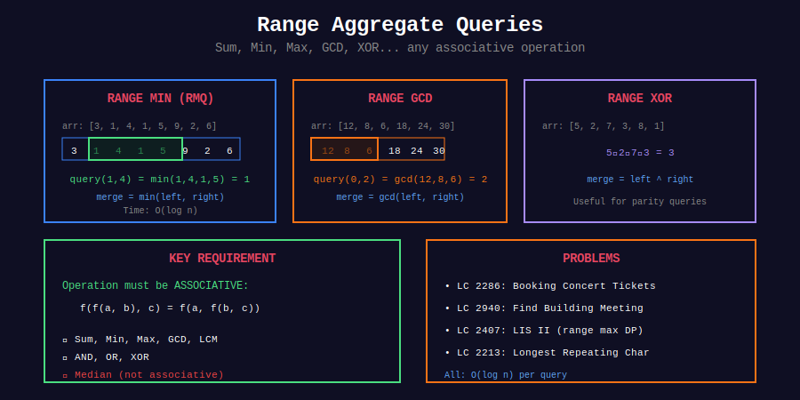

<div align="center">

# 🔍 Range Aggregate Queries

<p>
  
  
</p>

</div>

---

## 🧭 Navigation

| ⬅️ Previous | 📂 Current | ➡️ Next |
|:------------|:----------:|--------:|
| [← 04. Dynamic](../04_dynamic_segtree/README.md) | **05. Range Queries** | [Segment Tree →](../README.md) |

---

## 📊 Visual Overview

<div align="center">

</div>

---

## 📐 Core Concepts

**Range Aggregates:** Compute various functions over ranges.

**Supported Operations:**

- Range Min/Max

- Range GCD/LCM

- Range AND/OR/XOR

- Range Product

---

## 💻 Implementations

### Range Minimum Query

```python
class SegmentTreeRMQ:
    """Range Minimum Query"""
    
    def __init__(self, arr):
        self.n = len(arr)
        self.tree = [float('inf')] * (4 * self.n)
        self._build(arr, 0, 0, self.n - 1)
    
    def _build(self, arr, node, start, end):
        if start == end:
            self.tree[node] = arr[start]
        else:
            mid = (start + end) // 2
            self._build(arr, 2*node+1, start, mid)
            self._build(arr, 2*node+2, mid+1, end)
            self.tree[node] = min(self.tree[2*node+1], self.tree[2*node+2])

```

### Range GCD

```python
class SegmentTreeGCD:
    """Range GCD Query"""
    
    def _gcd(self, a, b):
        while b:
            a, b = b, a % b
        return a
    
    def _combine(self, left, right):
        return self._gcd(left, right)

```

---

## 📋 Problems

| # | Problem | Difficulty | Operation |
|---|---------|:----------:|-----------|
| 2286 | Booking Concert Tickets | Hard | Range max/sum |
| 2940 | Find Building Meeting | Hard | Range max + BS |
| 1526 | Min Increments on Subarrays | Hard | Range operations |
| 2213 | Longest Repeating Character | Hard | Interval merge |
| 2407 | LIS II | Hard | Range max DP |
| - | Range GCD | Hard | GCD operation |
| - | Range LCM | Hard | LCM operation |
| - | Range XOR | Hard | XOR operation |
| - | Range Product | Hard | Product operation |
| - | Range Majority | Hard | Boyer-Moore |

---

## 🧭 Navigation

| ⬅️ Previous | 📂 Current | ➡️ Next |
|:------------|:----------:|--------:|
| [← 04. Dynamic](../04_dynamic_segtree/README.md) | **05. Range Queries** | [Segment Tree →](../README.md) |

