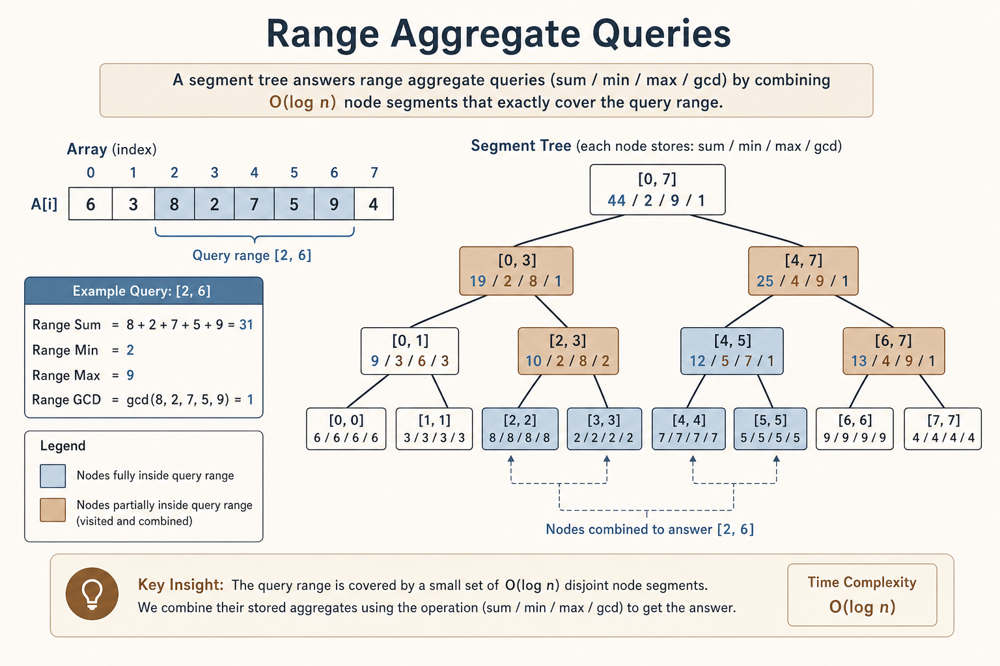
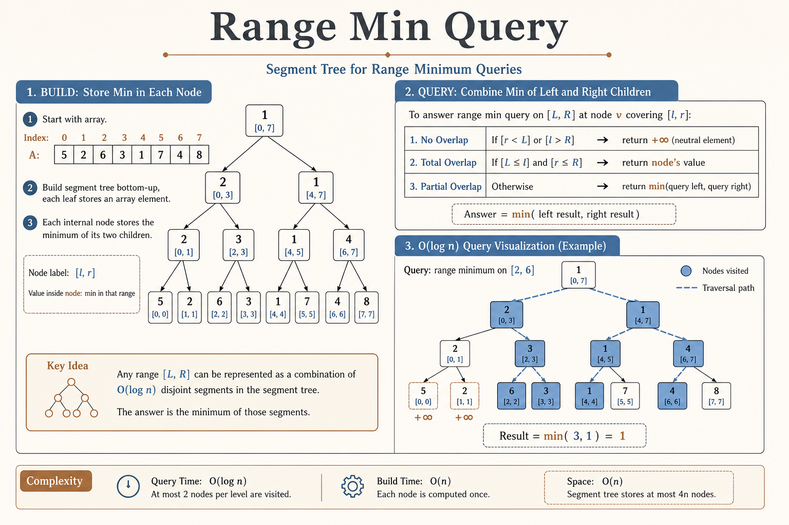
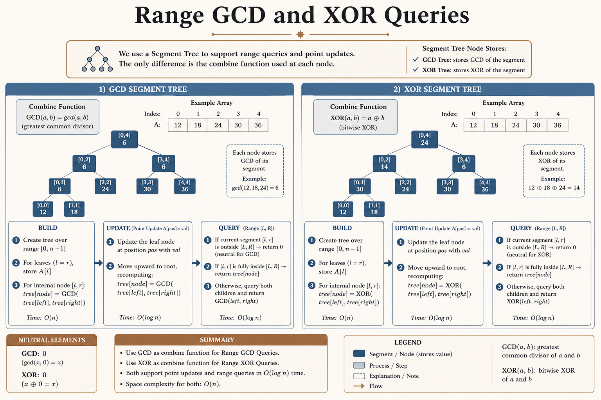

# 🔍 Range Aggregate Queries

### *Range Aggregate Queries*

  
  

---

## 📊 Visual Overview

---

## 🎯 At a Glance

| | |
|:---|:---|
| **Difficulty** | Hard |
| **Problems** | 10 |

> **How to use this page:** Start with the visual overview, scan **At a Glance**, then work through theory → walkthroughs → code.

---

## 🧭 Navigation

| ⬅️ Previous | 📂 Current | ➡️ Next |
|:------------|:----------:|--------:|
| [← 04. Dynamic](../04_dynamic_segtree/README.md) | **05. Range Queries** | [Segment Tree →](../README.md) |

---

## 📐 Core Concepts

**Range Aggregates:** Compute various functions over ranges.

**Supported Operations:**

- Range Min/Max

- Range GCD/LCM

- Range AND/OR/XOR

- Range Product

---

## 💻 Implementations

### Range Minimum Query

### Range GCD

---

## 📋 Problems

| # | Problem | Difficulty | Operation |
|---|---------|:----------:|-----------|
| 2286 | Booking Concert Tickets | Hard | Range max/sum |
| 2940 | Find Building Meeting | Hard | Range max + BS |
| 1526 | Min Increments on Subarrays | Hard | Range operations |
| 2213 | Longest Repeating Character | Hard | Interval merge |
| 2407 | LIS II | Hard | Range max DP |
| - | Range GCD | Hard | GCD operation |
| - | Range LCM | Hard | LCM operation |
| - | Range XOR | Hard | XOR operation |
| - | Range Product | Hard | Product operation |
| - | Range Majority | Hard | Boyer-Moore |

---
