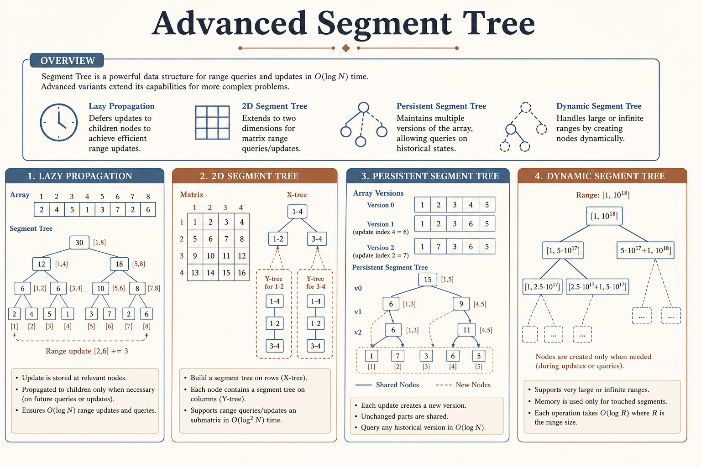
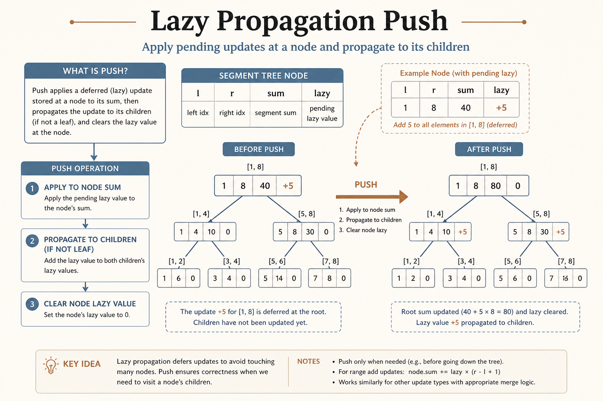
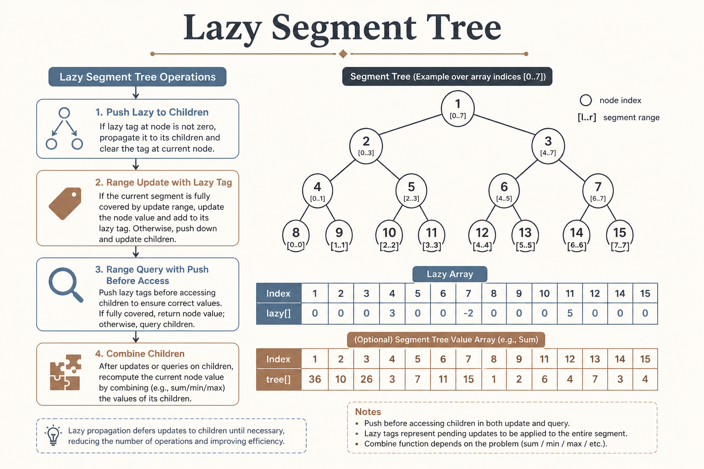
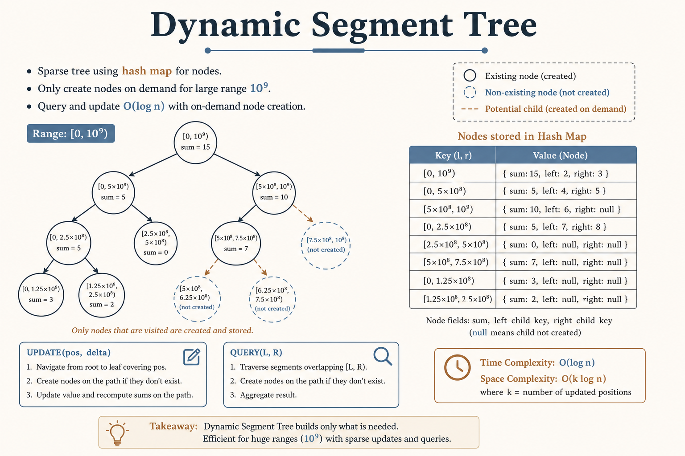

# 🌲 Segment Tree Advanced

### *Segment Tree Advanced*

  
  
  

---

## 📊 Visual Overview

---

## 🎯 At a Glance

| | |
|:---|:---|
| **Difficulty** | Hard |
| **Subtopics** | 5 |
| **Problems** | 40+ |

{: .highlight }
> **How to use this page:** Start with the visual overview, scan **At a Glance**, then work through theory → walkthroughs → code.

---

## 🧭 Navigation

| ⬅️ Previous | 📂 Current | ➡️ Next |
|:------------|:----------:|--------:|
| [← Treap](../06_treap/README.md) | **Segment Tree Advanced** | [🏠 Advanced Trees](../README.md) |

---

## 📂 Subtopics

<table>
<tr>
<td width="33%">

### [01. Lazy Propagation](./01_lazy_propagation/)

- Range updates

- Deferred updates

- Calendar problems

</td>
<td width="33%">

### [02. 2D Segment Tree](./02_2d_segment_tree/)

- 2D range queries

- Matrix updates

- Rectangle queries

</td>
<td width="33%">

### [03. Persistent Segment Tree](./03_persistent_segtree/)

- Version control

- Kth in range

- Path copying

</td>
</tr>
<tr>
<td width="33%">

### [04. Dynamic Segment Tree](./04_dynamic_segtree/)

- Sparse ranges

- On-demand creation

- Memory efficient

</td>
<td width="33%">

### [05. Range Queries](./05_range_queries/)

- Range Min/Max

- Range GCD/XOR

- Aggregate queries

</td>
<td width="33%">

</td>
</tr>
</table>

---

## 📐 Mathematical Foundation
### 1️⃣ Lazy Propagation

**Problem:** Range update takes O(n log n) with naive approach.

**Solution:** Defer updates until necessary.

**Lazy array:** `lazy[node]` stores pending update for subtree.

**Push operation:** Before accessing node, push lazy value to children.

### 2️⃣ 2D Segment Tree

**Structure:** Segment tree where each node contains another segment tree.

**Build:** O(mn log m log n) for m×n matrix

**Query/Update:** O(log m log n)

**Space:** O(mn log m log n) - very memory intensive

### 3️⃣ Persistent Segment Tree

**Idea:** Create new tree version by copying only modified nodes.

**Path copying:** Only O(log n) nodes change per update.

**Applications:**

- Query array at different times

- Kth smallest in range

- Version control

### 4️⃣ Dynamic Segment Tree

**Problem:** Range is too large (e.g., $10^9$) to allocate array.

**Solution:** Create nodes only when needed.

**Structure:** Use map/dict to store nodes.

**Space:** O(q log n) for q queries.

---

## 📋 Overview

**Advanced Segment Tree** techniques extend the basic segment tree to handle:

- **Lazy Propagation:** Efficient range updates in O(log n)

- **2D Segment Trees:** Range queries on matrices

- **Persistent Segment Trees:** Query historical versions

- **Dynamic Segment Trees:** Handle sparse or infinite ranges

**Key Advantage:** Handles complex range operations that simple data structures cannot.

---

## 🎯 Quick Reference

### Core Operations

| Operation | Time | Description |
|-----------|:----:|-------------|
| **Range Update (Lazy)** | O(log n) | Update entire range |
| **Range Query (Lazy)** | O(log n) | Query with pending updates |
| **2D Query** | O(log² n) | Query 2D range |
| **Persistent Build** | O(n log n) | Create new version |
| **Dynamic Update** | O(log n) | Sparse tree update |
| **Space** | O(n) - O(n log n) | Depends on variant |

---

## 💻 Quick Code Reference

**Lazy Propagation Segment Tree:**

**Dynamic Segment Tree:**

---

## 🗂️ Topics Covered

This section contains **40+ problems** organized into **5 categories**:

1. **[Lazy Propagation](./01_lazy_propagation/)** - Range updates, calendar problems, fancy sequence (10 problems)

2. **[2D Segment Tree](./02_2d_segment_tree/)** - 2D range sum, rectangle area, matrix queries (6 problems)

3. **[Persistent Segment Tree](./03_persistent_segtree/)** - Version control, Kth in range, historical queries (6 problems)

4. **[Dynamic Segment Tree](./04_dynamic_segtree/)** - Range module, calendar variants, sparse updates (8 problems)

5. **[Range Queries](./05_range_queries/)** - Range min/max, GCD, XOR, concert tickets (10 problems)

---

## 📊 Complexity Summary

| Technique | Build | Update | Query | Space |
|-----------|:-----:|:------:|:-----:|:-----:|
| **Lazy Propagation** | O(n) | O(log n) | O(log n) | O(n) |
| **2D Segment Tree** | O(mn log m log n) | O(log m log n) | O(log m log n) | O(mn log m log n) |
| **Persistent** | O(n log n) | O(log n) | O(log n) | O(n log n) |
| **Dynamic** | O(1) | O(log n) | O(log n) | O(q log n) |
| **Range Aggregate** | O(n) | O(log n) | O(log n) | O(n) |

---

## 💡 Key Insights

1. **Lazy Propagation:** Defer updates until necessary - critical for range updates

2. **2D Segment Tree:** Segment tree of segment trees - very memory intensive

3. **Persistent:** Path copying creates O(log n) new nodes per update

4. **Dynamic:** Only create nodes when needed - handles sparse/infinite ranges

5. **Merge function:** Can handle min, max, gcd, xor - not just sum

6. **Coordinate compression:** Often needed with dynamic segment trees

7. **Memory tradeoff:** Persistent and 2D trees use significantly more space

---
