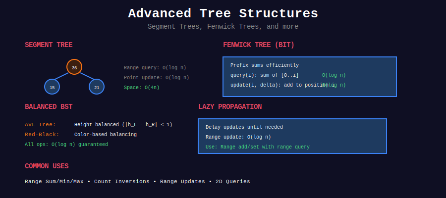

# 🌳 Advanced Trees

  
  
  

**Self-balancing trees and advanced structures**

[⬅️ Previous: Sweep Line](../26_sweep_line/README.md) | [🏠 Home](../README.md) | [Next: String Algorithms ➡️](../28_string_algorithms/README.md)

---

## 📋 Overview

Advanced tree structures: **AVL Trees**, **Red-Black Trees**, **B-Trees**, **Splay Trees**, **Treaps**.

---

## 📂 Subtopics

<table>
<tr>
<td width="33%">

### [01. AVL Trees](./01_avl_trees/)
- Self-balancing BST
- Rotations O(log n)
- Height ≤ 1.44 log n

</td>
<td width="33%">

### [02. Red-Black Trees](./02_red_black_trees/)
- Color properties
- TreeMap/TreeSet
- Industry standard

</td>
<td width="33%">

### [03. Fenwick Tree (BIT)](./03_fenwick_tree/)
- Binary Indexed Tree
- Range sum O(log n)
- Point updates

</td>
</tr>
<tr>
<td width="33%">

### [04. Splay Trees](./04_splay_trees/)
- Self-adjusting
- Amortized O(log n)
- Cache-friendly

</td>
<td width="33%">

### [05. B-Trees](./05_b_trees/)
- Multi-way search
- Databases/filesystems
- O(log n) operations

</td>
<td width="33%">

### [06. Treap](./06_treap/)
- Tree + Heap hybrid
- Randomized BST
- Simple implementation

</td>
</tr>
<tr>
<td width="33%">

### [07. Segment Tree (Advanced)](./07_segment_tree_advanced/)
- Lazy propagation
- Range updates
- 2D segment trees

</td>
<td width="33%">

</td>
<td width="33%">

</td>
</tr>
</table>

---

## 🏆 Must-Do Problems

### 🟡 Medium
| Problem | Link |
|---------|------|
| Balance a BST | [LeetCode 1382](https://leetcode.com/problems/balance-a-binary-search-tree/) |
| All Elements in Two BSTs | [LeetCode 1305](https://leetcode.com/problems/all-elements-in-two-binary-search-trees/) |
| Range Sum Query - Mutable | [LeetCode 307](https://leetcode.com/problems/range-sum-query-mutable/) |
| Count of Range Sum | [LeetCode 327](https://leetcode.com/problems/count-of-range-sum/) |

### 🔴 Hard
| Problem | Link |
|---------|------|
| Count of Smaller Numbers | [LeetCode 315](https://leetcode.com/problems/count-of-smaller-numbers-after-self/) |
| Reverse Pairs | [LeetCode 493](https://leetcode.com/problems/reverse-pairs/) |
| Count Good Triplets | [LeetCode 2179](https://leetcode.com/problems/count-good-triplets-in-an-array/) |
| Create Sorted Array | [LeetCode 1649](https://leetcode.com/problems/create-sorted-array-through-instructions/) |

---

[⬅️ Previous: Sweep Line](../26_sweep_line/README.md) | [🏠 Home](../README.md) | [Next: String Algorithms ➡️](../28_string_algorithms/README.md)

