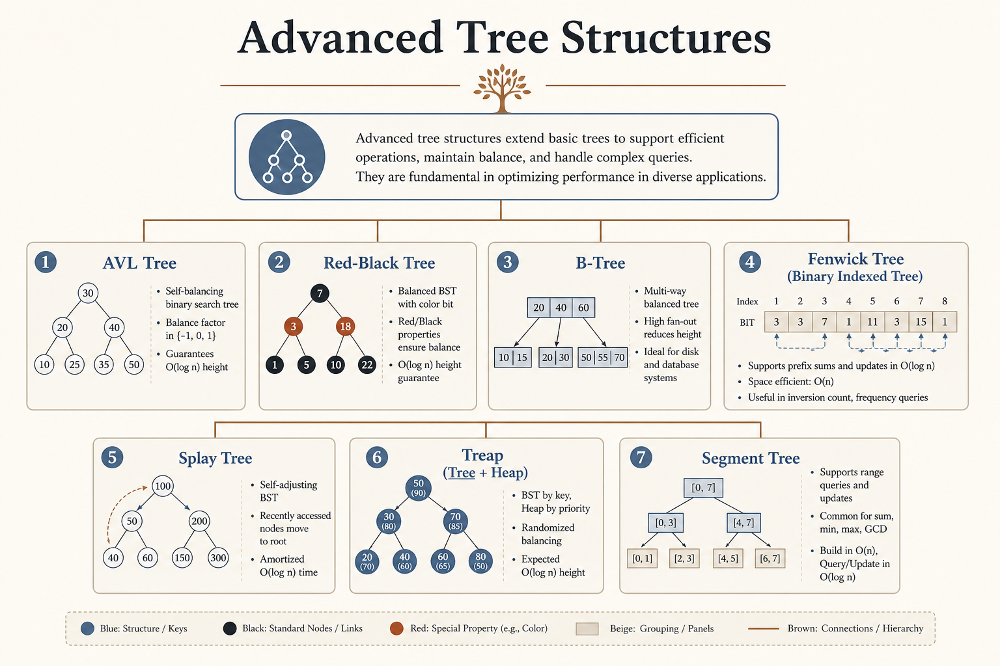

# 🌳 Advanced Trees

### *Self-balancing trees and advanced structures*

  
  
  

**Self-balancing trees and advanced structures**

[⬅️ Previous: Sweep Line](../26_sweep_line/README.md) | [🏠 Home](../README.md) | [Next: String Algorithms ➡️](../28_string_algorithms/README.md)

---

## 📊 Visual Overview

*Advanced Trees Overview*

---

## 🎯 At a Glance

| | |
|:---|:---|
| **In one line** | Self-balancing trees and advanced structures |
| **Difficulty** | Hard |
| **Subtopics** | 7 |
| **Problems** | 100+ |

{: .highlight }
> **How to use this page:** Start with the visual overview, scan **At a Glance**, then work through theory → walkthroughs → code.

---

## 📂 Subtopics

<table>
<tr>
<td width="33%">

### [01. AVL Trees](./01_avl_trees/)

- Self-balancing BST

- Rotations O(log n)

- Height ≤ 1.44 log n

</td>
<td width="33%">

### [02. Red-Black Trees](./02_red_black_trees/)

- Color properties

- TreeMap/TreeSet

- Industry standard

</td>
<td width="33%">

### [03. Fenwick Tree (BIT)](./03_fenwick_tree/)

- Binary Indexed Tree

- Range sum O(log n)

- Point updates

</td>
</tr>
<tr>
<td width="33%">

### [04. Splay Trees](./04_splay_trees/)

- Self-adjusting

- Amortized O(log n)

- Cache-friendly

</td>
<td width="33%">

### [05. B-Trees](./05_b_trees/)

- Multi-way search

- Databases/filesystems

- O(log n) operations

</td>
<td width="33%">

### [06. Treap](./06_treap/)

- Tree + Heap hybrid

- Randomized BST

- Simple implementation

</td>
</tr>
<tr>
<td width="33%">

### [07. Segment Tree (Advanced)](./07_segment_tree_advanced/)

- Lazy propagation

- Range updates

- 2D segment trees

</td>
<td width="33%">

</td>
<td width="33%">

</td>
</tr>
</table>

---

## 📋 Overview

Advanced tree structures: **AVL Trees**, **Red-Black Trees**, **B-Trees**, **Splay Trees**, **Treaps**.

---

## 🏆 LeetCode Problems

### 🟡 Medium

| # | Problem | Pattern | Time | Space |
|:-:|---------|---------|:----:|:-----:|
| 1382 | [Balance a BST](https://leetcode.com/problems/balance-a-binary-search-tree/) | AVL rebuild | O(n) | O(n) |
| 1305 | [All Elements in Two BSTs](https://leetcode.com/problems/all-elements-in-two-binary-search-trees/) | Merge | O(n log n) | O(n) |
| 307 | [Range Sum Query - Mutable](https://leetcode.com/problems/range-sum-query-mutable/) | Segment tree | O(log n) | O(n) |
| 327 | [Count of Range Sum](https://leetcode.com/problems/count-of-range-sum/) | Merge sort | O(n log n) | O(n) |

### 🔴 Hard

| # | Problem | Pattern | Time | Space |
|:-:|---------|---------|:----:|:-----:|
| 315 | [Count of Smaller Numbers After Self](https://leetcode.com/problems/count-of-smaller-numbers-after-self/) | BIT / merge | O(n log n) | O(n) |
| 493 | [Reverse Pairs](https://leetcode.com/problems/reverse-pairs/) | Merge sort | O(n log n) | O(n) |
| 2179 | [Count Good Triplets in an Array](https://leetcode.com/problems/count-good-triplets-in-an-array/) | BIT | O(n log n) | O(n) |
| 1649 | [Create Sorted Array through Instructions](https://leetcode.com/problems/create-sorted-array-through-instructions/) | BIT | O(n log n) | O(n) |

---

## 📚 References & Learning Resources

### 📖 Core Concepts

| Resource | Description | Link |
|----------|-------------|------|
| **AVL Trees** | GeeksforGeeks | [AVL](https://www.geeksforgeeks.org/avl-tree-set-1-insertion/) |
| **Red-Black Trees** | Wikipedia | [RBT](https://en.wikipedia.org/wiki/Red%E2%80%93black_tree) |

### 📝 Practice

| Platform | Focus | Link |
|----------|-------|------|
| **LeetCode** | Tree tag | [Problems](https://leetcode.com/tag/tree/) |

---

[⬅️ Previous: Sweep Line](../26_sweep_line/README.md) | [🏠 Home](../README.md) | [Next: String Algorithms ➡️](../28_string_algorithms/README.md)

