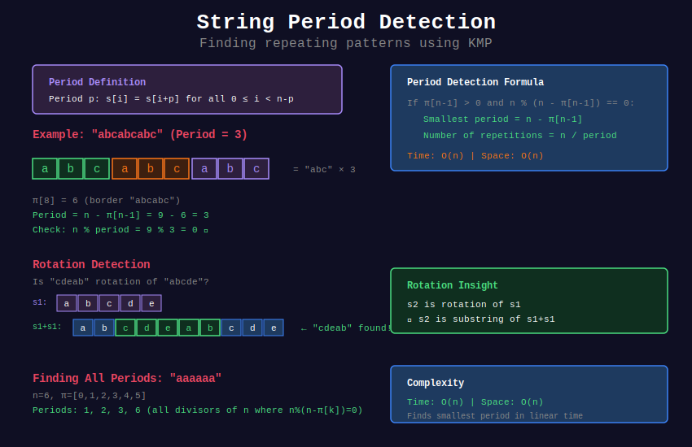

# 🔄 String Period Detection with KMP

## 📊 Visual Overview



## 📊 Metadata
- **Difficulty:** 
- **Time Complexity:** O(n)
- **Space Complexity:** O(n)
- **Pattern:** Period Analysis, Repetition Detection

---

## 🎯 Overview

A **period** of string s is a positive integer p such that s[i] = s[i+p] for all valid i. Using KMP's failure function, we can detect periods in linear time.

---

## 📐 Mathematical Foundation

### Period Definition

**Period p** of string s:
```
s[i] = s[i + p] for all 0 ≤ i < n - p

where n = len(s)
```

**Examples:**
```
"abcabcabc" has period 3 ("abc" repeats)
"abababab" has periods 2 and 8
"abcd" has period 4 (no repetition)
```

### Period Theorem

**Theorem (Fine-Wilf):** If string s has periods p and q, and p + q ≤ n, then s has period gcd(p, q).

**Corollary:** A string has at most O(log n) distinct periods.

### Connection to Failure Function

**Key Formula:**
```
If π[n-1] > 0 and n % (n - π[n-1]) == 0,
then smallest period = n - π[n-1]

Proof:
- π[n-1] = length of longest proper border
- If border length is k, then first k chars = last k chars
- Pattern repeats every (n - k) characters
```

---

## 💻 Implementations

### 1. Find Smallest Period

```python
def smallest_period(s):
    """
    Find smallest period of string
    
    Time: O(n)
    Space: O(n)
    
    Returns: Length of smallest period
    """
    n = len(s)
    if n == 0:
        return 0
    
    # Compute failure function
    pi = [0] * n
    k = 0
    
    for i in range(1, n):
        while k > 0 and s[k] != s[i]:
            k = pi[k - 1]
        
        if s[k] == s[i]:
            k += 1
        
        pi[i] = k
    
    # Check if string has repeating period
    border_len = pi[n - 1]
    period = n - border_len
    
    # Verify it's actually a period (not just last k chars)
    if n % period == 0:
        return period
    
    # No repetition, entire string is period
    return n

# Examples
print(smallest_period("abcabcabc"))   # 3
print(smallest_period("abab"))        # 2
print(smallest_period("abcd"))        # 4
print(smallest_period("aa"))          # 1
```

### 2. Check if String is Repeating Pattern

```python
def is_repeated_pattern(s):
    """
    Check if string is repetition of substring
    
    LeetCode 459: Repeated Substring Pattern
    
    Time: O(n)
    Space: O(n)
    
    Returns: (is_repeating, pattern)
    """
    n = len(s)
    
    if n == 0:
        return False, ""
    
    # Compute π
    pi = [0] * n
    k = 0
    
    for i in range(1, n):
        while k > 0 and s[k] != s[i]:
            k = pi[k - 1]
        
        if s[k] == s[i]:
            k += 1
        
        pi[i] = k
    
    # Check for period
    border_len = pi[n - 1]
    
    if border_len == 0:
        return False, ""
    
    period_len = n - border_len
    
    if n % period_len == 0:
        pattern = s[:period_len]
        return True, pattern
    
    return False, ""

# Examples
print(is_repeated_pattern("abcabcabc"))  # (True, "abc")
print(is_repeated_pattern("aba"))        # (False, "")
print(is_repeated_pattern("abab"))       # (True, "ab")
```

### 3. Find All Periods

```python
def find_all_periods(s):
    """
    Find all periods of string
    
    Time: O(n + k) where k = number of periods
    Space: O(n)
    
    Returns: List of all period lengths
    """
    n = len(s)
    
    if n == 0:
        return []
    
    # Compute π
    pi = [0] * n
    k = 0
    
    for i in range(1, n):
        while k > 0 and s[k] != s[i]:
            k = pi[k - 1]
        
        if s[k] == s[i]:
            k += 1
        
        pi[i] = k
    
    # Find all periods using border chain
    periods = []
    
    # Start with full length
    current = n
    border = pi[n - 1]
    
    while border > 0:
        period = current - border
        
        # Check if valid period for entire string
        if n % period == 0:
            periods.append(period)
        
        current = border
        border = pi[border - 1]
    
    # Add trivial period (entire string)
    periods.append(n)
    
    return sorted(periods)

# Examples
print(find_all_periods("abcabcabc"))    # [3, 9]
print(find_all_periods("abababab"))     # [2, 8]
print(find_all_periods("aaaaaa"))       # [1, 2, 3, 6]
```

### 4. Maximum Repetitions

```python
def max_repetitions(s, pattern):
    """
    Find maximum number of times pattern repeats consecutively
    
    LeetCode 1668: Maximum Repeating Substring
    
    Time: O(n + m)
    Space: O(m)
    """
    n, m = len(s), len(pattern)
    
    if m > n or m == 0:
        return 0
    
    # Build KMP failure function for pattern
    pi = [0] * m
    k = 0
    
    for i in range(1, m):
        while k > 0 and pattern[k] != pattern[i]:
            k = pi[k - 1]
        
        if pattern[k] == pattern[i]:
            k += 1
        
        pi[i] = k
    
    # Match and count consecutive occurrences
    max_count = 0
    current_count = 0
    i = j = 0
    
    while i < n:
        if s[i] == pattern[j]:
            i += 1
            j += 1
        
        if j == m:
            # Found complete match
            current_count += 1
            max_count = max(max_count, current_count)
            j = pi[j - 1]
        elif i < n and s[i] != pattern[j]:
            current_count = 0  # Reset on mismatch
            if j != 0:
                j = pi[j - 1]
            else:
                i += 1
    
    return max_count

# Example
s = "ababc"
pattern = "ab"
print(max_repetitions(s, pattern))  # 2 ("abab")
```

### 5. String Rotation Detection

```python
def is_rotation(s1, s2):
    """
    Check if s2 is rotation of s1
    
    LeetCode 796: Rotate String
    
    Time: O(n)
    Space: O(n)
    
    Key insight: s2 is rotation of s1 iff s2 is substring of s1+s1
    """
    if len(s1) != len(s2):
        return False
    
    if len(s1) == 0:
        return True
    
    # Create doubled string
    doubled = s1 + s1
    
    # Use KMP to search for s2 in doubled
    n, m = len(doubled), len(s2)
    
    # Build π for s2
    pi = [0] * m
    k = 0
    
    for i in range(1, m):
        while k > 0 and s2[k] != s2[i]:
            k = pi[k - 1]
        
        if s2[k] == s2[i]:
            k += 1
        
        pi[i] = k
    
    # Search for s2 in doubled
    i = j = 0
    
    while i < n:
        if doubled[i] == s2[j]:
            i += 1
            j += 1
        
        if j == m:
            return True
        
        elif i < n and doubled[i] != s2[j]:
            if j != 0:
                j = pi[j - 1]
            else:
                i += 1
    
    return False

# Examples
print(is_rotation("abcde", "cdeab"))    # True
print(is_rotation("abcde", "abced"))    # False
```

### 6. Cyclic Equivalence

```python
def find_cyclic_shifts(s):
    """
    Find all unique cyclic shifts of string
    
    Time: O(n²)
    Space: O(n²)
    
    Returns: List of unique rotations
    """
    n = len(s)
    rotations = set()
    
    for i in range(n):
        rotation = s[i:] + s[:i]
        rotations.add(rotation)
    
    return sorted(list(rotations))

def are_cyclic_equivalent(s1, s2):
    """
    Check if strings are cyclic equivalents
    
    Time: O(n)
    """
    return is_rotation(s1, s2) or is_rotation(s2, s1)

# Examples
print(find_cyclic_shifts("abc"))
# ['abc', 'bca', 'cab']

print(are_cyclic_equivalent("abc", "cab"))  # True
```

### 7. Lyndon Factorization

```python
def lyndon_factorization(s):
    """
    Compute Lyndon factorization using period properties
    
    Time: O(n)
    Space: O(n)
    
    Lyndon word: string that is strictly smaller than all its rotations
    """
    n = len(s)
    factors = []
    i = 0
    
    while i < n:
        j = i + 1
        k = i
        
        # Find next Lyndon factor
        while j < n and s[k] <= s[j]:
            if s[k] < s[j]:
                k = i
            else:
                k += 1
            j += 1
        
        # Extract factor
        while i <= k:
            factors.append(s[i:i + j - k])
            i += j - k
    
    return factors

# Example
print(lyndon_factorization("ababb"))   # ['ab', 'abb']
print(lyndon_factorization("banana"))  # ['b', 'an', 'an', 'a']
```

---

## 🧩 LeetCode Problems

### Easy
| # | Problem | Difficulty | Solution |
|---|---------|------------|----------|
| 459 | [Repeated Substring Pattern](https://leetcode.com/problems/repeated-substring-pattern/) | 🟢 Easy | Check period |
| 796 | [Rotate String](https://leetcode.com/problems/rotate-string/) | 🟢 Easy | Pattern in doubled |

### Medium
| # | Problem | Difficulty | Solution |
|---|---------|------------|----------|
| 1668 | [Maximum Repeating Substring](https://leetcode.com/problems/maximum-repeating-substring/) | 🟡 Medium | Count consecutive |
| 1392 | [Longest Happy Prefix](https://leetcode.com/problems/longest-happy-prefix/) | 🟡 Medium | Use π directly |

---

## 💡 Advanced Topics

### Period Lemma (Fine-Wilf Theorem)

```python
def verify_period_lemma(s, p, q):
    """
    Verify Fine-Wilf theorem: if string has periods p and q,
    and p + q ≤ len(s), then it has period gcd(p, q)
    
    Time: O(n)
    """
    import math
    
    n = len(s)
    
    # Check if p and q are periods
    def is_period(period):
        for i in range(n - period):
            if s[i] != s[i + period]:
                return False
        return True
    
    if not is_period(p) or not is_period(q):
        return False, "Not both periods"
    
    if p + q > n:
        return False, "Condition p + q ≤ n not met"
    
    g = math.gcd(p, q)
    
    if is_period(g):
        return True, f"gcd({p}, {q}) = {g} is a period"
    
    return False, "Unexpected: theorem violated!"

# Example
s = "abababab"
print(verify_period_lemma(s, 2, 8))  # True, gcd = 2
```

### Critical Factorization Theorem

```python
def critical_factorization(s):
    """
    Find critical factorization point using period analysis
    
    Used in Boyer-Moore and other algorithms
    
    Time: O(n)
    """
    n = len(s)
    pi = [0] * n
    k = 0
    
    for i in range(1, n):
        while k > 0 and s[k] != s[i]:
            k = pi[k - 1]
        
        if s[k] == s[i]:
            k += 1
        
        pi[i] = k
    
    # Critical point is where period changes significantly
    max_border = max(pi)
    critical_points = [i for i, val in enumerate(pi) if val == max_border]
    
    return critical_points[0] if critical_points else n // 2

# Example
s = "abcabcabc"
print(f"Critical point: {critical_factorization(s)}")
```

---

## 💡 Key Insights

1. **Period Detection is O(n):**
   - Single π computation suffices
   - Check condition: n % (n - π[n-1]) == 0

2. **Multiple Periods:**
   - Follow border chain to find all
   - At most O(log n) distinct periods typically

3. **Rotation = Doubled String Search:**
   - s2 is rotation of s1 iff s2 is substring of s1+s1

4. **Period Theorem:**
   - Two periods with sum ≤ n imply gcd period
   - Powerful tool for string analysis

---

**Navigation:** [← Failure Function](../02_failure_function/) | [KMP Overview](../README.md) | [Next: Prefix-Suffix →](../04_prefix_suffix/)

