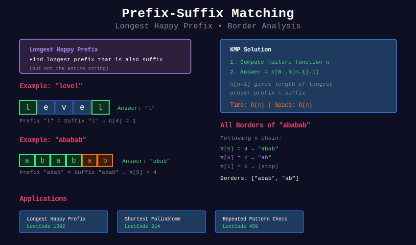

# 🔗 Prefix-Suffix Matching with KMP

## 📊 Visual Overview



## 📊 Metadata

- **Difficulty:** 

- **Time Complexity:** O(n)

- **Space Complexity:** O(n)

- **Pattern:** Border Analysis, Symmetric Properties

---

## 🎯 Overview

Prefix-suffix matching problems involve finding strings that are both prefixes and suffixes (borders). KMP's failure function directly solves these problems.

---

## 📐 Mathematical Foundation

### Border Definition

**Border** of string s: A string that is both a proper prefix and suffix of s.

```
String: "ABCAB"
Borders: "", "AB"
Longest proper border: "AB" (length 2)

```

### Happy Prefix

**Happy prefix:** A prefix that is also a suffix (proper, not entire string).

```
"level" → "l" is happy prefix
"ababab" → "ab", "abab" are happy prefixes

```

### Mathematical Properties

**Property 1:** All borders form a chain

```
If b₁ is border of s and b₂ is border of b₁,
then b₂ is border of s

```

**Property 2:** Number of borders

```
String of length n has at most O(log n) borders on average
Worst case: O(n) (e.g., "aaa...a")

```

---

## 💻 Implementations

### 1. Longest Happy Prefix

```python
def longest_happy_prefix(s):
    """
    Find longest proper prefix that is also suffix
    
    LeetCode 1392: Longest Happy Prefix
    
    Time: O(n)
    Space: O(n)
    
    Returns: The longest happy prefix string
    """
    n = len(s)
    
    if n == 0:
        return ""
    
    # Compute failure function
    pi = [0] * n
    k = 0
    
    for i in range(1, n):
        while k > 0 and s[k] != s[i]:
            k = pi[k - 1]
        
        if s[k] == s[i]:
            k += 1
        
        pi[i] = k
    
    # Longest happy prefix has length π[n-1]
    length = pi[n - 1]
    return s[:length]

# Examples
print(longest_happy_prefix("level"))         # "l"
print(longest_happy_prefix("ababab"))        # "abab"
print(longest_happy_prefix("leetcodeleet"))  # "leet"
print(longest_happy_prefix("a"))             # ""

```

### 2. All Happy Prefixes

```python
def all_happy_prefixes(s):
    """
    Find all happy prefixes (all borders)
    
    Time: O(n + k) where k = number of borders
    Space: O(n)
    
    Returns: List of all happy prefix strings
    """
    n = len(s)
    
    if n == 0:
        return []
    
    # Compute π
    pi = [0] * n
    k = 0
    
    for i in range(1, n):
        while k > 0 and s[k] != s[i]:
            k = pi[k - 1]
        
        if s[k] == s[i]:
            k += 1
        
        pi[i] = k
    
    # Follow border chain
    happy_prefixes = []
    k = pi[n - 1]
    
    while k > 0:
        happy_prefixes.append(s[:k])
        k = pi[k - 1]
    
    return happy_prefixes[::-1]  # Return in increasing length

# Examples
print(all_happy_prefixes("ababab"))     # ['ab', 'abab']
print(all_happy_prefixes("aaa"))        # ['a', 'aa']
print(all_happy_prefixes("abcabc"))     # ['abc']

```

### 3. Count Happy Prefixes at Each Position

```python
def count_borders_at_positions(s):
    """
    For each position, count number of borders
    
    Time: O(n²) worst case, O(n log n) average
    Space: O(n)
    
    Returns: List where result[i] = number of borders of s[0..i]
    """
    n = len(s)
    
    # Compute π
    pi = [0] * n
    k = 0
    
    for i in range(1, n):
        while k > 0 and s[k] != s[i]:
            k = pi[k - 1]
        
        if s[k] == s[i]:
            k += 1
        
        pi[i] = k
    
    # Count borders at each position
    border_counts = []
    
    for i in range(n):
        count = 0
        k = pi[i]
        
        while k > 0:
            count += 1
            k = pi[k - 1]
        
        border_counts.append(count)
    
    return border_counts

# Example
s = "ababab"
counts = count_borders_at_positions(s)
for i, count in enumerate(counts):
    print(f"s[0..{i}] = '{s[:i+1]}' has {count} borders")

```

### 4. Symmetric Substrings

```python
def count_symmetric_substrings(s):
    """
    Count substrings where prefix equals suffix
    
    Time: O(n²)
    Space: O(n)
    
    Returns: Count of symmetric substrings
    """
    n = len(s)
    count = 0
    
    # For each substring
    for i in range(n):
        substring = s[i:]
        
        # Compute π for substring
        m = len(substring)
        pi = [0] * m
        k = 0
        
        for j in range(1, m):
            while k > 0 and substring[k] != substring[j]:
                k = pi[k - 1]
            
            if substring[k] == substring[j]:
                k += 1
            
            pi[j] = k
        
        # Count borders (symmetric points)
        for j in range(m):
            if pi[j] > 0:
                count += 1
    
    return count

# Example
print(count_symmetric_substrings("aabaa"))   # Count substrings with borders

```

### 5. Maximum Border Length

```python
def max_border_length(s):
    """
    Find position with maximum border length
    
    Time: O(n)
    Space: O(n)
    
    Returns: (position, border_length, border_string)
    """
    n = len(s)
    
    if n == 0:
        return (-1, 0, "")
    
    # Compute π
    pi = [0] * n
    k = 0
    
    for i in range(1, n):
        while k > 0 and s[k] != s[i]:
            k = pi[k - 1]
        
        if s[k] == s[i]:
            k += 1
        
        pi[i] = k
    
    # Find maximum
    max_pos = max(range(n), key=lambda i: pi[i])
    max_len = pi[max_pos]
    border = s[:max_len]
    
    return (max_pos, max_len, border)

# Example
s = "ababcababa"
pos, length, border = max_border_length(s)
print(f"Max border at position {pos}: '{border}' (length {length})")

```

### 6. Border Array Construction

```python
def build_border_array(s):
    """
    Build array where border[i] lists all borders of s[0..i]
    
    Time: O(n² worst case, n log n average)
    Space: O(n log n average)
    
    Returns: List of lists containing border strings
    """
    n = len(s)
    
    # Compute π
    pi = [0] * n
    k = 0
    
    for i in range(1, n):
        while k > 0 and s[k] != s[i]:
            k = pi[k - 1]
        
        if s[k] == s[i]:
            k += 1
        
        pi[i] = k
    
    # Build border array
    border_array = []
    
    for i in range(n):
        borders = []
        k = pi[i]
        
        while k > 0:
            borders.append(s[:k])
            k = pi[k - 1]
        
        border_array.append(borders[::-1])  # Ascending order
    
    return border_array

# Example
s = "ababab"
borders = build_border_array(s)

for i, border_list in enumerate(borders):
    substring = s[:i+1]
    print(f"Borders of '{substring}': {border_list}")

```

### 7. Prefix-Suffix Overlap

```python
def max_prefix_suffix_overlap(s1, s2):
    """
    Find maximum overlap where suffix of s1 matches prefix of s2
    
    Time: O(len(s1) + len(s2))
    Space: O(len(s2))
    
    Applications: DNA sequencing, text merging
    
    Returns: Length of maximum overlap
    """
    # Use KMP to find longest prefix of s2 that matches suffix of s1
    
    # Build π for s2
    m = len(s2)
    pi = [0] * m
    k = 0
    
    for i in range(1, m):
        while k > 0 and s2[k] != s2[i]:
            k = pi[k - 1]
        
        if s2[k] == s2[i]:
            k += 1
        
        pi[i] = k
    
    # Match s1 against s2
    k = 0
    max_overlap = 0
    
    for char in s1:
        while k > 0 and s2[k] != char:
            k = pi[k - 1]
        
        if s2[k] == char:
            k += 1
            max_overlap = max(max_overlap, k)
        
        if k == m:
            k = pi[k - 1]
    
    return max_overlap

# Example: Finding DNA sequence overlaps
s1 = "GATCGA"
s2 = "CGATTAC"
overlap = max_prefix_suffix_overlap(s1, s2)
print(f"Maximum overlap: {overlap}")
print(f"Merged: {s1 + s2[overlap:]}")

```

---

## 🧩 LeetCode Problems

### Medium

| # | Problem | Difficulty | Approach |
|---|---------|------------|----------|
| 1392 | [Longest Happy Prefix](https://leetcode.com/problems/longest-happy-prefix/) | 🟡 Medium | Direct π[n-1] |
| 214 | [Shortest Palindrome](https://leetcode.com/problems/shortest-palindrome/) | 🟡 Medium | Prefix-suffix of reverse |

### Solutions

```python
class Solution:
    def longestPrefix(self, s: str) -> str:
        """
        LeetCode 1392: Longest Happy Prefix
        """
        n = len(s)
        pi = [0] * n
        k = 0
        
        for i in range(1, n):
            while k > 0 and s[k] != s[i]:
                k = pi[k - 1]
            
            if s[k] == s[i]:
                k += 1
            
            pi[i] = k
        
        return s[:pi[n - 1]]
    
    def shortestPalindrome(self, s: str) -> str:
        """
        LeetCode 214: Shortest Palindrome
        
        Find longest palindrome prefix using KMP
        """
        if not s:
            return s
        
        # Create s + '#' + reverse(s)
        rev = s[::-1]
        combined = s + '#' + rev
        
        n = len(combined)
        pi = [0] * n
        k = 0
        
        for i in range(1, n):
            while k > 0 and combined[k] != combined[i]:
                k = pi[k - 1]
            
            if combined[k] == combined[i]:
                k += 1
            
            pi[i] = k
        
        # π[n-1] gives longest palindrome prefix length
        palindrome_len = pi[n - 1]
        
        # Add reverse of remaining part to front
        to_add = s[palindrome_len:]
        return to_add[::-1] + s

```

---

## 💡 Applications

### 1. String Merging

```python
def merge_strings(strings):
    """
    Merge strings by finding overlaps
    
    Used in: genome assembly, text processing
    
    Time: O(n² · m) where n = number of strings, m = avg length
    """
    if not strings:
        return ""
    
    result = strings[0]
    
    for s in strings[1:]:
        # Find overlap
        overlap = max_prefix_suffix_overlap(result, s)
        # Merge
        result = result + s[overlap:]
    
    return result

# Example: DNA sequence assembly
fragments = ["GATCGA", "CGATTAC", "TACGAT"]
assembled = merge_strings(fragments)
print(f"Assembled sequence: {assembled}")

```

### 2. Palindrome Construction

```python
def min_chars_to_palindrome(s):
    """
    Minimum characters to add to end to make palindrome
    
    Time: O(n)
    """
    rev = s[::-1]
    combined = rev + '#' + s
    
    n = len(combined)
    pi = [0] * n
    k = 0
    
    for i in range(1, n):
        while k > 0 and combined[k] != combined[i]:
            k = pi[k - 1]
        
        if combined[k] == combined[i]:
            k += 1
        
        pi[i] = k
    
    # Characters to add
    chars_to_add = len(s) - pi[n - 1]
    return s + rev[:chars_to_add]

# Example
print(min_chars_to_palindrome("abc"))    # "abcba"
print(min_chars_to_palindrome("aacecaaa"))  # "aacecaaa"

```

---

## 💡 Key Insights

1. **π[n-1] is Key:**
   - Gives longest happy prefix directly
   - O(1) access after O(n) preprocessing

2. **Border Chain:**
   - Follow π to enumerate all borders
   - At most O(log n) average

3. **Reverse Trick:**
   - For palindromes: use s + '#' + reverse(s)
   - π tells longest palindrome prefix

4. **Overlap Finding:**
   - Essential for string merging
   - Used in bioinformatics

---

**Navigation:** [← String Period](../03_string_period/) | [KMP Overview](../README.md) | [Next: Palindrome KMP →](../05_palindrome_kmp/)

