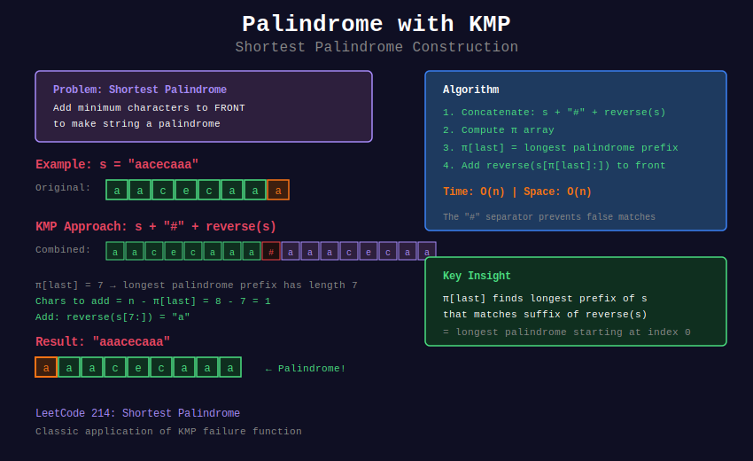

# 🎭 Palindrome Problems with KMP

## 📊 Visual Overview



## 📊 Metadata
- **Difficulty:** 
- **Time Complexity:** O(n)
- **Space Complexity:** O(n)
- **Pattern:** Palindrome Detection, String Reversal, KMP

---

## 🎯 Overview

KMP can solve palindrome problems efficiently by combining with string reversal. The key insight: palindromes have matching prefix-suffix when compared with their reverse.

---

## 📐 Mathematical Foundation

### Palindrome-Border Connection

**Key Insight:**

```
String s is palindrome ⟺ s = reverse(s)
⟺ entire string is border when concatenated with reverse

```

**For longest palindrome prefix:**

```
Build: s + '#' + reverse(s)
Compute π on this combined string
π[end] gives length of longest palindrome prefix

```

### Why It Works

```
If s[0..k] is palindrome:
  s[0..k] = reverse(s[0..k])
  In combined string s + '#' + reverse(s):
    prefix s[0..k] matches suffix reverse(s)[...] 
    which is reverse(s[0..k])

```

---

## 💻 Implementations

### 1. Shortest Palindrome (Add to Front)

```python
def shortest_palindrome(s):
    """
    Add minimum characters to front to make palindrome
    
    LeetCode 214: Shortest Palindrome
    
    Time: O(n)
    Space: O(n)
    
    Approach:
    - Find longest palindrome prefix
    - Add reverse of remaining suffix to front
    """
    if not s:
        return s
    
    # Create s + '#' + reverse(s)
    rev = s[::-1]
    combined = s + '#' + rev
    
    # Compute failure function
    n = len(combined)
    pi = [0] * n
    k = 0
    
    for i in range(1, n):
        while k > 0 and combined[k] != combined[i]:
            k = pi[k - 1]
        
        if combined[k] == combined[i]:
            k += 1
        
        pi[i] = k
    
    # π[n-1] = length of longest palindrome prefix
    palindrome_prefix_len = pi[n - 1]
    
    # Characters after palindrome prefix
    remaining = s[palindrome_prefix_len:]
    
    # Add reverse of remaining to front
    return remaining[::-1] + s

# Examples
print(shortest_palindrome("aacecaaa"))   # "aaacecaaa"
print(shortest_palindrome("abcd"))       # "dcbabcd"
print(shortest_palindrome(""))           # ""

```

### 2. Longest Palindrome Prefix

```python
def longest_palindrome_prefix(s):
    """
    Find longest prefix that is palindrome
    
    Time: O(n)
    Space: O(n)
    
    Returns: (length, palindrome_string)
    """
    if not s:
        return 0, ""
    
    # Create combined string
    rev = s[::-1]
    combined = s + '#' + rev
    
    # Compute π
    n = len(combined)
    pi = [0] * n
    k = 0
    
    for i in range(1, n):
        while k > 0 and combined[k] != combined[i]:
            k = pi[k - 1]
        
        if combined[k] == combined[i]:
            k += 1
        
        pi[i] = k
    
    length = pi[n - 1]
    return length, s[:length]

# Examples
print(longest_palindrome_prefix("aacecaabb"))  # (7, "aacecaa")
print(longest_palindrome_prefix("abcdef"))     # (1, "a")

```

### 3. Longest Palindrome Suffix

```python
def longest_palindrome_suffix(s):
    """
    Find longest suffix that is palindrome
    
    Time: O(n)
    Space: O(n)
    
    Approach: reverse(s) and find palindrome prefix
    """
    if not s:
        return 0, ""
    
    # Work with reversed string
    rev = s[::-1]
    
    # Find palindrome prefix of reversed string
    combined = rev + '#' + s
    
    n = len(combined)
    pi = [0] * n
    k = 0
    
    for i in range(1, n):
        while k > 0 and combined[k] != combined[i]:
            k = pi[k - 1]
        
        if combined[k] == combined[i]:
            k += 1
        
        pi[i] = k
    
    length = pi[n - 1]
    return length, s[len(s) - length:]

# Examples
print(longest_palindrome_suffix("abcaacaa"))   # (5, "aacaa")
print(longest_palindrome_suffix("xyz"))        # (1, "z")

```

### 4. Make Palindrome (Add to End)

```python
def make_palindrome_add_end(s):
    """
    Add minimum characters to end to make palindrome
    
    Time: O(n)
    Space: O(n)
    
    Approach: Find longest palindrome suffix, add reverse of prefix
    """
    if not s:
        return s
    
    # Find longest palindrome suffix
    rev = s[::-1]
    combined = rev + '#' + s
    
    n = len(combined)
    pi = [0] * n
    k = 0
    
    for i in range(1, n):
        while k > 0 and combined[k] != combined[i]:
            k = pi[k - 1]
        
        if combined[k] == combined[i]:
            k += 1
        
        pi[i] = k
    
    palindrome_suffix_len = pi[n - 1]
    
    # Add reverse of remaining prefix
    remaining = s[:len(s) - palindrome_suffix_len]
    
    return s + remaining[::-1]

# Examples
print(make_palindrome_add_end("aacecaaa"))   # "aacecaaaca"
print(make_palindrome_add_end("abc"))        # "abcba"

```

### 5. Check if Palindrome After One Delete

```python
def valid_palindrome_one_delete(s):
    """
    Check if string can become palindrome by deleting at most one char
    
    LeetCode 680: Valid Palindrome II
    
    Time: O(n)
    Space: O(1) for two-pointer, O(n) if using KMP
    
    Returns: (is_possible, deleted_index or -1)
    """
    def is_palindrome_kmp(s):
        """Helper: check if s is palindrome using KMP"""
        rev = s[::-1]
        combined = s + '#' + rev
        
        n = len(combined)
        pi = [0] * n
        k = 0
        
        for i in range(1, n):
            while k > 0 and combined[k] != combined[i]:
                k = pi[k - 1]
            
            if combined[k] == combined[i]:
                k += 1
            
            pi[i] = k
        
        return pi[n - 1] == len(s)
    
    # Two-pointer approach (more efficient)
    left, right = 0, len(s) - 1
    
    while left < right:
        if s[left] != s[right]:
            # Try deleting left or right
            option1 = s[:left] + s[left+1:]
            option2 = s[:right] + s[right+1:]
            
            if is_palindrome_kmp(option1):
                return True, left
            if is_palindrome_kmp(option2):
                return True, right
            
            return False, -1
        
        left += 1
        right -= 1
    
    return True, -1  # Already palindrome

# Examples
print(valid_palindrome_one_delete("aba"))      # (True, -1)
print(valid_palindrome_one_delete("abca"))     # (True, 1 or 2)
print(valid_palindrome_one_delete("abc"))      # (False, -1)

```

### 6. Count Palindromic Substrings Using KMP

```python
def count_palindrome_substrings_kmp(s):
    """
    Count all palindromic substrings using KMP
    
    Time: O(n²)
    Space: O(n)
    
    Note: Manacher's algorithm is better (O(n)) for this problem
    This shows KMP can also solve it
    """
    n = len(s)
    count = 0
    
    # Check each substring
    for i in range(n):
        for j in range(i, n):
            substring = s[i:j+1]
            
            # Check if palindrome using KMP
            rev = substring[::-1]
            combined = substring + '#' + rev
            
            m = len(combined)
            pi = [0] * m
            k = 0
            
            for idx in range(1, m):
                while k > 0 and combined[k] != combined[idx]:
                    k = pi[k - 1]
                
                if combined[k] == combined[idx]:
                    k += 1
                
                pi[idx] = k
            
            if pi[m - 1] == len(substring):
                count += 1
    
    return count

# Example
print(count_palindrome_substrings_kmp("abc"))    # 3
print(count_palindrome_substrings_kmp("aaa"))    # 6

```

### 7. Minimum Insertions for Palindrome

```python
def min_insertions_palindrome(s):
    """
    Minimum insertions needed to make string palindrome
    
    LeetCode 1312: Minimum Insertion Steps to Make String Palindrome
    
    Time: O(n²) with DP, O(n) preprocessing with KMP
    Space: O(n)
    
    Approach: Find longest common subsequence with reverse
    """
    # This problem needs DP for optimal solution
    # KMP helps find palindrome regions to guide DP
    
    def longest_palindrome_subsequence(s):
        """Helper: LCS of s and reverse(s)"""
        n = len(s)
        rev = s[::-1]
        
        # DP for LCS
        dp = [[0] * (n + 1) for _ in range(n + 1)]
        
        for i in range(1, n + 1):
            for j in range(1, n + 1):
                if s[i-1] == rev[j-1]:
                    dp[i][j] = dp[i-1][j-1] + 1
                else:
                    dp[i][j] = max(dp[i-1][j], dp[i][j-1])
        
        return dp[n][n]
    
    lps = longest_palindrome_subsequence(s)
    return len(s) - lps

# Examples
print(min_insertions_palindrome("zzazz"))     # 0
print(min_insertions_palindrome("mbadm"))     # 2
print(min_insertions_palindrome("leetcode"))  # 5

```

---

## 🧩 LeetCode Problems

### Easy

| # | Problem | Difficulty | Approach |
|---|---------|------------|----------|
| 125 | [Valid Palindrome](https://leetcode.com/problems/valid-palindrome/) | 🟢 Easy | Two pointers / KMP |
| 680 | [Valid Palindrome II](https://leetcode.com/problems/valid-palindrome-ii/) | 🟢 Easy | Check after delete |

### Medium

| # | Problem | Difficulty | Approach |
|---|---------|------------|----------|
| 5 | [Longest Palindromic Substring](https://leetcode.com/problems/longest-palindromic-substring/) | 🟡 Medium | Multiple approaches |
| 647 | [Palindromic Substrings](https://leetcode.com/problems/palindromic-substrings/) | 🟡 Medium | Count all |
| 1312 | [Minimum Insertion Steps](https://leetcode.com/problems/minimum-insertion-steps-to-make-a-string-palindrome/) | 🟡 Medium | LCS with reverse |

### Hard

| # | Problem | Difficulty | Approach |
|---|---------|------------|----------|
| 214 | [Shortest Palindrome](https://leetcode.com/problems/shortest-palindrome/) | 🔴 Hard | KMP on s+'#'+reverse |
| 336 | [Palindrome Pairs](https://leetcode.com/problems/palindrome-pairs/) | 🔴 Hard | Check all pairs |

---

## 💡 Solutions

```python
class Solution:
    def shortestPalindrome(self, s: str) -> str:
        """
        LeetCode 214: Shortest Palindrome
        """
        if not s:
            return s
        
        rev = s[::-1]
        combined = s + '#' + rev
        
        n = len(combined)
        pi = [0] * n
        k = 0
        
        for i in range(1, n):
            while k > 0 and combined[k] != combined[i]:
                k = pi[k - 1]
            
            if combined[k] == combined[i]:
                k += 1
            
            pi[i] = k
        
        palindrome_len = pi[n - 1]
        to_add = s[palindrome_len:]
        
        return to_add[::-1] + s
    
    def validPalindrome(self, s: str) -> bool:
        """
        LeetCode 680: Valid Palindrome II
        """
        def is_palindrome(s, left, right):
            while left < right:
                if s[left] != s[right]:
                    return False
                left += 1
                right -= 1
            return True
        
        left, right = 0, len(s) - 1
        
        while left < right:
            if s[left] != s[right]:
                # Try deleting either left or right
                return (is_palindrome(s, left + 1, right) or 
                        is_palindrome(s, left, right - 1))
            left += 1
            right -= 1
        
        return True

```

---

## 💡 Key Insights

1. **Combined String Trick:**
   ```
   s + '#' + reverse(s)
   Use KMP π to find palindrome regions
   ```

2. **Prefix vs Suffix:**
   - Palindrome prefix: s + '#' + reverse(s)
   - Palindrome suffix: reverse(s) + '#' + s

3. **When to Use KMP for Palindromes:**
   - ✅ Finding palindrome prefix/suffix
   - ✅ Minimum additions to make palindrome
   - ❌ All palindromic substrings (use Manacher's)
   - ❌ Longest palindromic substring (use Manacher's)

4. **Complexity:**
   - KMP approach: O(n) for specific problems
   - General palindrome: Consider Manacher's O(n)
   - Multiple checks: Precompute with DP

---

**Navigation:** [← Prefix-Suffix](../04_prefix_suffix/) | [KMP Overview](../README.md) | [Next: Multiple Patterns →](../06_multiple_patterns/)

