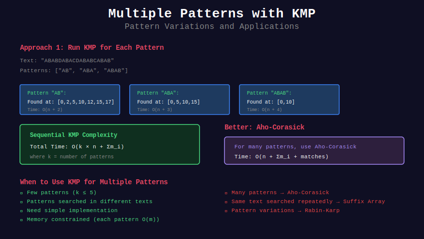

# 🔀 Multiple Pattern Matching with KMP

## 📊 Visual Overview



## 📊 Metadata

- **Difficulty:** 

- **Time Complexity:** O(n · k + m) where k = patterns

- **Space Complexity:** O(m)

- **Pattern:** Multiple Searches, Pattern Variations

---

## 🎯 Overview

While KMP is designed for single pattern matching, it can be adapted for multiple patterns. For many patterns, Aho-Corasick is preferred, but KMP extensions are valuable to understand.

---

## 📐 Approaches

### Naive Multiple KMP

Run KMP k times:

```
Time: O(k(n + m))
Space: O(m)

```

### Optimized Approaches

1. **Pattern preprocessing:** O(km) once
2. **Combined matching:** O(n) per text
3. **Total:** O(n + km) for preprocessing

---

## 💻 Implementations

### 1. Search Multiple Patterns (Sequential)

```python
def search_multiple_patterns(text, patterns):
    """
    Search for multiple patterns in text
    
    Time: O(n·k + m) where k = len(patterns), m = total pattern length
    Space: O(m)
    
    Returns: Dict mapping pattern -> list of positions
    """
    def compute_pi(pattern):
        m = len(pattern)
        pi = [0] * m
        k = 0
        
        for i in range(1, m):
            while k > 0 and pattern[k] != pattern[i]:
                k = pi[k - 1]
            
            if pattern[k] == pattern[i]:
                k += 1
            
            pi[i] = k
        
        return pi
    
    def kmp_search(text, pattern, pi):
        """Single KMP search"""
        n, m = len(text), len(pattern)
        matches = []
        
        i = j = 0
        while i < n:
            if text[i] == pattern[j]:
                i += 1
                j += 1
            
            if j == m:
                matches.append(i - j)
                j = pi[j - 1]
            elif i < n and text[i] != pattern[j]:
                if j != 0:
                    j = pi[j - 1]
                else:
                    i += 1
        
        return matches
    
    results = {}
    
    for pattern in patterns:
        pi = compute_pi(pattern)
        matches = kmp_search(text, pattern, pi)
        results[pattern] = matches
    
    return results

# Example
text = "ABABDABACDABABCABAB"
patterns = ["AB", "ABC", "ABABC"]

results = search_multiple_patterns(text, patterns)
for pattern, matches in results.items():
    print(f"'{pattern}': {matches}")

```

### 2. Optimized for Same-Length Patterns

```python
def search_same_length_patterns(text, patterns):
    """
    Optimized for patterns of same length
    
    Time: O(n + km)
    Space: O(k)
    
    Uses: Grouping by length and parallel matching
    """
    if not patterns:
        return {}
    
    # All patterns same length
    pattern_len = len(patterns[0])
    
    # Precompute π for all patterns
    pi_arrays = {}
    for pattern in patterns:
        pi = [0] * pattern_len
        k = 0
        
        for i in range(1, pattern_len):
            while k > 0 and pattern[k] != pattern[i]:
                k = pi[k - 1]
            
            if pattern[k] == pattern[i]:
                k += 1
            
            pi[i] = k
        
        pi_arrays[pattern] = pi
    
    # Match all patterns simultaneously
    results = {p: [] for p in patterns}
    
    for start_pos in range(len(text)):
        for pattern in patterns:
            if start_pos + pattern_len > len(text):
                continue
            
            # Check if pattern matches at this position
            match = True
            for i in range(pattern_len):
                if text[start_pos + i] != pattern[i]:
                    match = False
                    break
            
            if match:
                results[pattern].append(start_pos)
    
    return results

# Example
text = "ABCABDABC"
patterns = ["ABC", "ABD"]
print(search_same_length_patterns(text, patterns))

```

### 3. Pattern with Wildcards

```python
def search_with_wildcards(text, patterns_with_wildcards):
    """
    Search patterns that may contain wildcards ('?')
    
    Time: O(n·k + m)
    Space: O(m)
    
    Returns: Dict of pattern -> matches
    """
    def kmp_wildcard(text, pattern):
        """KMP with wildcard support"""
        def compute_pi_wildcard(pattern):
            m = len(pattern)
            pi = [0] * m
            k = 0
            
            for i in range(1, m):
                while k > 0 and pattern[k] != pattern[i] and \
                      pattern[k] != '?' and pattern[i] != '?':
                    k = pi[k - 1]
                
                if pattern[k] == pattern[i] or \
                   pattern[k] == '?' or pattern[i] == '?':
                    k += 1
                
                pi[i] = k
            
            return pi
        
        n, m = len(text), len(pattern)
        pi = compute_pi_wildcard(pattern)
        matches = []
        
        i = j = 0
        while i < n:
            if text[i] == pattern[j] or pattern[j] == '?':
                i += 1
                j += 1
            
            if j == m:
                matches.append(i - j)
                j = pi[j - 1]
            elif i < n and text[i] != pattern[j] and pattern[j] != '?':
                if j != 0:
                    j = pi[j - 1]
                else:
                    i += 1
        
        return matches
    
    results = {}
    
    for pattern in patterns_with_wildcards:
        matches = kmp_wildcard(text, pattern)
        results[pattern] = matches
    
    return results

# Example
text = "ABABDABAC"
patterns = ["AB?D", "?BAC", "AB"]
results = search_with_wildcards(text, patterns)
print(results)

```

### 4. Dictionary Word Search

```python
def find_dictionary_words(text, dictionary):
    """
    Find all dictionary words in text
    
    Time: O(n·k + m)
    Space: O(m)
    
    Applications: spell checking, word finding
    """
    results = {}
    
    # Preprocess: Group by length for efficiency
    by_length = {}
    for word in dictionary:
        length = len(word)
        if length not in by_length:
            by_length[length] = []
        by_length[length].append(word)
    
    # Search each group
    for length, words in by_length.items():
        for word in words:
            matches = search_multiple_patterns(text, [word])
            if matches[word]:
                results[word] = matches[word]
    
    return results

# Example
text = "the quick brown fox jumps"
dictionary = ["the", "quick", "fox", "jumps", "slow"]
found = find_dictionary_words(text, dictionary)
print(f"Found words: {list(found.keys())}")

```

### 5. Find All Anagrams of Multiple Patterns

```python
def find_anagram_matches(text, patterns):
    """
    Find positions where anagrams of patterns occur
    
    Time: O(n·k + m)
    Space: O(m + alphabet_size)
    
    Uses: Sorted pattern matching
    """
    from collections import Counter
    
    results = {}
    
    for pattern in patterns:
        pattern_len = len(pattern)
        pattern_count = Counter(pattern)
        
        matches = []
        
        # Sliding window
        for i in range(len(text) - pattern_len + 1):
            window = text[i:i + pattern_len]
            
            if Counter(window) == pattern_count:
                matches.append(i)
        
        results[pattern] = matches
    
    return results

# Example
text = "cbaebabacd"
patterns = ["abc", "ab"]
results = find_anagram_matches(text, patterns)
print(results)

```

### 6. Pattern Set Matching

```python
class PatternSetMatcher:
    """
    Efficient matching for fixed set of patterns
    
    Preprocess patterns once, match multiple texts
    """
    
    def __init__(self, patterns):
        self.patterns = patterns
        self.pi_arrays = {}
        
        # Precompute all failure functions
        for pattern in patterns:
            self.pi_arrays[pattern] = self._compute_pi(pattern)
    
    def _compute_pi(self, pattern):
        m = len(pattern)
        pi = [0] * m
        k = 0
        
        for i in range(1, m):
            while k > 0 and pattern[k] != pattern[i]:
                k = pi[k - 1]
            
            if pattern[k] == pattern[i]:
                k += 1
            
            pi[i] = k
        
        return pi
    
    def search(self, text):
        """Search all patterns in new text"""
        results = {}
        
        for pattern in self.patterns:
            pi = self.pi_arrays[pattern]
            matches = self._kmp_search(text, pattern, pi)
            results[pattern] = matches
        
        return results
    
    def _kmp_search(self, text, pattern, pi):
        n, m = len(text), len(pattern)
        matches = []
        
        i = j = 0
        while i < n:
            if text[i] == pattern[j]:
                i += 1
                j += 1
            
            if j == m:
                matches.append(i - j)
                j = pi[j - 1]
            elif i < n and text[i] != pattern[j]:
                if j != 0:
                    j = pi[j - 1]
                else:
                    i += 1
        
        return matches

# Example: Search same patterns in multiple texts
matcher = PatternSetMatcher(["AB", "ABC", "ABABC"])

texts = [
    "ABABDABACDABABCABAB",
    "ABCDEFGHI",
    "ABABCABC"
]

for idx, text in enumerate(texts):
    results = matcher.search(text)
    print(f"\nText {idx}: {text}")
    for pattern, matches in results.items():
        if matches:
            print(f"  '{pattern}': {matches}")

```

### 7. Pattern Matching with Errors

```python
def fuzzy_multiple_match(text, patterns, max_errors):
    """
    Find matches allowing up to max_errors mismatches
    
    Time: O(n·k·max_errors)
    Space: O(m)
    
    Note: For approximate matching, specialized algorithms are better
    """
    results = {}
    
    for pattern in patterns:
        matches = []
        n, m = len(text), len(pattern)
        
        for i in range(n - m + 1):
            errors = 0
            
            for j in range(m):
                if text[i + j] != pattern[j]:
                    errors += 1
                    if errors > max_errors:
                        break
            
            if errors <= max_errors:
                matches.append((i, errors))
        
        results[pattern] = matches
    
    return results

# Example
text = "ABABDABACDABABCABAB"
patterns = ["ABC", "ABD"]
results = fuzzy_multiple_match(text, patterns, max_errors=1)

for pattern, matches in results.items():
    print(f"'{pattern}':")
    for pos, errors in matches:
        print(f"  Position {pos} with {errors} errors")

```

---

## 🧩 LeetCode Problems

### Medium

| # | Problem | Difficulty | Approach |
|---|---------|------------|----------|
| 3008 | [Find Beautiful Indices I](https://leetcode.com/problems/find-beautiful-indices-in-the-given-array-i/) | 🟡 Medium | Multiple patterns |
| 3034 | [Number of Subarrays](https://leetcode.com/problems/number-of-subarrays-that-match-a-pattern-i/) | 🟡 Medium | Pattern matching |
| 472 | [Concatenated Words](https://leetcode.com/problems/concatenated-words/) | 🟡 Medium | Dictionary matching |

### Hard

| # | Problem | Difficulty | Approach |
|---|---------|------------|----------|
| 30 | [Substring with Concatenation](https://leetcode.com/problems/substring-with-concatenation-of-all-words/) | 🔴 Hard | Multiple word matching |
| 336 | [Palindrome Pairs](https://leetcode.com/problems/palindrome-pairs/) | 🔴 Hard | Pattern pairs |

---

## 💡 Key Insights

### When to Use Multiple KMP

✅ **Good for:**
- Small number of patterns (k < 10)

- Patterns preprocessed once, many texts

- Need exact matches

- Simpler implementation than Aho-Corasick

❌ **Better alternatives:**
- **Many patterns (k > 100):** Use Aho-Corasick

- **Approximate matching:** Use edit distance algorithms

- **Pattern discovery:** Use suffix arrays/trees

### Optimization Strategies

1. **Group by Length:**
   ```python
   # Patterns of same length can be checked together
   # Reduces overhead
   ```

2. **Early Termination:**
   ```python
   # Stop if all patterns found
   if len(found_patterns) == len(patterns):
       break
   ```

3. **Preprocessing:**
   ```python
   # Compute all π arrays once
   # Reuse for multiple texts
   ```

### Complexity Comparison

| Method | Preprocessing | Per Text | Best For |
|--------|--------------|----------|----------|
| **Multiple KMP** | O(km) | O(nk) | Few patterns |
| **Aho-Corasick** | O(m·σ) | O(n+k) | Many patterns |
| **Suffix Array** | O(n log n) | O(m log n) per query | Many queries |

---

## 💡 Advanced: Towards Aho-Corasick

KMP for multiple patterns naturally leads to Aho-Corasick:

```python
# KMP idea: Use failure function
# Aho-Corasick idea: Share failure function across patterns

# KMP: Linear chain
#   Pattern → Failure links

# Aho-Corasick: Tree structure
#   Patterns → Trie + Failure links

```

**When to graduate to Aho-Corasick:**
- More than ~10 patterns

- Patterns share common prefixes

- Need optimal O(n + k) matching

---

**Navigation:** [← Palindrome KMP](../05_palindrome_kmp/) | [KMP Overview](../README.md) | [String Algorithms](../../README.md)

