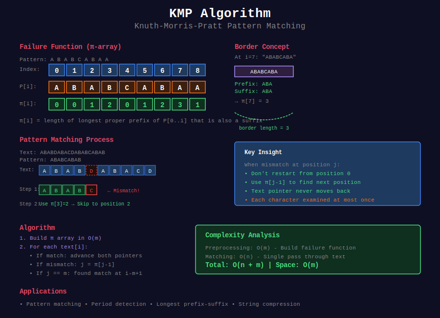

# 🔍 KMP Algorithm (Knuth-Morris-Pratt)

## 📊 Visual Overview



## 📊 Metadata
- **Difficulty:** 
- **Time Complexity:** O(n + m)
- **Space Complexity:** O(m)
- **Topics:** String Matching, Pattern Preprocessing, Failure Function
- **Prerequisites:** String basics, Arrays, Prefix analysis

---

## 📂 Subtopics

<table>
<tr>
<td width="33%">

### [01. Basic Pattern Matching](./01_basic_pattern_matching/)
- Simple KMP matching
- Find all occurrences
- First occurrence

</td>
<td width="33%">

### [02. Failure Function](./02_failure_function/)
- Computing π array
- Properties and proofs
- Applications of π

</td>
<td width="33%">

### [03. String Period](./03_string_period/)
- Period detection
- Repeating patterns
- Smallest period

</td>
</tr>
<tr>
<td width="33%">

### [04. Prefix-Suffix Matching](./04_prefix_suffix/)
- Longest happy prefix
- Border analysis
- Prefix properties

</td>
<td width="33%">

### [05. Palindrome with KMP](./05_palindrome_kmp/)
- Shortest palindrome
- Palindrome construction
- KMP for palindromes

</td>
<td width="33%">

### [06. Multiple Patterns](./06_multiple_patterns/)
- Multiple string matching
- Pattern variations
- Advanced applications

</td>
</tr>
</table>

---

## 🎯 Overview

The **Knuth-Morris-Pratt (KMP)** algorithm is a linear-time string matching algorithm that uses a preprocessing step to avoid redundant comparisons.

**Core Concepts:**
- **Failure Function (π):** Preprocesses pattern to enable smart backtracking
- **No Character Re-examination:** Each text character examined at most once
- **Linear Time:** O(n + m) guaranteed for any input
- **Wide Applications:** Beyond simple pattern matching

---

## 📐 Mathematical Foundation

### Failure Function Definition

For pattern P of length m:

```
π[i] = max{ k : 0 ≤ k < i and P[0..k-1] = P[i-k+1..i] }
     = length of longest proper prefix of P[0..i] 
       that is also a suffix of P[0..i]
```

**Proper prefix:** A prefix that is not the entire string.

### Key Properties

**Property 1:** Border Chain
```
If π[i] = k, then π[k-1] is the next longest border
Border chain: i → π[i] → π[π[i]] → ... → 0
```

**Property 2:** Monotonicity
```
π[i] ≤ π[i-1] + 1 for all i
```

**Property 3:** Periodicity
```
If π[m-1] > 0 and m % (m - π[m-1]) == 0,
then string has period (m - π[m-1])
```

### Example Computation

```
Pattern: "ABABCABAA"
Index:    012345678

Step-by-step:
i=0: π[0] = 0 (by definition)
i=1: "AB" → no proper prefix = suffix → π[1] = 0
i=2: "ABA" → "A" matches → π[2] = 1
i=3: "ABAB" → "AB" matches → π[3] = 2
i=4: "ABABC" → "AB" matches "AB" but C≠A → π[4] = 0
i=5: "ABABCA" → "A" matches → π[5] = 1
i=6: "ABABCAB" → "AB" matches → π[6] = 2
i=7: "ABABCABA" → "ABA" matches → π[7] = 3
i=8: "ABABCABAA" → "ABA" matches "ABA" but A≠C → π[8] = 1

Result: π = [0, 0, 1, 2, 0, 1, 2, 3, 1]
```

---

## 💻 Core Implementation

### Failure Function Construction

```python
def compute_failure_function(pattern):
    """
    Build KMP failure function (π-array)
    
    Time Complexity: O(m) - amortized analysis
    Space Complexity: O(m)
    
    Invariant: At step i, π[0..i-1] is correctly computed
    
    Args:
        pattern: String to preprocess
    
    Returns:
        List of integers representing failure function
    """
    m = len(pattern)
    pi = [0] * m
    
    # k = length of current longest border
    k = 0
    
    for i in range(1, m):

        # Fall back through border chain
        while k > 0 and pattern[k] != pattern[i]:
            k = pi[k - 1]
        
        # Extend border if characters match
        if pattern[k] == pattern[i]:
            k += 1
        
        pi[i] = k
    
    return pi

# Visualization helper
def visualize_failure_function(pattern):
    """Show step-by-step computation"""
    pi = compute_failure_function(pattern)
    
    print(f"Pattern: {pattern}")
    print(f"Index:   {''.join(str(i) for i in range(len(pattern)))}")
    print(f"π array: {pi}")
    print()
    
    # Show borders
    for i in range(len(pattern)):
        if pi[i] > 0:
            prefix = pattern[:pi[i]]
            suffix = pattern[i-pi[i]+1:i+1]
            print(f"Position {i}: border '{prefix}' = '{suffix}'")

# Example
visualize_failure_function("ABABCABAA")
```

### Pattern Matching Algorithm

```python
def kmp_search(text, pattern):
    """
    KMP pattern matching algorithm
    
    Time Complexity: O(n + m)
    - Preprocessing: O(m)
    - Matching: O(n)
    
    Space Complexity: O(m) for failure function
    
    Args:
        text: String to search in
        pattern: Pattern to find
    
    Returns:
        List of starting indices where pattern occurs
    """
    n, m = len(text), len(pattern)
    
    # Handle edge cases
    if m == 0:
        return list(range(n + 1))  # Empty pattern matches everywhere
    if m > n:
        return []
    
    # Preprocess pattern
    pi = compute_failure_function(pattern)
    
    matches = []
    k = 0  # Number of characters matched
    
    for i in range(n):

        # Fall back using failure function
        while k > 0 and pattern[k] != text[i]:
            k = pi[k - 1]
        
        # Extend match if characters match
        if pattern[k] == text[i]:
            k += 1
        
        # Complete match found
        if k == m:
            matches.append(i - m + 1)

            # Continue searching for overlapping matches
            k = pi[k - 1]
    
    return matches

# Example with detailed trace
def kmp_search_verbose(text, pattern):
    """KMP with detailed execution trace"""
    n, m = len(text), len(pattern)
    pi = compute_failure_function(pattern)
    
    print(f"Text:    {text}")
    print(f"Pattern: {pattern}")
    print(f"π array: {pi}")
    print()
    
    matches = []
    k = 0
    
    for i in range(n):
        print(f"Step {i}: text[{i}]='{text[i]}', pattern[{k}]='{pattern[k] if k < m else 'END'}'", end="")
        
        while k > 0 and pattern[k] != text[i]:
            print(f" → fallback to k={pi[k-1]}", end="")
            k = pi[k - 1]
        
        if pattern[k] == text[i]:
            k += 1
            print(f" → match! k={k}")
        else:
            print(f" → no match")
        
        if k == m:
            print(f"  ✓ Found match at position {i - m + 1}")
            matches.append(i - m + 1)
            k = pi[k - 1]
    
    return matches

# Example
text = "ABABDABACDABABCABAB"
pattern = "ABABCABAB"
print(kmp_search_verbose(text, pattern))
```

---

## 🎯 Quick Reference

### Algorithm Complexity

| Operation | Time | Space | Notes |
|-----------|------|-------|-------|
| **Preprocess pattern** | O(m) | O(m) | Build π array |
| **Match pattern** | O(n) | O(1) | Single pass over text |
| **Total** | O(n+m) | O(m) | Guaranteed linear |
| **Find k occurrences** | O(n+m+k) | O(m) | Including output |

### Common Variants

```python

# 1. First occurrence only
def find_first(text, pattern):
    pi = compute_failure_function(pattern)
    k = 0
    for i, char in enumerate(text):
        while k > 0 and pattern[k] != char:
            k = pi[k - 1]
        if pattern[k] == char:
            k += 1
        if k == len(pattern):
            return i - len(pattern) + 1
    return -1

# 2. Count occurrences (overlapping)
def count_occurrences(text, pattern):
    return len(kmp_search(text, pattern))

# 3. Non-overlapping matches
def non_overlapping_matches(text, pattern):
    matches = []
    n, m = len(text), len(pattern)
    pi = compute_failure_function(pattern)
    
    i = 0
    while i <= n - m:
        k = 0
        for j in range(i, n):
            while k > 0 and pattern[k] != text[j]:
                k = pi[k - 1]
            if pattern[k] == text[j]:
                k += 1
            if k == m:
                matches.append(i)
                i = j + 1
                break
        else:
            i += 1
    
    return matches

# 4. Case-insensitive matching
def kmp_case_insensitive(text, pattern):
    text_lower = text.lower()
    pattern_lower = pattern.lower()
    return kmp_search(text_lower, pattern_lower)
```

---

## 📊 Complexity Analysis

### Amortized Time Complexity

**Theorem:** KMP runs in O(n + m) time.

**Proof (Failure Function Construction):**

Define potential function: Φ = k (current border length)

For iteration i:
- **Actual cost:** 1 + (number of fallbacks)
- **Potential change:** ΔΦ ≤ 1 (k increases by at most 1)

**Amortized cost:** 
```
Amortized cost = Actual cost + ΔΦ
               ≤ (1 + fallbacks) + 1

Total potential change: Φ_final - Φ_initial ≤ m - 0 = m

Sum of amortized costs = Σ(1 + 1) = 2m
Sum of actual costs = Sum of amortized costs - (Φ_final - Φ_initial)
                   ≤ 2m - (-m) = 3m
                   = O(m)
```

**Proof (Pattern Matching):**

Similar analysis with k tracking matched characters:
- k can increase at most n times (one per text character)
- k can decrease at most n times (can't go below 0)
- Total operations: O(n)

**Combined:** O(m) + O(n) = O(n + m)

---

## 🗂️ Problem Categories

This section contains **45+ problems** across **6 categories**:

1. **[Basic Pattern Matching](./01_basic_pattern_matching/)** (8 problems)
   - Find all occurrences
   - First/last occurrence
   - Count matches

2. **[Failure Function Applications](./02_failure_function/)** (9 problems)
   - Direct π usage
   - Border properties
   - Prefix analysis

3. **[String Period Detection](./03_string_period/)** (8 problems)
   - Repeating patterns
   - Period finding
   - Rotation detection

4. **[Prefix-Suffix Matching](./04_prefix_suffix/)** (7 problems)
   - Longest happy prefix
   - Border problems
   - Symmetric properties

5. **[Palindrome with KMP](./05_palindrome_kmp/)** (6 problems)
   - Shortest palindrome
   - Palindrome construction
   - KMP variants for palindromes

6. **[Multiple Patterns](./06_multiple_patterns/)** (7 problems)
   - Multiple string matching
   - Pattern variations
   - Advanced applications

---

## 💡 Key Insights

### Why KMP Works

**Intuition:** When mismatch occurs after matching k characters:
- We know text[i-k..i-1] = pattern[0..k-1]
- We know pattern[0..π[k-1]-1] = pattern[k-π[k-1]..k-1]
- Therefore text[i-π[k-1]..i-1] = pattern[0..π[k-1]-1]
- Next comparison starts at pattern[π[k-1]]

**Visual Example:**
```
Text:    ...ABABCABAB...
Pattern:    ABABCABAA
              ↑ mismatch at position 8

We matched "ABABCABA" (k=8)
π[7] = 3 means "ABA" is longest border

Next comparison:
Text:    ...ABABCABAB...
Pattern:       ABABCABAA
               ↑ continue from here (position 3)
```

### When to Use KMP

✅ **Best for:**
- Single pattern matching
- Need guaranteed O(n+m) performance
- Pattern doesn't change frequently
- Theoretical correctness required
- Competitive programming

❌ **Consider alternatives:**
- Multiple patterns → Aho-Corasick
- Very short patterns → Naive search
- Average case performance → Boyer-Moore
- Probabilistic OK → Rabin-Karp

### KMP vs Other Algorithms

| Algorithm | Preprocessing | Matching | Best Case | Worst Case |
|-----------|--------------|----------|-----------|------------|
| **Naive** | O(1) | O(nm) | O(n) | O(nm) |
| **KMP** | O(m) | O(n) | O(n) | O(n+m) |
| **Boyer-Moore** | O(m+σ) | O(n/m) | O(n/m) | O(nm) |
| **Rabin-Karp** | O(m) | O(n) | O(n+m) | O(nm) |

σ = alphabet size

---

## 🧠 Advanced Topics

### Failure Function Properties

**Theorem 1 (Border Chain):**
```
All borders of string s can be enumerated by following π:
border₁ = s[0..π[n-1]-1]
border₂ = s[0..π[π[n-1]-1]-1]
...until π becomes 0

Time: O(number of borders) ≤ O(log n) typically
```

**Theorem 2 (Period Detection):**
```
If π[n-1] > 0 and n % (n - π[n-1]) == 0,
then s has period p = n - π[n-1]

Example: "abcabcabc"
n = 9, π[8] = 6
Period = 9 - 6 = 3
s = "abc" repeated 3 times
```

**Theorem 3 (Critical Factorization):**
```
For any string, there exists a position where
the border relation provides optimal information
for pattern matching.
```

### Online KMP

```python
class OnlineKMP:
    """
    KMP for streaming/online text
    
    Process text character by character without storing entire text
    """
    
    def __init__(self, pattern):
        self.pattern = pattern
        self.m = len(pattern)
        self.pi = compute_failure_function(pattern)
        self.k = 0  # Current matched length
        self.position = 0
        self.matches = []
    
    def process_char(self, char):
        """
        Process one character from stream
        
        Returns: Match position if complete match found, else None
        """
        while self.k > 0 and self.pattern[self.k] != char:
            self.k = self.pi[self.k - 1]
        
        if self.pattern[self.k] == char:
            self.k += 1
        
        result = None
        if self.k == self.m:
            result = self.position - self.m + 1
            self.matches.append(result)
            self.k = self.pi[self.k - 1]
        
        self.position += 1
        return result

# Example: Process streaming text
stream = "ABABDABACDABABCABAB"
kmp = OnlineKMP("ABABCABAB")

for i, char in enumerate(stream):
    match_pos = kmp.process_char(char)
    if match_pos is not None:
        print(f"Match found at position {match_pos}")
```

### KMP Automaton

```python
def build_kmp_automaton(pattern):
    """
    Build explicit state machine for KMP
    
    State = number of characters matched
    Transitions = next state for each character
    
    Returns: 2D array automaton[state][char] = next_state
    """
    m = len(pattern)
    pi = compute_failure_function(pattern)
    
    # Get alphabet (for simplicity, use ASCII)
    alphabet = set(pattern)
    automaton = {}
    
    for state in range(m + 1):
        automaton[state] = {}
        
        for char in alphabet:

            # Simulate KMP step
            k = state
            while k > 0 and (k == m or pattern[k] != char):
                k = pi[k - 1]
            
            if k < m and pattern[k] == char:
                k += 1
            
            automaton[state][char] = k
    
    return automaton

# Use automaton for matching
def match_with_automaton(text, pattern):
    """Match using precomputed automaton"""
    automaton = build_kmp_automaton(pattern)
    m = len(pattern)
    
    state = 0
    matches = []
    
    for i, char in enumerate(text):
        state = automaton[state].get(char, 0)
        
        if state == m:
            matches.append(i - m + 1)
            state = automaton[state].get('', 0)  # Failure transition
    
    return matches
```

---

## 📚 Additional Resources

### Papers & Theory
- [Original KMP Paper (1977)](https://epubs.siam.org/doi/10.1137/0206024)
- [Morris-Pratt Algorithm](https://doi.org/10.1145/360825.360855)
- [Automata-Theoretic View](https://www.sciencedirect.com/science/article/pii/0020019086900304)

### Tutorials & Visualizations
- [CP-Algorithms: KMP](https://cp-algorithms.com/string/prefix-function.html)
- [VisuAlgo: KMP Visualization](https://visualgo.net/en/suffixarray)
- [USACO Guide: KMP](https://usaco.guide/gold/string-hashing)

### Books
- **CLRS**: Chapter 32 (String Matching)
- **Algorithms on Strings**: Crochemore, Rytter
- **Handbook of Exact String Matching**: Charras, Lecroq

---

## 🧭 Navigation

| ⬅️ Previous | 📂 Current | ➡️ Next |
|:------------|:----------:|--------:|
| [String Algorithms](../README.md) | **KMP Algorithm** | [Rabin-Karp →](../02_rabin_karp/) |

---

## 🗺️ Subtopic Navigation

1. [Basic Pattern Matching →](./01_basic_pattern_matching/)
2. [Failure Function →](./02_failure_function/)
3. [String Period →](./03_string_period/)
4. [Prefix-Suffix Matching →](./04_prefix_suffix/)
5. [Palindrome with KMP →](./05_palindrome_kmp/)
6. [Multiple Patterns →](./06_multiple_patterns/)
