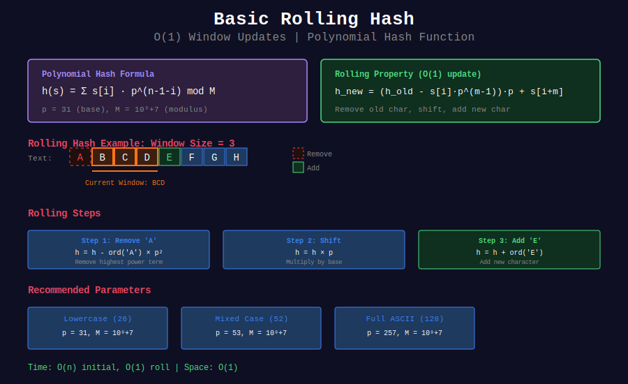

# 🎲 Basic Rolling Hash

## 📊 Visual Overview



## 📊 Metadata
- **Difficulty:** 
- **Time Complexity:** O(n) for n characters
- **Space Complexity:** O(1)
- **Pattern:** Hash Function, Modular Arithmetic

---

## 🎯 Overview

**Rolling hash** is the core technique enabling efficient string comparison. It allows updating a hash value in O(1) when a window slides over text.

---

## 📐 Mathematical Foundation

### Polynomial Hash Definition

For string s = s[0]s[1]...s[m-1]:

```
h(s) = Σ(i=0 to m-1) s[i] · p^(m-1-i) mod M

Expanded:
h(s) = (s[0]·p^(m-1) + s[1]·p^(m-2) + ... + s[m-1]·p^0) mod M

where:
- p = prime base
- M = prime modulus
- s[i] = character value (usually ord(s[i]))

```

### Rolling Property Derivation

**Goal:** Compute h(s[i+1..i+m]) from h(s[i..i+m-1]) in O(1).

**Step-by-step:**

```
Given:
h(s[i..i+m-1]) = s[i]·p^(m-1) + s[i+1]·p^(m-2) + ... + s[i+m-1]·p^0

Want:
h(s[i+1..i+m]) = s[i+1]·p^(m-1) + s[i+2]·p^(m-2) + ... + s[i+m]·p^0

Solution:
1. Subtract: h - s[i]·p^(m-1)
   = s[i+1]·p^(m-2) + ... + s[i+m-1]·p^0

2. Multiply by p:
   = s[i+1]·p^(m-1) + ... + s[i+m-1]·p^1

3. Add s[i+m]:
   = s[i+1]·p^(m-1) + ... + s[i+m-1]·p^1 + s[i+m]·p^0
   = h(s[i+1..i+m])

Formula:
h_new = ((h_old - s[i]·p^(m-1)) · p + s[i+m]) mod M

```

### Modular Arithmetic

**Why use modulo?**
- Prevent integer overflow
- Keep hash values bounded
- Maintain mathematical properties

**Key operations:**

```
Addition:
(a + b) mod M = ((a mod M) + (b mod M)) mod M

Multiplication:
(a · b) mod M = ((a mod M) · (b mod M)) mod M

Subtraction (handle negative):
(a - b) mod M = ((a mod M) - (b mod M) + M) mod M

Power:
a^k mod M = pow(a, k, M)  # Python built-in

```

---

## 💻 Implementations

### 1. Basic Hash Computation

```python
def compute_hash(s, base=31, mod=10**9 + 7):
    """
    Compute polynomial hash of string
    
    Time: O(n) where n = len(s)
    Space: O(1)
    
    Args:
        s: String to hash
        base: Prime base (31 for lowercase)
        mod: Prime modulus
    
    Returns:
        Hash value
    """
    h = 0
    
    for char in s:
        h = (h * base + ord(char)) % mod
    
    return h

# Examples
print(compute_hash("abc"))      # Specific hash value
print(compute_hash("def"))      # Different value
print(compute_hash("abc"))      # Same as first (deterministic)

```

### 2. Rolling Hash Class

```python
class RollingHash:
    """
    Rolling hash with O(1) updates
    
    Supports:
    - Initial hash computation
    - Rolling window updates
    - Query current hash
    """
    
    def __init__(self, s, window_size, base=31, mod=10**9 + 7):
        """
        Initialize with string and window size
        
        Time: O(window_size)
        """
        self.s = s
        self.window_size = window_size
        self.base = base
        self.mod = mod
        
        # Precompute base^(window_size - 1) mod
        self.power = pow(base, window_size - 1, mod)
        
        # Compute initial window hash
        self.current_hash = 0
        for i in range(window_size):
            self.current_hash = (self.current_hash * base + ord(s[i])) % mod
        
        self.left = 0  # Left boundary of window
    
    def get_hash(self):
        """Get current window hash"""
        return self.current_hash
    
    def roll(self):
        """
        Slide window right by one position
        
        Time: O(1)
        
        Returns: New hash value, or None if can't roll
        """
        if self.left + self.window_size >= len(self.s):
            return None
        
        # Remove leftmost character
        old_char = ord(self.s[self.left])
        self.current_hash = (
            self.current_hash - old_char * self.power % self.mod + self.mod
        ) % self.mod
        
        # Multiply by base
        self.current_hash = (self.current_hash * self.base) % self.mod
        
        # Add new rightmost character
        new_char = ord(self.s[self.left + self.window_size])
        self.current_hash = (self.current_hash + new_char) % self.mod
        
        self.left += 1
        return self.current_hash
    
    def get_window(self):
        """Get current window string"""
        return self.s[self.left:self.left + self.window_size]

# Example usage
s = "abcdefgh"
rh = RollingHash(s, window_size=3)

print(f"Window: {rh.get_window()}, Hash: {rh.get_hash()}")
while rh.roll() is not None:
    print(f"Window: {rh.get_window()}, Hash: {rh.get_hash()}")

```

### 3. Prefix Hash Array

```python
class PrefixHash:
    """
    Precompute prefix hashes for O(1) substring hash queries
    
    Useful when need many substring hashes
    """
    
    def __init__(self, s, base=31, mod=10**9 + 7):
        """
        Precompute all prefix hashes
        
        Time: O(n)
        Space: O(n)
        """
        self.s = s
        self.n = len(s)
        self.base = base
        self.mod = mod
        
        # prefix_hash[i] = hash of s[0..i-1]
        self.prefix_hash = [0] * (self.n + 1)
        
        # power[i] = base^i mod
        self.power = [1] * (self.n + 1)
        
        for i in range(self.n):
            self.prefix_hash[i + 1] = (
                self.prefix_hash[i] * base + ord(s[i])
            ) % mod
            self.power[i + 1] = (self.power[i] * base) % mod
    
    def get_hash(self, left, right):
        """
        Get hash of substring s[left:right]
        
        Time: O(1)
        
        Formula:
        h(s[l..r]) = (prefix[r] - prefix[l] * base^(r-l)) mod M
        """
        hash_val = (
            self.prefix_hash[right] - 
            self.prefix_hash[left] * self.power[right - left]
        ) % self.mod
        
        return (hash_val + self.mod) % self.mod
    
    def compare(self, l1, r1, l2, r2):
        """
        Compare if s[l1:r1] == s[l2:r2] using hashes
        
        Time: O(1)
        """
        if r1 - l1 != r2 - l2:
            return False
        
        return self.get_hash(l1, r1) == self.get_hash(l2, r2)

# Example
s = "abcabcabc"
ph = PrefixHash(s)

# Check if s[0:3] == s[3:6]
print(ph.compare(0, 3, 3, 6))  # True: "abc" == "abc"
print(ph.compare(0, 3, 6, 9))  # True: "abc" == "abc"
print(ph.compare(0, 2, 3, 5))  # False: "ab" != "ca"

```

### 4. Hash with Different Bases

```python
def compare_hash_bases(s):
    """
    Compare hash values with different bases
    
    Shows how base choice affects distribution
    """
    bases = [2, 10, 31, 53, 101, 257]
    mod = 10**9 + 7
    
    print(f"String: '{s}'")
    print(f"Length: {len(s)}\n")
    
    for base in bases:
        h = compute_hash(s, base, mod)
        print(f"Base {base:3d}: {h:12d}")

# Examples
compare_hash_bases("abc")
print()
compare_hash_bases("xyz")

```

### 5. Modular Arithmetic Helpers

```python
class ModularArithmetic:
    """
    Helper functions for modular arithmetic
    """
    
    def __init__(self, mod):
        self.mod = mod
    
    def add(self, a, b):
        """(a + b) mod M"""
        return (a + b) % self.mod
    
    def subtract(self, a, b):
        """(a - b) mod M, handles negative"""
        return (a - b + self.mod) % self.mod
    
    def multiply(self, a, b):
        """(a * b) mod M"""
        return (a * b) % self.mod
    
    def power(self, a, k):
        """a^k mod M (fast exponentiation)"""
        return pow(a, k, self.mod)
    
    def inverse(self, a):
        """
        Modular multiplicative inverse of a
        
        Uses Fermat's little theorem: a^(p-1) ≡ 1 (mod p)
        So: a^(-1) ≡ a^(p-2) (mod p)
        
        Only works if mod is prime
        """
        if self.mod <= 1:
            return None
        
        return self.power(a, self.mod - 2)
    
    def divide(self, a, b):
        """
        (a / b) mod M
        
        Computes a * b^(-1) mod M
        """
        return self.multiply(a, self.inverse(b))

# Example
mod_math = ModularArithmetic(10**9 + 7)

a, b = 123456789, 987654321
print(f"Add: {mod_math.add(a, b)}")
print(f"Subtract: {mod_math.subtract(a, b)}")
print(f"Multiply: {mod_math.multiply(a, b)}")
print(f"Power: {mod_math.power(2, 30)}")
print(f"Inverse of 10: {mod_math.inverse(10)}")

```

### 6. Hash Collision Detector

```python
def find_hash_collisions(strings, base=31, mod=10**9 + 7):
    """
    Find hash collisions in list of strings
    
    Time: O(n * m) where n = number of strings, m = avg length
    Space: O(n)
    
    Returns: List of collision pairs
    """
    from collections import defaultdict
    
    # Compute all hashes
    hash_to_strings = defaultdict(list)
    
    for s in strings:
        h = compute_hash(s, base, mod)
        hash_to_strings[h].append(s)
    
    # Find collisions
    collisions = []
    
    for h, string_list in hash_to_strings.items():
        if len(string_list) > 1:
            # Check which are actual collisions (different strings, same hash)
            for i in range(len(string_list)):
                for j in range(i + 1, len(string_list)):
                    if string_list[i] != string_list[j]:
                        collisions.append((string_list[i], string_list[j], h))
    
    return collisions

# Example: Try to find collisions
import random
import string

def generate_random_strings(count, length):
    return [''.join(random.choices(string.ascii_lowercase, k=length)) 
            for _ in range(count)]

# Test with 10000 random strings
strings = generate_random_strings(10000, 10)
collisions = find_hash_collisions(strings)

print(f"Generated {len(strings)} strings")
print(f"Found {len(collisions)} hash collisions")
if collisions:
    print(f"Example collision: '{collisions[0][0]}' and '{collisions[0][1]}'")
    print(f"Both have hash: {collisions[0][2]}")

```

### 7. Hash Quality Analysis

```python
def analyze_hash_distribution(strings, base=31, mod=10**9 + 7):
    """
    Analyze hash distribution quality
    
    Good hash should have:
    - Uniform distribution
    - Low collision rate
    - Good avalanche effect
    """
    hashes = [compute_hash(s, base, mod) for s in strings]
    
    # Statistics
    unique_hashes = len(set(hashes))
    total_strings = len(strings)
    collision_rate = 1 - unique_hashes / total_strings
    
    # Distribution analysis
    hash_counts = {}
    for h in hashes:
        hash_counts[h] = hash_counts.get(h, 0) + 1
    
    max_bucket = max(hash_counts.values())
    avg_bucket = total_strings / unique_hashes if unique_hashes > 0 else 0
    
    return {
        'total_strings': total_strings,
        'unique_hashes': unique_hashes,
        'collision_rate': collision_rate,
        'max_bucket_size': max_bucket,
        'avg_bucket_size': avg_bucket,
        'load_factor': total_strings / mod
    }

# Example
strings = generate_random_strings(10000, 10)
stats = analyze_hash_distribution(strings)

print("Hash Distribution Analysis:")
print(f"Total strings: {stats['total_strings']}")
print(f"Unique hashes: {stats['unique_hashes']}")
print(f"Collision rate: {stats['collision_rate']:.4%}")
print(f"Max bucket size: {stats['max_bucket_size']}")
print(f"Avg bucket size: {stats['avg_bucket_size']:.2f}")
print(f"Load factor: {stats['load_factor']:.2e}")

```

---

## 💡 Key Insights

### Choosing Good Parameters

**Base (p):**

```python
# For lowercase letters (26 chars)
p = 31  # Prime close to 26, good distribution

# For mixed case (52 chars)
p = 53  # Prime close to 52

# For full ASCII (128 chars)
p = 257 # Prime close to 128

# General rule: p should be prime and ≈ alphabet size

```

**Modulus (M):**

```python
# Common choices:
M = 10**9 + 7   # Fits in 32-bit int, prime
M = 10**9 + 9   # Alternative prime
M = 2**61 - 1   # Mersenne prime, very large

# Requirements:
# 1. M should be prime
# 2. M should be large (reduce collisions)
# 3. M < 2^63 (fit in long long)

```

### Common Mistakes

```python
# ❌ Wrong: Negative hash values
h = (h - old * power) % MOD  # Can be negative!

# ✓ Correct: Handle negative
h = (h - old * power % MOD + MOD) % MOD

# ❌ Wrong: Overflow before modulo
h = h * BASE + char  # May overflow!
h = h % MOD

# ✓ Correct: Modulo at each step
h = (h * BASE % MOD + char) % MOD

# ❌ Wrong: Recompute power every time
power = BASE ** (m - 1) % MOD  # Slow for large m

# ✓ Correct: Precompute once
power = pow(BASE, m - 1, MOD)  # Fast modular exponentiation

```

### Rolling vs Recomputation

```python
# When to recompute:
✓ Window size changes
✓ String modified
✓ First computation

# When to roll:
✓ Fixed window size
✓ Sequential access
✓ String unchanged

```

---

## 🎓 Mathematical Properties

### Hash Linearity

```
h(s1 + s2) = h(s1) · p^|s2| + h(s2) mod M

Proof:
s1 = a₀a₁...aₙ, s2 = b₀b₁...bₘ
s1+s2 = a₀a₁...aₙb₀b₁...bₘ

h(s1+s2) = Σ aᵢ·p^(n+m-i) + Σ bⱼ·p^(m-1-j)
         = h(s1)·p^m + h(s2)

```

### Collision Probability

```
For uniform random strings over alphabet Σ:

P(h(s₁) = h(s₂) | s₁ ≠ s₂) ≈ |Σ|·m / M

Example:
|Σ| = 26 (lowercase)
m = 100 (string length)
M = 10^9+7

P ≈ 2600 / 10^9 ≈ 2.6 × 10^-6 (very low!)

```

---

**Navigation:** [← Rabin-Karp Overview](../README.md) | [Next: Single Pattern →](../02_single_pattern/)

