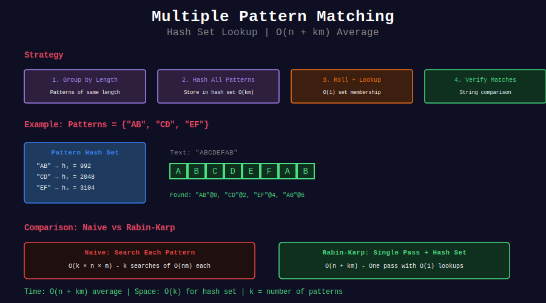

# 🔀 Multiple Pattern Matching with Rabin-Karp

## 📊 Visual Overview



## 📊 Metadata

- **Difficulty:** 

- **Time Complexity:** O(n + km) where k = number of patterns

- **Space Complexity:** O(k)

- **Pattern:** Batch Processing, Hash Sets

---

## 🎯 Overview

Rabin-Karp excels at matching multiple patterns simultaneously by comparing a single text window hash against a set of pattern hashes.

---

## 📐 Algorithm Strategy

```
1. Compute hashes for all patterns: O(km)

2. Store in hash set: O(1) lookup

3. For each text window:
   - Compute/roll window hash: O(1)
   - Check if in pattern set: O(1)
   - Verify if match: O(m)

4. Total: O(n + km) average

```

---

## 💻 Implementations

### 1. Basic Multiple Pattern Search

```python
def search_multiple_patterns(text, patterns, base=31, mod=10**9 + 7):
    """
    Find all occurrences of multiple patterns
    
    Time: O(n + k·m) average where k = len(patterns)
    Space: O(k)
    
    Returns: Dict mapping pattern -> list of positions
    """
    from collections import defaultdict
    
    # Group patterns by length for efficiency
    by_length = defaultdict(list)
    for pattern in patterns:
        by_length[len(pattern)].append(pattern)
    
    results = {p: [] for p in patterns}
    
    # Search each length group
    for length, pattern_group in by_length.items():
        if length > len(text):
            continue
        
        # Compute pattern hashes
        pattern_hashes = {}
        for pattern in pattern_group:
            h = 0
            for c in pattern:
                h = (h * base + ord(c)) % mod
            
            if h not in pattern_hashes:
                pattern_hashes[h] = []
            pattern_hashes[h].append(pattern)
        
        # Search text
        n, m = len(text), length
        power = pow(base, m - 1, mod)
        
        # Initial window
        w_hash = 0
        for i in range(m):
            w_hash = (w_hash * base + ord(text[i])) % mod
        
        # Check all positions
        for i in range(n - m + 1):
            if w_hash in pattern_hashes:
                # Verify each pattern with this hash
                for pattern in pattern_hashes[w_hash]:
                    if text[i:i+m] == pattern:
                        results[pattern].append(i)
            
            # Roll
            if i < n - m:
                w_hash = (w_hash - ord(text[i]) * power % mod + mod) % mod
                w_hash = (w_hash * base + ord(text[i+m])) % mod
    
    return results

# Example
text = "ABABDABACDABABCABAB"
patterns = ["AB", "ABAC", "ABABC", "XYZ"]

results = search_multiple_patterns(text, patterns)
for pattern, matches in results.items():
    if matches:
        print(f"'{pattern}': {matches}")

```

### 2. Optimized for Same-Length Patterns

```python
def search_same_length_patterns(text, patterns, base=31, mod=10**9 + 7):
    """
    Optimized when all patterns have same length
    
    Time: O(n + km)
    Space: O(k)
    """
    if not patterns:
        return {}
    
    m = len(patterns[0])  # All same length
    n = len(text)
    
    if m > n:
        return {p: [] for p in patterns}
    
    # Build hash set
    pattern_hash_map = {}
    for pattern in patterns:
        h = 0
        for c in pattern:
            h = (h * base + ord(c)) % mod
        
        if h not in pattern_hash_map:
            pattern_hash_map[h] = []
        pattern_hash_map[h].append(pattern)
    
    # Search
    results = {p: [] for p in patterns}
    power = pow(base, m - 1, mod)
    
    w_hash = 0
    for i in range(m):
        w_hash = (w_hash * base + ord(text[i])) % mod
    
    for i in range(n - m + 1):
        if w_hash in pattern_hash_map:
            for pattern in pattern_hash_map[w_hash]:
                if text[i:i+m] == pattern:
                    results[pattern].append(i)
        
        if i < n - m:
            w_hash = (w_hash - ord(text[i]) * power % mod + mod) % mod
            w_hash = (w_hash * base + ord(text[i+m])) % mod
    
    return results

```

### 3. Find Any Pattern Match

```python
def find_any_pattern(text, patterns, base=31, mod=10**9 + 7):
    """
    Find if ANY pattern matches (early termination)
    
    Time: O(n + km) best case, O(n·k·m) worst
    Returns: (found, pattern, position) or (False, None, -1)
    """
    by_length = {}
    for pattern in patterns:
        length = len(pattern)
        if length not in by_length:
            by_length[length] = []
        by_length[length].append(pattern)
    
    for length, pattern_group in by_length.items():
        if length > len(text):
            continue
        
        pattern_hashes = {}
        for pattern in pattern_group:
            h = sum(ord(c) * pow(base, length - 1 - i, mod) 
                   for i, c in enumerate(pattern)) % mod
            if h not in pattern_hashes:
                pattern_hashes[h] = []
            pattern_hashes[h].append(pattern)
        
        n, m = len(text), length
        power = pow(base, m - 1, mod)
        
        w_hash = 0
        for i in range(m):
            w_hash = (w_hash * base + ord(text[i])) % mod
        
        for i in range(n - m + 1):
            if w_hash in pattern_hashes:
                for pattern in pattern_hashes[w_hash]:
                    if text[i:i+m] == pattern:
                        return True, pattern, i
            
            if i < n - m:
                w_hash = (w_hash - ord(text[i]) * power % mod + mod) % mod
                w_hash = (w_hash * base + ord(text[i+m])) % mod
    
    return False, None, -1

```

### 4. Pattern Set Matcher Class

```python
class MultiPatternMatcher:
    """
    Preprocess patterns once, match against multiple texts
    """
    
    def __init__(self, patterns, base=31, mod=10**9 + 7):
        self.patterns = patterns
        self.base = base
        self.mod = mod
        
        # Group by length
        from collections import defaultdict
        self.by_length = defaultdict(list)
        self.pattern_hashes = {}
        
        for pattern in patterns:
            length = len(pattern)
            self.by_length[length].append(pattern)
            
            # Precompute hash
            h = 0
            for c in pattern:
                h = (h * base + ord(c)) % mod
            
            if h not in self.pattern_hashes:
                self.pattern_hashes[h] = []
            self.pattern_hashes[h].append(pattern)
    
    def search(self, text):
        """Search all patterns in new text"""
        results = {p: [] for p in self.patterns}
        
        for length, pattern_group in self.by_length.items():
            if length > len(text):
                continue
            
            matches = self._search_length(text, length)
            
            for pattern in pattern_group:
                if pattern in matches:
                    results[pattern] = matches[pattern]
        
        return results
    
    def _search_length(self, text, m):
        """Search all patterns of given length"""
        n = len(text)
        results = {}
        
        power = pow(self.base, m - 1, self.mod)
        
        w_hash = 0
        for i in range(m):
            w_hash = (w_hash * self.base + ord(text[i])) % self.mod
        
        for i in range(n - m + 1):
            if w_hash in self.pattern_hashes:
                for pattern in self.pattern_hashes[w_hash]:
                    if len(pattern) == m and text[i:i+m] == pattern:
                        if pattern not in results:
                            results[pattern] = []
                        results[pattern].append(i)
            
            if i < n - m:
                w_hash = (w_hash - ord(text[i]) * power % self.mod + self.mod) % self.mod
                w_hash = (w_hash * self.base + ord(text[i+m])) % self.mod
        
        return results

# Example: Match same patterns in multiple texts
matcher = MultiPatternMatcher(["AB", "ABC", "ABABC"])

texts = [
    "ABABDABACDABABCABAB",
    "ABCDEFGHI",
    "ABABCABC"
]

for idx, text in enumerate(texts):
    results = matcher.search(text)
    print(f"\nText {idx}:")
    for pattern, matches in results.items():
        if matches:
            print(f"  '{pattern}': {matches}")

```

---

## 💡 Key Optimizations

### 1. Group by Length

```python
# Instead of m different lengths:
for pattern in patterns:  # O(k·n·m)
    search(text, pattern)

# Group same lengths:
for length in unique_lengths:  # O(unique·n + k·m)
    search_all_of_length(text, length)

```

### 2. Hash Set Lookup

```python
# O(1) average to check if hash exists
if window_hash in pattern_hash_set:
    verify_patterns()

```

### 3. Early Termination

```python
if len(found_patterns) == len(patterns):
    break  # All patterns found

```

---

## 🧩 LeetCode Problems

| # | Problem | Difficulty |
|---|---------|------------|
| 3008 | [Find Beautiful Indices](https://leetcode.com/problems/find-beautiful-indices-in-the-given-array-i/) | 🟡 Medium |
| 30 | [Substring with Concatenation](https://leetcode.com/problems/substring-with-concatenation-of-all-words/) | 🔴 Hard |

---

**Navigation:** [← Single Pattern](../02_single_pattern/) | [Next: Collision Handling →](../04_collision_handling/)

