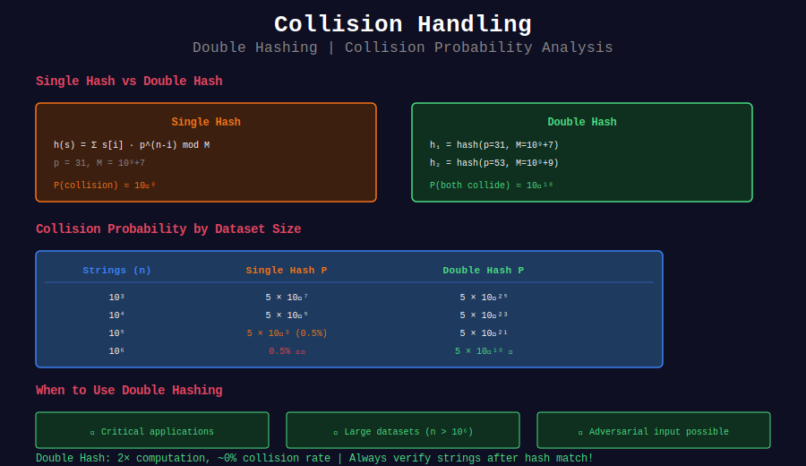

# 🛡️ Collision Handling in Rabin-Karp

## 📊 Visual Overview



## 📊 Metadata
- **Difficulty:** 
- **Collision Probability:** ~1/M single hash, ~1/(M₁·M₂) double hash
- **Topics:** Hash Collisions, Double Hashing, Probabilistic Algorithms

---

## 📐 Mathematical Foundation

### Collision Probability Analysis

**Single Hash:**
```
P(h(s₁) = h(s₂) | s₁ ≠ s₂) ≈ |Σ|·m / M

For lowercase, m=100, M=10⁹+7:
P ≈ 2600 / 10⁹ ≈ 2.6 × 10⁻⁶
```

**Birthday Paradox:**
```
With n strings:
P(at least one collision) ≈ 1 - e^(-n²/(2M))

For M = 10⁹:
n = 10⁴: P ≈ 0.005%
n = 10⁵: P ≈ 0.5%
n = 10⁶: P ≈ 40%
```

**Double Hashing:**
```
P(both collide) ≈ 1 / (M₁ · M₂)

For M₁=10⁹+7, M₂=10⁹+9:
P ≈ 10⁻¹⁸ (negligible!)
```

---

## 💻 Implementations

### 1. Double Hashing

```python
class DoubleHashRK:
    """
    Rabin-Karp with two independent hash functions
    
    Collision probability: ~10⁻¹⁸
    """
    
    def __init__(self):
        self.MOD1 = 10**9 + 7
        self.MOD2 = 10**9 + 9
        self.BASE1 = 31
        self.BASE2 = 53
    
    def hash_pair(self, s):
        """Compute both hashes"""
        h1, h2 = 0, 0
        for c in s:
            h1 = (h1 * self.BASE1 + ord(c)) % self.MOD1
            h2 = (h2 * self.BASE2 + ord(c)) % self.MOD2
        return (h1, h2)
    
    def search(self, text, pattern):
        """
        Search with double hashing
        
        Time: O(n + m)
        Space: O(1)
        """
        n, m = len(text), len(pattern)
        
        if m > n:
            return []
        
        # Pattern hashes
        p_hash = self.hash_pair(pattern)
        
        # Powers
        pow1 = pow(self.BASE1, m - 1, self.MOD1)
        pow2 = pow(self.BASE2, m - 1, self.MOD2)
        
        # Window hashes
        w_hash = self.hash_pair(text[:m])
        
        matches = []
        
        # Check first window
        if w_hash == p_hash:
            if text[:m] == pattern:  # Still verify (good practice)
                matches.append(0)
        
        # Roll through text
        for i in range(m, n):

            # Update hash 1
            h1 = w_hash[0]
            h1 = (h1 - ord(text[i-m]) * pow1 % self.MOD1 + self.MOD1) % self.MOD1
            h1 = (h1 * self.BASE1 + ord(text[i])) % self.MOD1
            
            # Update hash 2
            h2 = w_hash[1]
            h2 = (h2 - ord(text[i-m]) * pow2 % self.MOD2 + self.MOD2) % self.MOD2
            h2 = (h2 * self.BASE2 + ord(text[i])) % self.MOD2
            
            w_hash = (h1, h2)
            
            if w_hash == p_hash:
                if text[i-m+1:i+1] == pattern:
                    matches.append(i - m + 1)
        
        return matches
```

### 2. Triple Hashing (Overkill but Instructive)

```python
class TripleHashRK:
    """
    Three independent hashes
    
    Collision probability: ~10⁻²⁷
    """
    
    def __init__(self):
        self.MOD1 = 10**9 + 7
        self.MOD2 = 10**9 + 9
        self.MOD3 = 10**9 + 21
        self.BASE1 = 31
        self.BASE2 = 53
        self.BASE3 = 97
    
    def hash_triple(self, s):
        """Compute three independent hashes"""
        h1, h2, h3 = 0, 0, 0
        
        for c in s:
            h1 = (h1 * self.BASE1 + ord(c)) % self.MOD1
            h2 = (h2 * self.BASE2 + ord(c)) % self.MOD2
            h3 = (h3 * self.BASE3 + ord(c)) % self.MOD3
        
        return (h1, h2, h3)
```

### 3. Collision Detection and Reporting

```python
def detect_collisions(strings, base=31, mod=10**9 + 7):
    """
    Find hash collisions in list of strings
    
    Returns: List of collision pairs
    """
    from collections import defaultdict
    
    hash_to_strings = defaultdict(list)
    
    for s in strings:
        h = 0
        for c in s:
            h = (h * base + ord(c)) % mod
        hash_to_strings[h].append(s)
    
    collisions = []
    
    for h, string_list in hash_to_strings.items():
        if len(string_list) > 1:

            # Check for actual collisions (different strings)
            seen = set()
            for s in string_list:
                if s not in seen:
                    for s2 in string_list:
                        if s != s2 and (s2, s, h) not in collisions:
                            collisions.append((s, s2, h))
                    seen.add(s)
    
    return collisions

# Test
import random
import string

def gen_random_strings(n, length):
    return [''.join(random.choices(string.ascii_lowercase, k=length)) 
            for _ in range(n)]

strings = gen_random_strings(100000, 10)
collisions = detect_collisions(strings)
print(f"Found {len(collisions)} collisions in {len(strings)} strings")
```

### 4. Adaptive Hash Selection

```python
class AdaptiveHashRK:
    """
    Start with single hash, upgrade to double if collision detected
    """
    
    def __init__(self):
        self.use_double = False
        self.MOD1 = 10**9 + 7
        self.MOD2 = 10**9 + 9
        self.BASE1 = 31
        self.BASE2 = 53
    
    def search(self, text, pattern):
        """Search with adaptive hashing"""

        # Try single hash first
        matches_single = self._search_single(text, pattern)
        
        # If many false positives, switch to double
        if len(matches_single) > len(text) // 10:  # Heuristic threshold
            self.use_double = True
            return self._search_double(text, pattern)
        
        return matches_single
    
    def _search_single(self, text, pattern):
        """Single hash search"""
        n, m = len(text), len(pattern)
        if m > n:
            return []
        
        # Compute hashes
        p_hash = sum(ord(pattern[i]) * pow(self.BASE1, m-1-i, self.MOD1) 
                    for i in range(m)) % self.MOD1
        
        power = pow(self.BASE1, m - 1, self.MOD1)
        w_hash = sum(ord(text[i]) * pow(self.BASE1, m-1-i, self.MOD1) 
                    for i in range(m)) % self.MOD1
        
        matches = []
        
        for i in range(n - m + 1):
            if w_hash == p_hash and text[i:i+m] == pattern:
                matches.append(i)
            
            if i < n - m:
                w_hash = (w_hash - ord(text[i]) * power % self.MOD1 + self.MOD1) % self.MOD1
                w_hash = (w_hash * self.BASE1 + ord(text[i+m])) % self.MOD1
        
        return matches
    
    def _search_double(self, text, pattern):
        """Double hash search"""
        dh = DoubleHashRK()
        return dh.search(text, pattern)
```

---

## 💡 Key Insights

### When to Use Double Hashing

```python
✓ Critical applications (zero false positives)
✓ Large datasets (n > 10⁶)
✓ Adversarial input possible
✓ Cost of verification high

✗ Simple applications
✗ Small datasets
✗ Performance critical (extra overhead)
```

### Hash Parameter Selection

```python

# Single hash
MOD = 10**9 + 7  # Prime, fits in 32-bit
BASE = 31        # Prime near alphabet size

# Double hash
MOD1 = 10**9 + 7
MOD2 = 10**9 + 9  # Different prime
BASE1 = 31
BASE2 = 53        # Different base
```

### Collision Probability Table

| Strings (n) | Single Hash | Double Hash |
|-------------|-------------|-------------|
| 10³ | 5 × 10⁻⁷ | 5 × 10⁻²⁵ |
| 10⁴ | 5 × 10⁻⁵ | 5 × 10⁻²³ |
| 10⁵ | 5 × 10⁻³ | 5 × 10⁻²¹ |
| 10⁶ | 0.5% | 5 × 10⁻¹⁹ |

---

**Navigation:** [← Multiple Patterns](../03_multiple_patterns/) | [Next: Substring Problems →](../05_substring_problems/)

