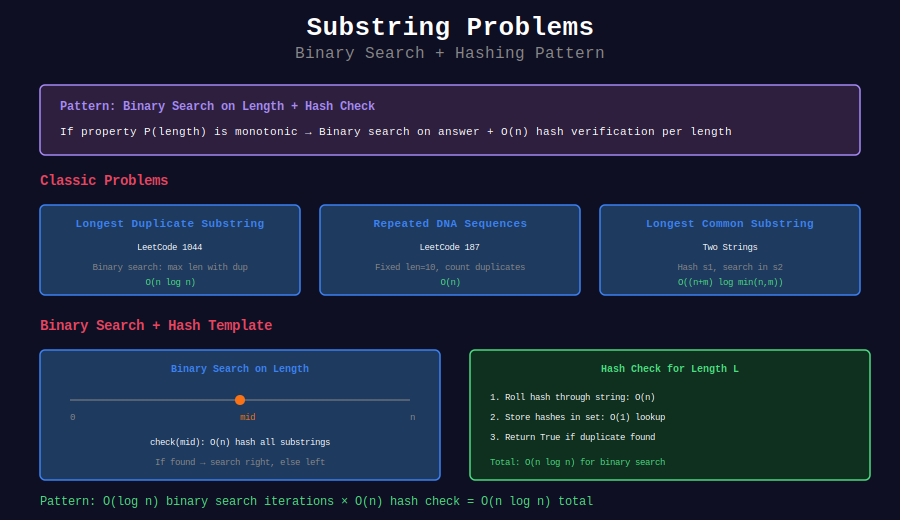

# 🔍 Substring Problems with Rabin-Karp

## 📊 Visual Overview



## 📊 Metadata

- **Difficulty:** 

- **Time Complexity:** O(n log n) typical (with binary search)

- **Space Complexity:** O(n)

- **Pattern:** Binary Search + Hashing, Duplicate Detection

---

## 🎯 Overview

Rabin-Karp combined with binary search solves many substring problems efficiently. The key: use hashing for O(1) substring comparison.

---

## 💻 Implementations

### 1. Longest Duplicate Substring

```python
def longest_duplicate_substring(s):
    """
    LeetCode 1044: Longest Duplicate Substring
    
    Time: O(n log n)
    Space: O(n)
    
    Approach: Binary search on length + hash to check duplicates
    """
    def has_duplicate_of_length(length):
        """Check if duplicate substring of given length exists"""
        if length == 0:
            return -1, ""
        
        BASE, MOD = 31, 10**9 + 7
        
        # Compute hash of first window
        h = 0
        power = 1
        for i in range(length):
            h = (h * BASE + ord(s[i])) % MOD
            if i < length - 1:
                power = (power * BASE) % MOD
        
        # Store seen hashes with their positions
        seen = {h: 0}
        
        # Roll through string
        for i in range(1, len(s) - length + 1):
            h = (h - ord(s[i-1]) * power % MOD + MOD) % MOD
            h = (h * BASE + ord(s[i+length-1])) % MOD
            
            if h in seen:
                # Found duplicate
                return seen[h], s[seen[h]:seen[h]+length]
            
            seen[h] = i
        
        return -1, ""
    
    # Binary search on length
    left, right = 0, len(s)
    result = ""
    
    while left < right:
        mid = (left + right + 1) // 2
        pos, substring = has_duplicate_of_length(mid)
        
        if pos != -1:
            result = substring
            left = mid
        else:
            right = mid - 1
    
    return result

# Examples
print(longest_duplicate_substring("banana"))    # "ana"
print(longest_duplicate_substring("abcd"))      # ""

```

### 2. Longest Repeating Substring

```python
def longest_repeating_substring(s):
    """
    LeetCode 1062: Longest Repeating Substring
    
    Similar to longest duplicate
    
    Time: O(n log n)
    Space: O(n)
    """
    def check(length):
        """Check if repeating substring of length exists"""
        if length == 0:
            return False
        
        BASE, MOD = 31, 10**9 + 7
        
        h = 0
        power = pow(BASE, length - 1, MOD)
        
        for i in range(length):
            h = (h * BASE + ord(s[i])) % MOD
        
        seen = {h}
        
        for i in range(1, len(s) - length + 1):
            h = (h - ord(s[i-1]) * power % MOD + MOD) % MOD
            h = (h * BASE + ord(s[i+length-1])) % MOD
            
            if h in seen:
                return True
            seen.add(h)
        
        return False
    
    # Binary search
    left, right = 0, len(s)
    
    while left < right:
        mid = (left + right + 1) // 2
        
        if check(mid):
            left = mid
        else:
            right = mid - 1
    
    return left

# Examples
print(longest_repeating_substring("abbaba"))    # 2 ("ab" or "ba")
print(longest_repeating_substring("aabcaabdaab"))  # 3 ("aab")

```

### 3. Distinct Substrings Count

```python
def count_distinct_substrings(s):
    """
    Count number of distinct substrings
    
    Time: O(n²)
    Space: O(n²) worst case
    
    Approach: Hash all substrings
    """
    n = len(s)
    BASE, MOD = 31, 10**9 + 7
    
    distinct_hashes = set()
    
    # For each starting position
    for i in range(n):
        h = 0
        
        # Extend substring
        for j in range(i, n):
            h = (h * BASE + ord(s[j])) % MOD
            distinct_hashes.add(h)
    
    return len(distinct_hashes) + 1  # +1 for empty string

# Examples
print(count_distinct_substrings("aaa"))      # 4: "", "a", "aa", "aaa"
print(count_distinct_substrings("banana"))   # 16

```

### 4. Repeated DNA Sequences

```python
def find_repeated_dna_sequences(s):
    """
    LeetCode 187: Repeated DNA Sequences
    
    Find all 10-letter sequences that occur more than once
    
    Time: O(n)
    Space: O(n)
    """
    if len(s) < 10:
        return []
    
    # DNA has only 4 characters, use base 4
    BASE, MOD = 4, 10**9 + 7
    char_map = {'A': 0, 'C': 1, 'G': 2, 'T': 3}
    
    # Compute first window hash
    h = 0
    for i in range(10):
        h = (h * BASE + char_map[s[i]]) % MOD
    
    seen = {h: 1}
    result = []
    
    # Roll through string
    power = pow(BASE, 9, MOD)
    
    for i in range(10, len(s)):
        h = (h - char_map[s[i-10]] * power % MOD + MOD) % MOD
        h = (h * BASE + char_map[s[i]]) % MOD
        
        if h in seen:
            if seen[h] == 1:
                result.append(s[i-9:i+1])
            seen[h] += 1
        else:
            seen[h] = 1
    
    return result

# Example
dna = "AAAAACCCCCAAAAACCCCCCAAAAAGGGTTT"
print(find_repeated_dna_sequences(dna))

```

### 5. Longest Common Substring (Two Strings)

```python
def longest_common_substring(s1, s2):
    """
    Find longest substring common to both strings
    
    Time: O((n+m) log min(n,m))
    Space: O(n+m)
    
    Approach: Binary search on length + hash check
    """
    def check(length):
        """Check if common substring of length exists"""
        if length == 0:
            return ""
        
        BASE, MOD = 31, 10**9 + 7
        
        # Hash all substrings of s1
        hashes_s1 = set()
        h = 0
        power = pow(BASE, length - 1, MOD)
        
        for i in range(length):
            h = (h * BASE + ord(s1[i])) % MOD
        hashes_s1.add(h)
        
        for i in range(length, len(s1)):
            h = (h - ord(s1[i-length]) * power % MOD + MOD) % MOD
            h = (h * BASE + ord(s1[i])) % MOD
            hashes_s1.add(h)
        
        # Check substrings of s2
        h = 0
        for i in range(length):
            h = (h * BASE + ord(s2[i])) % MOD
        
        if h in hashes_s1:
            return s2[:length]
        
        for i in range(length, len(s2)):
            h = (h - ord(s2[i-length]) * power % MOD + MOD) % MOD
            h = (h * BASE + ord(s2[i])) % MOD
            
            if h in hashes_s1:
                return s2[i-length+1:i+1]
        
        return ""
    
    # Binary search
    left, right = 0, min(len(s1), len(s2))
    result = ""
    
    while left <= right:
        mid = (left + right) // 2
        lcs = check(mid)
        
        if lcs:
            result = lcs
            left = mid + 1
        else:
            right = mid - 1
    
    return result

# Example
print(longest_common_substring("abcdefgh", "xyzabcpqr"))  # "abc"

```

### 6. Substring with Concatenation of All Words

```python
def find_substring_concatenation(s, words):
    """
    LeetCode 30: Substring with Concatenation of All Words
    
    Time: O(n * m) where m = len(words)
    Space: O(m)
    """
    from collections import Counter
    
    if not s or not words:
        return []
    
    word_len = len(words[0])
    word_count = len(words)
    total_len = word_len * word_count
    
    BASE, MOD = 31, 10**9 + 7
    
    # Compute word hashes
    word_hashes = Counter()
    for word in words:
        h = 0
        for c in word:
            h = (h * BASE + ord(c)) % MOD
        word_hashes[h] += 1
    
    result = []
    
    # Check each starting position
    for i in range(len(s) - total_len + 1):
        seen = Counter()
        j = 0
        
        while j < word_count:
            start = i + j * word_len
            
            # Compute hash of current word
            h = 0
            for k in range(start, start + word_len):
                h = (h * BASE + ord(s[k])) % MOD
            
            if h in word_hashes and seen[h] < word_hashes[h]:
                seen[h] += 1
                j += 1
            else:
                break
        
        if j == word_count:
            result.append(i)
    
    return result

```

---

## 🧩 LeetCode Problems

| # | Problem | Difficulty |
|---|---------|------------|
| 187 | [Repeated DNA Sequences](https://leetcode.com/problems/repeated-dna-sequences/) | 🟡 Medium |
| 1044 | [Longest Duplicate Substring](https://leetcode.com/problems/longest-duplicate-substring/) | 🟡 Medium |
| 1062 | [Longest Repeating Substring](https://leetcode.com/problems/longest-repeating-substring/) | 🟡 Medium |
| 718 | [Maximum Length Repeated Subarray](https://leetcode.com/problems/maximum-length-of-repeated-subarray/) | 🟡 Medium |
| 30 | [Substring with Concatenation](https://leetcode.com/problems/substring-with-concatenation-of-all-words/) | 🔴 Hard |

---

## 💡 Key Pattern: Binary Search + Hash

```python
def binary_search_hash_template(s):
    """
    Template for binary search + hash problems
    """
    def check(length):
        """Check if property holds for given length"""
        # Use rolling hash to check all substrings of this length
        # Return True/False or specific substring
        pass
    
    # Binary search on answer
    left, right = 0, len(s)
    result = None
    
    while left <= right:
        mid = (left + right) // 2
        
        if check(mid):
            result = mid
            left = mid + 1  # Try larger
        else:
            right = mid - 1  # Try smaller
    
    return result

```

---

**Navigation:** [← Collision Handling](../04_collision_handling/) | [Next: Advanced Applications →](../06_advanced_applications/)

