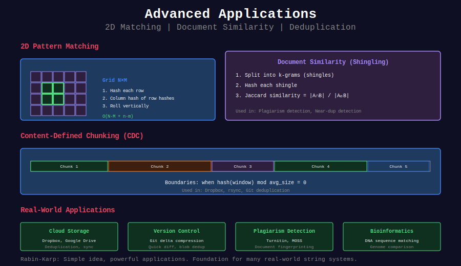

# 🚀 Advanced Applications of Rabin-Karp

## 📊 Visual Overview



## 📊 Metadata
- **Difficulty:** 
- **Topics:** 2D Hashing, Document Similarity, Plagiarism Detection
- **Applications:** Real-world string processing

---

## 💻 Implementations

### 1. 2D Pattern Matching

```python
def search_2d_pattern(grid, pattern):
    """
    Find 2D pattern in 2D grid
    
    Time: O(N·M + n·m) where N×M = grid, n×m = pattern
    Space: O(N + n)
    
    Approach: Hash each row, then use 1D Rabin-Karp on column of row hashes
    """
    if not grid or not pattern:
        return []
    
    N, M = len(grid), len(grid[0])
    n, m = len(pattern), len(pattern[0])
    
    if n > N or m > M:
        return []
    
    BASE, MOD = 31, 10**9 + 7
    
    # Step 1: Compute row hashes for grid
    grid_row_hashes = []
    for row in grid:
        h = 0
        for c in row[:m]:
            h = (h * BASE + ord(c)) % MOD
        grid_row_hashes.append([h])
        
        # Roll through row
        power = pow(BASE, m - 1, MOD)
        for j in range(m, M):
            h = (h - ord(row[j-m]) * power % MOD + MOD) % MOD
            h = (h * BASE + ord(row[j])) % MOD
            grid_row_hashes[-1].append(h)
    
    # Step 2: Compute row hashes for pattern
    pattern_row_hashes = []
    for row in pattern:
        h = 0
        for c in row:
            h = (h * BASE + ord(c)) % MOD
        pattern_row_hashes.append(h)
    
    # Step 3: Compute column hash of pattern rows
    pattern_col_hash = 0
    for h in pattern_row_hashes:
        pattern_col_hash = (pattern_col_hash * BASE + h) % MOD
    
    # Step 4: Search using column hashes
    matches = []
    power = pow(BASE, n - 1, MOD)
    
    for col in range(M - m + 1):
        # Compute column hash for this column
        col_hash = 0
        for i in range(n):
            col_hash = (col_hash * BASE + grid_row_hashes[i][col]) % MOD
        
        if col_hash == pattern_col_hash:
            # Verify actual match
            match = True
            for i in range(n):
                if grid[i][col:col+m] != list(pattern[i]):
                    match = False
                    break
            
            if match:
                matches.append((0, col))
        
        # Roll down columns
        for i in range(n, N):
            col_hash = (col_hash - grid_row_hashes[i-n][col] * power % MOD + MOD) % MOD
            col_hash = (col_hash * BASE + grid_row_hashes[i][col]) % MOD
            
            if col_hash == pattern_col_hash:
                match = True
                for j in range(n):
                    if grid[i-n+1+j][col:col+m] != list(pattern[j]):
                        match = False
                        break
                
                if match:
                    matches.append((i - n + 1, col))
    
    return matches
```

### 2. Document Similarity (Plagiarism Detection)

```python
def document_similarity(doc1, doc2, window_size=10):
    """
    Measure document similarity using shingling
    
    Time: O(n + m)
    Space: O(n + m)
    
    Returns: Jaccard similarity coefficient [0, 1]
    """
    def compute_shingles(doc, k):
        """Compute k-grams (shingles) hash set"""
        if len(doc) < k:
            return set([doc])
        
        BASE, MOD = 31, 10**9 + 7
        
        # First shingle
        h = 0
        for i in range(k):
            h = (h * BASE + ord(doc[i])) % MOD
        
        shingles = {h}
        
        # Roll through document
        power = pow(BASE, k - 1, MOD)
        for i in range(k, len(doc)):
            h = (h - ord(doc[i-k]) * power % MOD + MOD) % MOD
            h = (h * BASE + ord(doc[i])) % MOD
            shingles.add(h)
        
        return shingles
    
    # Compute shingle sets
    shingles1 = compute_shingles(doc1, window_size)
    shingles2 = compute_shingles(doc2, window_size)
    
    # Jaccard similarity
    intersection = len(shingles1 & shingles2)
    union = len(shingles1 | shingles2)
    
    return intersection / union if union > 0 else 0

# Example
doc1 = "The quick brown fox jumps over the lazy dog"
doc2 = "The quick brown fox leaps over the lazy dog"
similarity = document_similarity(doc1, doc2, window_size=5)
print(f"Similarity: {similarity:.2%}")
```

### 3. Chunking for Deduplication (CDC)

```python
def content_defined_chunking(data, avg_chunk_size=4096):
    """
    Content-Defined Chunking for deduplication
    
    Used in: Dropbox, backup systems
    
    Time: O(n)
    Space: O(n / avg_chunk_size)
    """
    BASE, MOD = 31, 2**13 - 1  # Use power of 2 minus 1
    MASK = avg_chunk_size - 1  # For modulo avg_chunk_size
    
    chunks = []
    chunk_start = 0
    
    h = 0
    window_size = 48  # Rabin window
    
    for i in range(len(data)):
        # Update hash
        h = (h * BASE + ord(data[i])) % MOD
        
        # Check if boundary (hash matches pattern)
        if (h & MASK) == 0:  # Chunk boundary
            chunks.append(data[chunk_start:i+1])
            chunk_start = i + 1
            h = 0
    
    # Last chunk
    if chunk_start < len(data):
        chunks.append(data[chunk_start:])
    
    return chunks

# Example
data = "A" * 10000 + "B" * 10000 + "A" * 10000
chunks = content_defined_chunking(data, avg_chunk_size=1024)
print(f"Split into {len(chunks)} chunks")
print(f"Chunk sizes: {[len(c) for c in chunks[:5]]}...")
```

### 4. Rolling Hash for Diff Algorithm

```python
def quick_diff(text1, text2, block_size=64):
    """
    Quick diff using rolling hash (rsync-style)
    
    Identifies matching blocks between two files
    
    Time: O(n + m)
    Space: O(n / block_size)
    """
    BASE, MOD = 31, 10**9 + 7
    
    # Build hash table of text1 blocks
    def compute_block_hashes(text, block_size):
        if len(text) < block_size:
            return {}
        
        hashes = {}
        h = 0
        
        for i in range(block_size):
            h = (h * BASE + ord(text[i])) % MOD
        
        hashes[h] = [0]
        
        power = pow(BASE, block_size - 1, MOD)
        
        for i in range(block_size, len(text)):
            h = (h - ord(text[i-block_size]) * power % MOD + MOD) % MOD
            h = (h * BASE + ord(text[i])) % MOD
            
            if h not in hashes:
                hashes[h] = []
            hashes[h].append(i - block_size + 1)
        
        return hashes
    
    # Build hash table for text1
    text1_hashes = compute_block_hashes(text1, block_size)
    
    # Find matching blocks in text2
    matches = []
    
    if len(text2) < block_size:
        return matches
    
    h = 0
    for i in range(block_size):
        h = (h * BASE + ord(text2[i])) % MOD
    
    if h in text1_hashes:
        for pos1 in text1_hashes[h]:
            if text1[pos1:pos1+block_size] == text2[:block_size]:
                matches.append((pos1, 0, block_size))
    
    power = pow(BASE, block_size - 1, MOD)
    
    for i in range(block_size, len(text2)):
        h = (h - ord(text2[i-block_size]) * power % MOD + MOD) % MOD
        h = (h * BASE + ord(text2[i])) % MOD
        
        if h in text1_hashes:
            for pos1 in text1_hashes[h]:
                if text1[pos1:pos1+block_size] == text2[i-block_size+1:i+1]:
                    matches.append((pos1, i - block_size + 1, block_size))
    
    return matches
```

### 5. MinHash for Large-Scale Similarity

```python
def minhash_similarity(doc1, doc2, num_hashes=100):
    """
    MinHash for approximate Jaccard similarity
    
    Much faster for large documents
    
    Time: O(n + m)
    Space: O(num_hashes)
    """
    import random
    
    def compute_minhash_signature(doc, num_hashes, shingle_size=3):
        """Compute MinHash signature"""
        # Generate hash functions
        random.seed(42)
        hash_functions = [
            (random.randint(1, 2**32), random.randint(0, 2**32))
            for _ in range(num_hashes)
        ]
        
        # Compute shingles
        shingles = set()
        for i in range(len(doc) - shingle_size + 1):
            shingles.add(doc[i:i+shingle_size])
        
        # Compute signature
        signature = []
        
        for a, b in hash_functions:
            min_hash = float('inf')
            
            for shingle in shingles:
                # Hash shingle
                h = hash(shingle)
                h = (a * h + b) % (2**32)
                min_hash = min(min_hash, h)
            
            signature.append(min_hash)
        
        return signature
    
    # Compute signatures
    sig1 = compute_minhash_signature(doc1, num_hashes)
    sig2 = compute_minhash_signature(doc2, num_hashes)
    
    # Estimate Jaccard similarity
    matches = sum(1 for i in range(num_hashes) if sig1[i] == sig2[i])
    
    return matches / num_hashes
```

---

## 💡 Real-World Applications

### Use Cases

1. **Cloud Storage (Dropbox, Google Drive)**
   - Content-defined chunking
   - Deduplication
   - Efficient sync

2. **Version Control (Git)**
   - Delta compression
   - Quick diff
   - Blob deduplication

3. **Plagiarism Detection**
   - Document fingerprinting
   - Similarity search
   - Large-scale comparison

4. **Spam Detection**
   - Email fingerprinting
   - Near-duplicate detection
   - Pattern matching

5. **Bioinformatics**
   - DNA sequence matching
   - Genome comparison
   - Pattern discovery

---

## 🎓 Advanced Topics

### Rabin Fingerprint

```python
# Used in rsync, Low Bandwidth Network Filesystem
# Polynomial over GF(2) instead of integers
```

### Locality-Sensitive Hashing

```python
# For approximate nearest neighbor search
# MinHash is one example
```

### Content-Addressable Storage

```python
# Hash-based addressing
# Used in Git, IPFS
```

---

**Navigation:** [← Substring Problems](../05_substring_problems/) | [Rabin-Karp Overview](../README.md) | [String Algorithms](../../README.md)

