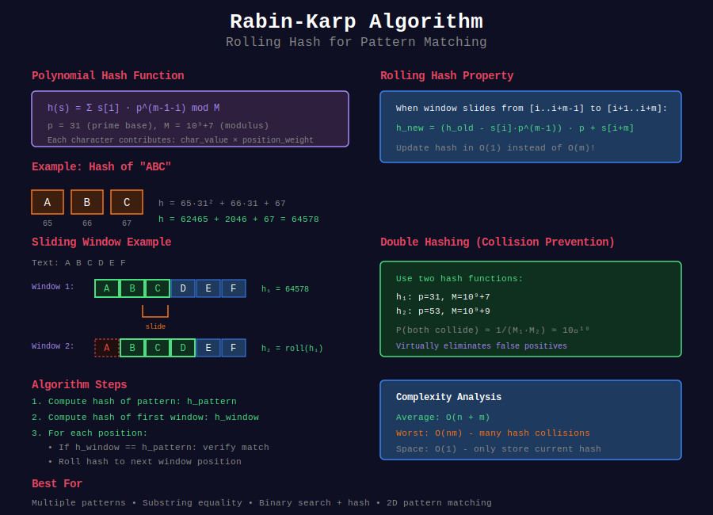

# 🎲 Rabin-Karp Algorithm

## 📊 Visual Overview



## 📊 Metadata
- **Difficulty:** 
- **Time Complexity:** O(n + m) average, O(nm) worst
- **Space Complexity:** O(1)
- **Topics:** Rolling Hash, Polynomial Hash, Pattern Matching
- **Prerequisites:** Modular arithmetic, Hashing, Number theory

---

## 📂 Subtopics

<table>
<tr>
<td width="33%">

### [01. Basic Rolling Hash](./01_basic_rolling_hash/)
- Hash function design
- Rolling property
- Modular arithmetic

</td>
<td width="33%">

### [02. Single Pattern](./02_single_pattern/)
- Basic pattern matching
- First/all occurrences
- Hash verification

</td>
<td width="33%">

### [03. Multiple Patterns](./03_multiple_patterns/)
- Multiple pattern search
- Pattern grouping
- Efficient batching

</td>
</tr>
<tr>
<td width="33%">

### [04. Collision Handling](./04_collision_handling/)
- Double hashing
- Collision probability
- Hash quality analysis

</td>
<td width="33%">

### [05. Substring Problems](./05_substring_problems/)
- Longest duplicate
- Distinct substrings
- Binary search + hash

</td>
<td width="33%">

### [06. Advanced Applications](./06_advanced_applications/)
- 2D pattern matching
- String similarity
- Real-world use cases

</td>
</tr>
</table>

---

## 🎯 Overview

**Rabin-Karp** is a string matching algorithm that uses **hashing** to find patterns in O(n + m) average time. It's particularly effective for:
- Multiple pattern matching
- Problems combining with binary search
- Probabilistic pattern matching

**Core Idea:** Convert strings to numbers using polynomial hash, compare numbers instead of strings.

---

## 📐 Mathematical Foundation

### Polynomial Hash Function

For string s of length m:

```
h(s) = (s[0]·p^(m-1) + s[1]·p^(m-2) + ... + s[m-1]·p^0) mod M

where:
- p = prime base (31 for lowercase, 53 for mixed case)
- M = large prime modulus (10^9+7 or 10^9+9)
- s[i] = character value (typically ASCII)
```

**Example:**
```
String: "abc"
p = 31, M = 10^9+7

h("abc") = (97·31² + 98·31 + 99) mod M
         = (93367 + 3038 + 99) mod M
         = 96504
```

### Rolling Hash Property

**Key Innovation:** Update hash in O(1) when window slides.

**Formula:**
```
Given: h(s[i..i+m-1])
Want: h(s[i+1..i+m])

h(s[i+1..i+m]) = ((h(s[i..i+m-1]) - s[i]·p^(m-1)) · p + s[i+m]) mod M
```

**Proof:**
```
h(s[i..i+m-1]) = s[i]·p^(m-1) + s[i+1]·p^(m-2) + ... + s[i+m-1]·p^0

Subtract s[i]·p^(m-1):
    = s[i+1]·p^(m-2) + ... + s[i+m-1]·p^0

Multiply by p:
    = s[i+1]·p^(m-1) + ... + s[i+m-1]·p^1

Add s[i+m]:
    = s[i+1]·p^(m-1) + ... + s[i+m-1]·p^1 + s[i+m]·p^0
    = h(s[i+1..i+m])
```

### Collision Probability

For random strings over alphabet Σ:

```
P(h(s₁) = h(s₂) | s₁ ≠ s₂) ≈ |Σ|·m / M

For m = 100, |Σ| = 26, M = 10^9+7:
P(collision) ≈ 2600 / 10^9 ≈ 2.6 × 10^-6 (very small!)
```

**Double Hashing:**
```
Use two independent hash functions h₁ and h₂
P(both collide) ≈ 1/(M₁·M₂) ≈ 10^-18 (negligible!)
```

---

## 💻 Core Implementations

### Basic Polynomial Hash

```python
class RabinKarp:
    """
    Rabin-Karp with polynomial rolling hash
    
    Time: O(n + m) average
    Space: O(1)
    """
    
    def __init__(self, base=31, mod=10**9 + 7):
        self.BASE = base
        self.MOD = mod
    
    def hash_string(self, s):
        """
        Compute polynomial hash of string
        
        Time: O(len(s))
        """
        h = 0
        for c in s:
            h = (h * self.BASE + ord(c)) % self.MOD
        return h
    
    def search(self, text, pattern):
        """
        Find all occurrences of pattern in text
        
        Time: O(n + m) average
        Space: O(1)
        
        Returns: List of starting indices
        """
        n, m = len(text), len(pattern)
        
        if m > n:
            return []
        
        # Compute pattern hash
        pattern_hash = self.hash_string(pattern)
        
        # Precompute p^(m-1) mod M
        power = pow(self.BASE, m - 1, self.MOD)
        
        # Compute initial window hash
        window_hash = self.hash_string(text[:m])
        
        matches = []
        
        # Check first window
        if window_hash == pattern_hash and text[:m] == pattern:
            matches.append(0)
        
        # Roll through text
        for i in range(m, n):

            # Remove leftmost character
            window_hash = (window_hash - ord(text[i-m]) * power % self.MOD + self.MOD) % self.MOD
            
            # Multiply by base
            window_hash = (window_hash * self.BASE) % self.MOD
            
            # Add rightmost character
            window_hash = (window_hash + ord(text[i])) % self.MOD
            
            # Check if hashes match
            if window_hash == pattern_hash:

                # Verify to avoid false positives
                if text[i-m+1:i+1] == pattern:
                    matches.append(i - m + 1)
        
        return matches

# Example usage
rk = RabinKarp()
text = "AABAACAADAABAABA"
pattern = "AABA"
print(rk.search(text, pattern))  # [0, 9, 12]
```

### Double Hashing Implementation

```python
class DoubleHashRabinKarp:
    """
    Rabin-Karp with double hashing for collision resistance
    
    Collision probability: ~10^-18
    """
    
    def __init__(self):
        self.MOD1 = 10**9 + 7
        self.MOD2 = 10**9 + 9
        self.BASE1 = 31
        self.BASE2 = 53
    
    def hash_pair(self, s):
        """Compute both hashes"""
        h1, h2 = 0, 0
        for c in s:
            h1 = (h1 * self.BASE1 + ord(c)) % self.MOD1
            h2 = (h2 * self.BASE2 + ord(c)) % self.MOD2
        return (h1, h2)
    
    def search(self, text, pattern):
        """
        Search with double hashing
        
        Time: O(n + m)
        """
        n, m = len(text), len(pattern)
        
        if m > n:
            return []
        
        # Pattern hashes
        p_hash = self.hash_pair(pattern)
        
        # Precompute powers
        pow1 = pow(self.BASE1, m - 1, self.MOD1)
        pow2 = pow(self.BASE2, m - 1, self.MOD2)
        
        # Initial window hashes
        w_hash = self.hash_pair(text[:m])
        
        matches = []
        
        # Check first window
        if w_hash == p_hash:

            # Extremely high confidence, but still verify
            if text[:m] == pattern:
                matches.append(0)
        
        # Roll through text
        for i in range(m, n):

            # Update hash 1
            h1 = w_hash[0]
            h1 = (h1 - ord(text[i-m]) * pow1 % self.MOD1 + self.MOD1) % self.MOD1
            h1 = (h1 * self.BASE1 + ord(text[i])) % self.MOD1
            
            # Update hash 2
            h2 = w_hash[1]
            h2 = (h2 - ord(text[i-m]) * pow2 % self.MOD2 + self.MOD2) % self.MOD2
            h2 = (h2 * self.BASE2 + ord(text[i])) % self.MOD2
            
            w_hash = (h1, h2)
            
            # Check match
            if w_hash == p_hash:
                if text[i-m+1:i+1] == pattern:
                    matches.append(i - m + 1)
        
        return matches
```

---

## 🎯 Quick Reference

### Time Complexity Analysis

| Operation | Average | Worst Case | Notes |
|-----------|---------|------------|-------|
| **Compute hash** | O(m) | O(m) | Preprocessing |
| **Roll hash** | O(1) | O(1) | Core advantage |
| **Pattern match** | O(n) | O(nm) | Worst: all positions collide |
| **Verify match** | O(m) | O(m) | Per collision |
| **Total** | O(n+m) | O(nm) | Average very good |

**Expected collisions:** O(n/M) ≈ 0 for large M

### Hash Parameter Selection

```python

# For lowercase strings (a-z)
BASE = 31   # Prime near 26
MOD = 10**9 + 7  # Large prime

# For mixed case (a-z, A-Z)
BASE = 53   # Prime near 52
MOD = 10**9 + 9  # Alternative large prime

# For all ASCII
BASE = 257  # Prime near 256
MOD = 2**61 - 1  # Mersenne prime

# Double hashing
MOD1 = 10**9 + 7
MOD2 = 10**9 + 9
BASE1 = 31
BASE2 = 53
```

### Common Patterns

```python

# 1. Single pattern matching
rk = RabinKarp()
matches = rk.search(text, pattern)

# 2. Multiple patterns
for pattern in patterns:
    matches[pattern] = rk.search(text, pattern)

# 3. Substring equality
hash1 = rk.hash_string(s1[i:j])
hash2 = rk.hash_string(s2[k:l])
if hash1 == hash2 and s1[i:j] == s2[k:l]:

    # Equal substrings

# 4. Binary search + hash
def check_length(L):
    hashes = set()
    for i in range(n - L + 1):
        h = compute_hash(s[i:i+L])
        if h in hashes:
            return True
        hashes.add(h)
    return False
```

---

## 📊 Algorithm Comparison

| Algorithm | Preprocessing | Matching | Best For |
|-----------|--------------|----------|----------|
| **Naive** | O(1) | O(nm) | Very short patterns |
| **KMP** | O(m) | O(n) | Guaranteed performance |
| **Rabin-Karp** | O(m) | O(n) avg | Multiple patterns |
| **Boyer-Moore** | O(m+σ) | O(n/m) avg | Large alphabets |
| **Aho-Corasick** | O(m) | O(n+k) | Many patterns |

---

## 🗂️ Problem Categories

This section contains **50+ problems** across **6 categories**:

1. **[Basic Rolling Hash](./01_basic_rolling_hash/)** (8 problems)
   - Hash implementation
   - Rolling updates
   - Modular arithmetic

2. **[Single Pattern Matching](./02_single_pattern/)** (9 problems)
   - Find occurrences
   - Pattern verification
   - Edge cases

3. **[Multiple Patterns](./03_multiple_patterns/)** (10 problems)
   - Batch searching
   - Pattern grouping
   - Optimization strategies

4. **[Collision Handling](./04_collision_handling/)** (8 problems)
   - Double hashing
   - Collision detection
   - Hash quality

5. **[Substring Problems](./05_substring_problems/)** (9 problems)
   - Longest duplicate
   - Distinct substrings
   - Binary search combinations

6. **[Advanced Applications](./06_advanced_applications/)** (8 problems)
   - 2D matching
   - DNA sequencing
   - Real-world problems

---

## 💡 Key Insights

### When to Use Rabin-Karp

✅ **Best for:**
- Multiple pattern matching (k patterns in same text)
- Substring comparison problems
- Combining with binary search
- When collisions are acceptable (with verification)
- Average-case performance critical

❌ **Avoid when:**
- Need guaranteed O(n) worst case → Use KMP
- Pattern changes frequently → Overhead not worth it
- Very short patterns → Naive might be faster
- Zero false positives critical → Use deterministic algorithm

### Hash Function Quality

**Good hash properties:**
```python
1. Uniform distribution: P(h(x) = v) ≈ 1/M for all v
2. Avalanche effect: Small change → large hash change
3. Fast computation: O(1) per character
4. Rolling property: O(1) window update
```

**Common pitfalls:**
```python

# ❌ Wrong: Negative hash values
hash = (hash - old * power) % MOD

# ✓ Correct: Handle negative
hash = (hash - old * power % MOD + MOD) % MOD

# ❌ Wrong: Integer overflow
hash = hash * BASE + char

# ✓ Correct: Modulo at each step
hash = (hash * BASE % MOD + char) % MOD
```

---

## 🎓 Advanced Topics

### Birthday Paradox Analysis

**Question:** How many strings before collision likely?

**Answer:**
```
Expected collisions with n strings:
E[collisions] ≈ n²/(2M)

For 50% collision probability:
n ≈ √(2M·ln(2)) ≈ 1.18√M

For M = 10^9:
n ≈ 37,000 strings before 50% collision chance
```

### Hash Space Analysis

```python

# Single hash
M = 10^9 + 7
Expected collisions per 10^6 strings: ~500

# Double hash
M1 = 10^9 + 7, M2 = 10^9 + 9
Expected collisions per 10^6 strings: ~5 × 10^-7 (negligible)

# Triple hash (overkill)
Expected collisions: ~10^-25
```

### Rolling Hash Variants

**1. Cyclic polynomial:**
```python
h = (h << 1) | (h >> (bits - 1))  # Rotate left
h ^= char
```

**2. Buzhash:**
```python
h ^= table[s[i]]
h = rotate_left(h, 1)
```

**3. Rabin fingerprint:**
```python

# Uses irreducible polynomial over GF(2^k)
h = (h * x + char) mod P(x)
```

---

## 📚 Mathematical Foundations

### Fermat's Little Theorem

**Theorem:** If p is prime and gcd(a, p) = 1:
```
a^(p-1) ≡ 1 (mod p)
```

**Application:** Compute modular inverse
```python

# To divide by a mod p:
inv_a = pow(a, p - 2, p)  # Uses Fermat
result = (b * inv_a) % p   # Equivalent to b/a mod p
```

### Chinese Remainder Theorem

**Use in double hashing:**
```
If gcd(M1, M2) = 1:
h1 ≡ v (mod M1) and h2 ≡ v (mod M2)
determines unique v (mod M1·M2)
```

---

## 🧭 Navigation

| ⬅️ Previous | 📂 Current | ➡️ Next |
|:------------|:----------:|--------:|
| [← KMP Algorithm](../01_kmp/) | **Rabin-Karp** | [Z-Algorithm →](../03_z_algorithm/) |

---

## 🗺️ Subtopic Navigation

1. [Basic Rolling Hash →](./01_basic_rolling_hash/)
2. [Single Pattern →](./02_single_pattern/)
3. [Multiple Patterns →](./03_multiple_patterns/)
4. [Collision Handling →](./04_collision_handling/)
5. [Substring Problems →](./05_substring_problems/)
6. [Advanced Applications →](./06_advanced_applications/)
