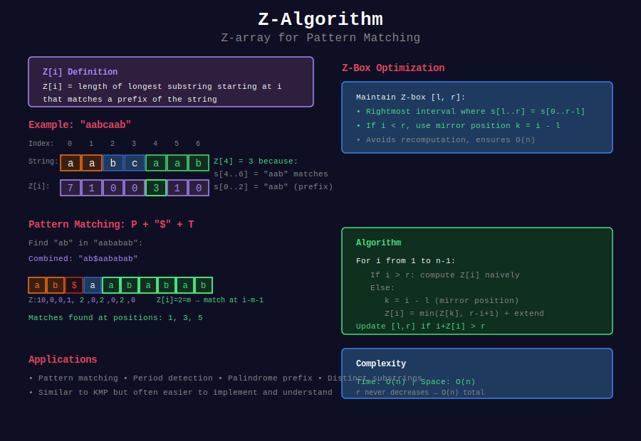

# 🔢 Z-Algorithm

## 📊 Visual Overview



## 📊 Metadata

- **Difficulty:** 

- **Time Complexity:** O(n)

- **Space Complexity:** O(n)

- **Topics:** String Matching, Z-array, Pattern Preprocessing

- **Prerequisites:** String basics, Two pointers

---

## 🎯 Overview

The **Z-Algorithm** computes the **Z-array** for a string in linear time. The Z-array is a powerful tool for pattern matching and various string problems.

**Z[i]** = Length of the longest substring starting from index i that matches the prefix of the string.

---

## 📐 Mathematical Foundation

### Z-Array Definition

For a string s of length n:

```
Z[i] = max{ k : s[0..k-1] = s[i..i+k-1] }
     = length of longest prefix of s that matches substring starting at i

By convention: Z[0] = 0 or Z[0] = n

```

**Example:**

```
String: "aabcaabxaaz"
Index:   01234567890

Z[0] = 0  (or n=11, by convention)
Z[1] = 1  ("a" matches prefix)
Z[2] = 0  ("b" doesn't match "a")
Z[3] = 0  ("c" doesn't match "a")
Z[4] = 3  ("aab" matches prefix)
Z[5] = 1  ("a" matches prefix)
Z[6] = 0  ("b" doesn't match "a")
Z[7] = 0  ("x" doesn't match "a")
Z[8] = 2  ("aa" matches prefix)
Z[9] = 1  ("a" matches prefix)
Z[10]= 0  ("z" doesn't match "a")

Result: Z = [0, 1, 0, 0, 3, 1, 0, 0, 2, 1, 0]

```

### Z-Box Concept

**Z-box:** The substring s[l..r] that matches prefix s[0..r-l].

**Key Invariant:** For current position i:

- We maintain rightmost Z-box [l, r] where r is maximum

- If i ≤ r, we can use previously computed Z-values

**Optimization:**

```
If i is inside current Z-box [l, r]:
  Mirror position k = i - l
  
  Case 1: Z[k] < r - i + 1
    → Z[i] = Z[k] (no expansion needed)
  
  Case 2: Z[k] ≥ r - i + 1
    → Initialize Z[i] = r - i + 1, then expand

```

---

## 💻 Implementation

### Basic Z-Algorithm

```python
def z_algorithm(s):
    """
    Compute Z-array for string s
    
    Time: O(n)
    Space: O(n)
    
    Z[i] = length of longest substring starting at i
           that matches prefix of s
    """
    n = len(s)
    z = [0] * n
    z[0] = n  # or 0, depending on convention
    
    # l, r = leftmost and rightmost boundaries of current Z-box
    l, r = 0, 0
    
    for i in range(1, n):
        # Case 1: i > r (outside current Z-box)
        if i > r:
            l, r = i, i
            
            # Naive expansion from position i
            while r < n and s[r - l] == s[r]:
                r += 1
            
            z[i] = r - l
            r -= 1  # r points to last matching character
        
        else:
            # Case 2: i <= r (inside current Z-box)
            k = i - l  # Mirror position in prefix
            
            # Case 2a: Z[k] doesn't reach boundary
            if z[k] < r - i + 1:
                z[i] = z[k]
            
            # Case 2b: Z[k] reaches or exceeds boundary
            else:
                l = i
                # Try to extend beyond r
                while r < n and s[r - l] == s[r]:
                    r += 1
                z[i] = r - l
                r -= 1
    
    return z

# Example usage
s = "aabcaabxaaz"
z = z_algorithm(s)
print(z)  # [11, 1, 0, 0, 3, 1, 0, 0, 2, 1, 0]

```

### Pattern Matching with Z-Algorithm

```python
def z_search(text, pattern):
    """
    Find all occurrences of pattern in text using Z-algorithm
    
    Time: O(n + m)
    Space: O(n + m)
    
    Approach: Concatenate pattern + separator + text
    Then find positions where Z[i] = len(pattern)
    """
    if not pattern or not text:
        return []
    
    m, n = len(pattern), len(text)
    
    # Concatenate with separator to avoid overlap
    s = pattern + '$' + text
    z = z_algorithm(s)
    
    # Find positions where full pattern matches
    matches = []
    for i in range(m + 1, len(s)):
        if z[i] == m:
            # Adjust index to text position
            matches.append(i - m - 1)
    
    return matches

# Example
text = "ABABDABACDABABCABAB"
pattern = "ABABCABAB"
matches = z_search(text, pattern)
print(f"Pattern found at: {matches}")

```

### Optimized Z-Algorithm (Alternative)

```python
def z_algorithm_optimized(s):
    """
    Alternative implementation with clearer logic
    
    Time: O(n)
    Space: O(n)
    """
    n = len(s)
    z = [0] * n
    
    # Start with l=0, r=0
    for i in range(1, n):
        # If i is beyond r, compute Z[i] naively
        if i > r:
            l = r = i
            while r < n and s[r - l] == s[r]:
                r += 1
            z[i] = r - l
            r -= 1
        else:
            # i is within [l, r]
            k = i - l
            
            # If Z[k] is within bounds, copy it
            if z[k] < r - i + 1:
                z[i] = z[k]
            else:
                # Otherwise, start from r and expand
                l = i
                while r < n and s[r - l] == s[r]:
                    r += 1
                z[i] = r - l
                r -= 1
    
    return z

```

---

## 🎯 Common Patterns & Use Cases

### 1. Count Pattern Occurrences

```python
def count_pattern(text, pattern):
    """
    Count occurrences of pattern in text
    
    Time: O(n + m)
    """
    s = pattern + '$' + text
    z = z_algorithm(s)
    m = len(pattern)
    
    count = sum(1 for i in range(m + 1, len(s)) if z[i] == m)
    return count

# Example
print(count_pattern("abababa", "aba"))  # 3 (overlapping)

```

### 2. Find All Palindrome Prefixes

```python
def palindrome_prefixes(s):
    """
    Find lengths of all palindromic prefixes
    
    Time: O(n)
    Space: O(n)
    """
    # Create string: s + '#' + reverse(s)
    combined = s + '#' + s[::-1]
    z = z_algorithm(combined)
    
    n = len(s)
    palindromes = []
    
    # Check each prefix
    for i in range(1, n + 1):
        # Position in combined string
        pos = 2 * n + 1 - i
        if z[pos] == i:
            palindromes.append(i)
    
    return palindromes

# Example
print(palindrome_prefixes("aabaa"))  # [1, 5] (a, aabaa)

```

### 3. Minimum Rotation

```python
def min_rotation(s):
    """
    Find lexicographically minimum rotation of string
    
    Time: O(n)
    Space: O(n)
    
    Example: "bca" -> "acb" (rotate right twice)
    """
    n = len(s)
    s_doubled = s + s
    
    # Booth's algorithm using Z-array
    min_pos = 0
    
    for i in range(1, n):
        # Compare s[min_pos:] with s[i:]
        compare = s_doubled[min_pos:min_pos+n]
        candidate = s_doubled[i:i+n]
        
        if candidate < compare:
            min_pos = i
    
    return s_doubled[min_pos:min_pos+n]

# Example
print(min_rotation("bca"))   # "acb"
print(min_rotation("baaa"))  # "aaab"

```

### 4. Longest Prefix-Suffix Match

```python
def longest_prefix_suffix(s):
    """
    Find length of longest proper prefix that is also suffix
    (Similar to KMP failure function)
    
    Time: O(n)
    """
    z = z_algorithm(s)
    n = len(s)
    
    # Check from end backwards
    for i in range(n - 1, 0, -1):
        if z[i] == n - i:  # Reaches end of string
            return z[i]
    
    return 0

# Example
print(longest_prefix_suffix("abcab"))   # 2 ("ab")
print(longest_prefix_suffix("aaa"))     # 2 ("aa")

```

### 5. String Matching with Mismatches

```python
def match_with_k_mismatches(text, pattern, k):
    """
    Find positions where pattern matches with at most k mismatches
    
    Time: O(n · k)
    Space: O(n + m)
    """
    n, m = len(text), len(pattern)
    matches = []
    
    for i in range(n - m + 1):
        mismatches = 0
        
        for j in range(m):
            if text[i + j] != pattern[j]:
                mismatches += 1
                if mismatches > k:
                    break
        
        if mismatches <= k:
            matches.append(i)
    
    return matches

# Better approach using Z-algorithm
def match_k_mismatches_optimized(text, pattern, k):
    """
    Optimized version splitting on mismatches
    
    Time: O(n · k)
    """
    n, m = len(text), len(pattern)
    matches = []
    
    for start in range(n - m + 1):
        # Use Z-algorithm for each segment
        mismatches = 0
        pos = 0
        
        while pos < m and mismatches <= k:
            # Compare substring
            s = pattern[pos:] + '$' + text[start + pos:]
            z = z_algorithm(s)
            
            match_len = z[m - pos + 1] if m - pos + 1 < len(z) else 0
            
            if match_len + pos >= m:
                break
            
            # Mismatch found
            mismatches += 1
            pos += match_len + 1
        
        if mismatches <= k:
            matches.append(start)
    
    return matches

```

### 6. Distinct Substrings Using Z-Array

```python
def count_distinct_substrings_z(s):
    """
    Count distinct substrings using Z-algorithm
    
    Time: O(n²)
    Space: O(n)
    """
    n = len(s)
    count = 1  # Empty string
    
    for i in range(n):
        # Compute Z-array for suffix starting at i
        suffix = s[i:]
        z = z_algorithm(suffix)
        
        # All substrings of this suffix are new except
        # those matching prefixes of previous suffixes
        count += len(suffix)
        
        # Subtract duplicates (would need more complex tracking)
        # This is simplified
    
    return count

```

### 7. Period Detection

```python
def find_period(s):
    """
    Find smallest period of string using Z-algorithm
    
    Time: O(n)
    Space: O(n)
    
    Period p: s[i] = s[i + p] for all valid i
    """
    n = len(s)
    z = z_algorithm(s)
    
    # Check each potential period
    for period in range(1, n):
        if period + z[period] == n:
            # String can be formed by repeating first 'period' chars
            return period
    
    return n  # Entire string is the period

# Example
print(find_period("abcabcabc"))  # 3
print(find_period("abab"))       # 2
print(find_period("abcd"))       # 4

```

---

## 🔬 Time Complexity Analysis

### Amortized Analysis

**Claim:** Z-algorithm runs in O(n) time.

**Proof:**
- Each position i is processed once in outer loop: O(n)

- The key: r (right boundary) never decreases more than it increases

- r starts at 0, ends at most at n-1
- Total increase in r: at most n

- Each while loop increases r by at least 1
- Therefore, total while loop iterations: at most n

**Formal argument:**

```
Let T = total number of iterations (outer + inner)

Outer loop: n iterations

Inner loop (while r < n and s[r-l] == s[r]):
  Each iteration increases r by 1
  r can increase from 0 to n-1 (total: n-1 times)
  
Therefore: T ≤ n + (n-1) = O(n)

```

### Space Complexity

- Z-array: O(n)

- For pattern matching: O(n + m) where m = pattern length

- No additional data structures needed

---

## 🧩 LeetCode Problems

### Medium

| # | Problem | Difficulty | Pattern |
|---|---------|------------|---------|
| 28 | [Find Index of First Occurrence](https://leetcode.com/problems/find-the-index-of-the-first-occurrence-in-a-string/) | 🟡 Medium | Basic Z-algorithm |
| 796 | [Rotate String](https://leetcode.com/problems/rotate-string/) | 🟡 Medium | Pattern matching |
| 459 | [Repeated Substring Pattern](https://leetcode.com/problems/repeated-substring-pattern/) | 🟡 Medium | Period detection |
| 214 | [Shortest Palindrome](https://leetcode.com/problems/shortest-palindrome/) | 🟡 Medium | Palindrome prefix |
| 1392 | [Longest Happy Prefix](https://leetcode.com/problems/longest-happy-prefix/) | 🟡 Medium | Prefix-suffix match |

### Hard

| # | Problem | Difficulty | Pattern |
|---|---------|------------|---------|
| 1316 | [Distinct Echo Substrings](https://leetcode.com/problems/distinct-echo-substrings/) | 🔴 Hard | Z-array + hash |
| 1531 | [String Compression II](https://leetcode.com/problems/string-compression-ii/) | 🔴 Hard | DP + Z-array |

---

## 💡 Key Insights

### Z-Algorithm vs KMP

| Aspect | Z-Algorithm | KMP |
|--------|-------------|-----|
| **Preprocessing** | Z-array | Failure function |
| **Matching** | Direct array lookup | State transitions |
| **Intuition** | Prefix matches | Border analysis |
| **Code complexity** | Simpler | More complex |
| **Use case** | Prefix-related problems | Pattern matching |

### When to Use Z-Algorithm

✅ **Use Z-Algorithm when:**
- Need all prefix matches at each position

- Problem involves prefix-suffix relationships

- Want simpler code than KMP

- Need to process each position independently

❌ **Consider alternatives when:**
- Only need first occurrence (simpler algorithms exist)

- Pattern changes frequently (preprocessing overhead)

- Need approximate matching (different algorithms)

### Common Applications

1. **Pattern Matching:** Replace KMP with clearer code
2. **Palindrome Problems:** Combine with reverse string
3. **Period Detection:** Find repeating patterns
4. **Prefix Queries:** Answer questions about prefixes
5. **String Comparison:** Compare substrings efficiently

---

## 🎓 Advanced Techniques

### 1. Two Z-Arrays (Forward + Backward)

```python
def longest_palindrome_substring(s):
    """
    Find longest palindromic substring using two Z-arrays
    
    Time: O(n)
    Space: O(n)
    """
    n = len(s)
    if n <= 1:
        return s
    
    # For odd-length palindromes
    max_len = 1
    start = 0
    
    for center in range(n):
        # Check palindrome centered at 'center'
        left = s[:center+1][::-1]
        right = s[center:]
        
        # Find common prefix length
        combined = right + '$' + left
        z = z_algorithm(combined)
        
        # Maximum match from this center
        for i in range(len(right), len(combined)):
            if z[i] > 0:
                pal_len = 2 * z[i] - 1
                if pal_len > max_len:
                    max_len = pal_len
                    start = center - z[i] + 1
    
    return s[start:start + max_len]

```

### 2. Z-Algorithm on Multiple Strings

```python
def longest_common_prefix_multiple(strings):
    """
    Find longest common prefix of multiple strings
    
    Time: O(n · k) where k = number of strings
    """
    if not strings:
        return ""
    
    # Use first string as reference
    reference = strings[0]
    
    for s in strings[1:]:
        # Find common prefix with Z-algorithm
        combined = reference + '$' + s
        z = z_algorithm(combined)
        
        # Find maximum Z-value starting from len(reference)+1
        max_match = 0
        for i in range(len(reference) + 1, len(combined)):
            max_match = max(max_match, z[i])
        
        # Update reference to common prefix
        reference = reference[:max_match]
        
        if not reference:
            return ""
    
    return reference

```

---

## 🔗 Related Topics

- [KMP Algorithm](../01_kmp/) - Similar pattern matching approach

- [Manacher's Algorithm](../05_manacher/) - Palindrome detection

- [String Hashing](../08_string_hashing/) - Alternative string comparison

---

## 📚 Additional Resources

- [CP-Algorithms: Z-Algorithm](https://cp-algorithms.com/string/z-function.html)

- [Codeforces Tutorial](https://codeforces.com/blog/entry/3107)

- [Visualization Tool](https://personal.utdallas.edu/~besp/demo/John2010/z-algorithm.htm)

---

**Navigation:** [← Rabin-Karp](../02_rabin_karp/) | [String Algorithms](../README.md) | [Next: Suffix Structures →](../04_suffix_structures/)

