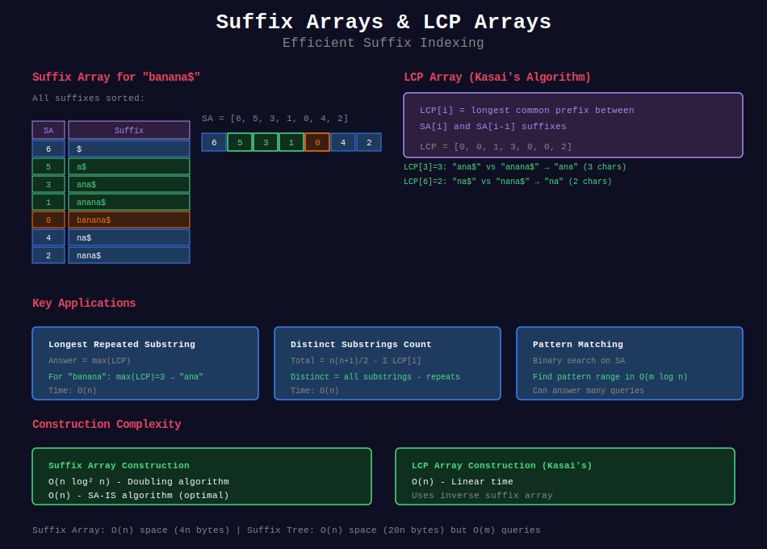

# 📚 Suffix Arrays & LCP Arrays

## 📊 Visual Overview



## 📊 Metadata

- **Difficulty:** 

- **Time Complexity:** O(n log n) construction, O(m log n) query

- **Space Complexity:** O(n)

- **Topics:** Suffix Array, LCP, String Sorting

- **Prerequisites:** Sorting, Binary search, String basics

---

## 🎯 Overview

**Suffix Array** is a sorted array of all suffixes of a string. Combined with the **LCP (Longest Common Prefix) Array**, it provides a memory-efficient alternative to suffix trees for many string problems.

---

## 📐 Mathematical Foundation

### Suffix Array Definition

For string s of length n, the **suffix array SA** is an array of integers representing the starting positions of suffixes in lexicographical order.

**Example:**

```
String: s = "banana$"
Suffixes:
  0: banana$
  1: anana$
  2: nana$
  3: ana$
  4: na$
  5: a$
  6: $

Sorted suffixes:
  6: $
  5: a$
  3: ana$
  1: anana$
  0: banana$
  4: na$
  2: nana$

SA = [6, 5, 3, 1, 0, 4, 2]

```

### LCP Array Definition

**LCP[i]** = Length of longest common prefix between suffixes SA[i] and SA[i-1].

```
For example above:
LCP[0] = 0  (undefined, by convention)
LCP[1] = 0  ($ vs a$)
LCP[2] = 1  (a$ vs ana$) → "a"
LCP[3] = 3  (ana$ vs anana$) → "ana"
LCP[4] = 0  (anana$ vs banana$)
LCP[5] = 0  (banana$ vs na$)
LCP[6] = 2  (na$ vs nana$) → "na"

LCP = [0, 0, 1, 3, 0, 0, 2]

```

### Key Properties

1. **Suffix array uniquely represents string**
2. **All substring queries can be answered** using SA + LCP
3. **Space:** O(n) vs O(n) for suffix tree (but simpler)
4. **Pattern matching:** O(m log n) with binary search

---

## 💻 Implementation

### Suffix Array Construction (O(n log² n))

```python
def build_suffix_array(s):
    """
    Build suffix array using O(n log² n) algorithm
    
    Approach: Iterative doubling
    - Sort by first character
    - Then by first 2 characters
    - Then by first 4 characters
    - ...until sorted by entire suffixes
    
    Time: O(n log² n) - n iterations, each O(n log n) sort
    Space: O(n)
    """
    n = len(s)
    
    # Append sentinel if not present
    if s[-1] != '$':
        s = s + '$'
        n += 1
    
    # Initial ranking by single character
    order = list(range(n))
    order.sort(key=lambda i: s[i])
    
    rank = [0] * n
    rank[order[0]] = 0
    for i in range(1, n):
        if s[order[i]] == s[order[i-1]]:
            rank[order[i]] = rank[order[i-1]]
        else:
            rank[order[i]] = i
    
    k = 1  # Current substring length
    while k < n:
        # Sort by (rank[i], rank[i+k])
        order.sort(key=lambda i: (rank[i], rank[(i + k) % n]))
        
        # Update ranks based on new order
        new_rank = [0] * n
        new_rank[order[0]] = 0
        
        for i in range(1, n):
            prev_pair = (rank[order[i-1]], rank[(order[i-1] + k) % n])
            curr_pair = (rank[order[i]], rank[(order[i] + k) % n])
            
            if curr_pair == prev_pair:
                new_rank[order[i]] = new_rank[order[i-1]]
            else:
                new_rank[order[i]] = i
        
        rank = new_rank
        k *= 2
    
    # Remove sentinel
    return order[1:] if s[-1] == '$' else order

# Example usage
s = "banana"
sa = build_suffix_array(s)
print(f"Suffix Array: {sa}")
# Output: [5, 3, 1, 0, 4, 2]

```

### Kasai's LCP Algorithm (O(n))

```python
def kasai_lcp(s, sa):
    """
    Build LCP array using Kasai's algorithm
    
    Time: O(n)
    Space: O(n)
    
    Key insight: If LCP[rank[i]] = h, then LCP[rank[i+1]] ≥ h-1
    """
    n = len(s)
    
    # Build inverse suffix array (rank)
    rank = [0] * n
    for i in range(n):
        rank[sa[i]] = i
    
    lcp = [0] * n
    h = 0  # Height (LCP value)
    
    for i in range(n):
        if rank[i] > 0:
            # Previous suffix in sorted order
            j = sa[rank[i] - 1]
            
            # Extend LCP from previous computation
            while i + h < n and j + h < n and s[i + h] == s[j + h]:
                h += 1
            
            lcp[rank[i]] = h
            
            # Decrease h for next iteration
            if h > 0:
                h -= 1
    
    return lcp

# Example
s = "banana"
sa = build_suffix_array(s)
lcp = kasai_lcp(s, sa)
print(f"LCP Array: {lcp}")

```

### Pattern Matching with Suffix Array

```python
def pattern_match_sa(s, sa, pattern):
    """
    Find all occurrences of pattern using binary search on SA
    
    Time: O(m log n) where m = len(pattern)
    Space: O(1)
    """
    n = len(s)
    m = len(pattern)
    
    def compare(suffix_pos, pattern):
        """Compare suffix at position with pattern"""
        for i in range(m):
            if suffix_pos + i >= n:
                return -1  # suffix is shorter
            if s[suffix_pos + i] < pattern[i]:
                return -1
            if s[suffix_pos + i] > pattern[i]:
                return 1
        return 0  # match
    
    # Binary search for leftmost occurrence
    left, right = 0, n
    while left < right:
        mid = (left + right) // 2
        if compare(sa[mid], pattern) < 0:
            left = mid + 1
        else:
            right = mid
    
    start_range = left
    
    # Binary search for rightmost occurrence
    left, right = 0, n
    while left < right:
        mid = (left + right) // 2
        if compare(sa[mid], pattern) <= 0:
            left = mid + 1
        else:
            right = mid
    
    end_range = left
    
    # Extract all matches
    if start_range >= n or compare(sa[start_range], pattern) != 0:
        return []
    
    return sorted([sa[i] for i in range(start_range, end_range)])

# Example
s = "banana"
sa = build_suffix_array(s)
matches = pattern_match_sa(s, sa, "ana")
print(f"Pattern 'ana' found at: {matches}")  # [1, 3]

```

---

## 🎯 Common Applications

### 1. Longest Repeated Substring

```python
def longest_repeated_substring(s):
    """
    Find longest substring that appears at least twice
    
    Time: O(n log n)
    Space: O(n)
    
    Approach: Maximum value in LCP array
    """
    if not s:
        return ""
    
    sa = build_suffix_array(s)
    lcp = kasai_lcp(s, sa)
    
    # Find maximum LCP value
    max_lcp = max(lcp)
    
    if max_lcp == 0:
        return ""
    
    # Find position with maximum LCP
    idx = lcp.index(max_lcp)
    return s[sa[idx]:sa[idx] + max_lcp]

# Example
print(longest_repeated_substring("banana"))     # "ana"
print(longest_repeated_substring("abcdefg"))    # ""

```

### 2. Number of Distinct Substrings

```python
def count_distinct_substrings(s):
    """
    Count number of distinct substrings
    
    Time: O(n log n)
    Space: O(n)
    
    Formula: n(n+1)/2 - Σ LCP[i]
    
    Explanation:
    - Total substrings: n(n+1)/2
    - Each LCP[i] represents repeated prefixes
    """
    n = len(s)
    sa = build_suffix_array(s)
    lcp = kasai_lcp(s, sa)
    
    # Total possible substrings
    total = n * (n + 1) // 2
    
    # Subtract repeated prefixes
    repeated = sum(lcp)
    
    return total - repeated

# Example
print(count_distinct_substrings("aaa"))      # 3: "a", "aa", "aaa"
print(count_distinct_substrings("banana"))   # 15

```

### 3. Longest Common Substring (Two Strings)

```python
def longest_common_substring(s1, s2):
    """
    Find longest substring common to both strings
    
    Time: O((n+m) log(n+m))
    Space: O(n+m)
    
    Approach:
    - Concatenate s1 + '#' + s2
    - Build SA and LCP
    - Find max LCP where suffixes from different strings
    """
    # Concatenate with separator
    combined = s1 + '#' + s2
    n1, n2 = len(s1), len(s2)
    n = len(combined)
    
    sa = build_suffix_array(combined)
    lcp = kasai_lcp(combined, sa)
    
    max_len = 0
    result = ""
    
    # Check each adjacent pair in SA
    for i in range(1, n):
        pos1, pos2 = sa[i-1], sa[i]
        
        # Check if from different strings
        if (pos1 < n1 and pos2 > n1) or (pos1 > n1 and pos2 < n1):
            if lcp[i] > max_len:
                max_len = lcp[i]
                result = combined[sa[i]:sa[i] + max_len]
    
    return result

# Example
print(longest_common_substring("abcdefgh", "xyzabc"))  # "abc"

```

### 4. K-Mismatch Problem

```python
def count_k_mismatch(s, k):
    """
    Count pairs of substrings with at most k mismatches
    
    Time: O(n² log n)
    Space: O(n)
    
    Uses SA + LCP for efficient comparison
    """
    n = len(s)
    sa = build_suffix_array(s)
    lcp = kasai_lcp(s, sa)
    
    count = 0
    
    # Check each pair of suffixes
    for i in range(n):
        for j in range(i + 1, n):
            # Use LCP to find first difference
            min_len = min(n - sa[i], n - sa[j])
            
            mismatches = 0
            for pos in range(min_len):
                if s[sa[i] + pos] != s[sa[j] + pos]:
                    mismatches += 1
                    if mismatches > k:
                        break
            
            if mismatches <= k:
                count += 1
    
    return count

```

### 5. Circular String Matching

```python
def circular_string_match(s, pattern):
    """
    Find if any rotation of s contains pattern
    
    Time: O(n log n)
    Space: O(n)
    """
    # Circular string = s + s
    circular = s + s
    sa = build_suffix_array(circular)
    
    # Search for pattern
    matches = pattern_match_sa(circular, sa, pattern)
    
    # Filter matches within first n characters
    return [m for m in matches if m < len(s)]

```

### 6. Palindrome Queries

```python
def longest_palindrome_sa(s):
    """
    Find longest palindromic substring using SA
    
    Time: O(n log n)
    Space: O(n)
    
    Approach:
    - Concatenate s + '$' + reverse(s)
    - Build SA and LCP
    - Find max LCP between symmetric positions
    """
    rev = s[::-1]
    combined = s + '$' + rev
    n = len(s)
    
    sa = build_suffix_array(combined)
    lcp = kasai_lcp(combined, sa)
    
    max_len = 0
    center = 0
    
    for i in range(1, len(combined)):
        pos1, pos2 = sa[i-1], sa[i]
        
        # Check if one from s and one from reverse
        if (pos1 < n and pos2 > n) or (pos1 > n and pos2 < n):
            # Check if they form palindrome
            if pos1 < n:
                left_pos = pos1
                right_pos = n - (pos2 - n - 1) - 1
            else:
                left_pos = pos2
                right_pos = n - (pos1 - n - 1) - 1
            
            # LCP gives palindrome length
            pal_len = lcp[i]
            if pal_len > max_len:
                max_len = pal_len
                center = left_pos
    
    return s[center:center + max_len]

```

### 7. Burrows-Wheeler Transform

```python
def burrows_wheeler_transform(s):
    """
    Compute BWT using suffix array
    
    Time: O(n log n)
    Space: O(n)
    
    BWT is last column of sorted rotations
    """
    s = s + '$'
    n = len(s)
    sa = build_suffix_array(s)
    
    # BWT is character before each suffix
    bwt = []
    for pos in sa:
        bwt.append(s[(pos - 1) % n])
    
    return ''.join(bwt)

def inverse_bwt(bwt):
    """
    Reconstruct original string from BWT
    
    Time: O(n log n)
    """
    n = len(bwt)
    
    # Create table of (char, original_index)
    table = [(bwt[i], i) for i in range(n)]
    table.sort()
    
    # Follow the trail
    idx = 0  # Start with $
    result = []
    
    for _ in range(n):
        result.append(table[idx][0])
        idx = table[idx][1]
    
    return ''.join(result[1:] + result[:1])

# Example
bwt = burrows_wheeler_transform("banana")
print(f"BWT: {bwt}")
print(f"Original: {inverse_bwt(bwt)}")

```

---

## 🧩 LeetCode Problems

### Medium

| # | Problem | Difficulty | Pattern |
|---|---------|------------|---------|
| 1062 | [Longest Repeating Substring](https://leetcode.com/problems/longest-repeating-substring/) | 🟡 Medium | Max LCP |
| 718 | [Maximum Length Repeated Subarray](https://leetcode.com/problems/maximum-length-of-repeated-subarray/) | 🟡 Medium | LCS variant |
| 1044 | [Longest Duplicate Substring](https://leetcode.com/problems/longest-duplicate-substring/) | 🟡 Medium | SA + binary search |

### Hard

| # | Problem | Difficulty | Pattern |
|---|---------|------------|---------|
| 1923 | [Longest Common Subpath](https://leetcode.com/problems/longest-common-subpath/) | 🔴 Hard | Multiple LCS |
| 2060 | [Check Original String](https://leetcode.com/problems/check-if-an-original-string-exists-given-two-encoded-strings/) | 🔴 Hard | SA + matching |
| 1948 | [Delete Duplicate Folders](https://leetcode.com/problems/delete-duplicate-folders-in-system/) | 🔴 Hard | SA on trees |

---

## 💡 Key Insights

### Suffix Array vs Suffix Tree

| Feature | Suffix Array | Suffix Tree |
|---------|--------------|-------------|
| **Space** | O(n) (4n bytes) | O(n) (20n bytes) |
| **Construction** | O(n log n) simple | O(n) complex |
| **Pattern match** | O(m log n) | O(m) |
| **Implementation** | Simpler | Complex |
| **Queries** | With LCP: comparable | Faster |

### When to Use Suffix Arrays

✅ **Use suffix arrays when:**
- Need memory efficiency

- Simpler implementation preferred

- Pattern matching with moderate frequency

- Building offline (preprocessing acceptable)

❌ **Consider alternatives when:**
- Need O(m) pattern matching (use suffix tree)

- Many online updates (use different structure)

- Small strings (simpler algorithms work)

### Common Optimizations

1. **Sparse Suffix Array:** Store every k-th suffix
2. **Enhanced Suffix Array:** Add additional tables for faster queries
3. **Compressed Suffix Array:** Use compression for space
4. **Parallel Construction:** Build SA in parallel

---

## 🎓 Advanced Techniques

### Optimized Construction (O(n))

```python
def sa_is(s):
    """
    SA-IS algorithm: O(n) time, O(n) space
    
    Most efficient suffix array construction
    Complex implementation, often use library
    """
    # This is a simplified outline
    # Real implementation is quite complex
    
    # 1. Classify characters as L-type or S-type
    # 2. Find LMS substrings
    # 3. Recursively sort LMS suffixes
    # 4. Induced sort from LMS positions
    
    # Use library in practice:
    # from suffix_array import sais
    # return sais(s)
    pass

```

### Range Minimum Query on LCP

```python
class LCPQuery:
    """
    Answer LCP queries in O(1) after O(n log n) preprocessing
    
    Uses sparse table for RMQ on LCP array
    """
    def __init__(self, lcp):
        n = len(lcp)
        k = n.bit_length()
        
        # Build sparse table
        self.st = [[0] * k for _ in range(n)]
        
        for i in range(n):
            self.st[i][0] = lcp[i]
        
        j = 1
        while (1 << j) <= n:
            i = 0
            while (i + (1 << j) - 1) < n:
                self.st[i][j] = min(self.st[i][j-1],
                                     self.st[i + (1 << (j-1))][j-1])
                i += 1
            j += 1
        
        self.log = [0] * (n + 1)
        for i in range(2, n + 1):
            self.log[i] = self.log[i >> 1] + 1
    
    def query(self, l, r):
        """Query min LCP in range [l, r]"""
        j = self.log[r - l + 1]
        return min(self.st[l][j], self.st[r - (1 << j) + 1][j])

```

---

## 🔗 Related Topics

- [Suffix Tree](../07_suffix_tree/) - More powerful but complex

- [String Hashing](../08_string_hashing/) - For substring comparisons

- [KMP Algorithm](../01_kmp/) - Pattern matching alternative

---

## 📚 Additional Resources

- [CP-Algorithms: Suffix Array](https://cp-algorithms.com/string/suffix-array.html)

- [Stanford CS166: Suffix Arrays](https://web.stanford.edu/class/cs166/)

- [Kasai's Algorithm Paper](https://www.sciencedirect.com/science/article/pii/S0304397501000225)

---

**Navigation:** [← Z-Algorithm](../03_z_algorithm/) | [String Algorithms](../README.md) | [Next: Manacher's →](../05_manacher/)

