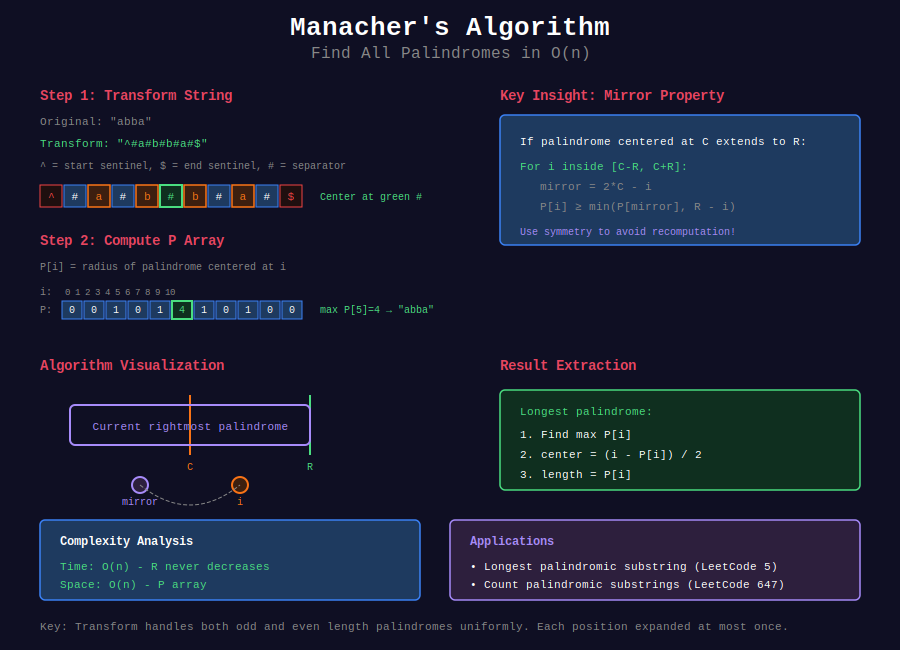

# 🎭 Manacher's Algorithm

## 📊 Visual Overview



## 📊 Metadata
- **Difficulty:** 
- **Time Complexity:** O(n)
- **Space Complexity:** O(n)
- **Topics:** Palindromes, Dynamic Programming, String Processing
- **Prerequisites:** String basics, Two pointers

---

## 🎯 Overview

**Manacher's Algorithm** finds all palindromic substrings in linear time O(n). It's the fastest known algorithm for finding the longest palindromic substring, beating the naive O(n²) approach.

**Key Insight:** Use previously computed palindrome information to avoid redundant checks, leveraging symmetry properties.

---

## 📐 Mathematical Foundation

### Problem Definition

Given string s of length n, find:
- **Longest palindromic substring**
- **All palindromic substrings**
- **Palindrome radius at each position**

### Palindrome Radius

**P[i]** = radius of longest palindrome centered at position i

```
For transformed string (with sentinels):
P[i] = maximum k such that 
       s[i-k] = s[i+k] for all k from 0 to P[i]

```

### Handling Even/Odd Length

**Problem:** Palindromes can be even or odd length.

**Solution:** Transform string to always have odd length:

```
Original:  "abba"
Transform: "^#a#b#b#a#$"

^ and $ are sentinels (boundary markers)
# are separators

Now all palindromes have odd length in transformed string

```

**Example:**

```
Original: "abba"
Transform: "^#a#b#b#a#$"
Indices:    0123456789

P[0] = 0  (sentinel ^)
P[1] = 0  (#)
P[2] = 1  (a → #a#)
P[3] = 0  (#)
P[4] = 1  (b → #b#)
P[5] = 4  (abba → #a#b#b#a#)
P[6] = 1  (b → #b#)
P[7] = 0  (#)
P[8] = 1  (a → #a#)
P[9] = 0  (#)
P[10]= 0  (sentinel $)

Max P[i] = 4 at i=5 → original palindrome "abba" of length 4

```

### Symmetry Property

**Key observation:** If palindrome centered at C extends to R (right boundary):

```
For position i where C-R ≤ i ≤ C+R:
  Mirror position: i' = 2*C - i
  
  Case 1: If P[i'] < R - i
    Then P[i] = P[i']
  
  Case 2: If P[i'] ≥ R - i
    Then P[i] ≥ R - i (need to expand further)

```

**Proof of Case 1:**
- Palindrome at i' is fully contained within palindrome at C
- By symmetry, same palindrome exists at i
- Cannot extend further (would contradict R being boundary)

---

## 💻 Implementation

### Classic Manacher's Algorithm

```python
def manacher(s):
    """
    Manacher's algorithm for finding all palindromes
    
    Time: O(n)
    Space: O(n)
    
    Returns: Array P where P[i] = radius of palindrome at position i
             in the transformed string
    """
    # Transform string
    t = '^#' + '#'.join(s) + '#$'
    n = len(t)
    
    # P[i] = radius of palindrome centered at i
    P = [0] * n
    
    center = 0  # Center of rightmost palindrome
    right = 0   # Right boundary of rightmost palindrome
    
    for i in range(1, n - 1):
        # Mirror of i with respect to center
        mirror = 2 * center - i
        
        # Initialize P[i] using previously computed values
        if i < right:
            P[i] = min(right - i, P[mirror])
        
        # Expand palindrome centered at i
        while t[i + P[i] + 1] == t[i - P[i] - 1]:
            P[i] += 1
        
        # Update rightmost palindrome if necessary
        if i + P[i] > right:
            center = i
            right = i + P[i]
    
    return P

def longest_palindrome(s):
    """
    Find longest palindromic substring
    
    Time: O(n)
    Space: O(n)
    """
    if not s:
        return ""
    
    P = manacher(s)
    
    # Find maximum radius
    max_len = max(P)
    center_index = P.index(max_len)
    
    # Convert back to original string indices
    start = (center_index - max_len) // 2
    return s[start:start + max_len]

# Example usage
s = "babad"
print(f"Longest palindrome: {longest_palindrome(s)}")  # "bab" or "aba"

s = "cbbd"
print(f"Longest palindrome: {longest_palindrome(s)}")  # "bb"

```

### Detailed Implementation with Comments

```python
def manacher_detailed(s):
    """
    Manacher's algorithm with detailed explanation
    
    Time: O(n)
    Space: O(n)
    """
    # Step 1: Transform string
    # Add sentinels (^, $) and separators (#)
    t = '^'
    for char in s:
        t += '#' + char
    t += '#$'
    
    n = len(t)
    P = [0] * n  # Palindrome radius array
    
    center = 0  # Center of current rightmost palindrome
    right = 0   # Right boundary of current rightmost palindrome
    
    for i in range(1, n - 1):
        # Step 2: Calculate mirror position
        mirror = 2 * center - i
        
        # Step 3: Initialize P[i]
        if i < right:
            # Use symmetry to initialize
            # But cap at right boundary
            P[i] = min(right - i, P[mirror])
        # else: P[i] = 0 (already initialized)
        
        # Step 4: Expand palindrome
        # Try to extend palindrome centered at i
        try:
            while t[i + P[i] + 1] == t[i - P[i] - 1]:
                P[i] += 1
        except IndexError:
            # Reached boundary
            pass
        
        # Step 5: Update rightmost palindrome
        if i + P[i] > right:
            center = i
            right = i + P[i]
    
    return P

# Visualize the algorithm
def visualize_manacher(s):
    """Show step-by-step execution"""
    t = '^#' + '#'.join(s) + '#$'
    P = manacher(s)
    
    print(f"Original string: {s}")
    print(f"Transformed:     {t}")
    print(f"P array:         {P}")
    print()
    
    for i in range(len(P)):
        if P[i] > 0:
            start = i - P[i]
            end = i + P[i]
            palindrome = t[start:end+1]
            print(f"Position {i}: radius={P[i]}, palindrome='{palindrome}'")

# Example
visualize_manacher("abba")

```

### Get All Palindromic Substrings

```python
def all_palindromes(s):
    """
    Find all palindromic substrings with their positions
    
    Time: O(n²) in worst case (for output)
    Space: O(n²) for storing all palindromes
    """
    P = manacher(s)
    palindromes = set()
    
    for i in range(len(P)):
        # For each center, extract all palindromes
        for radius in range(1, P[i] + 1):
            # Map back to original string
            start = (i - radius) // 2
            end = (i + radius) // 2
            
            if end <= len(s):
                pal = s[start:end]
                if len(pal) > 0:
                    palindromes.add(pal)
    
    return sorted(palindromes)

# Example
print(all_palindromes("aabaa"))
# ['a', 'aa', 'aabaa', 'aba', 'b', 'baa']

```

### Count All Palindromic Substrings

```python
def count_palindromes(s):
    """
    Count total number of palindromic substrings
    
    Time: O(n)
    Space: O(n)
    
    Formula: For radius r at position i,
             there are r palindromes centered at i
    """
    P = manacher(s)
    
    count = 0
    for radius in P:
        # Each radius contributes (radius + 1) // 2 palindromes
        # But we need to be careful with the transformation
        count += (radius + 1) // 2
    
    return count

# Alternative: direct counting
def count_palindromes_v2(s):
    """Count palindromic substrings directly"""
    P = manacher(s)
    count = 0
    
    for i in range(len(P)):
        # P[i] tells us how many palindromes are centered at i
        # In transformed string, each unit radius = one palindrome
        count += (P[i] + 1) // 2
    
    return count

# Example
print(count_palindromes("abc"))   # 3: "a", "b", "c"
print(count_palindromes("aaa"))   # 6: "a"(3), "aa"(2), "aaa"(1)

```

---

## 🎯 Common Patterns & Use Cases

### 1. Longest Palindromic Substring (LeetCode 5)

```python
def longestPalindrome(s):
    """
    LeetCode 5: Longest Palindromic Substring
    
    Time: O(n)
    Space: O(n)
    """
    if not s:
        return ""
    
    P = manacher(s)
    max_len = max(P)
    center_index = P.index(max_len)
    
    start = (center_index - max_len) // 2
    return s[start:start + max_len]

```

### 2. Palindromic Substrings Count (LeetCode 647)

```python
def countSubstrings(s):
    """
    LeetCode 647: Palindromic Substrings
    
    Time: O(n)
    Space: O(n)
    """
    P = manacher(s)
    count = 0
    
    for radius in P:
        count += (radius + 1) // 2
    
    return count

```

### 3. Shortest Palindrome (LeetCode 214)

```python
def shortestPalindrome(s):
    """
    LeetCode 214: Shortest Palindrome
    Add minimum characters to front to make palindrome
    
    Time: O(n)
    Space: O(n)
    
    Approach: Find longest palindrome prefix
    """
    if not s:
        return s
    
    # Find longest palindrome starting at index 0
    P = manacher(s)
    
    # Check palindromes centered at each position
    max_prefix = 0
    
    for i in range(len(P)):
        # Check if palindrome includes start of string
        if i - P[i] == 1:  # Reaches ^ sentinel
            # Length in original string
            length = P[i]
            max_prefix = max(max_prefix, length)
    
    # Add reverse of suffix to front
    suffix = s[max_prefix:]
    return suffix[::-1] + s

```

### 4. Minimum Cuts for Palindrome Partitioning

```python
def minCut(s):
    """
    LeetCode 132: Palindrome Partitioning II
    Minimum cuts to partition string into palindromes
    
    Time: O(n²) - but O(n) palindrome detection
    Space: O(n)
    """
    n = len(s)
    P = manacher(s)
    
    # Build palindrome check table
    is_palindrome = [[False] * n for _ in range(n)]
    
    for i in range(len(P)):
        for r in range(P[i] + 1):
            left = (i - r) // 2
            right = (i + r) // 2 - 1
            
            if 0 <= left < n and 0 <= right < n and left <= right:
                is_palindrome[left][right] = True
    
    # DP: min cuts
    dp = [float('inf')] * n
    
    for i in range(n):
        if is_palindrome[0][i]:
            dp[i] = 0
        else:
            for j in range(i):
                if is_palindrome[j + 1][i]:
                    dp[i] = min(dp[i], dp[j] + 1)
    
    return dp[n - 1]

```

### 5. Longest Palindrome by Removing One Character

```python
def longest_pal_remove_one(s):
    """
    Find longest palindrome after removing exactly one character
    
    Time: O(n²)
    Space: O(n)
    """
    n = len(s)
    max_len = 0
    
    for skip in range(n):
        # Create string without character at 'skip'
        temp = s[:skip] + s[skip+1:]
        
        # Find longest palindrome
        P = manacher(temp)
        max_len = max(max_len, max(P))
    
    return max_len

```

### 6. Palindrome Pairs

```python
def palindrome_pairs_manacher(words):
    """
    Find pairs of words that form palindrome when concatenated
    
    Uses Manacher's for palindrome checking
    Time: O(k · n²) where k = number of words, n = avg length
    """
    def is_palindrome(s):
        P = manacher(s)
        return max(P) == len(s)
    
    result = []
    
    for i in range(len(words)):
        for j in range(len(words)):
            if i != j:
                combined = words[i] + words[j]
                if is_palindrome(combined):
                    result.append([i, j])
    
    return result

```

### 7. Maximum Product of Palindrome Lengths

```python
def maxProduct(s):
    """
    LeetCode 2002: Maximum Product of Two Palindromic Subsequences
    
    Find two non-overlapping palindromic subsequences with max product
    
    Time: O(3^n) - complex problem
    Space: O(n)
    """
    # Manacher's helps identify palindrome regions
    P = manacher(s)
    
    # Rest requires backtracking/DP
    # Manacher's provides O(1) palindrome checking for substrings
    
    def check_palindrome(left, right):
        # Use precomputed P array
        # Calculate if s[left:right+1] is palindrome
        mid = left + right + 1  # In transformed string
        radius_needed = (right - left + 2) // 2
        
        return P[mid] >= radius_needed
    
    # ... rest of solution
    pass

```

---

## 🧩 LeetCode Problems

### Easy

| # | Problem | Difficulty | Pattern |
|---|---------|------------|---------|
| 9 | [Palindrome Number](https://leetcode.com/problems/palindrome-number/) | 🟢 Easy | Basic palindrome |
| 125 | [Valid Palindrome](https://leetcode.com/problems/valid-palindrome/) | 🟢 Easy | Two pointers |
| 680 | [Valid Palindrome II](https://leetcode.com/problems/valid-palindrome-ii/) | 🟢 Easy | Remove one char |

### Medium

| # | Problem | Difficulty | Pattern |
|---|---------|------------|---------|
| 5 | [Longest Palindromic Substring](https://leetcode.com/problems/longest-palindromic-substring/) | 🟡 Medium | Classic Manacher's |
| 647 | [Palindromic Substrings](https://leetcode.com/problems/palindromic-substrings/) | 🟡 Medium | Count palindromes |
| 516 | [Longest Palindromic Subsequence](https://leetcode.com/problems/longest-palindromic-subsequence/) | 🟡 Medium | DP + palindromes |
| 1312 | [Minimum Insertion Steps](https://leetcode.com/problems/minimum-insertion-steps-to-make-a-string-palindrome/) | 🟡 Medium | Manacher's + DP |

### Hard

| # | Problem | Difficulty | Pattern |
|---|---------|------------|---------|
| 214 | [Shortest Palindrome](https://leetcode.com/problems/shortest-palindrome/) | 🔴 Hard | Palindrome prefix |
| 132 | [Palindrome Partitioning II](https://leetcode.com/problems/palindrome-partitioning-ii/) | 🔴 Hard | DP + precomputation |
| 336 | [Palindrome Pairs](https://leetcode.com/problems/palindrome-pairs/) | 🔴 Hard | Multiple string pairs |
| 2002 | [Maximum Product](https://leetcode.com/problems/maximum-product-of-the-length-of-two-palindromic-subsequences/) | 🔴 Hard | Backtracking + check |

---

## 💡 Key Insights

### Why O(n)?

**Amortized Analysis:**

```
Key observation: Variable 'right' never decreases

- Outer loop: n iterations
- Inner while loop: each iteration increases 'right'
- 'right' can increase at most n times total
- Therefore: Total iterations = O(n)

```

**Proof:**

```
Let T = total operations
T = Σ(1 + expansions at position i)
  = n + (total increase in 'right')
  = n + O(n)
  = O(n)

```

### When to Use Manacher's

✅ **Use Manacher's when:**
- Need ALL palindromic information
- Time limit is tight (must be O(n))
- Working with very long strings
- Need to count/find all palindromes

❌ **Consider alternatives when:**
- Only need existence check (two pointers)
- String is very short (naive works)
- Need palindromic subsequences (DP better)
- Memory is very limited

### Common Pitfalls

1. **Forgetting sentinels:**

```python
# ❌ Wrong - may have index out of bounds
t = '#'.join(s)

# ✓ Correct
t = '^#' + '#'.join(s) + '#$'

```

2. **Incorrect mapping back to original:**

```python
# Transform index i maps to original index:
original_start = (i - P[i]) // 2
original_end = (i + P[i]) // 2

```

3. **Not handling empty string:**

```python
if not s:
    return ""

```

---

## 🎓 Advanced Applications

### Palindrome Tree (Eertree)

```python
class PalindromeTree:
    """
    Data structure to store all palindromes efficiently
    
    More complex than Manacher's but supports:
    - Online construction
    - Substring queries
    - Count distinct palindromes
    """
    # Implementation is complex, used in competitive programming
    pass

```

### Palindrome Density

```python
def palindrome_density(s):
    """
    Calculate palindrome density: ratio of palindromic substrings
    to total substrings
    
    Time: O(n)
    """
    n = len(s)
    total_substrings = n * (n + 1) // 2
    palindromic_count = count_palindromes(s)
    
    return palindromic_count / total_substrings

```

---

## 🔗 Related Topics

- [KMP Algorithm](../01_kmp/) - Prefix-suffix matching
- [Z-Algorithm](../03_z_algorithm/) - Prefix computations
- [String Hashing](../08_string_hashing/) - Fast palindrome checks

---

## 📚 Additional Resources

- [Original Paper (1975)](https://doi.org/10.1016/0022-0000(75)90058-3)
- [CP-Algorithms: Manacher's](https://cp-algorithms.com/string/manacher.html)
- [Visualization](https://www.hackerearth.com/practice/algorithms/string-algorithm/manachars-algorithm/tutorial/)

---

**Navigation:** [← Suffix Structures](../04_suffix_structures/) | [String Algorithms](../README.md) | [Next: Aho-Corasick →](../06_aho_corasick/)

