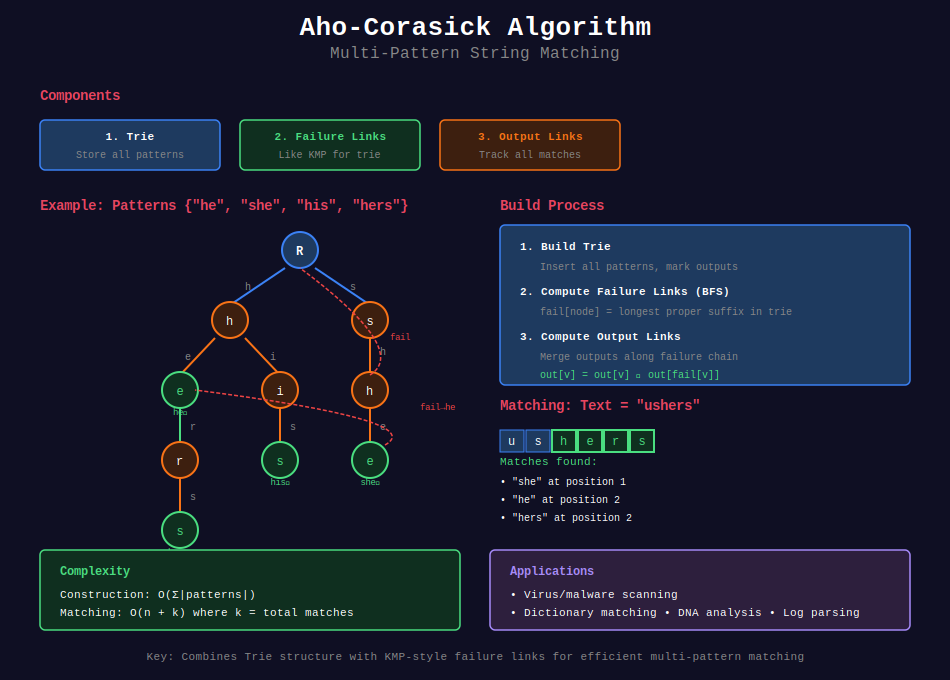

# 🔀 Aho-Corasick Algorithm

## 📊 Visual Overview



## 📊 Metadata

- **Difficulty:** 

- **Time Complexity:** O(n + m + k) where k = matches

- **Space Complexity:** O(m · σ) where σ = alphabet size

- **Topics:** Trie, Automaton, Multiple Pattern Matching

- **Prerequisites:** Trie, BFS, KMP failure function

---

## 🎯 Overview

The **Aho-Corasick** algorithm efficiently finds all occurrences of multiple patterns in a text simultaneously. It combines a **trie** with **failure links** (similar to KMP) to create a finite automaton.

**Key Applications:**
- Virus/malware scanning

- Dictionary matching

- Log analysis

- DNA sequence matching

---

## 📐 Mathematical Foundation

### Components

**1. Trie:** Store all patterns

```
Patterns: {"he", "she", "his", "hers"}

Trie structure:
        root
       /    \
      h      s
     / \      \
    e   i      h
   /     \      \
  (2)    s      e
 /      (3)     (1)
r
s
(4)

Numbers = pattern IDs

```

**2. Failure Links:** Point to longest proper suffix that's in trie

```
Similar to KMP failure function, but for trie nodes

For node representing "she":

- Failure link points to node "he"

- Because "he" is longest suffix of "she" in trie

```

**3. Output Links:** Find all patterns ending at current state

```
If we're at "she" and "he" is also a pattern:

- Both "she" and "he" match

- Output link tracks this

```

### Automaton Transitions

For each node and each character:

```
goto(node, char):
  If child exists: return child
  Else: follow failure links until match found or reach root

```

**Optimized:**
Store explicit transitions for all characters (preprocessed).

---

## 💻 Implementation

### Basic Aho-Corasick

```python
from collections import deque, defaultdict

class AhoCorasick:
    """
    Aho-Corasick automaton for multiple pattern matching
    
    Time: O(m) construction, O(n + k) matching
    where m = total length of patterns, n = text length, k = matches
    
    Space: O(m · σ) where σ = alphabet size
    """
    
    class Node:
        def __init__(self):
            self.children = {}
            self.fail = None  # Failure link
            self.output = []  # Patterns ending here
    
    def __init__(self):
        self.root = self.Node()
        self.root.fail = self.root
    
    def add_pattern(self, pattern, pattern_id=None):
        """
        Add pattern to trie
        
        Time: O(len(pattern))
        """
        node = self.root
        
        for char in pattern:
            if char not in node.children:
                node.children[char] = self.Node()
            node = node.children[char]
        
        # Mark end of pattern
        if pattern_id is None:
            pattern_id = pattern
        node.output.append(pattern_id)
    
    def build_automaton(self):
        """
        Build failure links and output links using BFS
        
        Time: O(m · σ)
        """
        queue = deque()
        
        # Level 1: direct children of root
        for char, child in self.root.children.items():
            child.fail = self.root
            queue.append(child)
        
        # BFS to build failure links
        while queue:
            current = queue.popleft()
            
            for char, child in current.children.items():
                queue.append(child)
                
                # Find failure link
                fail_node = current.fail
                
                while fail_node != self.root and char not in fail_node.children:
                    fail_node = fail_node.fail
                
                if char in fail_node.children and fail_node.children[char] != child:
                    child.fail = fail_node.children[char]
                else:
                    child.fail = self.root
                
                # Add output links
                child.output.extend(child.fail.output)
    
    def search(self, text):
        """
        Find all occurrences of all patterns in text
        
        Time: O(n + k) where k = number of matches
        
        Returns: List of (position, pattern_id) tuples
        """
        results = []
        node = self.root
        
        for i, char in enumerate(text):
            # Follow failure links until match found or reach root
            while node != self.root and char not in node.children:
                node = node.fail
            
            # Take transition
            if char in node.children:
                node = node.children[char]
            else:
                node = self.root
            
            # Report all matches
            for pattern_id in node.output:
                results.append((i, pattern_id))
        
        return results

# Example usage
ac = AhoCorasick()
ac.add_pattern("he")
ac.add_pattern("she")
ac.add_pattern("his")
ac.add_pattern("hers")
ac.build_automaton()

text = "ushers"
matches = ac.search(text)
print(f"Matches: {matches}")
# Output: [(2, 'she'), (2, 'he'), (2, 'hers')]

```

### Optimized with Goto Function

```python
class AhoCorasickOptimized:
    """
    Optimized Aho-Corasick with explicit goto table
    
    Faster matching: O(n) without any string comparisons
    """
    
    def __init__(self):
        self.goto = defaultdict(dict)  # goto[state][char] = next_state
        self.fail = {}                 # fail[state] = failure_state
        self.output = defaultdict(list) # output[state] = [patterns]
        self.state_count = 1           # root = 0
    
    def add_pattern(self, pattern, pattern_id=None):
        """Add pattern to automaton"""
        if pattern_id is None:
            pattern_id = pattern
        
        state = 0  # Start at root
        
        for char in pattern:
            if char not in self.goto[state]:
                self.goto[state][char] = self.state_count
                self.state_count += 1
            state = self.goto[state][char]
        
        self.output[state].append(pattern_id)
    
    def build_automaton(self):
        """Build failure function"""
        queue = deque()
        
        # Initialize level 1
        for char, state in self.goto[0].items():
            self.fail[state] = 0
            queue.append(state)
        
        # BFS
        while queue:
            r = queue.popleft()
            
            for char, s in self.goto[r].items():
                queue.append(s)
                
                # Find failure state
                state = self.fail[r]
                while state != 0 and char not in self.goto[state]:
                    state = self.fail[state]
                
                self.fail[s] = self.goto[state].get(char, 0)
                
                # Add output from failure state
                self.output[s].extend(self.output[self.fail[s]])
    
    def search(self, text):
        """Search for all patterns"""
        results = []
        state = 0
        
        for i, char in enumerate(text):
            # Follow failure links
            while state != 0 and char not in self.goto[state]:
                state = self.fail[state]
            
            # Take transition
            state = self.goto[state].get(char, 0)
            
            # Report matches
            for pattern_id in self.output[state]:
                results.append((i, pattern_id))
        
        return results

```

### With Pattern Position Information

```python
class AhoCorasickWithPositions:
    """
    Enhanced version that returns pattern starting positions
    """
    
    def __init__(self):
        self.ac = AhoCorasick()
        self.pattern_lengths = {}
    
    def add_pattern(self, pattern, pattern_id=None):
        if pattern_id is None:
            pattern_id = pattern
        
        self.ac.add_pattern(pattern, pattern_id)
        self.pattern_lengths[pattern_id] = len(pattern)
    
    def build_automaton(self):
        self.ac.build_automaton()
    
    def search(self, text):
        """
        Returns: List of (start_pos, end_pos, pattern_id)
        """
        matches = self.ac.search(text)
        results = []
        
        for end_pos, pattern_id in matches:
            start_pos = end_pos - self.pattern_lengths[pattern_id] + 1
            results.append((start_pos, end_pos, pattern_id))
        
        return results

```

---

## 🎯 Common Patterns & Use Cases

### 1. Word Break with Dictionary

```python
def word_break_ac(s, word_dict):
    """
    Check if string can be segmented using dictionary words
    
    Time: O(n + m) where m = total length of dictionary
    Space: O(m)
    """
    ac = AhoCorasick()
    for word in word_dict:
        ac.add_pattern(word)
    ac.build_automaton()
    
    n = len(s)
    dp = [False] * (n + 1)
    dp[0] = True
    
    matches = ac.search(s)
    
    # Group matches by end position
    by_end = defaultdict(list)
    for end_pos, word in matches:
        start_pos = end_pos - len(word) + 1
        by_end[end_pos].append(start_pos)
    
    # DP
    for i in range(n):
        if not dp[i]:
            continue
        
        for end in range(i, n):
            if i in by_end[end]:
                dp[end + 1] = True
    
    return dp[n]

```

### 2. Stream of Characters

```python
class StreamChecker:
    """
    LeetCode 1032: Stream of Characters
    
    Check if any suffix of streamed characters matches a word
    """
    
    def __init__(self, words):
        # Build Aho-Corasick on reversed words
        self.ac = AhoCorasick()
        for word in words:
            self.ac.add_pattern(word[::-1])
        self.ac.build_automaton()
        
        self.stream = []
        self.max_len = max(len(w) for w in words)
    
    def query(self, letter):
        """
        Check if any word matches suffix ending with this letter
        
        Time: O(1) amortized
        """
        self.stream.append(letter)
        
        # Keep only last max_len characters
        if len(self.stream) > self.max_len:
            self.stream.pop(0)
        
        # Search in reversed stream
        matches = self.ac.search(self.stream[::-1])
        
        return len(matches) > 0

```

### 3. Find All Anagrams of Patterns

```python
def find_anagram_matches(text, patterns):
    """
    Find positions where anagrams of any pattern occur
    
    Approach: Use Aho-Corasick on sorted patterns
    """
    ac = AhoCorasick()
    
    # Add sorted versions of patterns
    sorted_patterns = {}
    for pattern in patterns:
        sorted_p = ''.join(sorted(pattern))
        sorted_patterns[sorted_p] = pattern
        ac.add_pattern(sorted_p, pattern)
    
    ac.build_automaton()
    
    # Search in sorted sliding windows of text
    n, m = len(text), len(patterns[0])
    results = []
    
    for i in range(n - m + 1):
        window = text[i:i+m]
        sorted_window = ''.join(sorted(window))
        
        # Check if this sorted window matches any pattern
        matches = ac.search(sorted_window)
        
        for _, pattern in matches:
            results.append((i, pattern))
    
    return results

```

### 4. Replace All Patterns

```python
def replace_all_patterns(text, replacements):
    """
    Replace all occurrences of multiple patterns
    
    replacements: dict mapping pattern -> replacement
    
    Time: O(n + m + k) where k = number of replacements
    """
    ac = AhoCorasick()
    
    for pattern in replacements:
        ac.add_pattern(pattern)
    
    ac.build_automaton()
    
    # Find all matches
    matches = ac.search(text)
    
    # Sort by position (reverse to replace from end)
    matches.sort(key=lambda x: x[0], reverse=True)
    
    # Replace each match
    result = list(text)
    for end_pos, pattern in matches:
        start_pos = end_pos - len(pattern) + 1
        replacement = replacements[pattern]
        
        # Replace
        result[start_pos:end_pos+1] = replacement
    
    return ''.join(result)

# Example
text = "she sells seashells"
replacements = {"she": "he", "sea": "ocean"}
print(replace_all_patterns(text, replacements))

```

### 5. Virus Scanner Simulation

```python
class VirusScanner:
    """
    Scan text/file for virus signatures
    """
    
    def __init__(self, signatures):
        """
        signatures: list of (virus_name, pattern) tuples
        """
        self.ac = AhoCorasick()
        self.virus_names = {}
        
        for virus_name, pattern in signatures:
            self.ac.add_pattern(pattern, virus_name)
            self.virus_names[virus_name] = pattern
        
        self.ac.build_automaton()
    
    def scan(self, data):
        """
        Scan data for viruses
        
        Returns: List of detected viruses with positions
        """
        matches = self.ac.search(data)
        
        detected = []
        for pos, virus_name in matches:
            pattern_len = len(self.virus_names[virus_name])
            start = pos - pattern_len + 1
            detected.append({
                'virus': virus_name,
                'position': start,
                'length': pattern_len
            })
        
        return detected

# Example
signatures = [
    ("Virus_A", "malicious_code_1"),
    ("Virus_B", "dangerous_payload"),
    ("Virus_C", "exploit_string")
]

scanner = VirusScanner(signatures)
data = "some_data malicious_code_1 more_data exploit_string end"
detected = scanner.scan(data)
print(f"Detected viruses: {detected}")

```

### 6. Multi-String Replacement (with priority)

```python
def replace_with_priority(text, rules):
    """
    Replace patterns with priority (earlier patterns have priority)
    
    rules: [(pattern, replacement, priority)]
    """
    ac = AhoCorasick()
    
    for i, (pattern, replacement, priority) in enumerate(rules):
        ac.add_pattern(pattern, i)
    
    ac.build_automaton()
    
    matches = ac.search(text)
    
    # Group overlapping matches and choose by priority
    positions = defaultdict(list)
    for end_pos, rule_id in matches:
        pattern, replacement, priority = rules[rule_id]
        start_pos = end_pos - len(pattern) + 1
        positions[start_pos].append((priority, replacement, len(pattern)))
    
    # Build result
    result = []
    i = 0
    while i < len(text):
        if i in positions:
            # Choose highest priority match
            priority, replacement, length = min(positions[i])
            result.append(replacement)
            i += length
        else:
            result.append(text[i])
            i += 1
    
    return ''.join(result)

```

### 7. DNA Sequence Analysis

```python
def find_restriction_sites(dna, enzymes):
    """
    Find restriction enzyme cut sites in DNA
    
    enzymes: dict mapping enzyme_name -> recognition_sequence
    
    Returns: List of cut sites with enzyme names
    """
    ac = AhoCorasick()
    
    for enzyme, sequence in enzymes.items():
        ac.add_pattern(sequence, enzyme)
        # Also add reverse complement
        rev_comp = reverse_complement(sequence)
        ac.add_pattern(rev_comp, f"{enzyme}_rev")
    
    ac.build_automaton()
    
    matches = ac.search(dna)
    
    sites = []
    for pos, enzyme in matches:
        sites.append({
            'enzyme': enzyme,
            'position': pos,
            'sequence': enzymes.get(enzyme, '')
        })
    
    return sorted(sites, key=lambda x: x['position'])

def reverse_complement(seq):
    """Get reverse complement of DNA sequence"""
    complement = {'A': 'T', 'T': 'A', 'C': 'G', 'G': 'C'}
    return ''.join(complement.get(c, c) for c in reversed(seq))

```

---

## 🧩 LeetCode Problems

### Medium

| # | Problem | Difficulty | Pattern |
|---|---------|------------|---------|
| 1032 | [Stream of Characters](https://leetcode.com/problems/stream-of-characters/) | 🟡 Medium | Online matching |
| 472 | [Concatenated Words](https://leetcode.com/problems/concatenated-words/) | 🟡 Medium | Dictionary matching |
| 212 | [Word Search II](https://leetcode.com/problems/word-search-ii/) | 🟡 Medium | Trie + backtracking |

### Hard

| # | Problem | Difficulty | Pattern |
|---|---------|------------|---------|
| 1032 | [Stream of Characters](https://leetcode.com/problems/stream-of-characters/) | 🔴 Hard | Multiple patterns |
| 336 | [Palindrome Pairs](https://leetcode.com/problems/palindrome-pairs/) | 🔴 Hard | Pattern matching |
| 1316 | [Distinct Echo Substrings](https://leetcode.com/problems/distinct-echo-substrings/) | 🔴 Hard | Substring matching |

---

## 💡 Key Insights

### Complexity Analysis

**Construction:**

```
- Building trie: O(Σ|patterns|)

- Building failure links: O(m · σ) where σ = alphabet size

- Total: O(m · σ)

```

**Matching:**

```
- Each character processed once: O(n)

- Reporting matches: O(k) where k = number of matches

- Total: O(n + k)

```

### When to Use Aho-Corasick

✅ **Use when:**
- Searching for multiple patterns simultaneously

- Patterns don't change frequently

- Need to find ALL occurrences

- Working with large texts (virus scanning, log analysis)

❌ **Consider alternatives when:**
- Only one pattern (use KMP or Rabin-Karp)

- Patterns change frequently (rebuilding is expensive)

- Alphabet is very large (space overhead)

- Approximate matching needed (different algorithms)

### Comparison with Alternatives

| Algorithm | Patterns | Time | Space | Best For |
|-----------|----------|------|-------|----------|
| **KMP** | 1 | O(n+m) | O(m) | Single pattern |
| **Rabin-Karp** | Many | O(n·k) | O(1) | Hash-based |
| **Aho-Corasick** | Many | O(n+k) | O(m·σ) | Multiple exact matches |
| **Suffix Array** | Queries | O(m log n) | O(n) | Many queries on fixed text |

---

## 🔗 Related Topics

- [Tries](../../11_tries/) - Foundation data structure

- [KMP Algorithm](../01_kmp/) - Similar failure link concept

- [Suffix Tree](../07_suffix_tree/) - Alternative for pattern matching

---

## 📚 Additional Resources

- [Original Paper (1975)](https://doi.org/10.1145/360825.360855)

- [CP-Algorithms: Aho-Corasick](https://cp-algorithms.com/string/aho_corasick.html)

- [Visualization](https://www.cs.uku.fi/~kilpelai/BSA05/lectures/slides04.pdf)

---

**Navigation:** [← Manacher's](../05_manacher/) | [String Algorithms](../README.md) | [Next: Suffix Tree →](../07_suffix_tree/)

