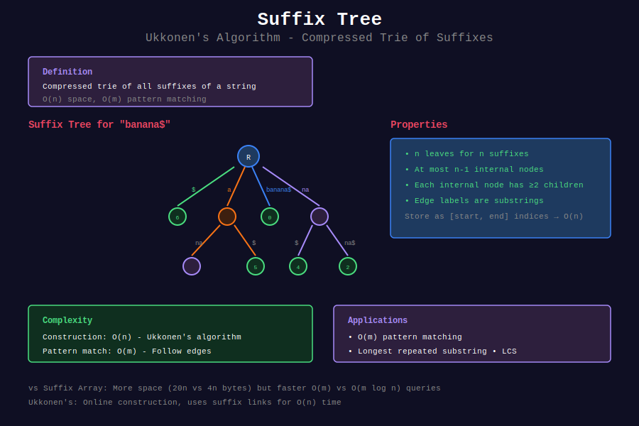

# 🌳 Suffix Tree (Ukkonen's Algorithm)

## 📊 Visual Overview



## 📊 Metadata
- **Difficulty:** 
- **Time Complexity:** O(n) construction, O(m) query
- **Space Complexity:** O(n)
- **Topics:** Suffix Tree, Ukkonen's Algorithm, String Indexing
- **Prerequisites:** Tries, Suffix arrays, Advanced data structures

---

## 🎯 Overview

A **Suffix Tree** is a compressed trie of all suffixes of a string. It's one of the most powerful data structures for string processing, enabling O(m) pattern matching and solving many string problems efficiently.

**Key Properties:**
- Contains all suffixes in compressed form
- O(n) space (linear in string length)
- O(m) pattern matching (linear in pattern length)
- Supports many string operations in optimal time

---

## 📐 Mathematical Foundation

### Definition

For string s$ (with sentinel $):
- **Suffix tree** is a compressed trie of all suffixes
- Each edge labeled with substring
- Each leaf represents one suffix
- Internal nodes have at least 2 children

**Example:**

```
String: "banana$"
Suffixes:
  banana$
  anana$
  nana$
  ana$
  na$
  a$
  $

Suffix Tree (compressed):
         root
        /    \
    banana$   a
              /\
             na$ \
                 na$

```

### Compression

**Trie → Suffix Tree:**
- Combine nodes with single child into one edge
- Label edge with substring (store as [start, end])
- Space: O(n) edges, each stores 2 integers

**Key Insight:** Store edge labels as indices, not strings!

```
Edge label: [3, 5] means s[3:6] (substring from index 3 to 5)

```

---

## 💻 Implementation

### Basic Suffix Tree Node

```python
class SuffixTreeNode:
    """
    Node in suffix tree
    
    Stores:
    - children: dict mapping first char -> child node
    - start: starting index of edge label
    - end: ending index of edge label (pointer for active construction)
    - suffix_link: link to node representing suffix without first char
    """
    
    def __init__(self, start=-1, end=-1):
        self.children = {}
        self.start = start
        self.end = end
        self.suffix_link = None
        self.suffix_index = -1  # For leaf nodes
    
    def edge_length(self):
        """Length of edge leading to this node"""
        if self.end == -1:
            return 0
        return self.end - self.start + 1

```

### Ukkonen's Algorithm (Simplified)

```python
class SuffixTree:
    """
    Suffix Tree using Ukkonen's online algorithm
    
    Time: O(n)
    Space: O(n)
    
    Note: This is a simplified educational version.
    Production code would need more optimizations.
    """
    
    def __init__(self, text):
        self.text = text + '$'  # Add sentinel
        self.n = len(self.text)
        
        # Root node
        self.root = SuffixTreeNode()
        self.root.suffix_link = self.root
        
        # Active point (for online construction)
        self.active_node = self.root
        self.active_edge = -1
        self.active_length = 0
        
        # Remaining suffixes to add
        self.remaining = 0
        
        # Global end pointer (for leaves)
        self.end = [-1]
        
        # Build tree
        self.build()
    
    def build(self):
        """
        Build suffix tree using Ukkonen's algorithm
        
        Online algorithm: processes string left to right
        Maintains suffix tree for s[0..i] at each step i
        """
        for i in range(self.n):
            self.extend(i)
    
    def extend(self, pos):
        """
        Extend tree with character at position pos
        
        Uses:
        - Active point: where to insert next suffix
        - Suffix links: jump to next suffix to insert
        - Remaining: how many suffixes need to be added
        """
        self.end[0] = pos
        self.remaining += 1
        last_new_node = None
        
        while self.remaining > 0:
            if self.active_length == 0:
                self.active_edge = pos
            
            # Check if active edge exists
            if self.text[self.active_edge] not in self.active_node.children:
                # Create new leaf
                self.active_node.children[self.text[self.active_edge]] = \
                    SuffixTreeNode(pos, self.end)
                
                if last_new_node:
                    last_new_node.suffix_link = self.active_node
                    last_new_node = None
            
            else:
                # Walk down if necessary
                next_node = self.active_node.children[self.text[self.active_edge]]
                
                if self.walk_down(next_node):
                    continue
                
                # Check if current character already exists
                if self.text[next_node.start + self.active_length] == self.text[pos]:
                    # Character already in tree
                    if last_new_node:
                        last_new_node.suffix_link = self.active_node
                    
                    self.active_length += 1
                    break
                
                # Split edge and create new internal node
                split_node = SuffixTreeNode(next_node.start, 
                                            next_node.start + self.active_length - 1)
                
                self.active_node.children[self.text[self.active_edge]] = split_node
                
                # Create new leaf
                split_node.children[self.text[pos]] = SuffixTreeNode(pos, self.end)
                
                # Update old node
                next_node.start += self.active_length
                split_node.children[self.text[next_node.start]] = next_node
                
                # Set suffix link
                if last_new_node:
                    last_new_node.suffix_link = split_node
                
                last_new_node = split_node
            
            self.remaining -= 1
            
            # Move to next suffix
            if self.active_node == self.root and self.active_length > 0:
                self.active_length -= 1
                self.active_edge = pos - self.remaining + 1
            elif self.active_node != self.root:
                self.active_node = self.active_node.suffix_link or self.root
    
    def walk_down(self, node):
        """
        Walk down tree if active length exceeds edge length
        """
        edge_length = node.edge_length()
        
        if self.active_length >= edge_length:
            self.active_edge += edge_length
            self.active_length -= edge_length
            self.active_node = node
            return True
        
        return False
    
    def search(self, pattern):
        """
        Search for pattern in suffix tree
        
        Time: O(m) where m = len(pattern)
        Returns: True if pattern exists
        """
        node = self.root
        i = 0
        
        while i < len(pattern):
            if pattern[i] not in node.children:
                return False
            
            child = node.children[pattern[i]]
            
            # Match against edge label
            edge_start = child.start
            edge_end = child.end[0] if isinstance(child.end, list) else child.end
            
            j = edge_start
            while j <= edge_end and i < len(pattern):
                if self.text[j] != pattern[i]:
                    return False
                i += 1
                j += 1
            
            node = child
        
        return True

```

### Practical Suffix Tree (Using Library Concept)

```python
class SimpleSuffixTree:
    """
    Simplified suffix tree for educational purposes
    
    Not optimal but easier to understand
    """
    
    def __init__(self, text):
        self.text = text + '$'
        self.root = {}
        self.build_tree()
    
    def build_tree(self):
        """Build suffix tree (naive approach)"""
        n = len(self.text)
        
        for i in range(n):
            suffix = self.text[i:]
            self.add_suffix(suffix, i)
    
    def add_suffix(self, suffix, index):
        """Add suffix to tree"""
        node = self.root
        
        for char in suffix:
            if char not in node:
                node[char] = {}
            node = node[char]
        
        node['$index'] = index
    
    def search(self, pattern):
        """Search for pattern"""
        node = self.root
        
        for char in pattern:
            if char not in node:
                return False
            node = node[char]
        
        return True
    
    def get_all_occurrences(self, pattern):
        """Find all occurrences of pattern"""
        node = self.root
        
        # Navigate to pattern
        for char in pattern:
            if char not in node:
                return []
            node = node[char]
        
        # Collect all leaf indices
        return self._collect_leaves(node)
    
    def _collect_leaves(self, node):
        """Collect all leaf indices under node"""
        if '$index' in node:
            return [node['$index']]
        
        indices = []
        for key, child in node.items():
            if key != '$index':
                indices.extend(self._collect_leaves(child))
        
        return indices

```

---

## 🎯 Common Applications

### 1. Pattern Matching

```python
def pattern_match_suffix_tree(text, pattern):
    """
    Find all occurrences of pattern in text
    
    Time: O(n) construction + O(m + k) matching
    where k = number of occurrences
    """
    st = SimpleSuffixTree(text)
    return st.get_all_occurrences(pattern)

# Example
text = "banana"
pattern = "ana"
print(pattern_match_suffix_tree(text, pattern))  # [1, 3]

```

### 2. Longest Repeated Substring

```python
def longest_repeated_substring(text):
    """
    Find longest substring that occurs at least twice
    
    Time: O(n)
    
    Approach: Find deepest internal node
    """
    st = SimpleSuffixTree(text)
    
    def dfs(node, depth, path):
        # Check if internal node (has multiple children)
        child_count = sum(1 for k in node.keys() if k != '$index')
        
        if child_count >= 2:
            # Internal node found
            max_depth = depth
            max_path = path
            
            # Recurse on children
            for key, child in node.items():
                if key != '$index':
                    child_depth, child_path = dfs(child, depth + 1, path + key)
                    if child_depth > max_depth:
                        max_depth = child_depth
                        max_path = child_path
            
            return max_depth, max_path
        
        return depth, path
    
    _, result = dfs(st.root, 0, "")
    return result

# Example
print(longest_repeated_substring("banana"))  # "ana"

```

### 3. Longest Common Substring

```python
def longest_common_substring(s1, s2):
    """
    Find longest substring common to both strings
    
    Time: O(n + m)
    
    Approach: Build suffix tree for s1#s2$
    Find deepest node with leaves from both strings
    """
    combined = s1 + '#' + s2 + '$'
    st = SimpleSuffixTree(combined)
    
    def dfs(node, depth, path):
        # Collect leaf indices
        leaves = []
        
        if '$index' in node:
            leaves.append(node['$index'])
        
        for key, child in node.items():
            if key != '$index':
                child_leaves = dfs_collect(child)
                leaves.extend(child_leaves)
        
        # Check if leaves from both strings
        has_s1 = any(idx < len(s1) for idx in leaves)
        has_s2 = any(idx > len(s1) for idx in leaves)
        
        if has_s1 and has_s2:
            # Valid LCS candidate
            max_depth = depth
            max_path = path
            
            for key, child in node.items():
                if key != '$index':
                    child_depth, child_path = dfs(child, depth + 1, path + key)
                    if child_depth > max_depth:
                        max_depth = child_depth
                        max_path = child_path
            
            return max_depth, max_path
        
        return 0, ""
    
    def dfs_collect(node):
        """Collect all leaf indices"""
        if '$index' in node:
            return [node['$index']]
        
        leaves = []
        for key, child in node.items():
            if key != '$index':
                leaves.extend(dfs_collect(child))
        return leaves
    
    _, result = dfs(st.root, 0, "")
    return result

```

### 4. Number of Distinct Substrings

```python
def count_distinct_substrings(text):
    """
    Count distinct substrings
    
    Time: O(n)
    
    Approach: Each path from root represents distinct substring
    Count all edge characters in suffix tree
    """
    st = SimpleSuffixTree(text)
    
    def dfs(node):
        count = 0
        
        for key, child in node.items():
            if key != '$index' and key != '$':
                count += 1  # This character
                count += dfs(child)  # Subtree
        
        return count
    
    return dfs(st.root)

# Example
print(count_distinct_substrings("banana"))  # 15

```

### 5. Substring Queries

```python
class SubstringQueryDS:
    """
    Data structure for substring existence queries
    
    Construction: O(n)
    Query: O(m) where m = query length
    """
    
    def __init__(self, text):
        self.st = SimpleSuffixTree(text)
    
    def exists(self, substring):
        """Check if substring exists"""
        return self.st.search(substring)
    
    def count(self, substring):
        """Count occurrences of substring"""
        return len(self.st.get_all_occurrences(substring))
    
    def positions(self, substring):
        """Get all positions where substring occurs"""
        return sorted(self.st.get_all_occurrences(substring))

```

### 6. Palindrome Substring Count

```python
def count_palindromic_substrings_st(text):
    """
    Count palindromic substrings using suffix tree
    
    Time: O(n²) - checking palindromes
    Space: O(n)
    
    Note: Manacher's is better for this specific problem
    """
    st = SimpleSuffixTree(text)
    count = 0
    
    n = len(text)
    for i in range(n):
        for j in range(i + 1, n + 1):
            substring = text[i:j]
            if substring == substring[::-1]:
                count += 1
    
    return count

```

### 7. Longest Palindromic Substring

```python
def longest_palindrome_suffix_tree(text):
    """
    Find longest palindromic substring
    
    Approach: Build suffix tree for text#reverse(text)
    Find longest common substring where positions are symmetric
    """
    rev = text[::-1]
    combined = text + '#' + rev + '$'
    st = SimpleSuffixTree(combined)
    
    n = len(text)
    max_len = 0
    result = ""
    
    # Check each possible center
    for center in range(n):
        # Check odd-length palindromes
        for radius in range(min(center + 1, n - center)):
            left = center - radius
            right = center + radius
            
            substring = text[left:right + 1]
            if substring == substring[::-1] and len(substring) > max_len:
                max_len = len(substring)
                result = substring
    
    return result

```

---

## 🧩 LeetCode Problems

### Medium

| # | Problem | Difficulty | Pattern |
|---|---------|------------|---------|
| 1062 | [Longest Repeating Substring](https://leetcode.com/problems/longest-repeating-substring/) | 🟡 Medium | Deepest internal node |
| 1044 | [Longest Duplicate Substring](https://leetcode.com/problems/longest-duplicate-substring/) | 🟡 Medium | Repeated substring |

### Hard

| # | Problem | Difficulty | Pattern |
|---|---------|------------|---------|
| 1923 | [Longest Common Subpath](https://leetcode.com/problems/longest-common-subpath/) | 🔴 Hard | Multiple LCS |
| 336 | [Palindrome Pairs](https://leetcode.com/problems/palindrome-pairs/) | 🔴 Hard | Suffix + prefix matching |

---

## 💡 Key Insights

### Suffix Tree vs Suffix Array

| Feature | Suffix Tree | Suffix Array |
|---------|-------------|--------------|
| **Space** | O(n) (20n bytes) | O(n) (4n bytes) |
| **Construction** | O(n) complex | O(n log n) simple |
| **Pattern match** | O(m) | O(m log n) |
| **LCP queries** | O(1) with preprocessing | O(1) with RMQ |
| **Implementation** | Very complex | Moderate |
| **Practical use** | Research, specialized | More common |

### When to Use Suffix Trees

✅ **Use suffix trees when:**
- Need O(m) pattern matching (fastest possible)
- Many different string operations on same text
- Theoretical optimality required
- Text is preprocessed once, queried many times

❌ **Consider alternatives when:**
- Simple pattern matching (use KMP/Rabin-Karp)
- Memory is limited (use suffix array)
- Implementation complexity matters
- Need to modify text frequently

### Common Applications Summary

```python
# Fast operations with suffix tree:
- Pattern matching: O(m)
- Longest repeated substring: O(n)
- Longest common substring: O(n+m)
- Count distinct substrings: O(n)
- Substring queries: O(m)
- Find all occurrences: O(m + k)

```

---

## 🎓 Advanced Concepts

### Generalized Suffix Tree

```python
class GeneralizedSuffixTree:
    """
    Suffix tree for multiple strings
    
    Applications:
    - Longest common substring of k strings
    - Find string in collection
    - All pairs LCS
    """
    
    def __init__(self, strings):
        # Combine strings with unique separators
        self.strings = strings
        combined = ""
        self.boundaries = [0]
        
        for i, s in enumerate(strings):
            combined += s + chr(ord('$') + i)
            self.boundaries.append(len(combined))
        
        self.st = SimpleSuffixTree(combined)
    
    def longest_common_substring_all(self):
        """Find longest substring common to ALL strings"""
        # Find deepest node with leaves from all strings
        pass

```

### Suffix Links Properties

```
Suffix link from node representing "aα" points to node representing "α"

Uses:
- Fast construction in Ukkonen's algorithm
- Linear time guarantee
- Navigate between related suffixes

```

---

## 🔗 Related Topics

- [Suffix Array](../04_suffix_structures/) - Memory-efficient alternative
- [Tries](../../11_tries/) - Foundation data structure
- [KMP Algorithm](../01_kmp/) - Simpler pattern matching

---

## 📚 Additional Resources

- [Ukkonen's Algorithm Paper (1995)](https://www.cs.helsinki.fi/u/ukkonen/SuffixT1withFigs.pdf)
- [CP-Algorithms: Suffix Tree](https://cp-algorithms.com/string/suffix-tree-ukkonen.html)
- [Stanford CS166: Suffix Trees](https://web.stanford.edu/class/cs166/lectures/03/Small03.pdf)
- [Visualization Tool](https://brenden.github.io/ukkonen-animation/)

---

**Navigation:** [← Aho-Corasick](../06_aho_corasick/) | [String Algorithms](../README.md) | [Next: String Hashing →](../08_string_hashing/)

