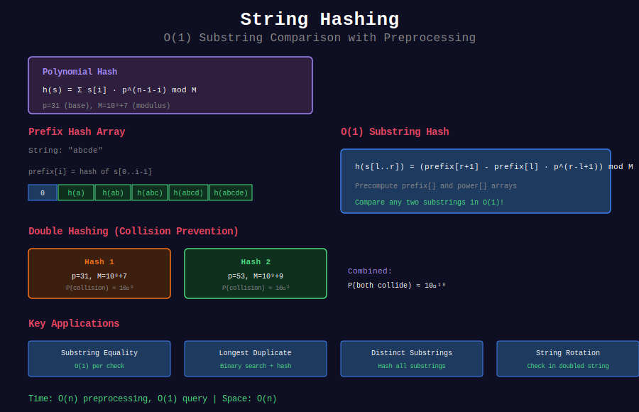

# 🔐 String Hashing

## 📊 Visual Overview



## 📊 Metadata

- **Difficulty:** 

- **Time Complexity:** O(n) preprocessing, O(1) query

- **Space Complexity:** O(n)

- **Topics:** Hashing, Rolling Hash, Polynomial Hash

- **Prerequisites:** Modular arithmetic, Number theory basics

---

## 🎯 Overview

**String Hashing** converts strings to numerical values (hashes) for fast comparison and manipulation. It enables O(1) substring comparisons after O(n) preprocessing.

**Core Applications:**

- Fast string comparison

- Substring equality checks

- Pattern matching

- Duplicate detection

- Dictionary operations

---

## 📐 Mathematical Foundation

### Polynomial Hash Function

The most common string hash:

```
h(s) = (s[0]·p^(n-1) + s[1]·p^(n-2) + ... + s[n-1]·p^0) mod M

where:

- p = prime base (typically 31 for lowercase, 53 for mixed case)

- M = large prime modulus (10^9+7 or 10^9+9)

- s[i] = numerical value of character (often ASCII code)

```

**Example:**

```
String: "abc"
p = 31, M = 10^9+7

h("abc") = (97·31² + 98·31 + 99) mod M
         = (93367 + 3038 + 99) mod M
         = 96504

```

### Hash Properties

**1. Deterministic:** Same string → same hash

```
h("abc") always gives same value

```

**2. Uniform Distribution:** Different strings likely have different hashes

```
P(h(s1) = h(s2)) ≈ 1/M for s1 ≠ s2

```

**3. Efficient Computation:** O(n) to compute

```
Hash can be computed in single pass

```

### Collision Probability

For random strings:

```
P(collision) ≈ k²/(2M)  (Birthday paradox)

For M = 10^9+7:

- 1000 strings: P ≈ 0.0005%

- 10000 strings: P ≈ 0.05%

- 100000 strings: P ≈ 5%

```

**Mitigation:** Use double hashing

```
Two independent hash functions h₁ and h₂
P(both collide) ≈ 1/(M₁·M₂) ≈ 10^-18

```

---

## 💻 Implementation

### Basic Polynomial Hash

```python
class StringHash:
    """
    Polynomial hash for strings
    
    Time: O(n) construction, O(1) comparison
    Space: O(n) for prefix hashes
    """
    
    def __init__(self, s, base=31, mod=10**9 + 7):
        self.s = s
        self.n = len(s)
        self.base = base
        self.mod = mod
        
        # Precompute prefix hashes
        self.prefix_hash = [0] * (self.n + 1)
        self.power = [1] * (self.n + 1)
        
        for i in range(self.n):
            self.prefix_hash[i + 1] = (
                self.prefix_hash[i] * self.base + ord(s[i])
            ) % self.mod
            self.power[i + 1] = (self.power[i] * self.base) % self.mod
    
    def hash_substring(self, left, right):
        """
        Get hash of substring s[left:right]
        
        Time: O(1)
        
        Formula:
        h(s[l..r]) = (prefix[r+1] - prefix[l] * p^(r-l+1)) mod M
        """
        hash_val = (
            self.prefix_hash[right] - 
            self.prefix_hash[left] * self.power[right - left]
        ) % self.mod
        
        return (hash_val + self.mod) % self.mod
    
    def compare_substrings(self, l1, r1, l2, r2):
        """
        Compare s[l1:r1] with s[l2:r2] in O(1)
        
        Returns: True if equal, False otherwise
        """
        if r1 - l1 != r2 - l2:
            return False
        
        return self.hash_substring(l1, r1) == self.hash_substring(l2, r2)

# Example usage
s = "abcabcabc"
sh = StringHash(s)

# Check if s[0:3] == s[3:6]
print(sh.compare_substrings(0, 3, 3, 6))  # True: "abc" == "abc"

```

### Double Hashing

```python
class DoubleStringHash:
    """
    Use two hash functions to virtually eliminate collisions
    
    Collision probability: ~1/(M₁·M₂) ≈ 10^-18
    """
    
    def __init__(self, s):
        self.s = s
        self.n = len(s)
        
        # Two different primes
        self.mod1 = 10**9 + 7
        self.mod2 = 10**9 + 9
        self.base1 = 31
        self.base2 = 53
        
        # Precompute for both hash functions
        self.prefix1 = [0] * (self.n + 1)
        self.prefix2 = [0] * (self.n + 1)
        self.power1 = [1] * (self.n + 1)
        self.power2 = [1] * (self.n + 1)
        
        for i in range(self.n):
            # Hash 1
            self.prefix1[i + 1] = (
                self.prefix1[i] * self.base1 + ord(s[i])
            ) % self.mod1
            self.power1[i + 1] = (self.power1[i] * self.base1) % self.mod1
            
            # Hash 2
            self.prefix2[i + 1] = (
                self.prefix2[i] * self.base2 + ord(s[i])
            ) % self.mod2
            self.power2[i + 1] = (self.power2[i] * self.base2) % self.mod2
    
    def hash_substring(self, left, right):
        """Get both hashes of substring"""
        hash1 = (
            self.prefix1[right] - 
            self.prefix1[left] * self.power1[right - left]
        ) % self.mod1
        hash1 = (hash1 + self.mod1) % self.mod1
        
        hash2 = (
            self.prefix2[right] - 
            self.prefix2[left] * self.power2[right - left]
        ) % self.mod2
        hash2 = (hash2 + self.mod2) % self.mod2
        
        return (hash1, hash2)
    
    def compare_substrings(self, l1, r1, l2, r2):
        """Compare using both hashes"""
        if r1 - l1 != r2 - l2:
            return False
        
        return self.hash_substring(l1, r1) == self.hash_substring(l2, r2)

```

### Rolling Hash (for Sliding Window)

```python
class RollingHash:
    """
    Rolling hash for sliding window problems
    
    Update hash in O(1) when window slides
    """
    
    def __init__(self, base=31, mod=10**9 + 7):
        self.base = base
        self.mod = mod
    
    def compute_hash(self, s):
        """Compute hash of entire string"""
        h = 0
        for c in s:
            h = (h * self.base + ord(c)) % self.mod
        return h
    
    def roll(self, current_hash, old_char, new_char, window_size):
        """
        Update hash when sliding window
        
        Remove old_char from left, add new_char to right
        
        Time: O(1)
        """
        # Compute power for window size
        power = pow(self.base, window_size - 1, self.mod)
        
        # Remove old character
        current_hash = (
            current_hash - ord(old_char) * power % self.mod + self.mod
        ) % self.mod
        
        # Shift and add new character
        current_hash = (current_hash * self.base + ord(new_char)) % self.mod
        
        return current_hash

# Example: Find all substrings of length k
def find_all_k_substrings(s, k):
    """Find all unique substrings of length k"""
    rh = RollingHash()
    
    if k > len(s):
        return []
    
    # Compute initial hash
    current_hash = rh.compute_hash(s[:k])
    hashes = {current_hash: s[:k]}
    
    # Slide window
    for i in range(k, len(s)):
        current_hash = rh.roll(current_hash, s[i-k], s[i], k)
        if current_hash not in hashes:
            hashes[current_hash] = s[i-k+1:i+1]
    
    return list(hashes.values())

```

---

## 🎯 Common Patterns & Use Cases

### 1. Longest Common Substring (Two Strings)

```python
def longest_common_substring(s1, s2):
    """
    Find longest common substring using binary search + hashing
    
    Time: O((n+m) log min(n,m))
    Space: O(n+m)
    """
    def check_length(length):
        """Check if common substring of given length exists"""
        # Hash all substrings of s1
        sh1 = StringHash(s1)
        hashes1 = set()
        for i in range(len(s1) - length + 1):
            hashes1.add(sh1.hash_substring(i, i + length))
        
        # Check substrings of s2
        sh2 = StringHash(s2)
        for i in range(len(s2) - length + 1):
            if sh2.hash_substring(i, i + length) in hashes1:
                return True, s2[i:i+length]
        
        return False, ""
    
    # Binary search on length
    left, right = 0, min(len(s1), len(s2))
    result = ""
    
    while left <= right:
        mid = (left + right) // 2
        found, substring = check_length(mid)
        
        if found:
            result = substring
            left = mid + 1
        else:
            right = mid - 1
    
    return result

# Example
print(longest_common_substring("abcdefgh", "xyzabcpqr"))  # "abc"

```

### 2. Distinct Substrings Count

```python
def count_distinct_substrings(s):
    """
    Count number of distinct substrings
    
    Time: O(n²)
    Space: O(n²)
    """
    sh = StringHash(s)
    n = len(s)
    
    distinct = set()
    
    for length in range(1, n + 1):
        for start in range(n - length + 1):
            hash_val = sh.hash_substring(start, start + length)
            distinct.add(hash_val)
    
    return len(distinct)

# Example
print(count_distinct_substrings("aaa"))     # 3: "a", "aa", "aaa"
print(count_distinct_substrings("banana"))  # 15

```

### 3. Check if Strings are Rotations

```python
def are_rotations(s1, s2):
    """
    Check if s2 is rotation of s1
    
    Time: O(n)
    Space: O(n)
    
    Example: "abcd" and "cdab" are rotations
    """
    if len(s1) != len(s2):
        return False
    
    # s2 is rotation if s2 is substring of s1+s1
    doubled = s1 + s1
    sh = StringHash(doubled)
    target_hash = StringHash(s2).hash_substring(0, len(s2))
    
    for i in range(len(s1)):
        if sh.hash_substring(i, i + len(s2)) == target_hash:
            return True
    
    return False

# Example
print(are_rotations("abcd", "cdab"))  # True
print(are_rotations("abcd", "abdc"))  # False

```

### 4. Palindrome Substring Check

```python
def count_palindrome_substrings_hash(s):
    """
    Count palindromic substrings using hashing
    
    Time: O(n²)
    Space: O(n)
    """
    n = len(s)
    
    # Build hash for forward and backward
    forward = StringHash(s)
    backward = StringHash(s[::-1])
    
    count = 0
    
    for length in range(1, n + 1):
        for start in range(n - length + 1):
            # Check if s[start:start+length] is palindrome
            forward_hash = forward.hash_substring(start, start + length)
            
            # Corresponding position in reversed string
            rev_start = n - start - length
            backward_hash = backward.hash_substring(rev_start, rev_start + length)
            
            if forward_hash == backward_hash:
                # Verify (to handle hash collisions)
                substring = s[start:start + length]
                if substring == substring[::-1]:
                    count += 1
    
    return count

```

### 5. Repeated DNA Sequences

```python
def find_repeated_dna_sequences(s):
    """
    LeetCode 187: Find all 10-letter sequences that occur more than once
    
    Time: O(n)
    Space: O(n)
    """
    if len(s) < 10:
        return []
    
    rh = RollingHash()
    
    # Map ACGT to numbers for smaller hash
    char_map = {'A': 0, 'C': 1, 'G': 2, 'T': 3}
    
    # Compute initial hash
    current_hash = 0
    for i in range(10):
        current_hash = (current_hash * 4 + char_map[s[i]]) % (10**9 + 7)
    
    seen = {current_hash}
    repeated = set()
    
    # Slide window
    power = pow(4, 9, 10**9 + 7)
    
    for i in range(10, len(s)):
        # Roll hash
        current_hash = (
            current_hash - char_map[s[i-10]] * power
        ) % (10**9 + 7)
        current_hash = (current_hash + 10**9 + 7) % (10**9 + 7)
        current_hash = (current_hash * 4 + char_map[s[i]]) % (10**9 + 7)
        
        if current_hash in seen:
            repeated.add(s[i-9:i+1])
        seen.add(current_hash)
    
    return list(repeated)

```

### 6. Minimum Window with Same Hash

```python
def min_window_same_hash(s, t):
    """
    Find minimum window in s that contains permutation of t
    
    Uses hashing for fast comparison
    
    Time: O(n)
    Space: O(1)
    """
    if len(t) > len(s):
        return ""
    
    from collections import Counter
    
    target_count = Counter(t)
    window_count = Counter()
    
    left = 0
    min_len = float('inf')
    min_start = 0
    required = len(target_count)
    formed = 0
    
    for right in range(len(s)):
        char = s[right]
        window_count[char] += 1
        
        if char in target_count and window_count[char] == target_count[char]:
            formed += 1
        
        while left <= right and formed == required:
            # Update result
            if right - left + 1 < min_len:
                min_len = right - left + 1
                min_start = left
            
            # Shrink window
            char = s[left]
            window_count[char] -= 1
            if char in target_count and window_count[char] < target_count[char]:
                formed -= 1
            
            left += 1
    
    return s[min_start:min_start + min_len] if min_len != float('inf') else ""

```

### 7. Longest Duplicate Substring

```python
def longest_duplicate_substring(s):
    """
    LeetCode 1044: Find longest duplicate substring
    
    Time: O(n log n)
    Space: O(n)
    
    Uses binary search + hashing
    """
    def search(length):
        """Check if duplicate substring of given length exists"""
        sh = StringHash(s)
        seen = {}
        
        for i in range(len(s) - length + 1):
            h = sh.hash_substring(i, i + length)
            
            if h in seen:
                return seen[h]  # Return the duplicate substring
            seen[h] = s[i:i+length]
        
        return None
    
    # Binary search on length
    left, right = 0, len(s)
    result = ""
    
    while left < right:
        mid = (left + right + 1) // 2
        dup = search(mid)
        
        if dup:
            result = dup
            left = mid
        else:
            right = mid - 1
    
    return result

```

### 8. String Matching with Wildcards

```python
def match_with_wildcards(text, pattern):
    """
    Match pattern with wildcards ('?' matches any character)
    
    Time: O(n + m)
    Space: O(n + m)
    """
    # Split pattern by wildcards
    parts = pattern.split('?')
    
    if len(parts) == 1:
        # No wildcards, exact match
        return text == pattern
    
    # Check if parts appear in order
    sh_text = StringHash(text)
    pos = 0
    
    for i, part in enumerate(parts):
        if not part:
            pos += 1
            continue
        
        # Find this part in text starting from pos
        sh_part = StringHash(part)
        part_hash = sh_part.hash_substring(0, len(part))
        
        found = False
        for j in range(pos, len(text) - len(part) + 1):
            if sh_text.hash_substring(j, j + len(part)) == part_hash:
                pos = j + len(part)
                found = True
                break
        
        if not found:
            return False
    
    return True

```

---

## 🧩 LeetCode Problems

### Easy

| # | Problem | Difficulty | Pattern |
|---|---------|------------|---------|
| 28 | [Find Index of First Occurrence](https://leetcode.com/problems/find-the-index-of-the-first-occurrence-in-a-string/) | 🟢 Easy | Rolling hash |
| 205 | [Isomorphic Strings](https://leetcode.com/problems/isomorphic-strings/) | 🟢 Easy | Hash mapping |

### Medium

| # | Problem | Difficulty | Pattern |
|---|---------|------------|---------|
| 187 | [Repeated DNA Sequences](https://leetcode.com/problems/repeated-dna-sequences/) | 🟡 Medium | Fixed window hash |
| 1044 | [Longest Duplicate Substring](https://leetcode.com/problems/longest-duplicate-substring/) | 🟡 Medium | Binary search + hash |
| 1062 | [Longest Repeating Substring](https://leetcode.com/problems/longest-repeating-substring/) | 🟡 Medium | Binary search + hash |
| 718 | [Maximum Length Repeated Subarray](https://leetcode.com/problems/maximum-length-of-repeated-subarray/) | 🟡 Medium | Rolling hash arrays |
| 1554 | [Strings Differ by One Character](https://leetcode.com/problems/strings-differ-by-one-character/) | 🟡 Medium | Multiple hashes |

### Hard

| # | Problem | Difficulty | Pattern |
|---|---------|------------|---------|
| 1923 | [Longest Common Subpath](https://leetcode.com/problems/longest-common-subpath/) | 🔴 Hard | Multiple string LCS |
| 1316 | [Distinct Echo Substrings](https://leetcode.com/problems/distinct-echo-substrings/) | 🔴 Hard | Hash + pattern |
| 1983 | [Widest Pair of Indices](https://leetcode.com/problems/widest-pair-of-indices-with-equal-range-sum/) | 🔴 Hard | Prefix hash |

---

## 💡 Key Insights

### Choosing Hash Parameters

**Base (p):**

```python
# Guidelines:

- Lowercase only (a-z): p = 31
- Mixed case (a-z, A-Z): p = 53
- All printable ASCII: p = 257
- Custom alphabet size σ: p ≈ σ (prime)

# Why prime?

- Better distribution

- Reduces patterns in collisions

- Mathematical properties for proofs

```

**Modulus (M):**

```python
# Common choices:
MOD = 10**9 + 7   # Large prime, fits in 32-bit
MOD = 10**9 + 9   # Alternative prime
MOD = 2**61 - 1   # Mersenne prime (very large)

# For double hashing:
MOD1 = 10**9 + 7
MOD2 = 10**9 + 9

```

### Hash vs Direct Comparison

| Aspect | Hashing | Direct |
|--------|---------|--------|
| **Preprocessing** | O(n) | O(1) |
| **Single compare** | O(1) | O(m) |
| **Multiple compares** | O(k) | O(k·m) |
| **Correctness** | Probabilistic | Deterministic |
| **Memory** | O(n) | O(1) |

**When to use hashing:**

- Multiple substring comparisons (k >> 1)

- Large strings

- Acceptable false positive rate

### Common Pitfalls

```python
# ❌ Wrong: Negative hash after subtraction
hash_val = (prefix[r] - prefix[l] * power) % MOD

# ✓ Correct: Handle negative values
hash_val = (prefix[r] - prefix[l] * power % MOD + MOD) % MOD

# ❌ Wrong: Integer overflow
hash_val = prefix[i] * base + ord(char)

# ✓ Correct: Modulo at each step
hash_val = (prefix[i] * base % MOD + ord(char)) % MOD

# ❌ Wrong: Assuming no collisions
if hash1 == hash2:
    return True

# ✓ Correct: Verify on hash match (if critical)
if hash1 == hash2:
    return s1[l1:r1] == s2[l2:r2]

```

---

## 🎓 Advanced Techniques

### 1. Polynomial Hash with Carry

```python
class CarryHash:
    """
    Hash that handles larger values without modulo
    Uses Python's arbitrary precision integers
    """
    
    def __init__(self, s, base=31):
        self.s = s
        self.base = base
        self.hash = self._compute()
    
    def _compute(self):
        h = 0
        for c in self.s:
            h = h * self.base + ord(c)
        return h

```

### 2. Zobrist Hashing (for Sets)

```python
import random

class ZobristHash:
    """
    Hash for sets/multisets (order-independent)
    
    Used in: game states, unordered collections
    """
    
    def __init__(self, alphabet_size=256):
        random.seed(42)  # For reproducibility
        self.table = [random.getrandbits(64) for _ in range(alphabet_size)]
    
    def hash_string(self, s):
        """Hash of string as multiset"""
        h = 0
        for c in s:
            h ^= self.table[ord(c)]
        return h

```

### 3. Incremental Hashing

```python
class IncrementalHash:
    """
    Support adding/removing characters from both ends
    
    Used in: deque-based sliding windows
    """
    
    def __init__(self, base=31, mod=10**9+7):
        self.base = base
        self.mod = mod
        self.hash = 0
        self.length = 0
    
    def append_right(self, char):
        """Add character to right end"""
        self.hash = (self.hash * self.base + ord(char)) % self.mod
        self.length += 1
    
    def append_left(self, char):
        """Add character to left end"""
        power = pow(self.base, self.length, self.mod)
        self.hash = (self.hash + ord(char) * power) % self.mod
        self.length += 1
    
    def remove_right(self, char):
        """Remove character from right end"""
        self.hash = (self.hash - ord(char) + self.mod) % self.mod
        self.hash = (self.hash * pow(self.base, self.mod-2, self.mod)) % self.mod
        self.length -= 1

```

---

## 🔗 Related Topics

- [Rabin-Karp](../02_rabin_karp/) - Pattern matching with rolling hash

- [Hash Tables](../../06_hash_tables/) - General hashing concepts

- [Suffix Array](../04_suffix_structures/) - Alternative for substring queries

---

## 📚 Additional Resources

- [CP-Algorithms: String Hashing](https://cp-algorithms.com/string/string-hashing.html)

- [Codeforces: Anti-Hash Tests](https://codeforces.com/blog/entry/4898)

- [USACO Guide: Hashing](https://usaco.guide/gold/string-hashing)

---

**Navigation:** [← Suffix Tree](../07_suffix_tree/) | [String Algorithms](../README.md) | [Next: Computational Geometry →](../../29_computational_geometry/README.md)

