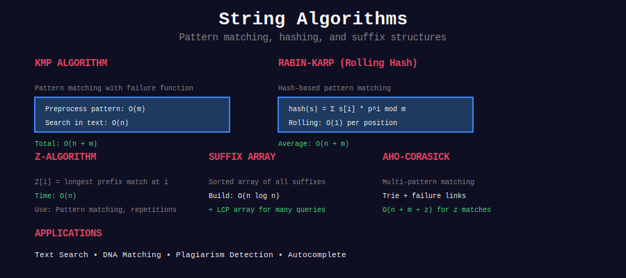
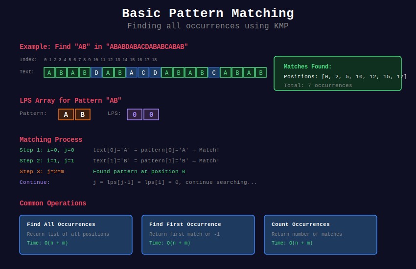

<div align="center">

# 🔤 String Algorithms



<p>
  
  
  
</p>

</div>

---

## 📊 Visual Overview



---

## 🧭 Navigation

| ⬅️ Previous | 📂 Current | ➡️ Next |
|:------------|:----------:|--------:|
| [← Advanced Trees](../27_advanced_trees/README.md) | **String Algorithms** | [Computational Geometry →](../29_computational_geometry/README.md) |

---

## 📂 Subtopics

<table>
<tr>
<td width="33%">

### [01. KMP Algorithm](./01_kmp/)
- Failure function
- Linear pattern matching
- Prefix-suffix analysis

</td>
<td width="33%">

### [02. Rabin-Karp](./02_rabin_karp/)
- Rolling hash technique
- Multiple pattern matching
- Hash collision handling

</td>
<td width="33%">

### [03. Z-Algorithm](./03_z_algorithm/)
- Z-function computation
- Linear string matching
- Pattern preprocessing

</td>
</tr>
<tr>
<td width="33%">

### [04. Suffix Structures](./04_suffix_structures/)
- Suffix arrays
- LCP arrays
- Kasai's algorithm

</td>
<td width="33%">

### [05. Manacher's Algorithm](./05_manacher/)
- Palindrome detection
- Linear time solution
- Center expansion

</td>
<td width="33%">

### [06. Aho-Corasick](./06_aho_corasick/)
- Trie + failure links
- Multiple pattern search
- Dictionary matching

</td>
</tr>
<tr>
<td width="33%">

### [07. Suffix Tree](./07_suffix_tree/)
- Ukkonen's algorithm
- Linear construction
- Pattern matching

</td>
<td width="33%">

### [08. String Hashing](./08_string_hashing/)
- Polynomial hashing
- Double hashing
- Hash comparisons

</td>
<td width="33%">

</td>
</tr>
</table>

---

## 📋 Overview

**String Algorithms** are fundamental techniques for efficiently processing, searching, and analyzing text data:

- **Pattern Matching:** Find occurrences of patterns in text efficiently
- **Hashing Techniques:** Use rolling hashes for fast string comparisons
- **Suffix Structures:** Build data structures for complex string queries
- **Palindrome Detection:** Identify palindromic substrings in linear time
- **Multiple Pattern Search:** Search for many patterns simultaneously
- **String Preprocessing:** Build auxiliary structures for fast queries

---

## 🎯 Quick Reference

### Algorithm Comparison

| Problem | Best Algorithm | Time Complexity | Space |
|---------|---------------|:---------------:|:-----:|
| **Single Pattern Match** | KMP | O(n + m) | O(m) |
| **Multiple Patterns** | Aho-Corasick | O(n + m + k) | O(m) |
| **Rolling Hash** | Rabin-Karp | O(n + m) avg | O(1) |
| **All Palindromes** | Manacher's | O(n) | O(n) |
| **Suffix Array** | SA-IS | O(n) | O(n) |
| **Suffix Tree** | Ukkonen's | O(n) | O(n) |
| **LCP Array** | Kasai's | O(n) | O(n) |
| **Z-Function** | Z-Algorithm | O(n) | O(n) |

**Key:**
- n = text length
- m = total pattern length
- k = number of occurrences

---

## 📐 Key Concepts

### 1️⃣ String Matching Fundamentals

**Problem:** Find all occurrences of pattern P in text T.

**Naive Approach:**
- Time: O(nm) where n = |T|, m = |P|
- Compare pattern at each position

**Optimal Approaches:**
- **KMP:** O(n + m) using failure function
- **Rabin-Karp:** O(n + m) average using hashing
- **Z-Algorithm:** O(n + m) using Z-array

---

### 2️⃣ KMP Algorithm

**Core Idea:** Avoid redundant comparisons by preprocessing pattern.

**Failure Function π[i]:**
```
π[i] = length of longest proper prefix of P[0..i] 
       that is also a suffix of P[0..i]
```

**Mathematical Property:**
```
If P[0..i] matches T[j-i..j] but P[i+1] ≠ T[j+1],
then next potential match starts at position j - π[i]
```

**Time Complexity Analysis:**
- Preprocessing: O(m)
- Matching: O(n)
- Total: O(n + m)

---

### 3️⃣ Rabin-Karp Hashing

**Rolling Hash Formula:**
```
h(s[i..i+m-1]) = Σ(j=0 to m-1) s[i+j] · p^(m-1-j) mod M
```

**Rolling Property:**
```
h(s[i+1..i+m]) = (h(s[i..i+m-1]) - s[i]·p^(m-1))·p + s[i+m] mod M
```

**Key Parameters:**
- **p:** Prime base (usually 31 or 53)
- **M:** Large prime modulus (10^9 + 7 or 10^9 + 9)

**Collision Probability:**
```
P(collision) ≈ 1/M for random strings
```

**Double Hashing:**
```
Use two hash functions with different primes
P(both collide) ≈ 1/(M₁ · M₂) ≈ 10^-18
```

---

### 4️⃣ Z-Algorithm

**Z-Array Definition:**
```
Z[i] = length of longest substring starting at i 
       that matches prefix of string
```

**Example:**
```
String: "aabcaabxaaz"
Z:      [0,1,0,0,3,1,0,0,2,1,0]
```

**Key Observation:**
- If Z[i] = k, then s[i..i+k-1] = s[0..k-1]
- Use previously computed Z-values to optimize

**Time Complexity:** O(n) using two-pointer technique

---

### 5️⃣ Suffix Arrays

**Definition:** Array of integers representing sorted suffixes.

**Construction:**
```
For string s = "banana$":
Suffixes (sorted):
0: $
6: a$
5: ana$
3: anana$
1: banana$
4: na$
2: nana$

SA = [6, 5, 3, 1, 4, 2, 0]
```

**LCP (Longest Common Prefix) Array:**
```
LCP[i] = longest common prefix of SA[i] and SA[i-1]
```

**Applications:**
- Pattern matching in O(m log n)
- Longest repeated substring
- Longest common substring of multiple strings

---

### 6️⃣ Manacher's Algorithm

**Problem:** Find all palindromic substrings in O(n).

**Transformation:** Convert to odd-length palindromes
```
"abba" → "#a#b#b#a#"
```

**P[i]:** Radius of palindrome centered at i

**Key Property:**
```
If palindrome centered at c extends to position r,
then P[i] can be initialized from P[2c - i] (mirror)
```

**Recurrence:**
```
P[i] = min(P[2c - i], r - i) + expansion
```

**Time Complexity:** O(n) because each position expanded at most once

---

### 7️⃣ Aho-Corasick Automaton

**Data Structure:** Trie + failure links

**Components:**
1. **Trie:** Store all patterns
2. **Failure Links:** Jump to longest proper suffix
3. **Output Links:** Find all matches ending at current state

**Failure Link Computation:**
```
fail[node] = longest proper suffix that is in trie
```

**Time Complexity:**
- Construction: O(Σ|patterns|)
- Matching: O(n + k) where k = number of matches

**Applications:**
- Dictionary matching
- Virus scanning
- Log analysis

---

### 8️⃣ Suffix Trees

**Definition:** Compressed trie of all suffixes.

**Properties:**
- **Edges:** Labeled with substrings
- **Leaves:** Represent suffix positions
- **Internal nodes:** Branch points

**Construction (Ukkonen's Algorithm):**
- Online algorithm: O(n) time
- Builds tree left-to-right
- Uses suffix links for efficiency

**Applications:**
- Find pattern in O(m)
- Longest repeated substring
- Longest common substring
- Suffix array construction

---

## 💻 Essential Implementations

### KMP Failure Function

```python
def compute_failure_function(pattern):
    """
    Compute KMP failure function
    Time: O(m), Space: O(m)
    """
    m = len(pattern)
    pi = [0] * m
    k = 0
    
    for i in range(1, m):
        # Fall back using failure function
        while k > 0 and pattern[k] != pattern[i]:
            k = pi[k - 1]
        
        # Extend match
        if pattern[k] == pattern[i]:
            k += 1
        
        pi[i] = k
    
    return pi

def kmp_search(text, pattern):
    """
    KMP pattern matching
    Time: O(n + m), Space: O(m)
    """
    n, m = len(text), len(pattern)
    if m == 0:
        return [0]
    
    pi = compute_failure_function(pattern)
    matches = []
    k = 0  # matched characters
    
    for i in range(n):
        # Fall back
        while k > 0 and pattern[k] != text[i]:
            k = pi[k - 1]
        
        # Extend match
        if pattern[k] == text[i]:
            k += 1
        
        # Found complete match
        if k == m:
            matches.append(i - m + 1)
            k = pi[k - 1]
    
    return matches
```

### Rabin-Karp with Double Hashing

```python
class RabinKarp:
    """
    Rolling hash for pattern matching
    Time: O(n + m) average, O(nm) worst
    """
    def __init__(self):
        self.MOD1 = 10**9 + 7
        self.MOD2 = 10**9 + 9
        self.BASE1 = 31
        self.BASE2 = 53
    
    def search(self, text, pattern):
        n, m = len(text), len(pattern)
        if m > n:
            return []
        
        # Compute pattern hashes
        p_hash1 = self._hash(pattern, self.BASE1, self.MOD1)
        p_hash2 = self._hash(pattern, self.BASE2, self.MOD2)
        
        # Precompute powers
        pow1 = pow(self.BASE1, m - 1, self.MOD1)
        pow2 = pow(self.BASE2, m - 1, self.MOD2)
        
        # Compute initial window hash
        t_hash1 = self._hash(text[:m], self.BASE1, self.MOD1)
        t_hash2 = self._hash(text[:m], self.BASE2, self.MOD2)
        
        matches = []
        
        for i in range(n - m + 1):
            # Check hashes
            if t_hash1 == p_hash1 and t_hash2 == p_hash2:
                # Double check to avoid hash collision
                if text[i:i+m] == pattern:
                    matches.append(i)
            
            # Roll hash
            if i < n - m:
                t_hash1 = self._roll_hash(
                    t_hash1, ord(text[i]), ord(text[i+m]),
                    pow1, self.BASE1, self.MOD1
                )
                t_hash2 = self._roll_hash(
                    t_hash2, ord(text[i]), ord(text[i+m]),
                    pow2, self.BASE2, self.MOD2
                )
        
        return matches
    
    def _hash(self, s, base, mod):
        h = 0
        for c in s:
            h = (h * base + ord(c)) % mod
        return h
    
    def _roll_hash(self, h, old_char, new_char, pow_val, base, mod):
        h = (h - old_char * pow_val % mod + mod) % mod
        h = (h * base + new_char) % mod
        return h
```

### Z-Algorithm

```python
def z_algorithm(s):
    """
    Compute Z-array for string s
    Time: O(n), Space: O(n)
    
    Z[i] = length of longest substring starting at i
           that matches prefix of s
    """
    n = len(s)
    z = [0] * n
    z[0] = n
    
    l, r = 0, 0  # Current Z-box [l, r]
    
    for i in range(1, n):
        # Case 1: i > r (outside current Z-box)
        if i > r:
            l, r = i, i
            while r < n and s[r - l] == s[r]:
                r += 1
            z[i] = r - l
            r -= 1
        else:
            # Case 2: i <= r (inside current Z-box)
            k = i - l  # Mirror position
            
            # Case 2a: Z[k] < r - i + 1
            if z[k] < r - i + 1:
                z[i] = z[k]
            # Case 2b: Z[k] >= r - i + 1
            else:
                l = i
                while r < n and s[r - l] == s[r]:
                    r += 1
                z[i] = r - l
                r -= 1
    
    return z

def z_search(text, pattern):
    """
    Pattern matching using Z-algorithm
    Time: O(n + m), Space: O(n + m)
    """
    # Concatenate pattern and text with separator
    s = pattern + '$' + text
    z = z_algorithm(s)
    
    m = len(pattern)
    matches = []
    
    for i in range(m + 1, len(s)):
        if z[i] == m:
            matches.append(i - m - 1)
    
    return matches
```

### Suffix Array Construction

```python
def build_suffix_array(s):
    """
    Build suffix array using O(n log² n) algorithm
    Time: O(n log² n), Space: O(n)
    """
    n = len(s)
    # Append sentinel
    s = s + '$'
    n += 1
    
    # Initial ranking by single character
    order = sorted(range(n), key=lambda i: s[i])
    rank = [0] * n
    rank[order[0]] = 0
    
    for i in range(1, n):
        if s[order[i]] == s[order[i-1]]:
            rank[order[i]] = rank[order[i-1]]
        else:
            rank[order[i]] = i
    
    k = 1
    while k < n:
        # Sort by (rank[i], rank[i+k])
        order = sorted(range(n), key=lambda i: (rank[i], rank[(i+k) % n]))
        
        # Update ranks
        new_rank = [0] * n
        new_rank[order[0]] = 0
        
        for i in range(1, n):
            prev = (rank[order[i-1]], rank[(order[i-1]+k) % n])
            curr = (rank[order[i]], rank[(order[i]+k) % n])
            
            if curr == prev:
                new_rank[order[i]] = new_rank[order[i-1]]
            else:
                new_rank[order[i]] = i
        
        rank = new_rank
        k *= 2
    
    return order[1:]  # Remove sentinel

def kasai_lcp(s, sa):
    """
    Build LCP array using Kasai's algorithm
    Time: O(n), Space: O(n)
    
    LCP[i] = longest common prefix of suffixes SA[i] and SA[i+1]
    """
    n = len(s)
    rank = [0] * n
    
    # Compute rank array (inverse of suffix array)
    for i in range(n):
        rank[sa[i]] = i
    
    lcp = [0] * (n - 1)
    h = 0
    
    for i in range(n):
        if rank[i] > 0:
            j = sa[rank[i] - 1]
            
            # Extend LCP
            while i + h < n and j + h < n and s[i + h] == s[j + h]:
                h += 1
            
            lcp[rank[i] - 1] = h
            
            # Decrease h by 1 for next iteration
            if h > 0:
                h -= 1
    
    return lcp
```

### Manacher's Algorithm

```python
def manacher(s):
    """
    Find all palindromic substrings in O(n)
    Returns radius of palindrome centered at each position
    """
    # Transform string to handle even-length palindromes
    t = '#'.join('^{}$'.format(s))
    n = len(t)
    
    # p[i] = radius of palindrome centered at i
    p = [0] * n
    center = 0  # Center of rightmost palindrome
    right = 0   # Right boundary of rightmost palindrome
    
    for i in range(1, n - 1):
        # Mirror of i with respect to center
        mirror = 2 * center - i
        
        # Initialize p[i] using previously computed values
        if i < right:
            p[i] = min(right - i, p[mirror])
        
        # Expand palindrome centered at i
        while t[i + p[i] + 1] == t[i - p[i] - 1]:
            p[i] += 1
        
        # Update rightmost palindrome
        if i + p[i] > right:
            center = i
            right = i + p[i]
    
    return p

def longest_palindrome(s):
    """
    Find longest palindromic substring
    Time: O(n), Space: O(n)
    """
    if not s:
        return ""
    
    p = manacher(s)
    
    # Find maximum radius
    max_len = 0
    center_index = 0
    
    for i in range(len(p)):
        if p[i] > max_len:
            max_len = p[i]
            center_index = i
    
    # Extract substring from original string
    start = (center_index - max_len) // 2
    return s[start:start + max_len]
```

---

## 🗂️ Topics Covered

This section contains **70+ problems** across **8 categories**:

1. **[KMP Algorithm](./01_kmp/)** - Failure function, pattern matching (8 problems)
2. **[Rabin-Karp](./02_rabin_karp/)** - Rolling hash, multiple patterns (8 problems)
3. **[Z-Algorithm](./03_z_algorithm/)** - Z-function, linear matching (7 problems)
4. **[Suffix Structures](./04_suffix_structures/)** - Suffix/LCP arrays (10 problems)
5. **[Manacher's Algorithm](./05_manacher/)** - Palindrome detection (8 problems)
6. **[Aho-Corasick](./06_aho_corasick/)** - Multi-pattern search (9 problems)
7. **[Suffix Tree](./07_suffix_tree/)** - Ukkonen's algorithm (10 problems)
8. **[String Hashing](./08_string_hashing/)** - Polynomial hash techniques (12 problems)

---

## 📊 Complexity Summary

| Category | Time | Space | Best For |
|----------|:----:|:-----:|----------|
| **KMP** | O(n+m) | O(m) | Single pattern, guaranteed linear |
| **Rabin-Karp** | O(n+m) | O(1) | Multiple patterns, simple implementation |
| **Z-Algorithm** | O(n+m) | O(n+m) | Pattern matching, prefix queries |
| **Suffix Array** | O(n log n) | O(n) | Multiple queries on same text |
| **Manacher's** | O(n) | O(n) | All palindromes in linear time |
| **Aho-Corasick** | O(n+m+k) | O(m) | Multiple pattern matching |
| **Suffix Tree** | O(n) | O(n) | Complex string queries |
| **Hashing** | O(n) | O(1) | Fast comparisons, probabilistic |

---

## 💡 Key Insights

### Pattern Matching Trade-offs

1. **KMP vs Rabin-Karp:**
   - KMP: Deterministic O(n+m), no false positives
   - RK: Probabilistic, easier to implement, good for multiple patterns

2. **When to Use Z-Algorithm:**
   - Similar to KMP but more intuitive
   - Better for problems involving prefix matching
   - Easier to understand and implement

3. **Suffix Arrays vs Suffix Trees:**
   - SA: Less space, easier to implement, slower queries
   - ST: More space, complex construction, faster queries
   - Modern: Use suffix arrays with LCP

### Hashing Best Practices

```python
# Good hash parameters
MOD1 = 10**9 + 7
MOD2 = 10**9 + 9
BASE1 = 31  # for lowercase
BASE1 = 53  # for mixed case

# Polynomial hash formula
hash = (hash * BASE + ord(char)) % MOD

# Rolling hash update
hash = (hash - old_char * pow_base) * BASE + new_char
```

### Palindrome Detection

```
Center Expansion: O(n²)
Manacher's: O(n)
DP: O(n²) but finds count
Hash + Binary Search: O(n log n) for longest
```

### Common Patterns

1. **String + DP:** Edit distance, LCS
2. **Hash + Sliding Window:** Substring problems
3. **KMP + DP:** String matching with wildcards
4. **Suffix Array + Binary Search:** Pattern queries

---

## 🧠 Problem-Solving Strategies

### Pattern Matching Flow

```
1. Single pattern, small text
   → Naive O(nm) or KMP O(n+m)

2. Single pattern, large text
   → KMP or Z-algorithm

3. Multiple patterns
   → Rabin-Karp or Aho-Corasick

4. Many queries on same text
   → Build suffix array/tree once

5. Need all occurrences
   → KMP or Z-algorithm

6. Need approximate matching
   → DP-based approaches
```

### Hash vs Exact Matching

```python
# When to use hashing
✓ Substring equality checks
✓ Rolling window comparisons
✓ Multiple pattern search
✓ Collision probability acceptable

# When to avoid hashing
✗ Need exact matches (critical applications)
✗ Adversarial input possible
✗ Small alphabet (better alternatives exist)
```

### Optimization Techniques

1. **Early Termination:**
```python
if len(pattern) > len(text):
    return []  # No match possible
```

2. **Character Frequency Check:**
```python
from collections import Counter
if Counter(pattern) - Counter(text):
    return []  # Pattern has chars not in text
```

3. **First/Last Character Heuristic:**
```python
# Jump positions where first char doesn't match
```

---

## 📈 Advanced Concepts

### 1️⃣ Suffix Array Applications

**Longest Repeated Substring:**
```python
def longest_repeated(s):
    sa = build_suffix_array(s)
    lcp = kasai_lcp(s, sa)
    max_lcp = max(lcp)
    idx = lcp.index(max_lcp)
    return s[sa[idx]:sa[idx] + max_lcp]
```

**Number of Distinct Substrings:**
```
Total substrings = n(n+1)/2
Repeated = Σ LCP[i]
Distinct = n(n+1)/2 - Σ LCP[i]
```

### 2️⃣ String Periodicity

**Period Lemma:**
```
If string s has periods p and q with p + q ≤ n,
then s also has period gcd(p, q)
```

**Application:** Find smallest period using KMP failure function
```python
def smallest_period(s):
    n = len(s)
    pi = compute_failure_function(s)
    period = n - pi[n-1]
    if n % period == 0:
        return period
    return n
```

### 3️⃣ String Matching with Wildcards

**Problem:** Match pattern with '?' (any char) or '*' (any sequence)

**Approach:**
1. KMP with modified comparison
2. Divide pattern at wildcards
3. Use automaton-based matching

---

## 🎓 Mathematical Foundations

### String Distance Metrics

1. **Hamming Distance:** Number of positions where characters differ
   - Only for equal-length strings
   - Time: O(n)

2. **Edit Distance (Levenshtein):** Minimum operations (insert/delete/replace)
   - Time: O(nm) with DP
   - Space: O(min(n,m)) optimized

3. **Longest Common Subsequence:**
   ```
   LCS(i,j) = 1 + LCS(i-1,j-1)  if s1[i] = s2[j]
            = max(LCS(i-1,j), LCS(i,j-1))  otherwise
   ```

### Hash Function Quality

**Good hash properties:**
1. **Uniform distribution:** All values equally likely
2. **Deterministic:** Same input → same output
3. **Fast computation:** O(1) per character
4. **Rolling property:** Update in O(1)

**Polynomial hash advantages:**
```
- Position-dependent: "abc" ≠ "cba"
- Prefix property: Easy to extend
- Rolling updates: O(1) window slides
```

---

## 🧭 Navigation

| ⬅️ Previous | 📂 Current | ➡️ Next |
|:------------|:----------:|--------:|
| [← Advanced Trees](../27_advanced_trees/README.md) | **String Algorithms** | [Computational Geometry →](../29_computational_geometry/README.md) |
