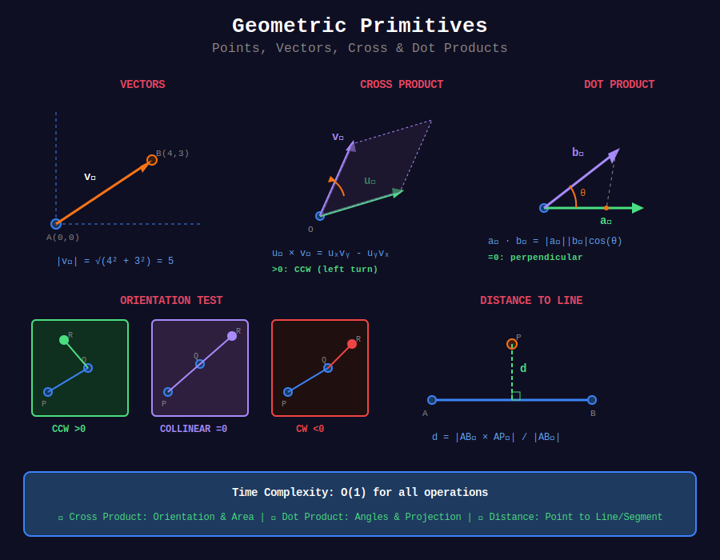

# 🔷 Geometric Primitives

## 📊 Metadata

- **Difficulty:** 

- **Time Complexity:** O(1) for most operations

- **Space Complexity:** O(1)

- **Topics:** Vectors, Cross Product, Dot Product, Distances

---

## 🎯 Overview

Geometric primitives are the fundamental building blocks of computational geometry: points, vectors, lines, and basic operations on them.

---

## 📊 Visual Overview



*Visualization of vectors, cross product, dot product, and orientation tests*

---

## 📐 Mathematical Foundation

### Points and Vectors

**Point:** Position in 2D space

```
P = (x, y)

```

**Vector:** Directed line segment

```
v = (v_x, v_y)

From point A to B:
v = B - A = (B.x - A.x, B.y - A.y)

```

**Vector magnitude:**

```
|v| = √(v_x² + v_y²)

```

**Unit vector:**

```
v̂ = v / |v| = (v_x/|v|, v_y/|v|)

```

### Cross Product

**Definition (2D):**

```
u × v = u_x · v_y - u_y · v_x

Geometric interpretation:

- Magnitude: Area of parallelogram formed by u and v

- Sign: Orientation of v relative to u

```

**Properties:**

```
1. Anticommutative: u × v = -(v × u)
2. Distributive: u × (v + w) = u × v + u × w
3. Scalar multiple: (αu) × v = α(u × v)
4. Zero if parallel: u × v = 0 ⟺ u ∥ v

```

**Applications:**

- Orientation test

- Area calculation

- Line intersection detection

### Dot Product

**Definition:**

```
u · v = u_x · v_x + u_y · v_y
     = |u| · |v| · cos(θ)

where θ = angle between vectors

```

**Properties:**

```
1. Commutative: u · v = v · u
2. Distributive: u · (v + w) = u · v + u · w
3. u · v > 0: acute angle (< 90°)
4. u · v = 0: perpendicular (90°)
5. u · v < 0: obtuse angle (> 90°)

```

**Applications:**

- Angle calculation

- Projection

- Perpendicularity test

- Distance to line

---

## 💻 Implementations

### 1. Point and Vector Class

```python
from math import sqrt, atan2, cos, sin, pi

class Point:
    """
    2D Point representation
    
    Supports:
    - Arithmetic operations
    - Distance calculations
    - Vector operations
    """
    
    def __init__(self, x, y):
        self.x = float(x)
        self.y = float(y)
    
    def __add__(self, other):
        """Vector addition"""
        return Point(self.x + other.x, self.y + other.y)
    
    def __sub__(self, other):
        """Vector subtraction"""
        return Point(self.x - other.x, self.y - other.y)
    
    def __mul__(self, scalar):
        """Scalar multiplication"""
        return Point(self.x * scalar, self.y * scalar)
    
    def __truediv__(self, scalar):
        """Scalar division"""
        return Point(self.x / scalar, self.y / scalar)
    
    def __eq__(self, other):
        """Equality with epsilon tolerance"""
        EPS = 1e-9
        return abs(self.x - other.x) < EPS and abs(self.y - other.y) < EPS
    
    def __repr__(self):
        return f"Point({self.x:.2f}, {self.y:.2f})"
    
    def magnitude(self):
        """Length of vector from origin"""
        return sqrt(self.x * self.x + self.y * self.y)
    
    def magnitude_squared(self):
        """Squared magnitude (avoids sqrt)"""
        return self.x * self.x + self.y * self.y
    
    def normalize(self):
        """Return unit vector"""
        mag = self.magnitude()
        if mag == 0:
            return Point(0, 0)
        return self / mag
    
    def distance(self, other):
        """Euclidean distance to another point"""
        dx = self.x - other.x
        dy = self.y - other.y
        return sqrt(dx * dx + dy * dy)
    
    def distance_squared(self, other):
        """Squared distance (faster for comparisons)"""
        dx = self.x - other.x
        dy = self.y - other.y
        return dx * dx + dy * dy
    
    def angle(self):
        """Angle from positive x-axis in radians"""
        return atan2(self.y, self.x)
    
    def rotate(self, angle):
        """Rotate point by angle (in radians) around origin"""
        cos_a = cos(angle)
        sin_a = sin(angle)
        return Point(
            self.x * cos_a - self.y * sin_a,
            self.x * sin_a + self.y * cos_a
        )
    
    def rotate_around(self, center, angle):
        """Rotate point around another point"""
        # Translate to origin
        translated = self - center
        # Rotate
        rotated = translated.rotate(angle)
        # Translate back
        return rotated + center

```

### 2. Cross and Dot Products

```python
def cross_product(o, a, b):
    """
    Cross product of vectors OA and OB
    
    Returns: (A - O) × (B - O)
    
    Interpretation:
     > 0: B is counter-clockwise from A (left turn)
     = 0: O, A, B are collinear
     < 0: B is clockwise from A (right turn)
    
    Time: O(1)
    """
    return (a.x - o.x) * (b.y - o.y) - (a.y - o.y) * (b.x - o.x)

def dot_product(u, v):
    """
    Dot product of vectors u and v
    
    Returns: u · v = u_x * v_x + u_y * v_y
    
    Time: O(1)
    """
    return u.x * v.x + u.y * v.y

def cross_product_magnitude(u, v):
    """
    Magnitude of cross product (area of parallelogram)
    
    Returns: |u × v|
    """
    return abs(u.x * v.y - u.y * v.x)

# Examples
o = Point(0, 0)
a = Point(1, 0)
b = Point(1, 1)

print(f"Cross product: {cross_product(o, a, b)}")  # Positive: CCW
print(f"Dot product: {dot_product(a, b)}")         # Positive: acute angle

```

### 3. Orientation Test

```python
def orientation(p, q, r):
    """
    Find orientation of ordered triplet (p, q, r)
    
    Uses cross product to determine turn direction
    
    Returns:
     1: Counter-clockwise (left turn)
     0: Collinear
    -1: Clockwise (right turn)
    
    Time: O(1)
    """
    val = cross_product(p, q, r)
    
    EPS = 1e-9
    if abs(val) < EPS:
        return 0
    
    return 1 if val > 0 else -1

# Examples
p = Point(0, 0)
q = Point(1, 1)
r1 = Point(2, 2)  # Collinear
r2 = Point(0, 2)  # CCW
r3 = Point(2, 0)  # CW

print(f"Orientation (collinear): {orientation(p, q, r1)}")  # 0
print(f"Orientation (CCW): {orientation(p, q, r2)}")        # 1
print(f"Orientation (CW): {orientation(p, q, r3)}")         # -1

```

### 4. Distance Calculations

```python
def point_to_line_distance(point, line_p1, line_p2):
    """
    Distance from point to infinite line defined by two points
    
    Formula: |((P2-P1) × (P1-P0))| / |P2-P1|
    
    Time: O(1)
    """
    # Vector from line_p1 to line_p2
    line_vec = line_p2 - line_p1
    
    # Vector from line_p1 to point
    point_vec = point - line_p1
    
    # Cross product magnitude
    cross = abs(cross_product(Point(0, 0), line_vec, point_vec))
    
    # Line length
    line_length = line_vec.magnitude()
    
    if line_length == 0:
        return point.distance(line_p1)
    
    return cross / line_length

def point_to_segment_distance(point, seg_p1, seg_p2):
    """
    Distance from point to line segment
    
    Considers segment endpoints
    
    Time: O(1)
    """
    # Vector along segment
    seg_vec = seg_p2 - seg_p1
    
    # Vector from seg_p1 to point
    point_vec = point - seg_p1
    
    # Project point onto line
    seg_len_sq = seg_vec.magnitude_squared()
    
    if seg_len_sq == 0:
        return point.distance(seg_p1)
    
    # Parameter t of projection
    t = dot_product(point_vec, seg_vec) / seg_len_sq
    
    # Clamp to segment
    t = max(0, min(1, t))
    
    # Closest point on segment
    closest = seg_p1 + seg_vec * t
    
    return point.distance(closest)

# Example
point = Point(2, 2)
p1 = Point(0, 0)
p2 = Point(4, 0)

print(f"Distance to line: {point_to_line_distance(point, p1, p2):.2f}")      # 2.00
print(f"Distance to segment: {point_to_segment_distance(point, p1, p2):.2f}") # 2.00

```

### 5. Angle Calculations

```python
def angle_between_vectors(u, v):
    """
    Angle between two vectors (in radians)
    
    Formula: θ = arccos((u · v) / (|u| * |v|))
    
    Returns: Angle in [0, π]
    
    Time: O(1)
    """
    from math import acos
    
    dot = dot_product(u, v)
    mag_u = u.magnitude()
    mag_v = v.magnitude()
    
    if mag_u == 0 or mag_v == 0:
        return 0
    
    cos_angle = dot / (mag_u * mag_v)
    
    # Clamp to [-1, 1] for numerical stability
    cos_angle = max(-1, min(1, cos_angle))
    
    return acos(cos_angle)

def signed_angle(u, v):
    """
    Signed angle from u to v (in radians)
    
    Positive: counter-clockwise
    Negative: clockwise
    
    Returns: Angle in [-π, π]
    
    Time: O(1)
    """
    angle = atan2(v.y, v.x) - atan2(u.y, u.x)
    
    # Normalize to [-π, π]
    while angle > pi:
        angle -= 2 * pi
    while angle < -pi:
        angle += 2 * pi
    
    return angle

# Example
u = Point(1, 0)
v = Point(0, 1)

print(f"Angle between: {angle_between_vectors(u, v):.4f} rad")  # π/2
print(f"Signed angle: {signed_angle(u, v):.4f} rad")            # π/2

```

### 6. Projection

```python
def project_point_onto_line(point, line_p1, line_p2):
    """
    Project point onto infinite line
    
    Returns: Closest point on line to given point
    
    Time: O(1)
    """
    # Line direction vector
    line_vec = line_p2 - line_p1
    
    # Vector from line_p1 to point
    point_vec = point - line_p1
    
    # Projection length
    line_len_sq = line_vec.magnitude_squared()
    
    if line_len_sq == 0:
        return line_p1
    
    # Parameter t
    t = dot_product(point_vec, line_vec) / line_len_sq
    
    # Projected point
    return line_p1 + line_vec * t

def project_vector(v, onto):
    """
    Project vector v onto vector 'onto'
    
    Formula: proj_onto(v) = ((v · onto) / |onto|²) * onto
    
    Time: O(1)
    """
    onto_len_sq = onto.magnitude_squared()
    
    if onto_len_sq == 0:
        return Point(0, 0)
    
    scalar = dot_product(v, onto) / onto_len_sq
    
    return onto * scalar

# Example
point = Point(3, 4)
line_p1 = Point(0, 0)
line_p2 = Point(5, 0)

projection = project_point_onto_line(point, line_p1, line_p2)
print(f"Projection: {projection}")  # Point(3.00, 0.00)

```

---

## 🧩 LeetCode Problems

| # | Problem | Difficulty |
|---|---------|------------|
| 973 | [K Closest Points to Origin](https://leetcode.com/problems/k-closest-points-to-origin/) | 🟡 Medium |
| 149 | [Max Points on a Line](https://leetcode.com/problems/max-points-on-a-line/) | 🔴 Hard |
| 1232 | [Check If It Is a Straight Line](https://leetcode.com/problems/check-if-it-is-a-straight-line/) | 🟢 Easy |
| 593 | [Valid Square](https://leetcode.com/problems/valid-square/) | 🟡 Medium |

---

## 💡 Key Insights

### Epsilon Comparisons

```python
EPS = 1e-9

def equals(a, b):
    """Floating point equality"""
    return abs(a - b) < EPS

def compare(a, b):
    """Floating point comparison"""
    if abs(a - b) < EPS:
        return 0
    return 1 if a > b else -1

```

### Avoiding Square Roots

```python
# ❌ Slower: Compare distances
if point1.distance(ref) < point2.distance(ref):

# ✓ Faster: Compare squared distances
if point1.distance_squared(ref) < point2.distance_squared(ref):

```

### Cross Product Sign Table

| Cross Product | Meaning | Visualization |
|---------------|---------|---------------|
| > 0 | Counter-clockwise | Left turn |
| = 0 | Collinear | Straight |
| < 0 | Clockwise | Right turn |

---

**Navigation:** [← Computational Geometry](../README.md) | [Next: Convex Hull →](../02_convex_hull/)

