

# 🔷 Geometric Primitives

### *Points, vectors, and lines — cross/dot products, orientation, and distance*

  
  

[🏠 Computational Geometry](../README.md) | [Next: Convex Hull →](../02_convex_hull/README.md)

---

## 📊 Visual Overview

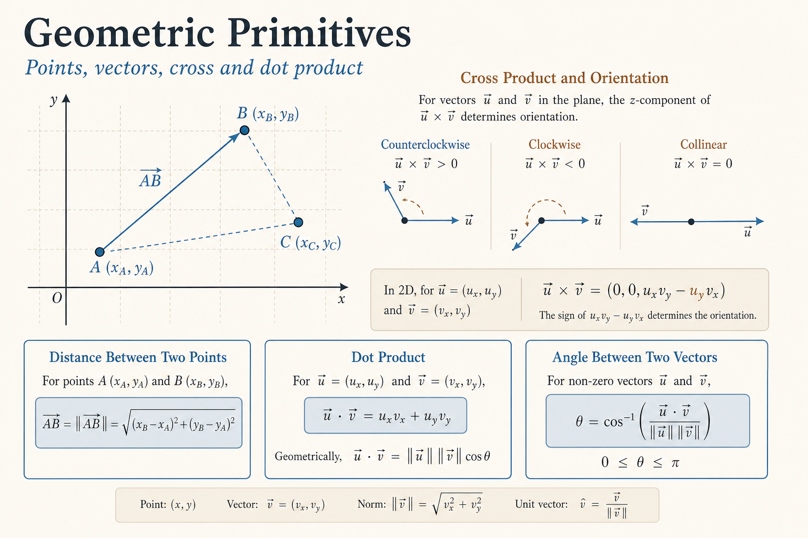

*Visualization of vectors, cross product, dot product, and orientation tests*

---

## 🎯 At a Glance

| | |
|:---|:---|
| **In one line** | Geometric primitives are the fundamental building blocks of computational geometry: points, vectors, lines, and basic operations on them. |
| **Typical time** | O(1) for most operations |
| **Typical space** | O(1) |
| **Topics** | Vectors, Cross Product, Dot Product, Distances |

> **How to use this page:** Start with the visual overview, scan **At a Glance**, then work through theory → walkthroughs → code.

---

## 🎯 Overview

Geometric primitives are the fundamental building blocks of computational geometry: points, vectors, lines, and basic operations on them.

---

## 🧭 Navigation

| ⬅️ Previous | 📂 Current | ➡️ Next |
|:------------|:----------:|--------:|
| [🏠 Computational Geometry](../README.md) | **01. Geometric Primitives** | [02. Convex Hull →](../02_convex_hull/README.md) |

---

## 📐 Mathematical Foundation

### Points and Vectors

**Point:** Position in 2D space

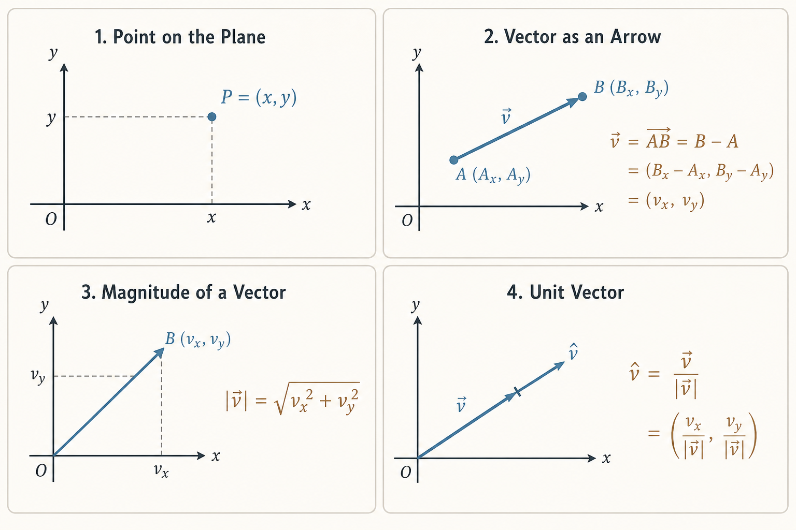

*Point coordinates, vector definition, magnitude, and unit vector*

### Cross Product

**Definition (2D):**

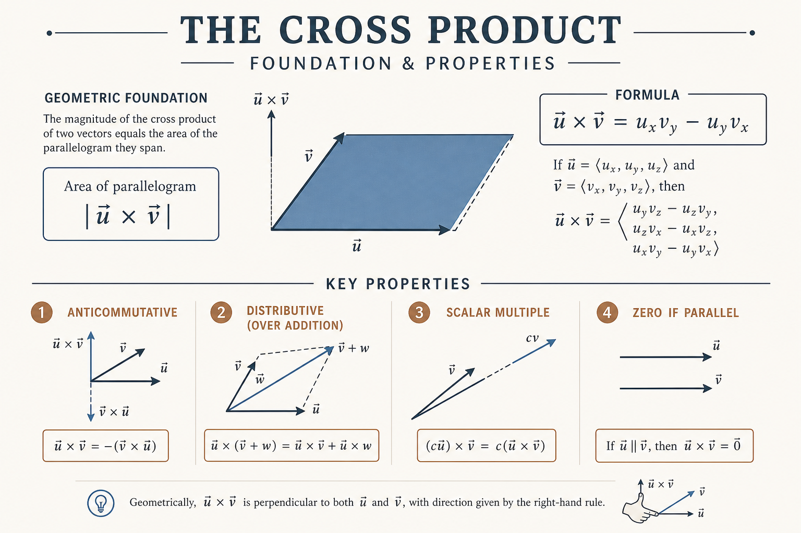

*Cross product formula, parallelogram area, and key properties*

**Applications:**

- Orientation test

- Area calculation

- Line intersection detection

### Dot Product

**Definition:**

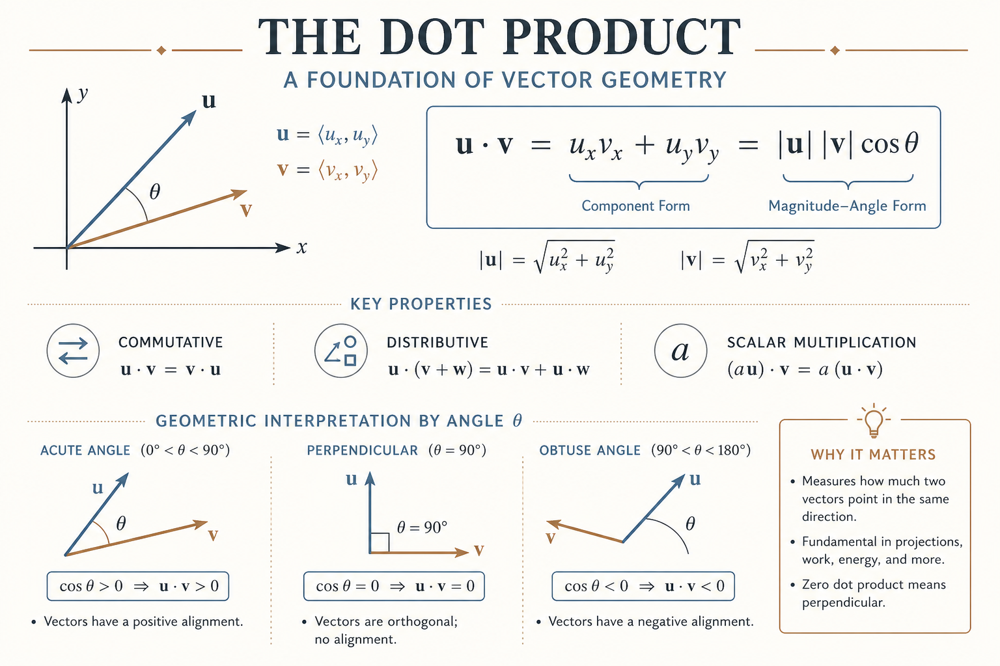

*Dot product formula, angle relationship, and key properties*

**Applications:**

- Angle calculation

- Projection

- Perpendicularity test

- Distance to line

---

## 💻 Implementations

### 1. Point and Vector Class

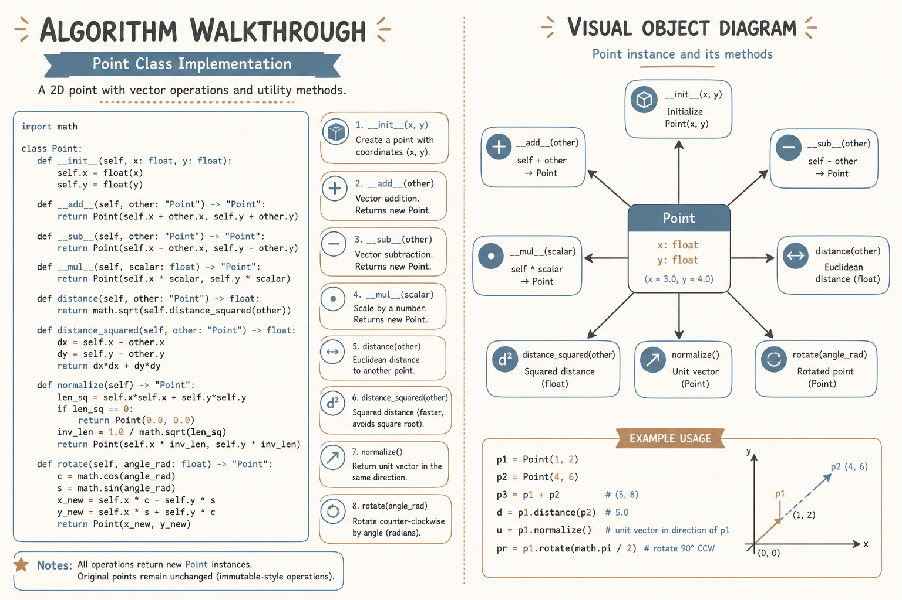

*Point class with arithmetic, distance, normalize, and rotate methods*

### 2. Cross and Dot Products

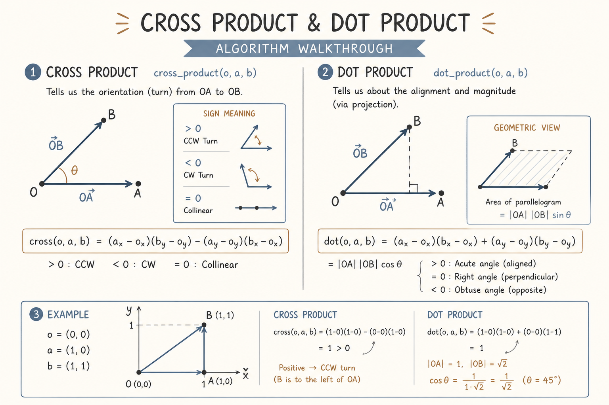

*cross_product, dot_product, and cross_product_magnitude with CCW/CW examples*

### 3. Orientation Test

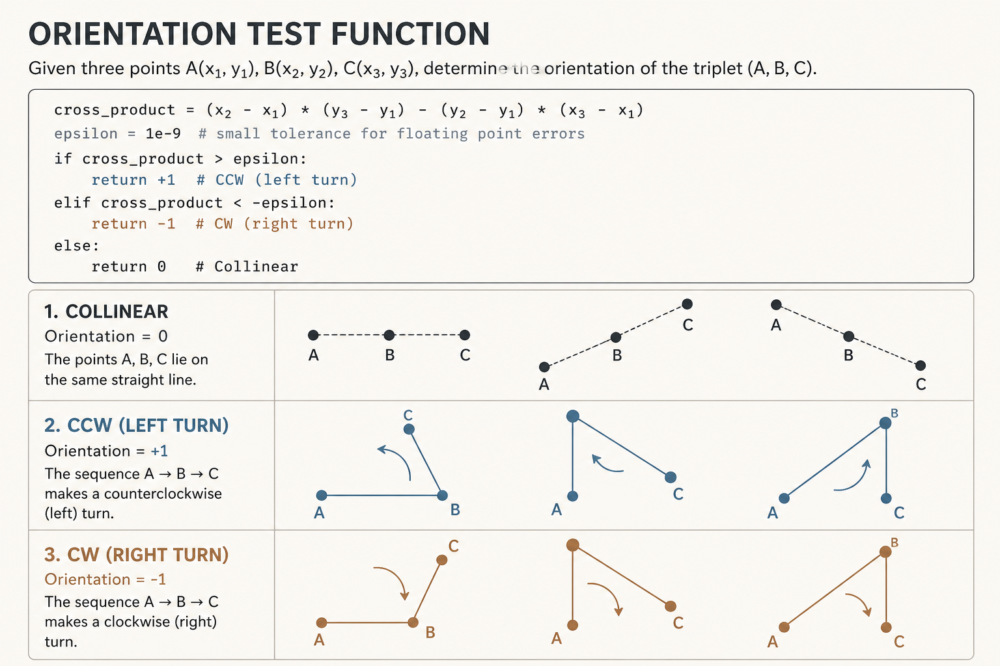

*orientation() using cross product with collinear, CCW, and CW examples*

### 4. Distance Calculations

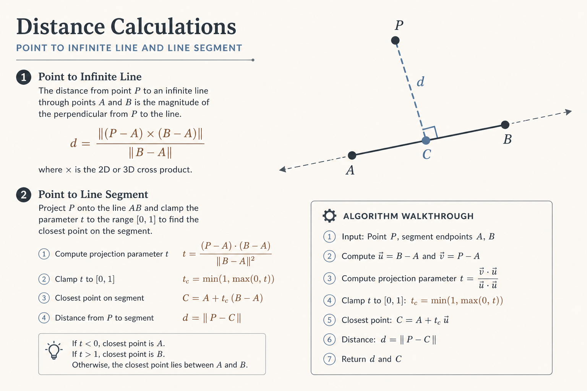

*Point-to-line and point-to-segment distance with projection parameter t*

### 5. Angle Calculations

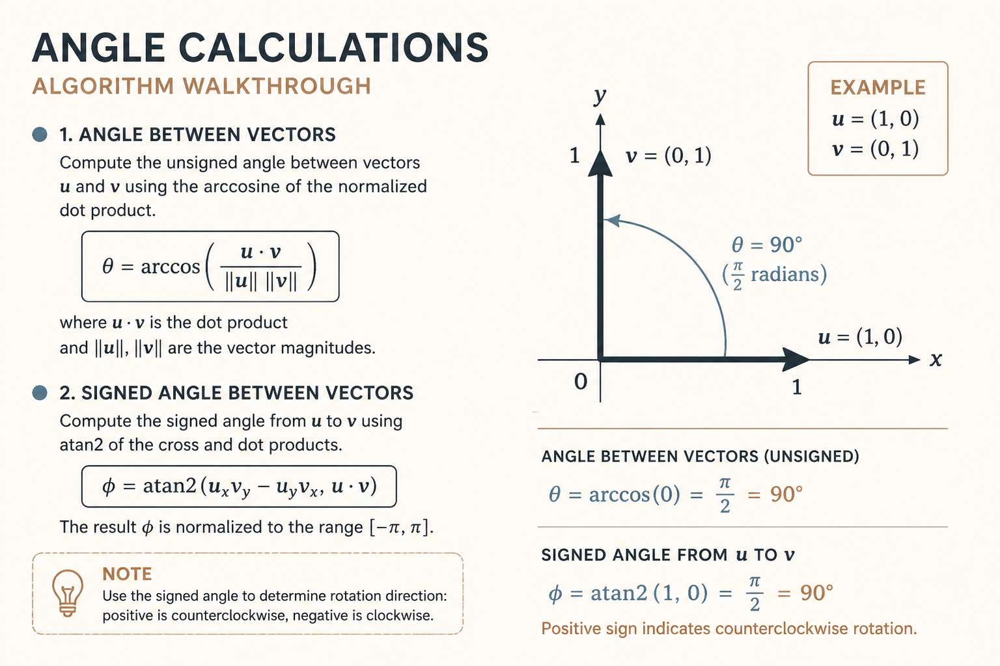

*angle_between_vectors and signed_angle using dot product and atan2*

### 6. Projection

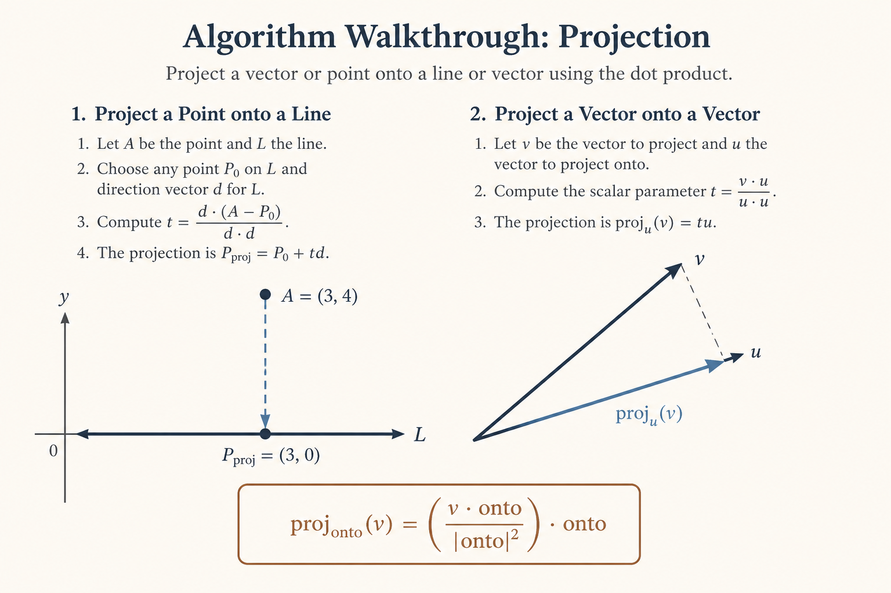

*Project point onto line and project vector onto vector*

---

## 🧩 LeetCode Problems

| # | Problem | Difficulty |
|---|---------|------------|
| 973 | [K Closest Points to Origin](https://leetcode.com/problems/k-closest-points-to-origin/) | 🟡 Medium |
| 149 | [Max Points on a Line](https://leetcode.com/problems/max-points-on-a-line/) | 🔴 Hard |
| 1232 | [Check If It Is a Straight Line](https://leetcode.com/problems/check-if-it-is-a-straight-line/) | 🟢 Easy |
| 593 | [Valid Square](https://leetcode.com/problems/valid-square/) | 🟡 Medium |

---

## 💡 Key Insights

### Epsilon Comparisons

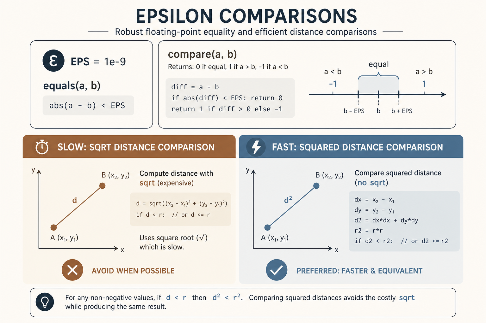

*EPS-based floating point comparisons and squared distance optimization*

### Cross Product Sign Table

| Cross Product | Meaning | Visualization |
|---------------|---------|---------------|
| > 0 | Counter-clockwise | Left turn |
| = 0 | Collinear | Straight |
| < 0 | Clockwise | Right turn |

---

## 📚 References & Learning Resources

### 📖 Core Concepts

| Resource | Description | Link |
|----------|-------------|------|
| **Basic Geometry** | CP-Algorithms | [Primitives](https://cp-algorithms.com/geometry/basic-geometry.html) |
| **Orientation Test** | GeeksforGeeks | [Cross product](https://www.geeksforgeeks.org/orientation-3-ordered-points/) |

### 📝 Practice

| Platform | Focus | Link |
|----------|-------|------|
| **LeetCode** | Geometry tag | [Problems](https://leetcode.com/tag/geometry/) |

---

**Navigation:** [← Computational Geometry](../README.md) | [Next: Convex Hull →](../02_convex_hull/)
