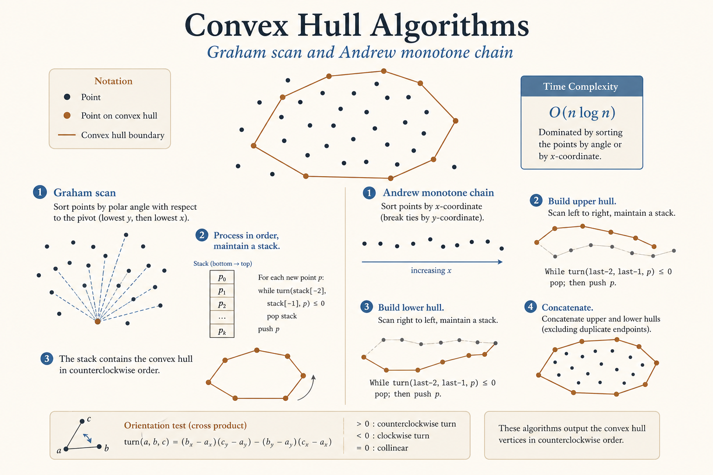
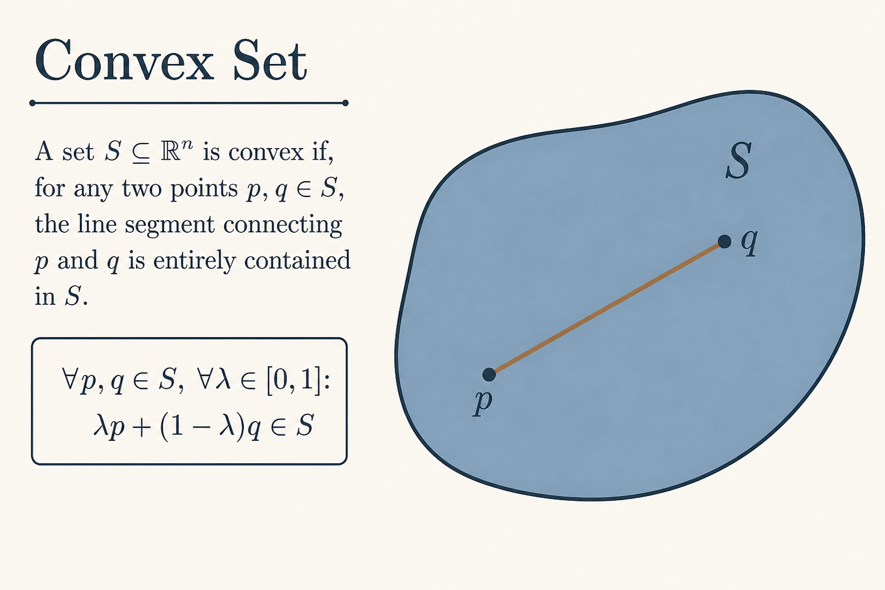
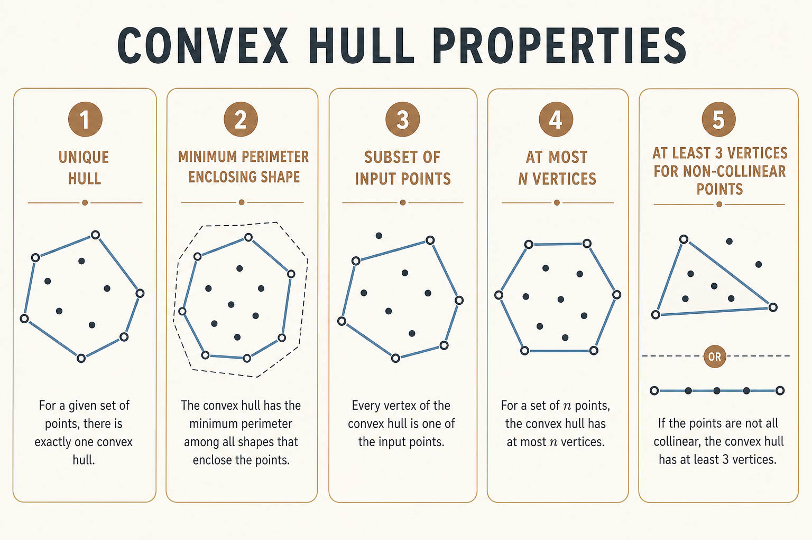
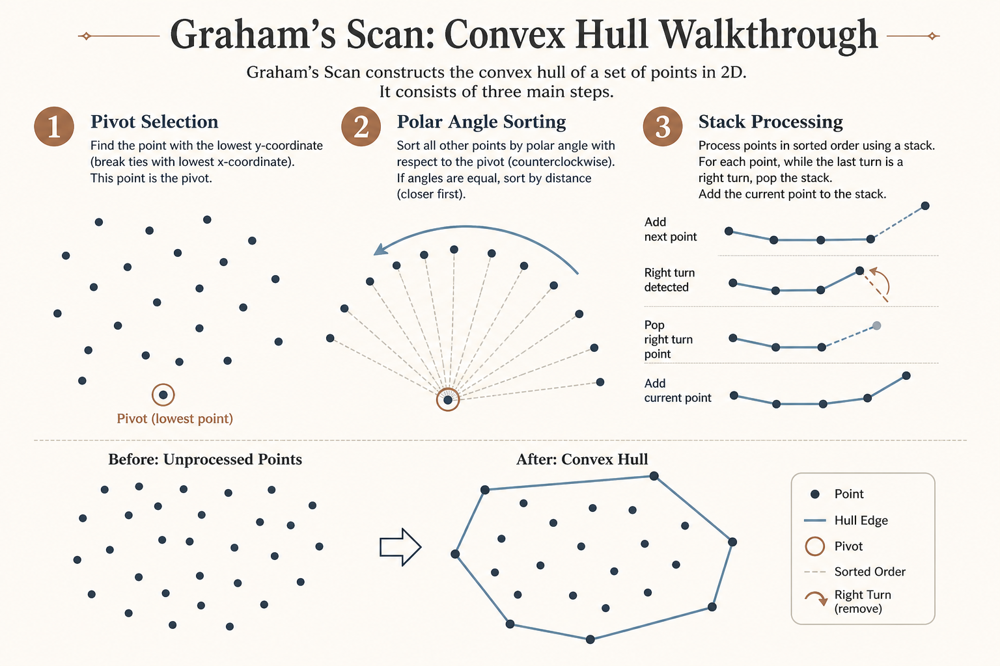
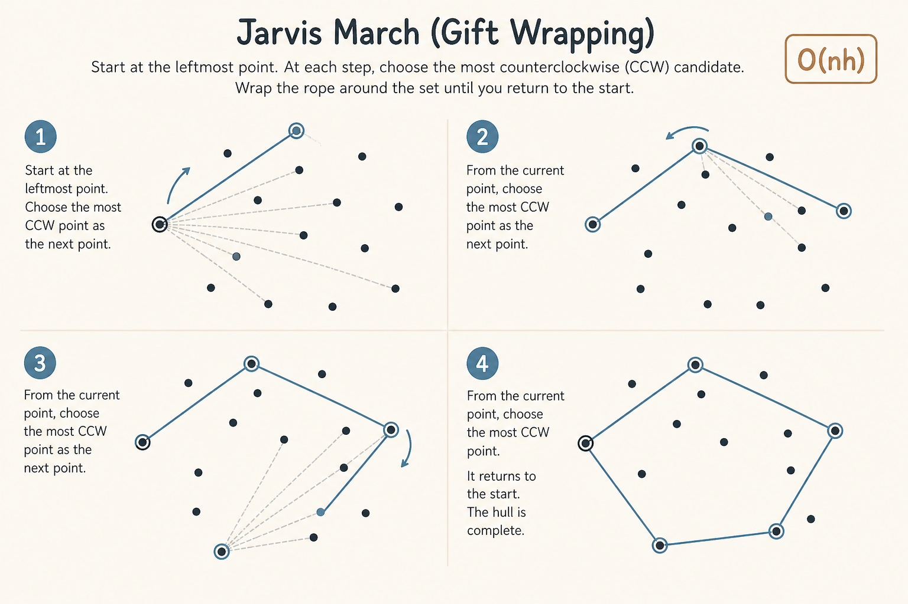
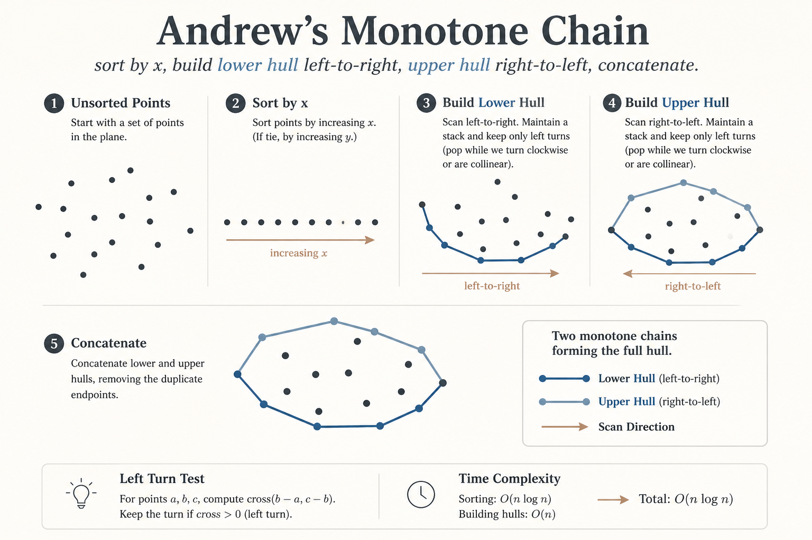
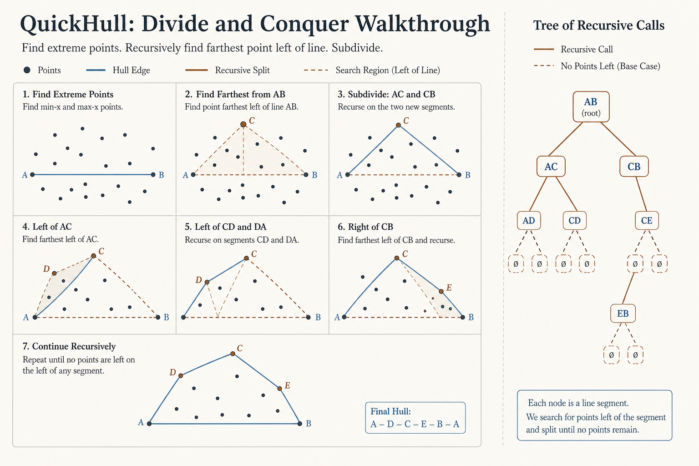
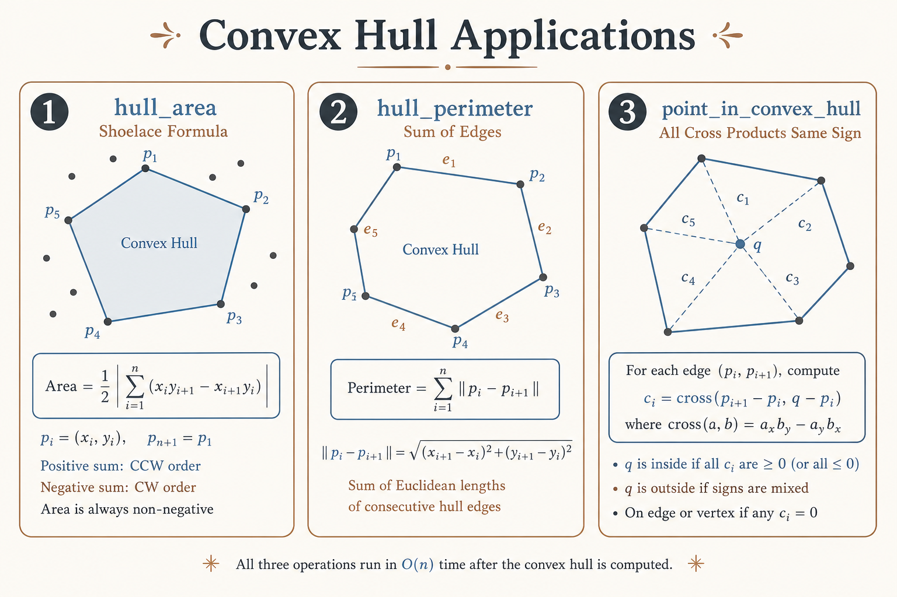

# 🔺 Convex Hull Algorithms

### *Graham scan, Jarvis march, and convex hull algorithms*

[🏠 Computational Geometry](../README.md)

---

## 📊 Visual Overview

*Graham's Scan step-by-step visualization with algorithm comparison*

---

## 🎯 At a Glance

| | |
|:---|:---|
| **In one line** | **Convex Hull:** Smallest convex polygon containing all given points. |
| **Typical time** | O(n log n) optimal |
| **Typical space** | O(n) |

> **How to use this page:** Start with the visual overview, scan **At a Glance**, then work through theory → walkthroughs → code.
## 🧭 Navigation

| ⬅️ Previous | 📂 Current | ➡️ Next |
|:------------|:----------:|--------:|
| [🏠 Computational Geometry](../README.md) | **02. Convex Hull** | [Line Intersection →](../03_line_intersection/README.md) |

---

---

## 🎯 Overview

**Convex Hull:** Smallest convex polygon containing all given points. Fundamental problem in computational geometry.

---

## 📐 Mathematical Foundation

### Convex Set

**Definition:** Set S is convex if for any two points p, q ∈ S, the line segment pq is entirely in S.

*Convex set definition: line segment between any two interior points stays inside*

### Convex Hull Properties

*Unique hull, minimum perimeter, subset of input, at most n vertices, at least 3*

---

## 💻 Implementations

### 1. Graham's Scan

*Pivot selection, polar angle sorting, stack-based CCW hull construction — O(n log n)*

### 2. Jarvis March (Gift Wrapping)

*Gift wrapping from leftmost point finding most CCW candidate — O(nh)*

### 3. Andrew's Monotone Chain

*Sort by x, build lower and upper monotone chains — O(n log n)*

### 4. QuickHull (Divide and Conquer)

*Recursive divide at farthest point from extreme pair — O(n log n) average*

### 5. Convex Hull Applications

*Hull area (shoelace), perimeter, and point-in-convex-hull cross product test*

---

## 🧩 LeetCode Problems

| # | Problem | Difficulty | Algorithm |
|---|---------|------------|-----------|
| 587 | [Erect the Fence](https://leetcode.com/problems/erect-the-fence/) | 🔴 Hard | Any convex hull |
| 973 | [K Closest Points](https://leetcode.com/problems/k-closest-points-to-origin/) | 🟡 Medium | Partial hull |
| 892 | [Surface Area of 3D Shapes](https://leetcode.com/problems/surface-area-of-3d-shapes/) | 🟢 Easy | 3D hull concept |

---

## 💡 Algorithm Comparison

| Algorithm | Time | Space | Best When |
|-----------|:----:|:-----:|-----------|
| **Graham's Scan** | O(n log n) | O(n) | General purpose |
| **Jarvis March** | O(nh) | O(h) | h << n (few hull points) |
| **Andrew's** | O(n log n) | O(n) | Simpler implementation |
| **QuickHull** | O(n log n) avg | O(n) | Divide & conquer preference |

**Recommendation:** Andrew's Monotone Chain for simplicity and reliability.

---

## 📚 References & Learning Resources

### 📖 Core Concepts

| Resource | Description | Link |
|----------|-------------|------|
| **Convex Hull** | CP-Algorithms | [Algorithms](https://cp-algorithms.com/geometry/convex-hull.html) |
| **Graham Scan** | GeeksforGeeks | [Convex hull](https://www.geeksforgeeks.org/convex-hull-algorithm/) |

### 📝 Practice

| Platform | Focus | Link |
|----------|-------|------|
| **LeetCode** | Geometry tag | [Problems](https://leetcode.com/tag/geometry/) |

---

**Navigation:** [← Geometric Primitives](../01_geometric_primitives/) | [Next: Line Intersection →](../03_line_intersection/)
