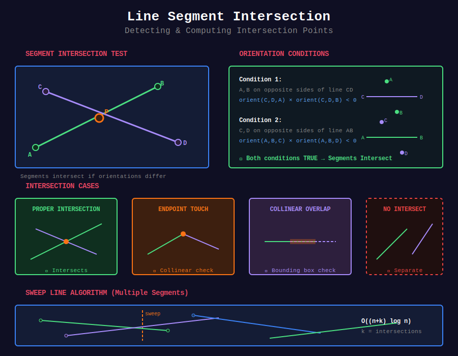

# ⚡ Line Intersection Algorithms

## 📊 Metadata

- **Difficulty:** 

- **Time Complexity:** O(n²) naive, O((n+k) log n) sweep line

- **Space Complexity:** O(n)

- **Topics:** Segment Intersection, Sweep Line, Bentley-Ottmann

---

## 🎯 Overview

Line intersection problems determine if and where geometric segments intersect. Critical for CAD, GIS, collision detection.

---

## 📊 Visual Overview



*Segment intersection test using orientation conditions*

---

## 📐 Mathematical Foundation

### Segment Intersection Conditions

**Two segments AB and CD intersect if:**

```
1. General position:
   - A and B are on opposite sides of line CD
   - C and D are on opposite sides of line AB
   
2. Collinear case:
   - All four points collinear
   - Segments overlap (bounding box check)

```

**Formula:**

```
Segments intersect ⟺
  orientation(A,B,C) · orientation(A,B,D) < 0
  AND
  orientation(C,D,A) · orientation(C,D,B) < 0

```

---

## 💻 Implementations

### 1. Basic Segment Intersection

```python
def segments_intersect(p1, q1, p2, q2):
    """
    Check if segments (p1,q1) and (p2,q2) intersect
    
    Time: O(1)
    Space: O(1)
    
    Returns: True if segments intersect
    """
    def on_segment(p, q, r):
        """Check if q lies on segment pr (given collinear)"""
        return (min(p.x, r.x) <= q.x <= max(p.x, r.x) and
                min(p.y, r.y) <= q.y <= max(p.y, r.y))
    
    o1 = orientation(p1, q1, p2)
    o2 = orientation(p1, q1, q2)
    o3 = orientation(p2, q2, p1)
    o4 = orientation(p2, q2, q1)
    
    # General case
    if o1 != o2 and o3 != o4:
        return True
    
    # Special cases: collinear points
    if o1 == 0 and on_segment(p1, p2, q1):
        return True
    if o2 == 0 and on_segment(p1, q2, q1):
        return True
    if o3 == 0 and on_segment(p2, p1, q2):
        return True
    if o4 == 0 and on_segment(p2, q1, q2):
        return True
    
    return False

```

### 2. Intersection Point

```python
def segment_intersection_point(p1, q1, p2, q2):
    """
    Find intersection point of two segments (if exists)
    
    Time: O(1)
    Returns: Point or None
    """
    # Direction vectors
    d1 = q1 - p1
    d2 = q2 - p2
    
    # Cross product
    cross = d1.x * d2.y - d1.y * d2.x
    
    # Parallel segments
    if abs(cross) < 1e-9:
        return None
    
    # Parameters of intersection
    t1 = ((p2.x - p1.x) * d2.y - (p2.y - p1.y) * d2.x) / cross
    t2 = ((p2.x - p1.x) * d1.y - (p2.y - p1.y) * d1.x) / cross
    
    # Check if intersection is within both segments
    if 0 <= t1 <= 1 and 0 <= t2 <= 1:
        return Point(p1.x + t1 * d1.x, p1.y + t1 * d1.y)
    
    return None

```

### 3. All Pairs Intersection (Naive)

```python
def find_all_intersections_naive(segments):
    """
    Find all pairwise segment intersections
    
    Time: O(n²)
    Space: O(k) where k = number of intersections
    
    Returns: List of intersection points
    """
    intersections = []
    n = len(segments)
    
    for i in range(n):
        for j in range(i + 1, n):
            p1, q1 = segments[i]
            p2, q2 = segments[j]
            
            point = segment_intersection_point(p1, q1, p2, q2)
            if point:
                intersections.append((i, j, point))
    
    return intersections

```

### 4. Sweep Line Algorithm (Simplified)

```python
from sortedcontainers import SortedList

def sweep_line_intersections(segments):
    """
    Sweep line algorithm for segment intersections
    
    Time: O((n+k) log n) where k = intersections
    Space: O(n)
    
    Simpl

ified version of Bentley-Ottmann
    """
    events = []
    
    # Create events for segment endpoints
    for i, (p, q) in enumerate(segments):
        # Ensure p is left endpoint
        if p.x > q.x or (p.x == q.x and p.y > q.y):
            p, q = q, p
        
        events.append((p.x, 0, i, p, q))  # Start event
        events.append((q.x, 1, i, p, q))  # End event
    
    events.sort()
    
    active = SortedList(key=lambda x: segments[x][0].y)  # Active segments
    intersections = []
    
    for x, event_type, seg_id, p, q in events:
        if event_type == 0:  # Start
            # Check intersection with neighbors
            active.add(seg_id)
            idx = active.index(seg_id)
            
            # Check with previous and next segments
            if idx > 0:
                check_and_add_intersection(seg_id, active[idx-1], segments, intersections)
            if idx < len(active) - 1:
                check_and_add_intersection(seg_id, active[idx+1], segments, intersections)
        
        else:  # End
            idx = active.index(seg_id)
            
            # Before removing, check if neighbors now intersect
            if 0 < idx < len(active) - 1:
                check_and_add_intersection(active[idx-1], active[idx+1], segments, intersections)
            
            active.remove(seg_id)
    
    return intersections

def check_and_add_intersection(i, j, segments, intersections):
    """Helper to check and record intersection"""
    p1, q1 = segments[i]
    p2, q2 = segments[j]
    
    point = segment_intersection_point(p1, q1, p2, q2)
    if point:
        intersections.append((i, j, point))

```

---

## 🧩 LeetCode Problems

| # | Problem | Difficulty |
|---|---------|------------|
| 223 | [Rectangle Area](https://leetcode.com/problems/rectangle-area/) | 🟡 Medium |
| 836 | [Rectangle Overlap](https://leetcode.com/problems/rectangle-overlap/) | 🟢 Easy |
| 149 | [Max Points on a Line](https://leetcode.com/problems/max-points-on-a-line/) | 🔴 Hard |

---

**Navigation:** [← Convex Hull](../02_convex_hull/) | [Next: Point Location →](../04_point_location/)

