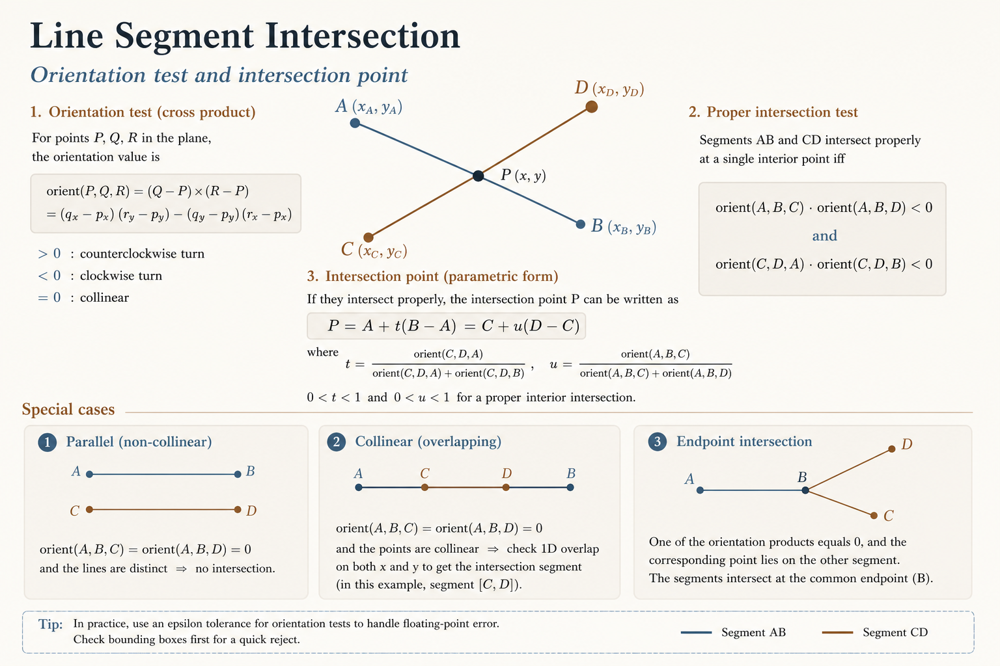
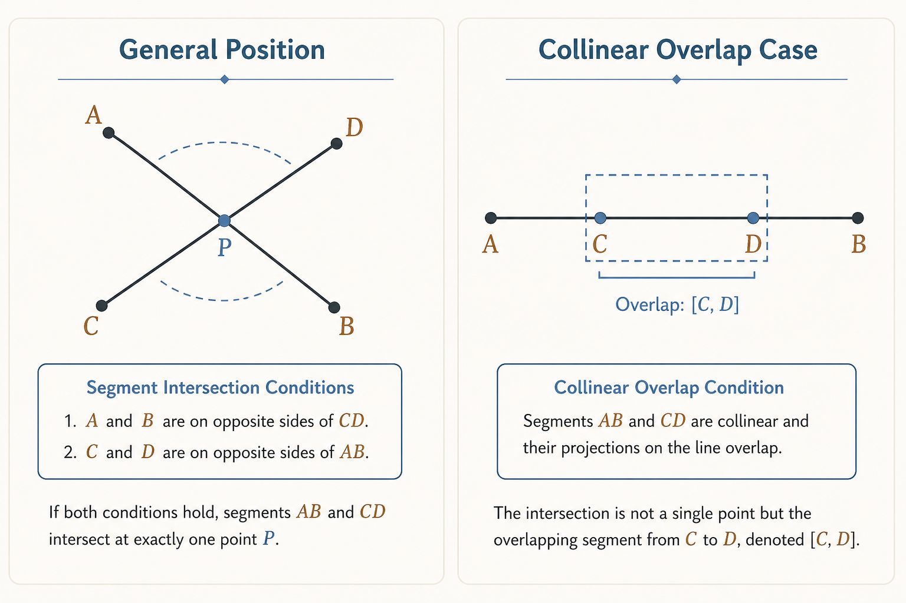
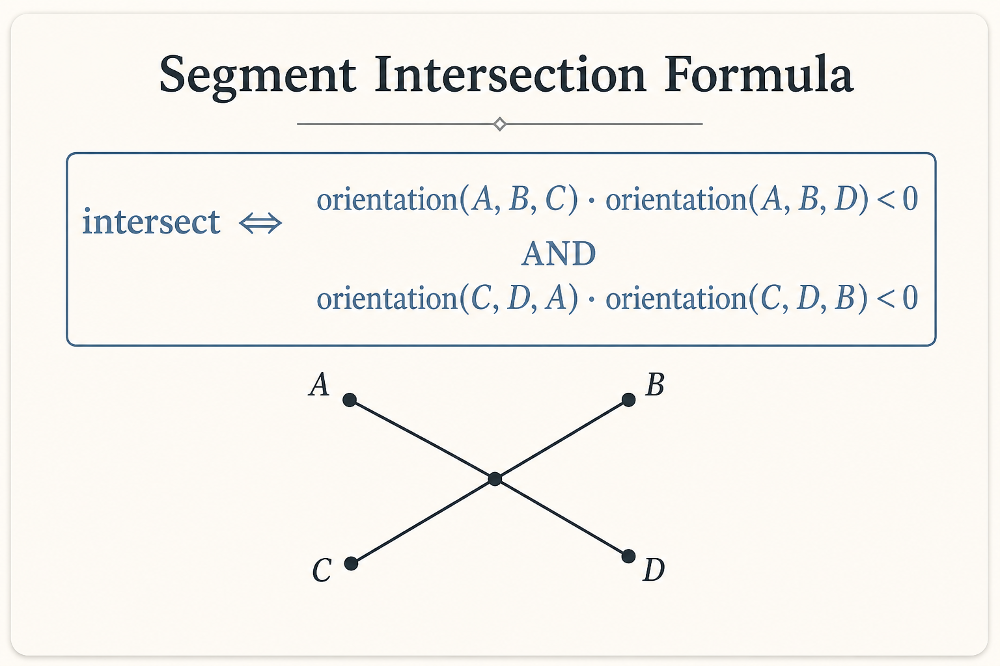
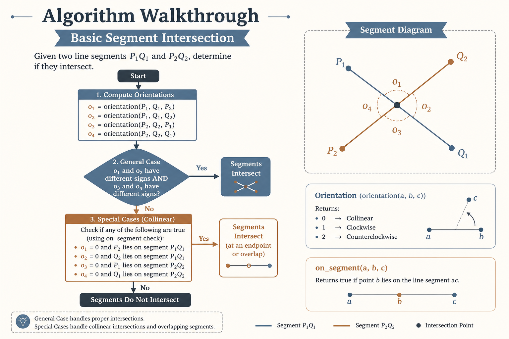
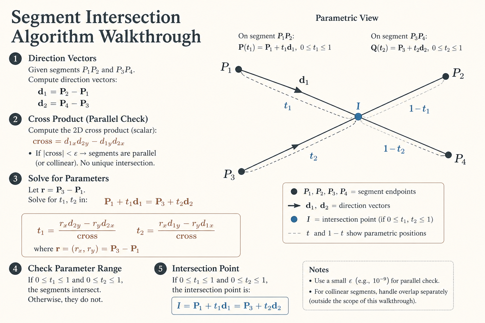
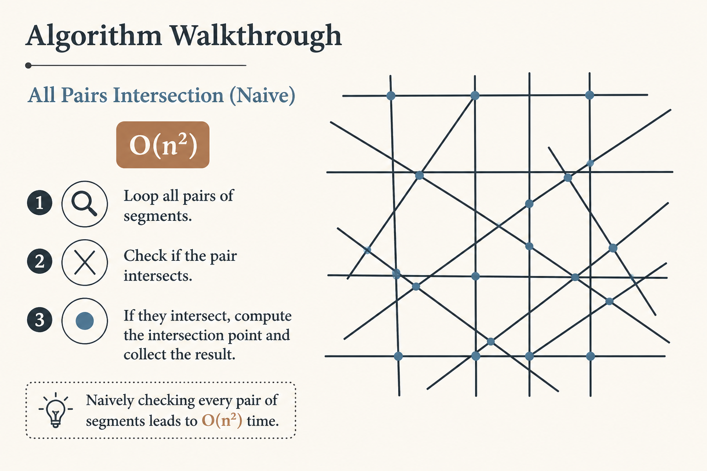
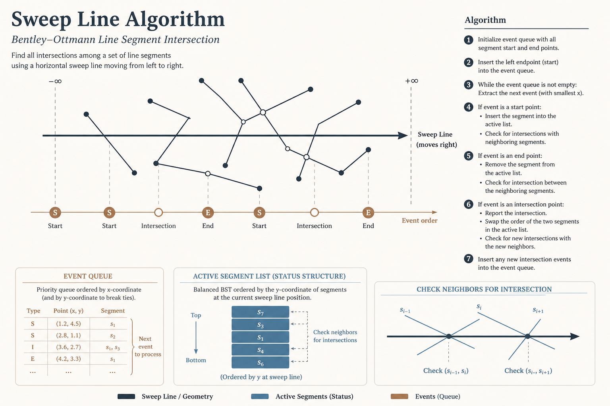

# ⚡ Line Intersection Algorithms

### *Line intersection problems determine if and where geometric segments intersect.*

[🏠 Computational Geometry](../README.md)

---

## 📊 Visual Overview

*Segment intersection test using orientation conditions*

---

## 🎯 At a Glance

| | |
|:---|:---|
| **In one line** | Line intersection problems determine if and where geometric segments intersect. |
| **Typical time** | O(n²) naive, O((n+k) log n) sweep line |
| **Typical space** | O(n) |
| **Topics** | Segment Intersection, Sweep Line, Bentley-Ottmann |

{: .highlight }
> **How to use this page:** Start with the visual overview, scan **At a Glance**, then work through theory → walkthroughs → code.
## 🧭 Navigation

| ⬅️ Previous | 📂 Current | ➡️ Next |
|:------------|:----------:|--------:|
| [← Line Intersection](../03_line_intersection/README.md) | **03. Line Intersection** | [Point Location →](../04_point_location/README.md) |

---

---

## 🎯 Overview

Line intersection problems determine if and where geometric segments intersect. Critical for CAD, GIS, collision detection.

---

## 📐 Mathematical Foundation

### Segment Intersection Conditions

**Two segments AB and CD intersect if:**

*General position (opposite sides) and collinear overlap cases*

**Formula:**

*Orientation product condition for segment intersection*

---

## 💻 Implementations

### 1. Basic Segment Intersection

*Four orientation tests with general and collinear on_segment cases*

### 2. Intersection Point

*Parametric intersection using direction vectors and cross product*

### 3. All Pairs Intersection (Naive)

*O(n²) brute force checking all segment pairs*

### 4. Sweep Line Algorithm (Simplified)

*Event-driven sweep line with active segment list — O((n+k) log n)*

---

## 🧩 LeetCode Problems

| # | Problem | Difficulty |
|---|---------|------------|
| 223 | [Rectangle Area](https://leetcode.com/problems/rectangle-area/) | 🟡 Medium |
| 836 | [Rectangle Overlap](https://leetcode.com/problems/rectangle-overlap/) | 🟢 Easy |
| 149 | [Max Points on a Line](https://leetcode.com/problems/max-points-on-a-line/) | 🔴 Hard |

---

## 📚 References & Learning Resources

### 📖 Core Concepts

| Resource | Description | Link |
|----------|-------------|------|
| **Line Segment Intersection** | GeeksforGeeks | [Intersection](https://www.geeksforgeeks.org/check-if-two-given-line-segments-intersect/) |
| **Sweep Line** | CP-Algorithms | [Sweep line](https://cp-algorithms.com/geometry/sweep-line.html) |

### 📝 Practice

| Platform | Focus | Link |
|----------|-------|------|
| **LeetCode** | Geometry tag | [Problems](https://leetcode.com/tag/geometry/) |

---

**Navigation:** [← Convex Hull](../02_convex_hull/) | [Next: Point Location →](../04_point_location/)
