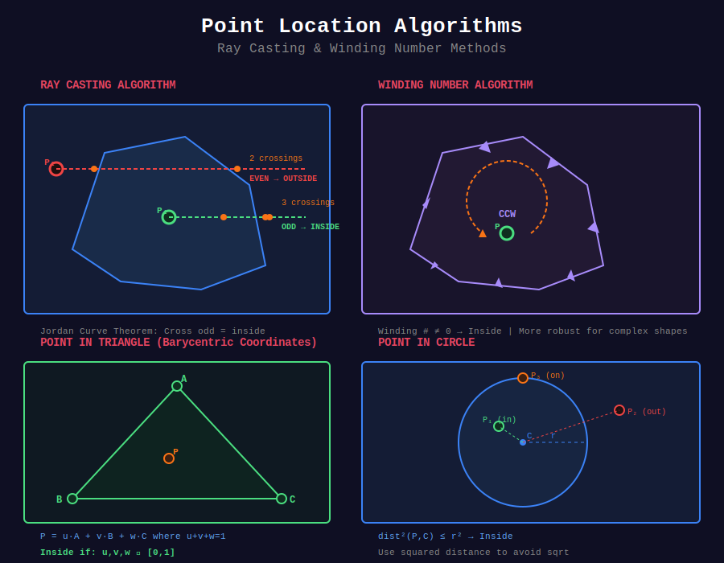

# 📍 Point Location Problems

## 📊 Metadata
- **Difficulty:** 
- **Time Complexity:** O(n) for point in polygon
- **Space Complexity:** O(1)
- **Topics:** Ray Casting, Winding Number, Point in Triangle

---

## 🎯 Overview

Point location determines spatial relationships: Is a point inside, outside, or on the boundary of a geometric region?

---

## 📊 Visual Overview



*Ray casting and winding number algorithms for point-in-polygon tests*

---

## 📐 Mathematical Foundation

### Jordan Curve Theorem

**Theorem:** Any simple closed curve divides the plane into:
- Interior (bounded region)
- Exterior (unbounded region)

**Application:** Point is inside polygon ⟺ ray from point to infinity crosses odd number of edges.

---

## 💻 Implementations

### 1. Ray Casting (Point in Polygon)

```python
def point_in_polygon(point, polygon):
    """
    Ray casting algorithm for point in polygon test
    
    Time: O(n) where n = polygon vertices
    Space: O(1)
    
    Returns: True if point inside polygon
    """
    n = len(polygon)
    inside = False
    
    p1 = polygon[0]
    
    for i in range(1, n + 1):
        p2 = polygon[i % n]
        
        # Check if point is on horizontal ray to the right
        if point.y > min(p1.y, p2.y):
            if point.y <= max(p1.y, p2.y):
                if point.x <= max(p1.x, p2.x):
                    # Calculate x-intersection
                    if p1.y != p2.y:
                        x_inters = (point.y - p1.y) * (p2.x - p1.x) / (p2.y - p1.y) + p1.x
                    
                    if p1.x == p2.x or point.x <= x_inters:
                        inside = not inside
        
        p1 = p2
    
    return inside

```

### 2. Winding Number

```python
def winding_number(point, polygon):
    """
    Winding number algorithm (more robust)
    
    Time: O(n)
    Returns: Winding number (0 = outside, ≠0 = inside)
    """
    wn = 0
    n = len(polygon)
    
    for i in range(n):
        p1 = polygon[i]
        p2 = polygon[(i + 1) % n]
        
        if p1.y <= point.y:
            if p2.y > point.y:  # Upward crossing
                if is_left(p1, p2, point) > 0:
                    wn += 1
        else:
            if p2.y <= point.y:  # Downward crossing
                if is_left(p1, p2, point) < 0:
                    wn -= 1
    
    return wn != 0

def is_left(p0, p1, p2):
    """Test if point is left of line"""
    return ((p1.x - p0.x) * (p2.y - p0.y) - 
            (p2.x - p0.x) * (p1.y - p0.y))

```

### 3. Point in Triangle

```python
def point_in_triangle(p, a, b, c):
    """
    Check if point p is inside triangle ABC
    
    Time: O(1)
    
    Uses barycentric coordinates
    """
    # Compute vectors
    v0 = c - a
    v1 = b - a
    v2 = p - a
    
    # Compute dot products
    dot00 = dot_product(v0, v0)
    dot01 = dot_product(v0, v1)
    dot02 = dot_product(v0, v2)
    dot11 = dot_product(v1, v1)
    dot12 = dot_product(v1, v2)
    
    # Compute barycentric coordinates
    inv_denom = 1 / (dot00 * dot11 - dot01 * dot01)
    u = (dot11 * dot02 - dot01 * dot12) * inv_denom
    v = (dot00 * dot12 - dot01 * dot02) * inv_denom
    
    # Check if point is in triangle
    return (u >= 0) and (v >= 0) and (u + v <= 1)

```

### 4. Point in Circle

```python
def point_in_circle(point, center, radius):
    """
    Check if point is inside circle
    
    Time: O(1)
    """
    return point.distance_squared(center) <= radius * radius

def point_on_circle(point, center, radius, epsilon=1e-9):
    """Check if point is on circle boundary"""
    dist_sq = point.distance_squared(center)
    return abs(dist_sq - radius * radius) < epsilon

```

---

## 🧩 LeetCode Problems

| # | Problem | Difficulty |
|---|---------|------------|
| 883 | [Projection Area of 3D Shapes](https://leetcode.com/problems/projection-area-of-3d-shapes/) | 🟢 Easy |
| 892 | [Surface Area of 3D Shapes](https://leetcode.com/problems/surface-area-of-3d-shapes/) | 🟢 Easy |

---

**Navigation:** [← Line Intersection](../03_line_intersection/) | [Next: Polygon Operations →](../05_polygon_operations/)

