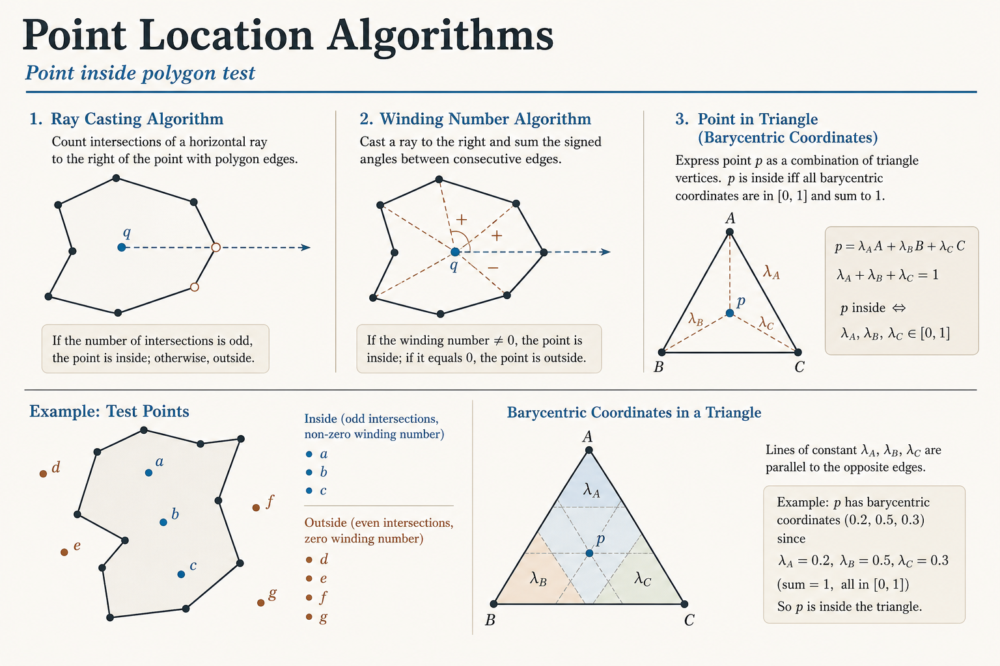
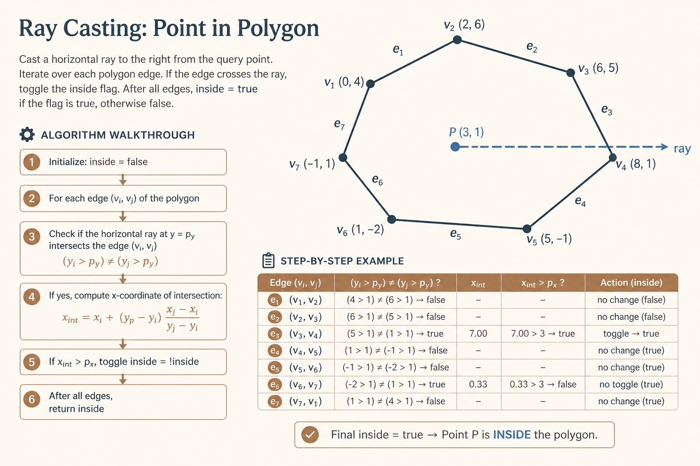
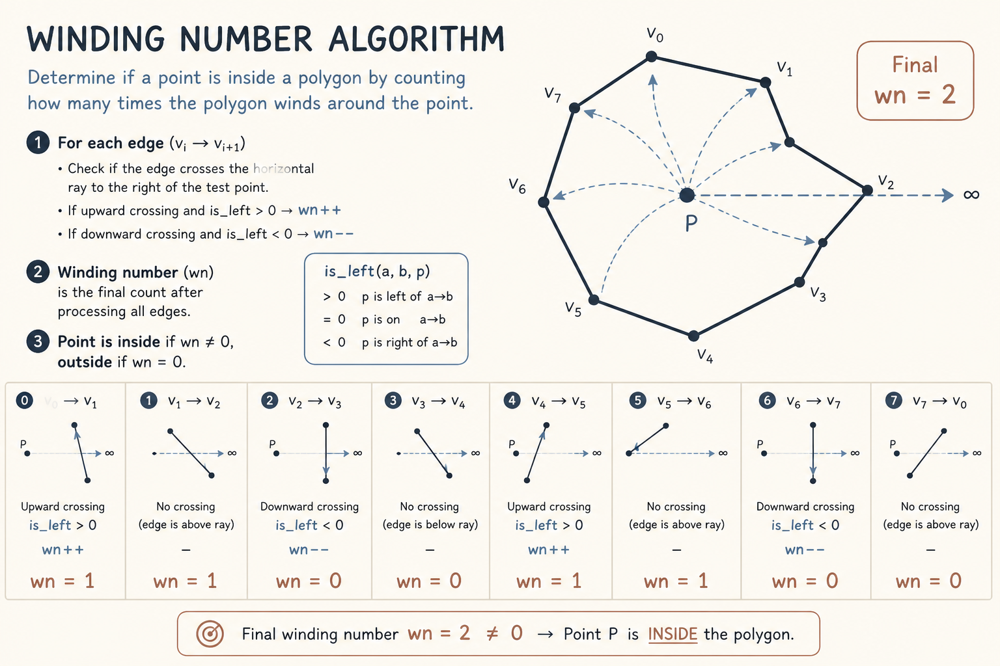
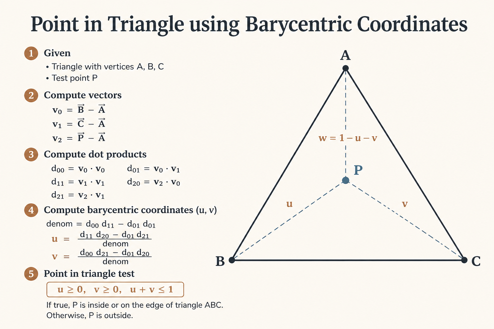
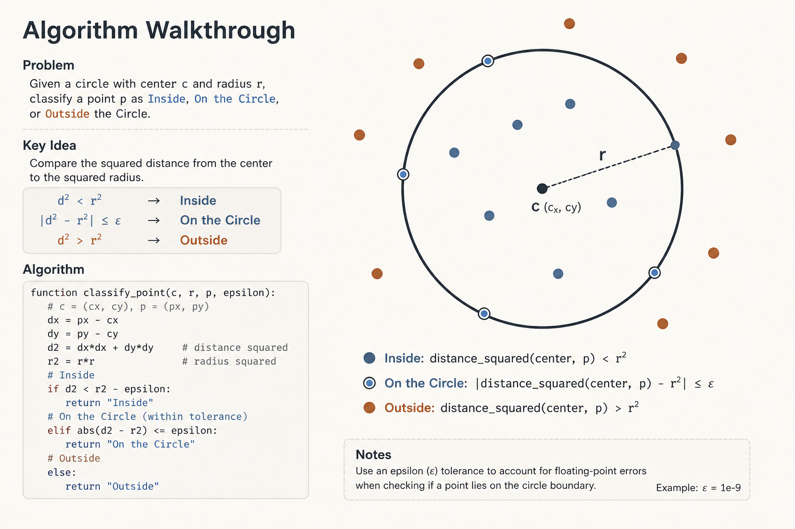

# 📍 Point Location Problems

### *Point location determines spatial relationships: Is a point inside, outside, or on the boundary of a geometric region?.*

[🏠 Computational Geometry](../README.md)

---

## 📊 Visual Overview

*Ray casting and winding number algorithms for point-in-polygon tests*

---

## 🎯 At a Glance

| | |
|:---|:---|
| **In one line** | Point location determines spatial relationships: Is a point inside, outside, or on the boundary of a geometric region?. |
| **Typical time** | O(n) for point in polygon |
| **Typical space** | O(1) |
| **Topics** | Ray Casting, Winding Number, Point in Triangle |

{: .highlight }
> **How to use this page:** Start with the visual overview, scan **At a Glance**, then work through theory → walkthroughs → code.
## 🧭 Navigation

| ⬅️ Previous | 📂 Current | ➡️ Next |
|:------------|:----------:|--------:|
| [← Point Location](../04_point_location/README.md) | **04. Point Location** | [Polygon Operations →](../05_polygon_operations/README.md) |

---

---

## 🎯 Overview

Point location determines spatial relationships: Is a point inside, outside, or on the boundary of a geometric region?

---

## 📐 Mathematical Foundation

### Jordan Curve Theorem

**Theorem:** Any simple closed curve divides the plane into:

- Interior (bounded region)

- Exterior (unbounded region)

**Application:** Point is inside polygon ⟺ ray from point to infinity crosses odd number of edges.

---

## 💻 Implementations

### 1. Ray Casting (Point in Polygon)

*Horizontal ray casting with edge crossing count — O(n) per query*

### 2. Winding Number

*Signed angle winding number — more robust for complex polygons*

### 3. Point in Triangle

*Barycentric coordinate test: u ≥ 0, v ≥ 0, u + v ≤ 1*

### 4. Point in Circle

*Distance squared comparison and epsilon boundary check*

---

## 🧩 LeetCode Problems

| # | Problem | Difficulty |
|---|---------|------------|
| 883 | [Projection Area of 3D Shapes](https://leetcode.com/problems/projection-area-of-3d-shapes/) | 🟢 Easy |
| 892 | [Surface Area of 3D Shapes](https://leetcode.com/problems/surface-area-of-3d-shapes/) | 🟢 Easy |

---

## 📚 References & Learning Resources

### 📖 Core Concepts

| Resource | Description | Link |
|----------|-------------|------|
| **Point in Polygon** | GeeksforGeeks | [Ray casting](https://www.geeksforgeeks.org/how-to-check-if-a-given-point-lies-inside-a-polygon/) |
| **Winding Number** | Wikipedia | [Winding number](https://en.wikipedia.org/wiki/Point_in_polygon) |

### 📝 Practice

| Platform | Focus | Link |
|----------|-------|------|
| **LeetCode** | Geometry tag | [Problems](https://leetcode.com/tag/geometry/) |

---

**Navigation:** [← Line Intersection](../03_line_intersection/) | [Next: Polygon Operations →](../05_polygon_operations/)
