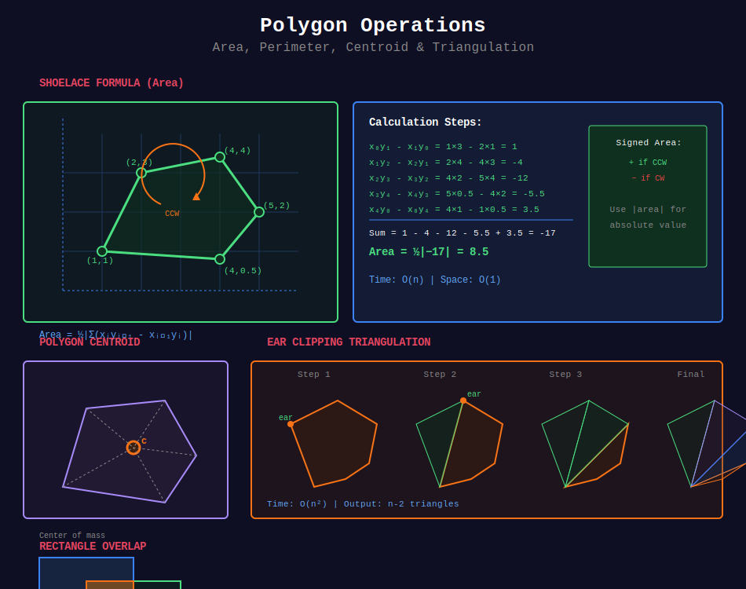

# 🔷 Polygon Operations

## 📊 Metadata
- **Difficulty:** 
- **Time Complexity:** O(n) for area, O(n²) for triangulation
- **Space Complexity:** O(n)
- **Topics:** Area, Perimeter, Triangulation, Boolean Operations

---

## 🎯 Overview

Polygon operations compute properties and perform transformations on polygons.

---

## 📊 Visual Overview



*Shoelace formula for area calculation and ear clipping triangulation*

---

## 📐 Mathematical Foundation

### Shoelace Formula (Area)

**For polygon with vertices (x₀, y₀), (x₁, y₁), ..., (xₙ₋₁, yₙ₋₁):**

```
Area = ½|Σ(xᵢyᵢ₊₁ - xᵢ₊₁yᵢ)|

where indices are mod n
```

**Signed area:** Positive if counter-clockwise, negative if clockwise.

---

## 💻 Implementations

### 1. Polygon Area (Shoelace Formula)

```python
def polygon_area(polygon):
    """
    Calculate polygon area using Shoelace formula
    
    Time: O(n)
    Space: O(1)
    
    Returns: Absolute area
    """
    n = len(polygon)
    if n < 3:
        return 0
    
    area = 0
    for i in range(n):
        j = (i + 1) % n
        area += polygon[i].x * polygon[j].y
        area -= polygon[j].x * polygon[i].y
    
    return abs(area) / 2

def signed_area(polygon):
    """Signed area (positive if CCW, negative if CW)"""
    n = len(polygon)
    area = 0
    
    for i in range(n):
        j = (i + 1) % n
        area += polygon[i].x * polygon[j].y
        area -= polygon[j].x * polygon[i].y
    
    return area / 2
```

### 2. Polygon Perimeter

```python
def polygon_perimeter(polygon):
    """
    Calculate polygon perimeter
    
    Time: O(n)
    """
    n = len(polygon)
    if n < 2:
        return 0
    
    perimeter = 0
    for i in range(n):
        j = (i + 1) % n
        perimeter += polygon[i].distance(polygon[j])
    
    return perimeter
```

### 3. Polygon Centroid

```python
def polygon_centroid(polygon):
    """
    Calculate polygon centroid (center of mass)
    
    Time: O(n)
    """
    n = len(polygon)
    if n < 3:
        return Point(0, 0)
    
    area = signed_area(polygon)
    
    if abs(area) < 1e-9:
        return Point(0, 0)
    
    cx = cy = 0
    
    for i in range(n):
        j = (i + 1) % n
        cross = (polygon[i].x * polygon[j].y - 
                polygon[j].x * polygon[i].y)
        
        cx += (polygon[i].x + polygon[j].x) * cross
        cy += (polygon[i].y + polygon[j].y) * cross
    
    factor = 1 / (6 * area)
    return Point(cx * factor, cy * factor)
```

### 4. Polygon Triangulation (Ear Clipping)

```python
def triangulate_ear_clipping(polygon):
    """
    Triangulate simple polygon using ear clipping
    
    Time: O(n²)
    Space: O(n)
    
    Returns: List of triangles (each as 3 points)
    """
    def is_ear(polygon, i, indices):
        """Check if vertex is an ear"""
        n = len(indices)
        prev = polygon[indices[(i - 1) % n]]
        curr = polygon[indices[i]]
        next_v = polygon[indices[(i + 1) % n]]
        
        # Check if triangle is counter-clockwise
        if cross_product(prev, curr, next_v) <= 0:
            return False
        
        # Check if any other vertex is inside triangle
        for j in range(n):
            if j in {(i - 1) % n, i, (i + 1) % n}:
                continue
            
            p = polygon[indices[j]]
            if point_in_triangle(p, prev, curr, next_v):
                return False
        
        return True
    
    n = len(polygon)
    if n < 3:
        return []
    
    indices = list(range(n))
    triangles = []
    
    while len(indices) > 3:
        for i in range(len(indices)):
            if is_ear(polygon, i, indices):

                # Add triangle
                prev = polygon[indices[(i - 1) % len(indices)]]
                curr = polygon[indices[i]]
                next_v = polygon[indices[(i + 1) % len(indices)]]
                triangles.append((prev, curr, next_v))
                
                # Remove ear
                indices.pop(i)
                break
    
    # Add final triangle
    if len(indices) == 3:
        triangles.append(tuple(polygon[i] for i in indices))
    
    return triangles
```

### 5. Rectangle Overlap

```python
def rectangles_overlap(rect1, rect2):
    """
    Check if two axis-aligned rectangles overlap
    
    rect = (x1, y1, x2, y2) where (x1,y1) is bottom-left
    
    Time: O(1)
    """
    x1, y1, x2, y2 = rect1
    x3, y3, x4, y4 = rect2
    
    # No overlap if one is completely to the side of the other
    if x2 <= x3 or x4 <= x1:
        return False
    if y2 <= y3 or y4 <= y1:
        return False
    
    return True

def rectangle_intersection_area(rect1, rect2):
    """Calculate area of intersection of two rectangles"""
    x1, y1, x2, y2 = rect1
    x3, y3, x4, y4 = rect2
    
    # Find intersection rectangle
    x_left = max(x1, x3)
    y_bottom = max(y1, y3)
    x_right = min(x2, x4)
    y_top = min(y2, y4)
    
    # Check if there's actual intersection
    if x_right <= x_left or y_top <= y_bottom:
        return 0
    
    return (x_right - x_left) * (y_top - y_bottom)
```

---

## 🧩 LeetCode Problems

| # | Problem | Difficulty |
|---|---------|------------|
| 223 | [Rectangle Area](https://leetcode.com/problems/rectangle-area/) | 🟡 Medium |
| 836 | [Rectangle Overlap](https://leetcode.com/problems/rectangle-overlap/) | 🟢 Easy |
| 850 | [Rectangle Area II](https://leetcode.com/problems/rectangle-area-ii/) | 🔴 Hard |
| 593 | [Valid Square](https://leetcode.com/problems/valid-square/) | 🟡 Medium |

---

**Navigation:** [← Point Location](../04_point_location/) | [Next: Closest Pair →](../06_closest_pair/)

