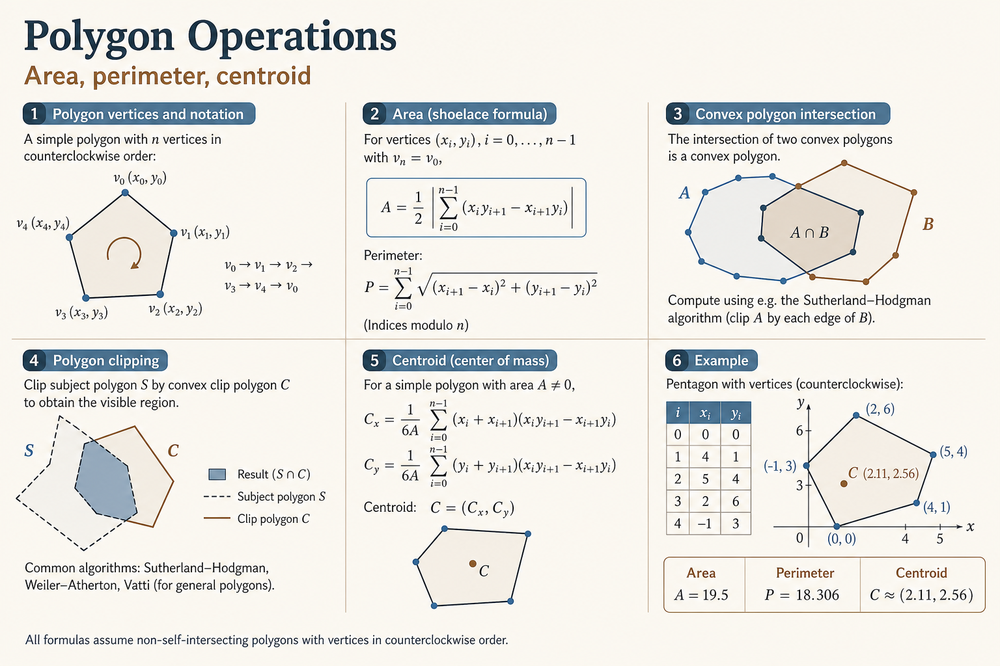
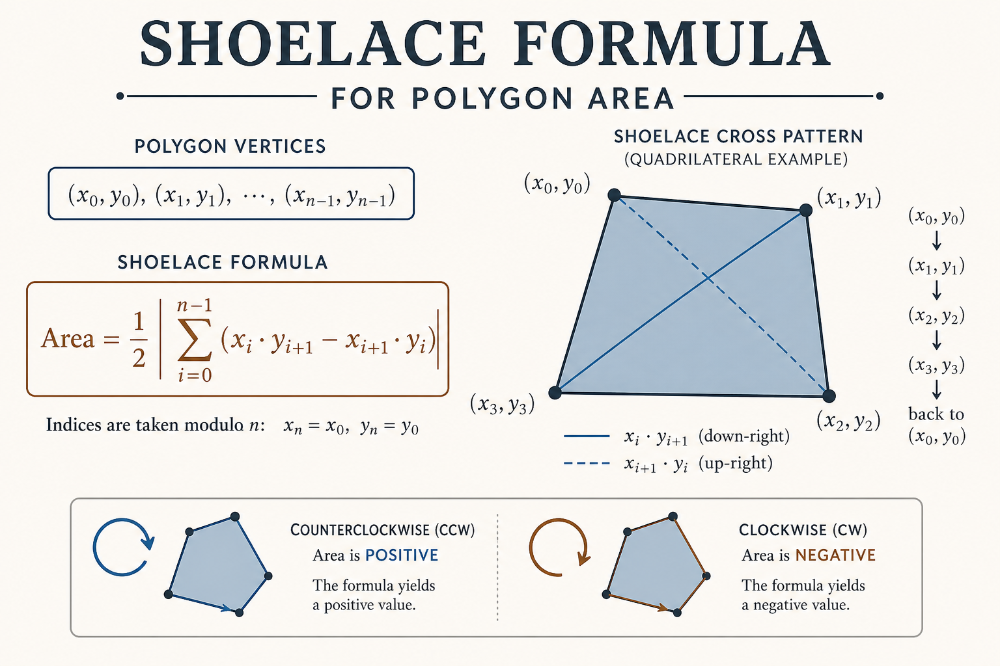
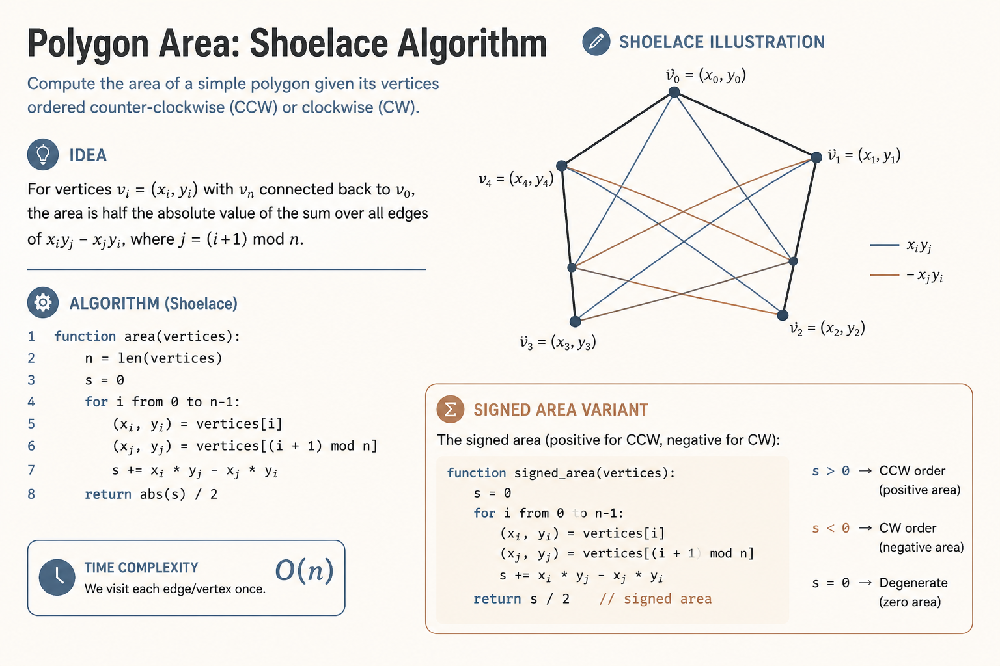
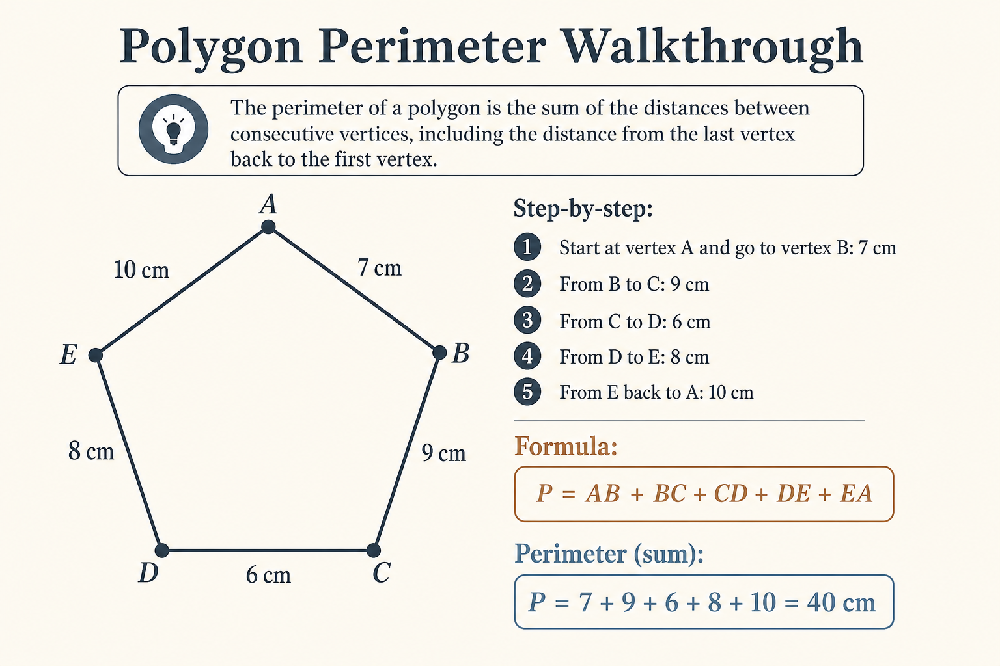
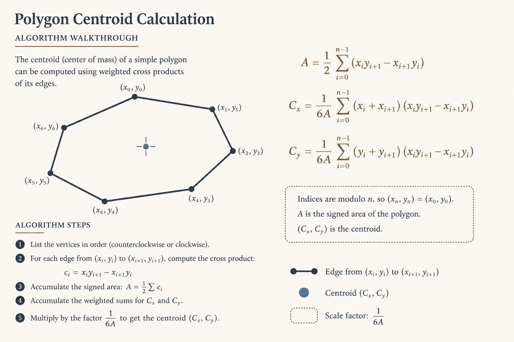
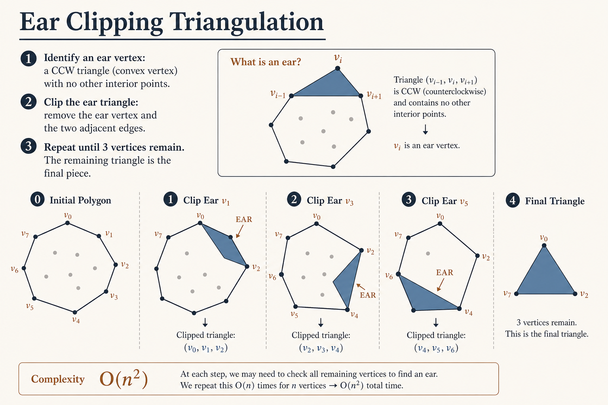
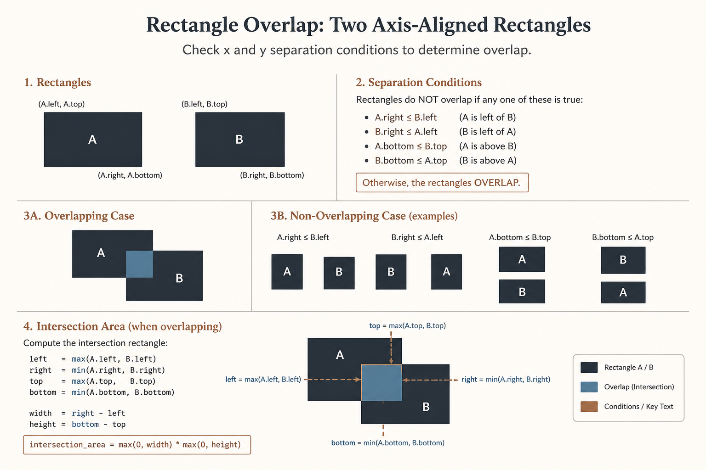

# 🔷 Polygon Operations

### *Area, perimeter, and point-in-polygon tests*

[🏠 Computational Geometry](../README.md)

---

## 📊 Visual Overview

*Shoelace formula for area calculation and ear clipping triangulation*

---

## 🎯 At a Glance

| | |
|:---|:---|
| **In one line** | Polygon operations compute properties and perform transformations on polygons. |
| **Typical time** | O(n) for area, O(n²) for triangulation |
| **Typical space** | O(n) |
| **Topics** | Area, Perimeter, Triangulation, Boolean Operations |

> **How to use this page:** Start with the visual overview, scan **At a Glance**, then work through theory → walkthroughs → code.
## 🧭 Navigation

| ⬅️ Previous | 📂 Current | ➡️ Next |
|:------------|:----------:|--------:|
| [← Polygon Operations](../05_polygon_operations/README.md) | **05. Polygon Operations** | [Closest Pair →](../06_closest_pair/README.md) |

---

---

## 🎯 Overview

Polygon operations compute properties and perform transformations on polygons.

---

## 📐 Mathematical Foundation

### Shoelace Formula (Area)

**For polygon with vertices (x₀, y₀), (x₁, y₁), ..., (xₙ₋₁, yₙ₋₁):**

*Shoelace area formula with signed area (positive CCW, negative CW)*

---

## 💻 Implementations

### 1. Polygon Area (Shoelace Formula)

*Shoelace formula implementation with signed area variant — O(n)*

### 2. Polygon Perimeter

*Sum of edge distances including wrap-around — O(n)*

### 3. Polygon Centroid

*Center of mass using weighted cross products — O(n)*

### 4. Polygon Triangulation (Ear Clipping)

*Identify and clip ear vertices until triangle remains — O(n²)*

### 5. Rectangle Overlap

*Axis-aligned rectangle overlap test and intersection area*

---

## 🧩 LeetCode Problems

| # | Problem | Difficulty |
|---|---------|------------|
| 223 | [Rectangle Area](https://leetcode.com/problems/rectangle-area/) | 🟡 Medium |
| 836 | [Rectangle Overlap](https://leetcode.com/problems/rectangle-overlap/) | 🟢 Easy |
| 850 | [Rectangle Area II](https://leetcode.com/problems/rectangle-area-ii/) | 🔴 Hard |
| 593 | [Valid Square](https://leetcode.com/problems/valid-square/) | 🟡 Medium |

---

## 📚 References & Learning Resources

### 📖 Core Concepts

| Resource | Description | Link |
|----------|-------------|------|
| **Polygon Area** | GeeksforGeeks | [Shoelace formula](https://www.geeksforgeeks.org/area-of-a-polygon-with-given-n-ordered-vertices/) |
| **Computational Geometry** | CP-Algorithms | [Geometry](https://cp-algorithms.com/geometry/) |

### 📝 Practice

| Platform | Focus | Link |
|----------|-------|------|
| **LeetCode** | Geometry tag | [Problems](https://leetcode.com/tag/geometry/) |

---

**Navigation:** [← Point Location](../04_point_location/) | [Next: Closest Pair →](../06_closest_pair/)
