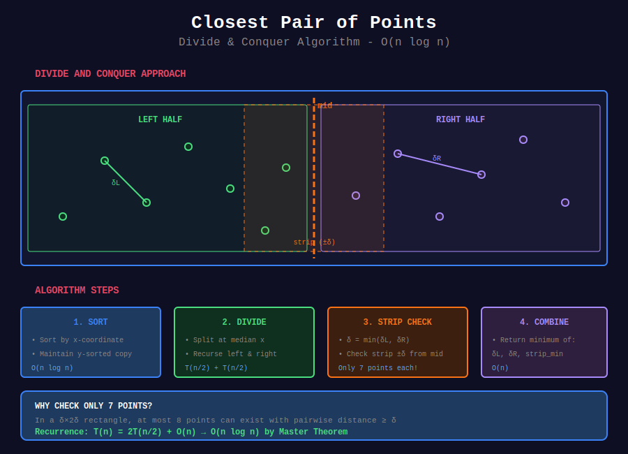

# 🎯 Closest Pair of Points

## 📊 Metadata

- **Difficulty:** 

- **Time Complexity:** O(n log n)

- **Space Complexity:** O(n)

- **Algorithm:** Divide and Conquer

---

## 🎯 Overview

**Problem:** Given n points in 2D plane, find the pair with minimum distance.

**Naive:** O(n²) - check all pairs

**Optimal:** O(n log n) - divide and conquer

---

## 📊 Visual Overview



*Divide and conquer approach with strip optimization*

---

## 📐 Mathematical Foundation

### Divide and Conquer Strategy

```
1. Sort points by x-coordinate
2. Divide into left and right halves
3. Recursively find closest pairs in each half
4. Find closest pair across the dividing line
5. Return minimum of three distances

```

**Key Insight:** Points in the strip near dividing line that could be closer than δ (minimum distance from recursive calls) must be within δ vertically.

---

## 💻 Implementations

### 1. Closest Pair (Divide and Conquer)

```python
def closest_pair(points):
    """
    Find closest pair of points
    
    Time: O(n log n)
    Space: O(n)
    
    Returns: (min_distance, point1, point2)
    """
    # Sort by x-coordinate
    points_x = sorted(points, key=lambda p: p.x)
    # Sort by y-coordinate  
    points_y = sorted(points, key=lambda p: p.y)
    
    return _closest_pair_recursive(points_x, points_y)

def _closest_pair_recursive(px, py):
    """Recursive helper"""
    n = len(px)
    
    # Base case: brute force for small n
    if n <= 3:
        return _brute_force_closest(px)
    
    # Divide
    mid = n // 2
    mid_point = px[mid]
    
    # Split by x-coordinate
    px_left = px[:mid]
    px_right = px[mid:]
    
    # Split py by which side of dividing line
    py_left = [p for p in py if p.x <= mid_point.x]
    py_right = [p for p in py if p.x > mid_point.x]
    
    # Conquer
    dist_left, p1_left, p2_left = _closest_pair_recursive(px_left, py_left)
    dist_right, p1_right, p2_right = _closest_pair_recursive(px_right, py_right)
    
    # Find minimum distance from recursive calls
    if dist_left < dist_right:
        min_dist = dist_left
        p1, p2 = p1_left, p2_left
    else:
        min_dist = dist_right
        p1, p2 = p1_right, p2_right
    
    # Find closest pair across dividing line
    strip_dist, strip_p1, strip_p2 = _closest_split_pair(px, py, mid_point, min_dist)
    
    # Return overall minimum
    if strip_dist < min_dist:
        return strip_dist, strip_p1, strip_p2
    else:
        return min_dist, p1, p2

def _brute_force_closest(points):
    """Brute force for small point sets"""
    min_dist = float('inf')
    p1, p2 = None, None
    n = len(points)
    
    for i in range(n):
        for j in range(i + 1, n):
            dist = points[i].distance(points[j])
            if dist < min_dist:
                min_dist = dist
                p1, p2 = points[i], points[j]
    
    return min_dist, p1, p2

def _closest_split_pair(px, py, mid_point, delta):
    """
    Find closest pair with one point on each side
    
    Key optimization: Only check points within delta of dividing line
    and only check 7 points ahead in strip
    """
    # Build strip of points within delta of dividing line
    strip = [p for p in py if abs(p.x - mid_point.x) < delta]
    
    min_dist = delta
    p1, p2 = None, None
    
    # Check each point with next 7 points in strip
    for i in range(len(strip)):
        for j in range(i + 1, min(i + 8, len(strip))):
            dist = strip[i].distance(strip[j])
            if dist < min_dist:
                min_dist = dist
                p1, p2 = strip[i], strip[j]
    
    return min_dist, p1, p2

```

### 2. K Closest Points to Origin

```python
import heapq

def k_closest_to_origin(points, k):
    """
    LeetCode 973: K Closest Points to Origin
    
    Time: O(n log k) using heap
    Space: O(k)
    
    Returns: k closest points to origin
    """
    # Max heap of size k (negate distances for max heap)
    heap = []
    
    for point in points:
        dist_sq = point.x * point.x + point.y * point.y
        
        if len(heap) < k:
            heapq.heappush(heap, (-dist_sq, point))
        elif dist_sq < -heap[0][0]:
            heapq.heapreplace(heap, (-dist_sq, point))
    
    return [point for _, point in heap]

```

### 3. All Points Within Distance

```python
def points_within_distance(points, center, max_dist):
    """
    Find all points within max_dist of center
    
    Time: O(n)
    Space: O(k) where k = result size
    """
    max_dist_sq = max_dist * max_dist
    result = []
    
    for point in points:
        if point.distance_squared(center) <= max_dist_sq:
            result.append(point)
    
    return result

```

### 4. Farthest Pair (Convex Hull)

```python
def farthest_pair(points):
    """
    Find farthest pair of points
    
    Time: O(n log n) using rotating calipers on convex hull
    Space: O(n)
    
    Note: Farthest pair must be on convex hull
    """
    # Get convex hull
    hull = convex_hull_graham(points)
    
    if len(hull) < 2:
        return None, None, 0
    
    # Brute force on hull points (small number)
    max_dist = 0
    p1, p2 = None, None
    
    for i in range(len(hull)):
        for j in range(i + 1, len(hull)):
            dist = hull[i].distance(hull[j])
            if dist > max_dist:
                max_dist = dist
                p1, p2 = hull[i], hull[j]
    
    return p1, p2, max_dist

```

---

## 🧩 LeetCode Problems

| # | Problem | Difficulty |
|---|---------|------------|
| 973 | [K Closest Points to Origin](https://leetcode.com/problems/k-closest-points-to-origin/) | 🟡 Medium |
| 1030 | [Matrix Cells in Distance Order](https://leetcode.com/problems/matrix-cells-in-distance-order/) | 🟢 Easy |

---

## 💡 Key Insights

### Why O(n log n)?

```
Recurrence: T(n) = 2T(n/2) + O(n)

- Divide: O(1)

- Conquer: 2T(n/2)

- Combine (strip): O(n) - but only check 7 points per point

By Master Theorem: T(n) = O(n log n)

```

### Why Check Only 7 Points?

```
In a δ × 2δ rectangle, at most 8 points can be placed
such that all pairwise distances are ≥ δ

Therefore, need to check at most 7 points ahead in strip

```

### Optimization: Use Squared Distances

```python
# ❌ Slower: Calculate actual distance
if point1.distance(point2) < min_dist:

# ✓ Faster: Use squared distance
if point1.distance_squared(point2) < min_dist_sq:

```

---

**Navigation:** [← Polygon Operations](../05_polygon_operations/) | [Computational Geometry](../README.md) | [Number Theory →](../../30_number_theory/README.md)

