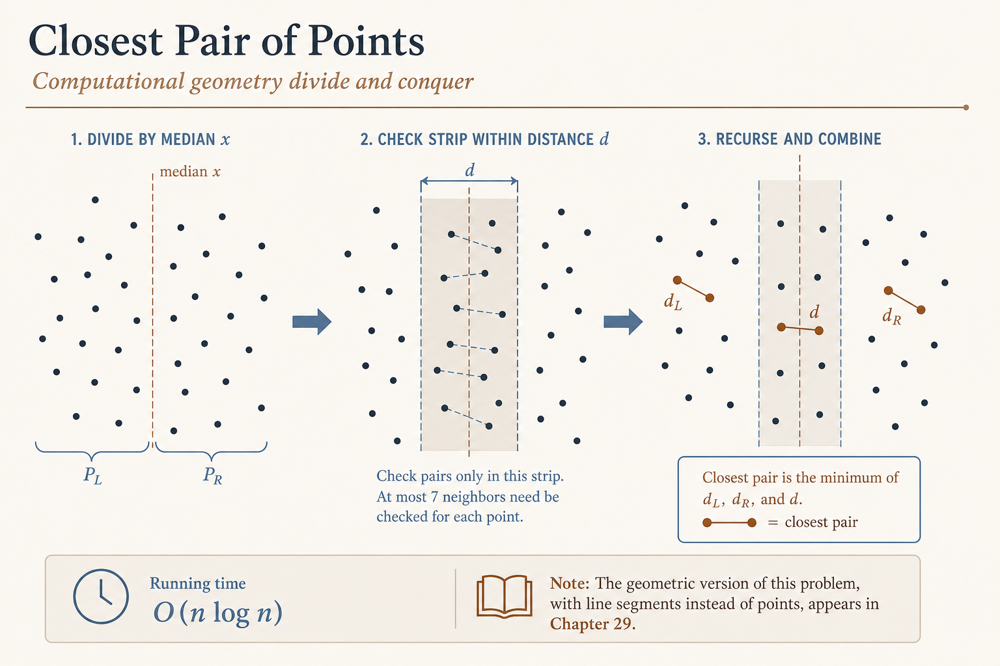
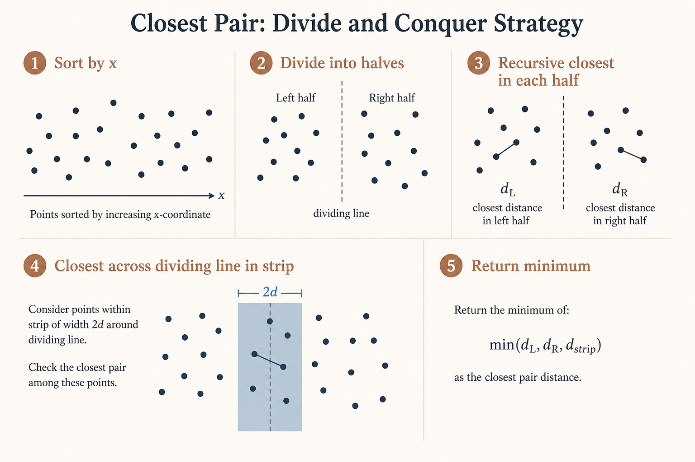
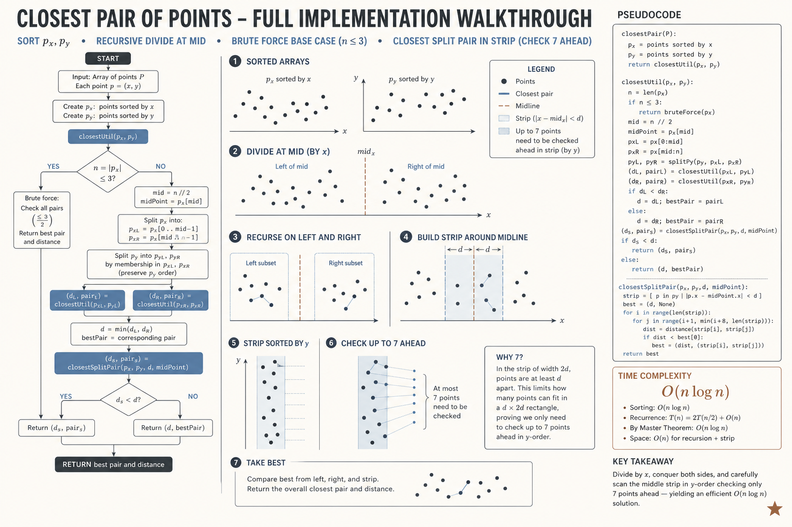
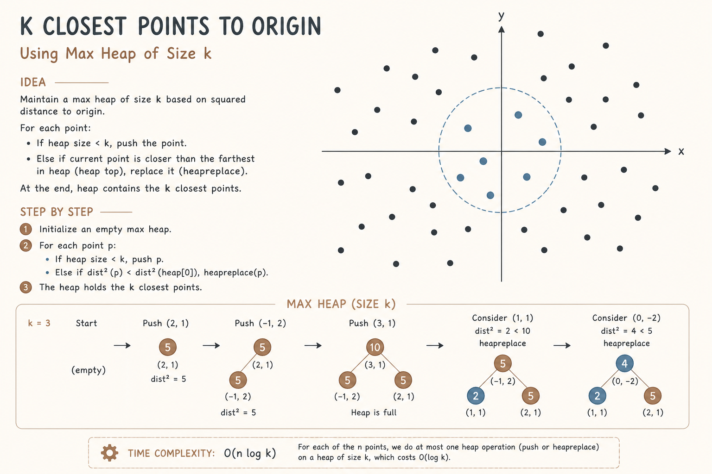
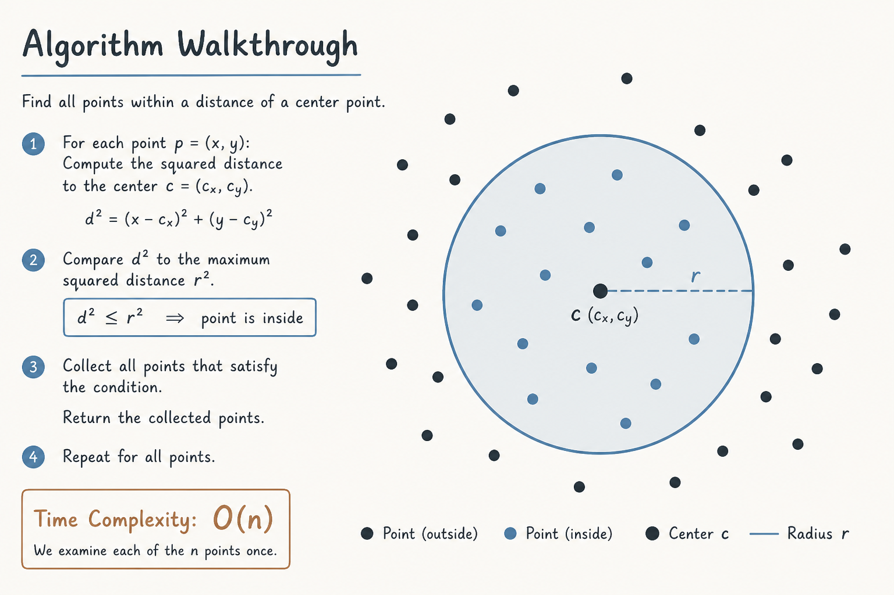
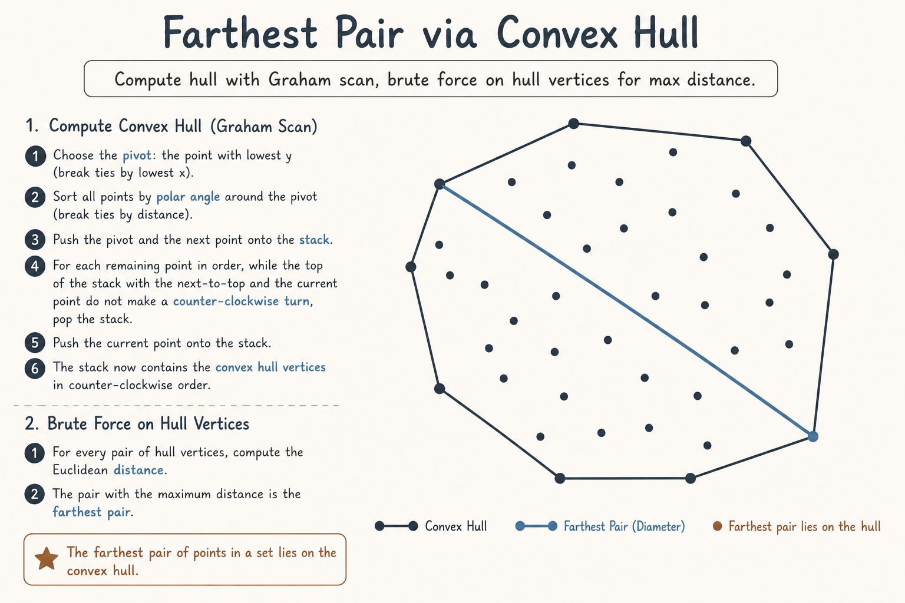
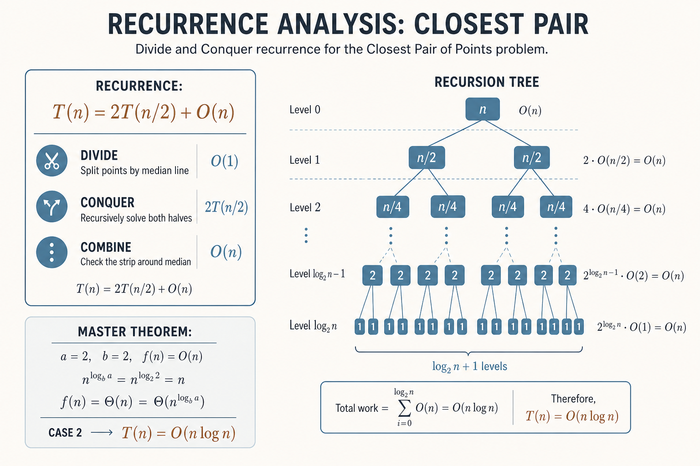
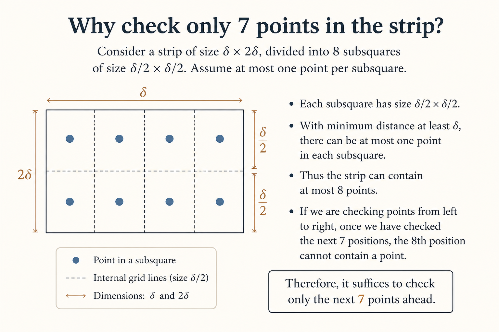

# 🎯 Closest Pair of Points

### *Divide-and-conquer closest pair in O(n log n)*

[🏠 Computational Geometry](../README.md)

---

## 📊 Visual Overview

*Divide and conquer approach with strip optimization*

---

## 🎯 At a Glance

| | |
|:---|:---|
| **In one line** | **Problem:** Given n points in 2D plane, find the pair with minimum distance. |
| **Typical time** | O(n log n) |
| **Typical space** | O(n) |

{: .highlight }
> **How to use this page:** Start with the visual overview, scan **At a Glance**, then work through theory → walkthroughs → code.
## 🧭 Navigation

| ⬅️ Previous | 📂 Current | ➡️ Next |
|:------------|:----------:|--------:|
| [← Closest Pair](../06_closest_pair/README.md) | **06. Closest Pair** | [🏠 Computational Geometry](../README.md) |

---

---

## 🎯 Overview

**Problem:** Given n points in 2D plane, find the pair with minimum distance.

**Naive:** O(n²) - check all pairs

**Optimal:** O(n log n) - divide and conquer

---

## 📐 Mathematical Foundation

### Divide and Conquer Strategy

*Sort, divide, recurse, combine across strip — key insight: strip width δ*

**Key Insight:** Points in the strip near dividing line that could be closer than δ must be within δ vertically.

---

## 💻 Implementations

### 1. Closest Pair (Divide and Conquer)

*Full divide-and-conquer with strip optimization checking 7 ahead — O(n log n)*

### 2. K Closest Points to Origin

*Max heap of size k for LeetCode 973 — O(n log k)*

### 3. All Points Within Distance

*Filter points by distance_squared ≤ max_dist² — O(n)*

### 4. Farthest Pair (Convex Hull)

*Farthest pair on convex hull diameter — O(n log n)*

---

## 🧩 LeetCode Problems

| # | Problem | Difficulty |
|---|---------|------------|
| 973 | [K Closest Points to Origin](https://leetcode.com/problems/k-closest-points-to-origin/) | 🟡 Medium |
| 1030 | [Matrix Cells in Distance Order](https://leetcode.com/problems/matrix-cells-in-distance-order/) | 🟢 Easy |

---

## 💡 Key Insights

### Why O(n log n)?

*T(n) = 2T(n/2) + O(n) — Master Theorem yields O(n log n)*

### Why Check Only 7 Points?

*δ × 2δ rectangle holds at most 8 points with min distance δ*

### Optimization: Use Squared Distances

*Compare distance_squared instead of distance to avoid sqrt*

---

## 📚 References & Learning Resources

### 📖 Core Concepts

| Resource | Description | Link |
|----------|-------------|------|
| **Closest Pair** | CP-Algorithms | [Closest pair](https://cp-algorithms.com/geometry/closest-pair.html) |
| **Divide & Conquer** | GeeksforGeeks | [Closest pair](https://www.geeksforgeeks.org/closest-pair-of-points-onlogn-approach/) |

### 📝 Practice

| Platform | Focus | Link |
|----------|-------|------|
| **LeetCode** | Geometry tag | [Problems](https://leetcode.com/tag/geometry/) |

---

**Navigation:** [← Polygon Operations](../05_polygon_operations/) | [Computational Geometry](../README.md) | [Number Theory →](../../30_number_theory/README.md)
