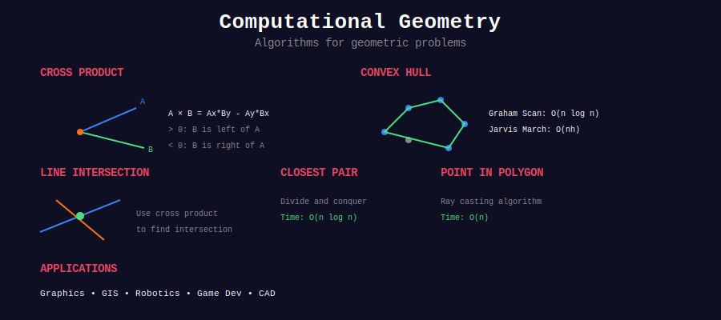
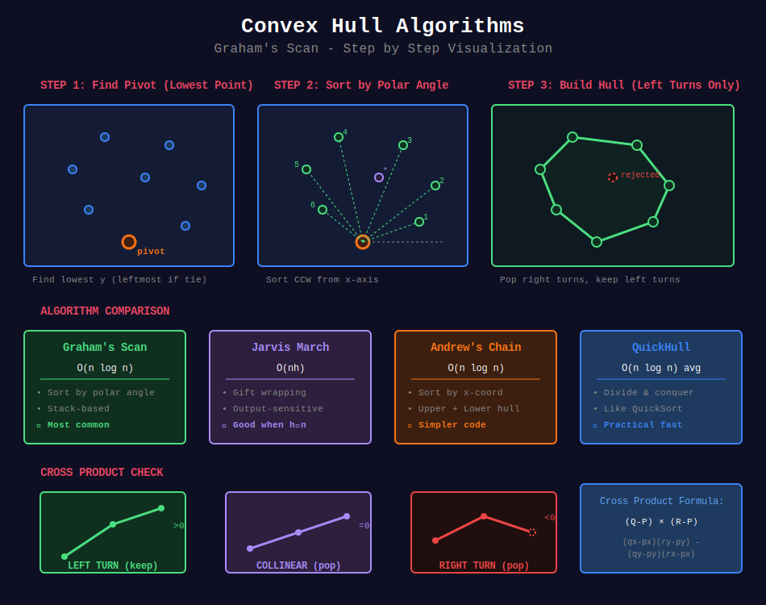

# 📐 Computational Geometry



## 📊 Metadata

- **Difficulty:** 

- **Subtopics:** 6
- **Problems:** 50+

- **Prerequisites:** Linear algebra, Vectors, Coordinate geometry

---

## 🧭 Navigation

| ⬅️ Previous | 📂 Current | ➡️ Next |
|:------------|:----------:|--------:|
| [← String Algorithms](../28_string_algorithms/README.md) | **Computational Geometry** | [Number Theory →](../30_number_theory/README.md) |

---

## 📂 Subtopics

<table>
<tr>
<td width="33%">

### [01. Geometric Primitives](./01_geometric_primitives/)

- Points, vectors, lines

- Cross product, dot product

- Orientation tests

- Distance calculations

</td>
<td width="33%">

### [02. Convex Hull](./02_convex_hull/)

- Graham's Scan

- Jarvis March

- QuickHull

- Andrew's Algorithm

</td>
<td width="33%">

### [03. Line Intersection](./03_line_intersection/)

- Segment intersection

- Bentley-Ottmann

- Sweep line algorithm

</td>
</tr>
<tr>
<td width="33%">

### [04. Point Location](./04_point_location/)

- Point in polygon

- Point in triangle

- Winding number

- Ray casting

</td>
<td width="33%">

### [05. Polygon Operations](./05_polygon_operations/)

- Area calculation

- Triangulation

- Boolean operations

- Minkowski sum

</td>
<td width="33%">

### [06. Closest Pair](./06_closest_pair/)

- Divide & conquer

- Sweep line approach

- Voronoi diagram

</td>
</tr>
</table>

---

## 📊 Visual Overview



*Overview of computational geometry concepts and algorithms*

---

## 📋 Overview

**Computational Geometry** studies algorithms for geometric problems, combining mathematics and computer science:

- **Geometric Primitives:** Fundamental operations on points, lines, and shapes

- **Convex Hull:** Finding smallest convex polygon containing all points

- **Intersections:** Detecting and computing intersections of geometric objects

- **Point Location:** Determining spatial relationships between points and regions

- **Polygon Operations:** Computing properties and transformations of polygons

- **Proximity:** Finding closest pairs and nearest neighbors

---

## 🎯 Quick Reference

### Algorithm Complexity

| Problem | Algorithm | Time | Space |
|---------|-----------|:----:|:-----:|
| **Convex Hull** | Graham's Scan | O(n log n) | O(n) |
| **Convex Hull** | Jarvis March | O(nh) | O(1) |
| **Line Intersection** | Sweep Line | O((n+k) log n) | O(n) |
| **Point in Polygon** | Ray Casting | O(n) | O(1) |
| **Closest Pair** | Divide & Conquer | O(n log n) | O(n) |
| **Polygon Area** | Shoelace Formula | O(n) | O(1) |
| **Triangulation** | Ear Clipping | O(n²) | O(n) |

**Legend:** n = number of points/vertices, h = hull size, k = intersections

---

## 📐 Key Concepts

### 1️⃣ Cross Product

**Definition:** For vectors **u** = (u_x, u_y) and **v** = (v_x, v_y):

```
u × v = u_x · v_y - u_y · v_x

Geometric interpretation:

- Magnitude: |u × v| = area of parallelogram formed by u and v

- Sign: determines relative orientation
  > 0: v is counter-clockwise from u
  = 0: u and v are collinear
  < 0: v is clockwise from u

```

**Applications:**

- Orientation test

- Convex hull construction

- Line intersection detection

- Area calculations

---

### 2️⃣ Dot Product

**Definition:** For vectors **u** and **v**:

```
u · v = u_x · v_x + u_y · v_y
     = |u| · |v| · cos(θ)

where θ is angle between vectors

Properties:

- u · v > 0: acute angle (< 90°)

- u · v = 0: perpendicular (90°)

- u · v < 0: obtuse angle (> 90°)

```

**Applications:**

- Angle calculations

- Projection

- Perpendicularity testing

- Distance to line

---

### 3️⃣ Orientation Test

**Problem:** Given three points P, Q, R, determine their orientation.

**Formula:**

```
orientation(P, Q, R) = sign((Q - P) × (R - P))
                     = sign((Q.x - P.x)(R.y - P.y) - (Q.y - P.y)(R.x - P.x))

Result:
  > 0: Counter-clockwise (left turn)
  = 0: Collinear (no turn)
  < 0: Clockwise (right turn)

```

**Visual:**

```
    R
   /
  /
 Q----P    CCW: positive

 P----Q
  \
   \
    R     CW: negative

```

---

### 4️⃣ Line Segment Intersection

**Problem:** Do segments AB and CD intersect?

**Necessary conditions:**

1. Orientation test: A, B must be on opposite sides of line CD

2. Orientation test: C, D must be on opposite sides of line AB

**Formula:**

```
Segments intersect if:
  orientation(A, B, C) · orientation(A, B, D) < 0
  AND
  orientation(C, D, A) · orientation(C, D, B) < 0

Special case: Collinear segments require bounding box check

```

---

### 5️⃣ Point in Polygon

**Ray Casting Algorithm:**

```
Cast ray from point to infinity
Count intersections with polygon edges
Odd count → inside
Even count → outside

Mathematical basis: Jordan Curve Theorem

```

**Winding Number:**

```
Sum of signed angles from point to each edge
Non-zero → inside
Zero → outside

More robust for complex polygons

```

---

## 💻 Essential Implementations

### Geometric Primitives

```python
from math import sqrt, atan2, pi

class Point:
    """2D Point representation"""
    
    def __init__(self, x, y):
        self.x = x
        self.y = y
    
    def __sub__(self, other):
        """Vector from other to self"""
        return Point(self.x - other.x, self.y - other.y)
    
    def __repr__(self):
        return f"Point({self.x}, {self.y})"
    
    def distance(self, other):
        """Euclidean distance"""
        dx = self.x - other.x
        dy = self.y - other.y
        return sqrt(dx * dx + dy * dy)
    
    def distance_squared(self, other):
        """Squared distance (avoids sqrt for comparisons)"""
        dx = self.x - other.x
        dy = self.y - other.y
        return dx * dx + dy * dy

def cross_product(o, a, b):
    """
    Cross product of vectors OA and OB
    
    Returns: (A - O) × (B - O)
    
    Positive: B is counter-clockwise from A
    Zero: O, A, B are collinear
    Negative: B is clockwise from A
    """
    return (a.x - o.x) * (b.y - o.y) - (a.y - o.y) * (b.x - o.x)

def dot_product(u, v):
    """
    Dot product of vectors u and v
    
    Returns: u · v
    """
    return u.x * v.x + u.y * v.y

def orientation(p, q, r):
    """
    Find orientation of ordered triplet (p, q, r)
    
    Returns:
     1: Counter-clockwise
     0: Collinear
    -1: Clockwise
    """
    val = cross_product(p, q, r)
    
    if abs(val) < 1e-9:  # Epsilon for floating point
        return 0
    
    return 1 if val > 0 else -1

```

### Convex Hull (Graham's Scan)

```python
def convex_hull_graham(points):
    """
    Compute convex hull using Graham's Scan
    
    Time: O(n log n)
    Space: O(n)
    
    Returns: List of points on convex hull in counter-clockwise order
    """
    n = len(points)
    if n < 3:
        return points
    
    # Find bottom-most point (or leftmost if tie)
    start = min(points, key=lambda p: (p.y, p.x))
    
    # Sort points by polar angle with respect to start point
    def polar_angle_key(p):
        if p == start:
            return -pi, 0
        angle = atan2(p.y - start.y, p.x - start.x)
        dist = start.distance_squared(p)
        return angle, dist
    
    sorted_points = sorted(points, key=polar_angle_key)
    
    # Build convex hull
    hull = []
    
    for p in sorted_points:
        # Remove points that make clockwise turn
        while len(hull) >= 2 and cross_product(hull[-2], hull[-1], p) <= 0:
            hull.pop()
        
        hull.append(p)
    
    return hull

```

### Line Segment Intersection

```python
def segments_intersect(p1, q1, p2, q2):
    """
    Check if line segments (p1, q1) and (p2, q2) intersect
    
    Time: O(1)
    Space: O(1)
    
    Returns: True if segments intersect
    """
    def on_segment(p, q, r):
        """Check if point q lies on segment pr (given collinear)"""
        return (min(p.x, r.x) <= q.x <= max(p.x, r.x) and
                min(p.y, r.y) <= q.y <= max(p.y, r.y))
    
    o1 = orientation(p1, q1, p2)
    o2 = orientation(p1, q1, q2)
    o3 = orientation(p2, q2, p1)
    o4 = orientation(p2, q2, q1)
    
    # General case: different orientations
    if o1 != o2 and o3 != o4:
        return True
    
    # Special cases: collinear points
    if o1 == 0 and on_segment(p1, p2, q1):
        return True
    if o2 == 0 and on_segment(p1, q2, q1):
        return True
    if o3 == 0 and on_segment(p2, p1, q2):
        return True
    if o4 == 0 and on_segment(p2, q1, q2):
        return True
    
    return False

```

### Point in Polygon (Ray Casting)

```python
def point_in_polygon(point, polygon):
    """
    Check if point is inside polygon using ray casting
    
    Time: O(n) where n = number of vertices
    Space: O(1)
    
    Returns: True if point is inside polygon
    """
    n = len(polygon)
    inside = False
    
    p1 = polygon[0]
    
    for i in range(1, n + 1):
        p2 = polygon[i % n]
        
        # Check if point is on same horizontal level as edge
        if point.y > min(p1.y, p2.y):
            if point.y <= max(p1.y, p2.y):
                if point.x <= max(p1.x, p2.x):
                    # Compute x-intersection of ray with edge
                    if p1.y != p2.y:
                        x_intersection = (point.y - p1.y) * (p2.x - p1.x) / (p2.y - p1.y) + p1.x
                    
                    if p1.x == p2.x or point.x <= x_intersection:
                        inside = not inside
        
        p1 = p2
    
    return inside

```

---

## 🗂️ Topics Covered

This section contains **50+ problems** across **6 categories**:

1. **[Geometric Primitives](./01_geometric_primitives/)** (10 problems)
   - Vector operations
   - Distance calculations
   - Orientation tests
   - Angle computations

2. **[Convex Hull](./02_convex_hull/)** (8 problems)
   - Graham's Scan
   - Jarvis March
   - QuickHull
   - Applications

3. **[Line Intersection](./03_line_intersection/)** (9 problems)
   - Segment intersection
   - Sweep line algorithms
   - Bentley-Ottmann

4. **[Point Location](./04_point_location/)** (8 problems)
   - Point in polygon
   - Point in circle
   - Spatial queries

5. **[Polygon Operations](./05_polygon_operations/)** (10 problems)
   - Area calculation
   - Perimeter
   - Triangulation
   - Boolean operations

6. **[Closest Pair](./06_closest_pair/)** (7 problems)
   - Brute force
   - Divide & conquer
   - Sweep line

---

## 📊 Complexity Summary

| Category | Typical Time | Space | Best Algorithm |
|----------|:------------:|:-----:|----------------|
| **Convex Hull** | O(n log n) | O(n) | Graham's Scan |
| **Point in Polygon** | O(n) | O(1) | Ray Casting |
| **Closest Pair** | O(n log n) | O(n) | Divide & Conquer |
| **Line Intersection** | O(n log n) | O(n) | Sweep Line |
| **Polygon Area** | O(n) | O(1) | Shoelace Formula |
| **Triangulation** | O(n²) | O(n) | Ear Clipping |

---

## 💡 Key Insights

### Floating Point Precision

**Problem:** Floating point comparisons are inexact.

**Solution:** Use epsilon for equality checks

```python
EPS = 1e-9

def equals(a, b):
    return abs(a - b) < EPS

def compare(a, b):
    if abs(a - b) < EPS:
        return 0
    return 1 if a > b else -1

```

### Cross Product Sign

```
Positive: Counter-clockwise turn (left turn)
Zero: Collinear (straight)
Negative: Clockwise turn (right turn)

Key for: Convex hull, orientation tests, polygon winding

```

### Degeneracies

**Handle special cases:**

- Collinear points

- Duplicate points

- Vertical lines

- Zero-length segments

- Self-intersecting polygons

### Coordinate System

```
Standard: Origin at bottom-left, y increases upward
Screen: Origin at top-left, y increases downward

Convert when needed for graphics applications

```

---

## 🧭 Navigation

| ⬅️ Previous | 📂 Current | ➡️ Next |
|:------------|:----------:|--------:|
| [← String Algorithms](../28_string_algorithms/README.md) | **Computational Geometry** | [Number Theory →](../30_number_theory/README.md) |

---

## 🗺️ Subtopic Navigation

1. [Geometric Primitives →](./01_geometric_primitives/)

2. [Convex Hull →](./02_convex_hull/)

3. [Line Intersection →](./03_line_intersection/)

4. [Point Location →](./04_point_location/)

5. [Polygon Operations →](./05_polygon_operations/)

6. [Closest Pair →](./06_closest_pair/)
