

# 📐 Computational Geometry

### *Points, lines, polygons — algorithms on the plane*

  
  

---

## 📊 Visual Overview

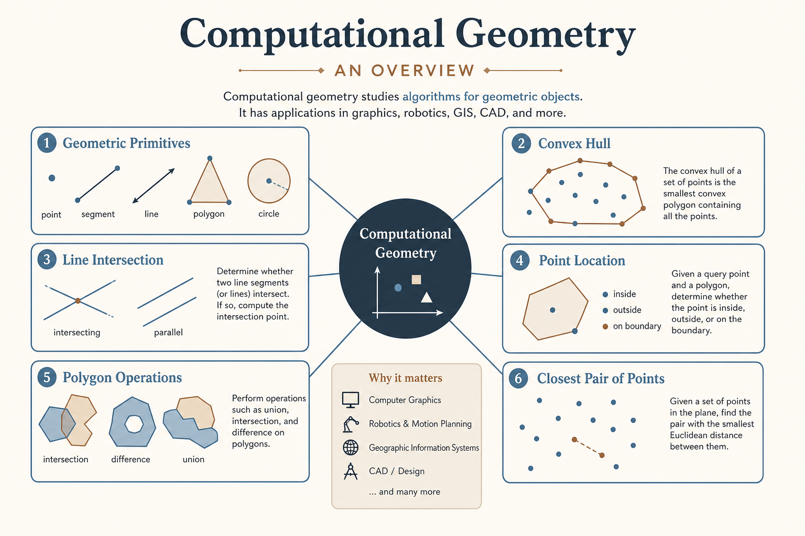

*Computational Geometry Overview*

---

## 🎯 At a Glance

| | |
|:---|:---|
| **Subtopics** | 6 |
| **Problems** | 50+ |
| **Prerequisites** | Linear algebra, Vectors, Coordinate geometry |

> **How to use this page:** Start with the visual overview, scan **At a Glance**, then work through theory → walkthroughs → code.

---

## 🧭 Navigation

| ⬅️ Previous | 📂 Current | ➡️ Next |
|:------------|:----------:|--------:|
| [← String Algorithms](../28_string_algorithms/README.md) | **Computational Geometry** | [Number Theory →](../30_number_theory/README.md) |

---

## 📂 Subtopics

<table>
<tr>
<td width="33%">

### [01. Geometric Primitives](./01_geometric_primitives/)

- Points, vectors, lines

- Cross product, dot product

- Orientation tests

- Distance calculations

</td>
<td width="33%">

### [02. Convex Hull](./02_convex_hull/)

- Graham's Scan

- Jarvis March

- QuickHull

- Andrew's Algorithm

</td>
<td width="33%">

### [03. Line Intersection](./03_line_intersection/)

- Segment intersection

- Bentley-Ottmann

- Sweep line algorithm

</td>
</tr>
<tr>
<td width="33%">

### [04. Point Location](./04_point_location/)

- Point in polygon

- Point in triangle

- Winding number

- Ray casting

</td>
<td width="33%">

### [05. Polygon Operations](./05_polygon_operations/)

- Area calculation

- Triangulation

- Boolean operations

- Minkowski sum

</td>
<td width="33%">

### [06. Closest Pair](./06_closest_pair/)

- Divide & conquer

- Sweep line approach

- Voronoi diagram

</td>
</tr>
</table>

---

## 📐 Key Concepts

### 1️⃣ Cross Product

**Definition:** For vectors **u** = (u_x, u_y) and **v** = (v_x, v_y):

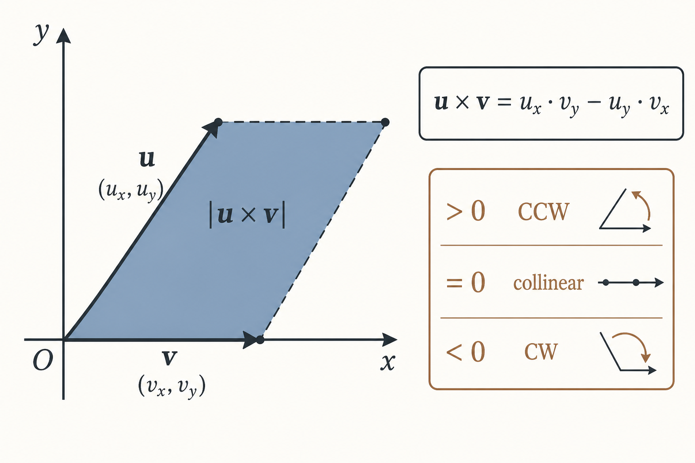

*Cross product formula, parallelogram area, and orientation sign*

**Applications:**

- Orientation test

- Convex hull construction

- Line intersection detection

- Area calculations

---

### 2️⃣ Dot Product

**Definition:** For vectors **u** and **v**:

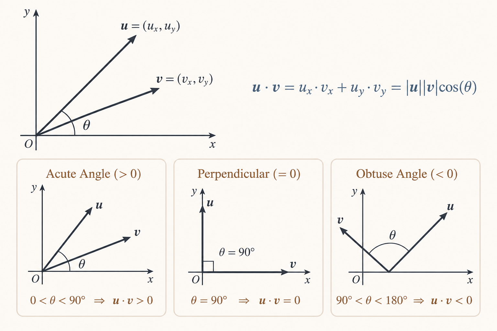

*Dot product formula, angle relationship, and sign properties*

**Applications:**

- Angle calculations

- Projection

- Perpendicularity testing

- Distance to line

---

### 3️⃣ Orientation Test

**Problem:** Given three points P, Q, R, determine their orientation.

**Formula and visualization:**

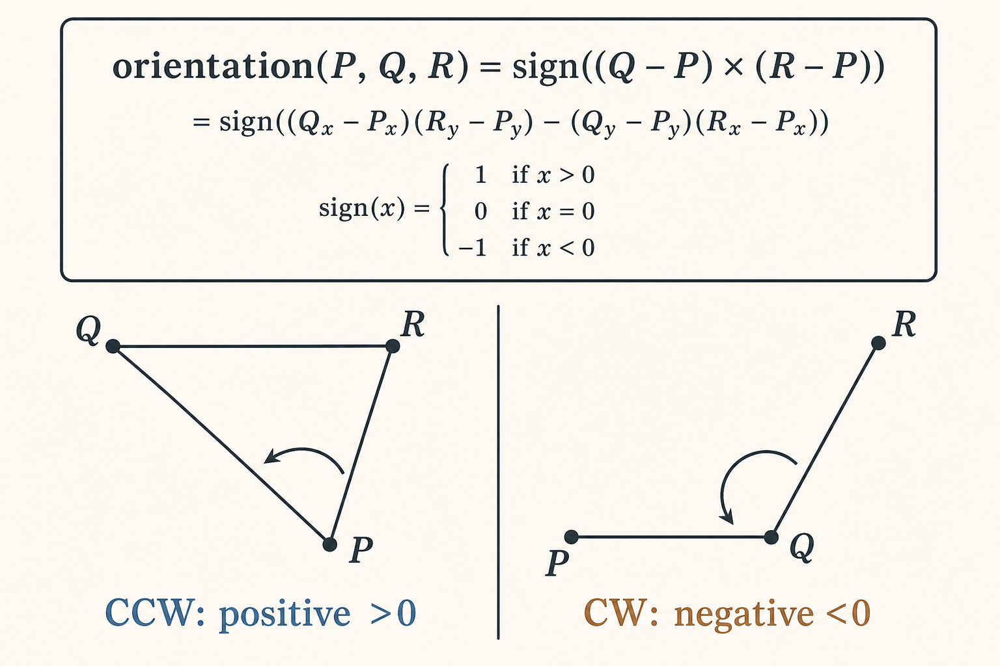

*Orientation formula with CCW (positive) and CW (negative) turn examples*

---

### 4️⃣ Line Segment Intersection

**Problem:** Do segments AB and CD intersect?

**Necessary conditions:**

1. Orientation test: A, B must be on opposite sides of line CD

2. Orientation test: C, D must be on opposite sides of line AB

**Formula:**

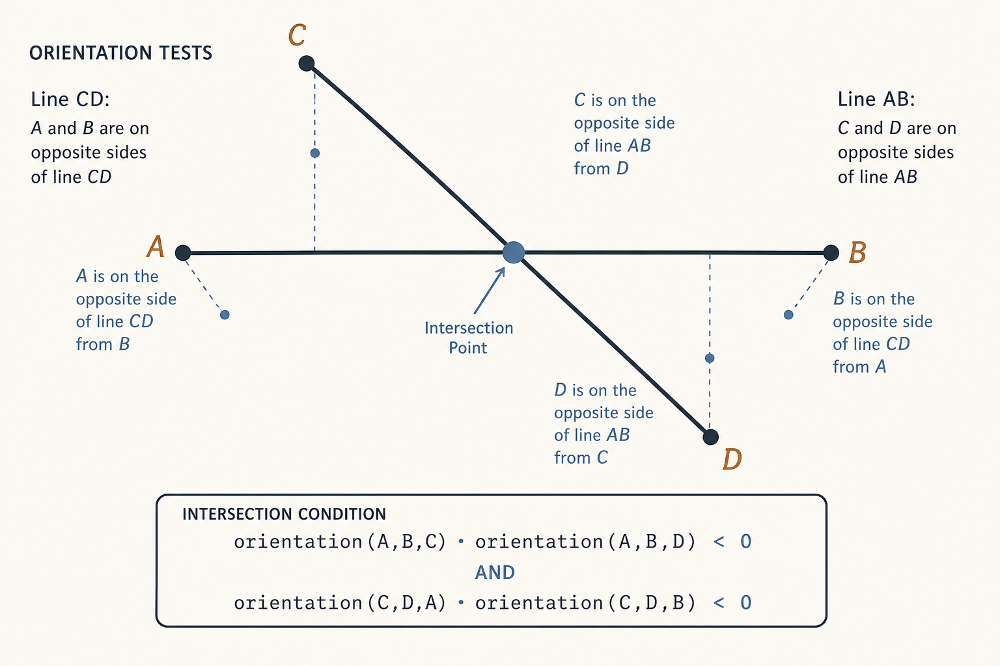

*Orientation-based segment intersection test with collinear special case*

---

### 5️⃣ Point in Polygon

**Ray Casting Algorithm:**

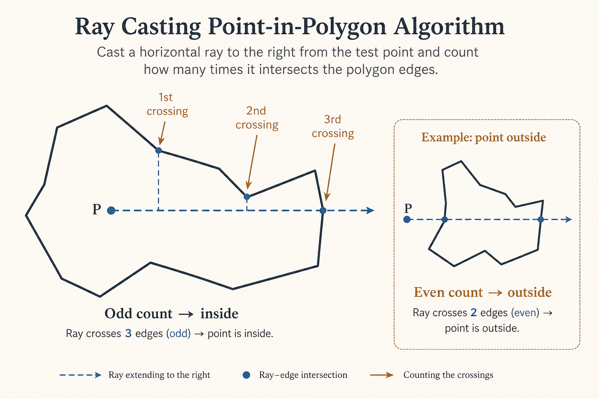

*Cast ray from point, count edge crossings — odd = inside (Jordan Curve Theorem)*

**Winding Number:**

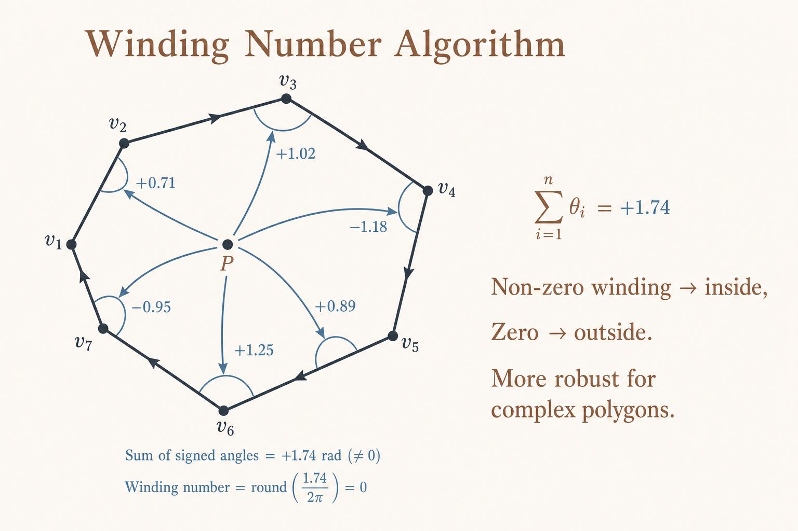

*Sum of signed angles — non-zero = inside; more robust for complex polygons*

---

## 🎨 Convex Hull Preview

*Overview of computational geometry concepts and algorithms*

---

## 📋 Overview

**Computational Geometry** studies algorithms for geometric problems, combining mathematics and computer science:

- **Geometric Primitives:** Fundamental operations on points, lines, and shapes

- **Convex Hull:** Finding smallest convex polygon containing all points

- **Intersections:** Detecting and computing intersections of geometric objects

- **Point Location:** Determining spatial relationships between points and regions

- **Polygon Operations:** Computing properties and transformations of polygons

- **Proximity:** Finding closest pairs and nearest neighbors

---

## 🎯 Quick Reference

### Algorithm Complexity

| Problem | Algorithm | Time | Space |
|---------|-----------|:----:|:-----:|
| **Convex Hull** | Graham's Scan | O(n log n) | O(n) |
| **Convex Hull** | Jarvis March | O(nh) | O(1) |
| **Line Intersection** | Sweep Line | O((n+k) log n) | O(n) |
| **Point in Polygon** | Ray Casting | O(n) | O(1) |
| **Closest Pair** | Divide & Conquer | O(n log n) | O(n) |
| **Polygon Area** | Shoelace Formula | O(n) | O(1) |
| **Triangulation** | Ear Clipping | O(n²) | O(n) |

**Legend:** n = number of points/vertices, h = hull size, k = intersections

---

## 💻 Essential Implementations

### Geometric Primitives

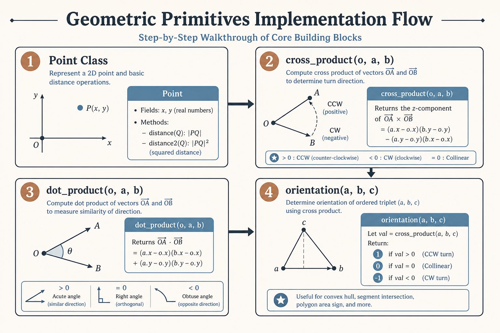

*Point class, cross product, dot product, and orientation test walkthrough*

### Convex Hull (Graham's Scan)

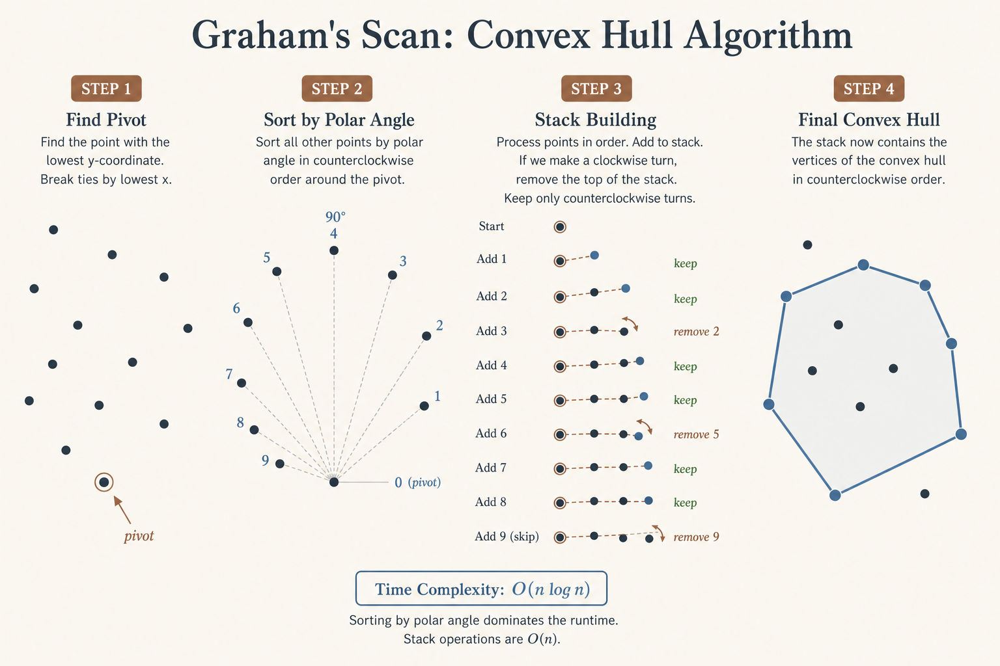

*Pivot selection, polar angle sorting, and stack-based hull construction*

### Line Segment Intersection

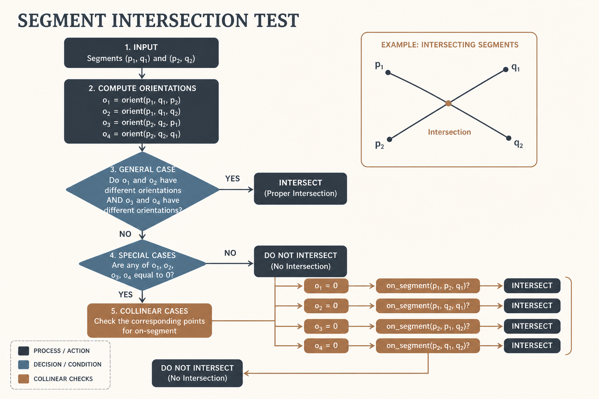

*Orientation-based intersection test with collinear edge cases*

### Point in Polygon (Ray Casting)

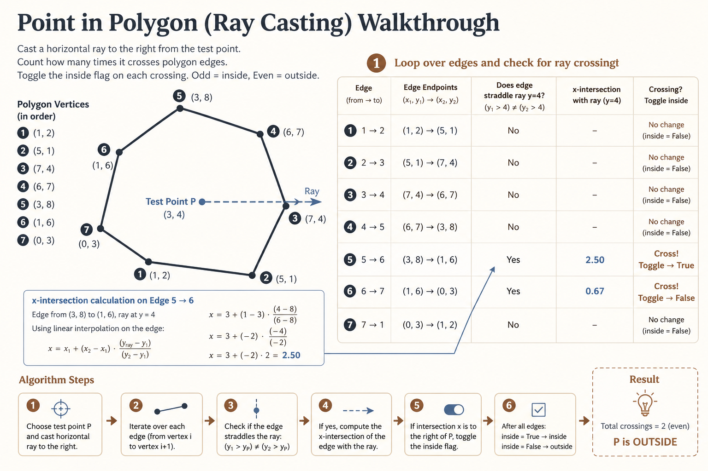

*Ray casting algorithm with horizontal ray edge crossing logic*

---

## 🗂️ Topics Covered

This section contains **50+ problems** across **6 categories**:

1. **[Geometric Primitives](./01_geometric_primitives/)** (10 problems)
   - Vector operations
   - Distance calculations
   - Orientation tests
   - Angle computations

2. **[Convex Hull](./02_convex_hull/)** (8 problems)
   - Graham's Scan
   - Jarvis March
   - QuickHull
   - Applications

3. **[Line Intersection](./03_line_intersection/)** (9 problems)
   - Segment intersection
   - Sweep line algorithms
   - Bentley-Ottmann

4. **[Point Location](./04_point_location/)** (8 problems)
   - Point in polygon
   - Point in circle
   - Spatial queries

5. **[Polygon Operations](./05_polygon_operations/)** (10 problems)
   - Area calculation
   - Perimeter
   - Triangulation
   - Boolean operations

6. **[Closest Pair](./06_closest_pair/)** (7 problems)
   - Brute force
   - Divide & conquer
   - Sweep line

---

## 📊 Complexity Summary

| Category | Typical Time | Space | Best Algorithm |
|----------|:------------:|:-----:|----------------|
| **Convex Hull** | O(n log n) | O(n) | Graham's Scan |
| **Point in Polygon** | O(n) | O(1) | Ray Casting |
| **Closest Pair** | O(n log n) | O(n) | Divide & Conquer |
| **Line Intersection** | O(n log n) | O(n) | Sweep Line |
| **Polygon Area** | O(n) | O(1) | Shoelace Formula |
| **Triangulation** | O(n²) | O(n) | Ear Clipping |

---

## 💡 Key Insights

### Floating Point Precision

**Problem:** Floating point comparisons are inexact.

**Solution:** Use epsilon for equality checks

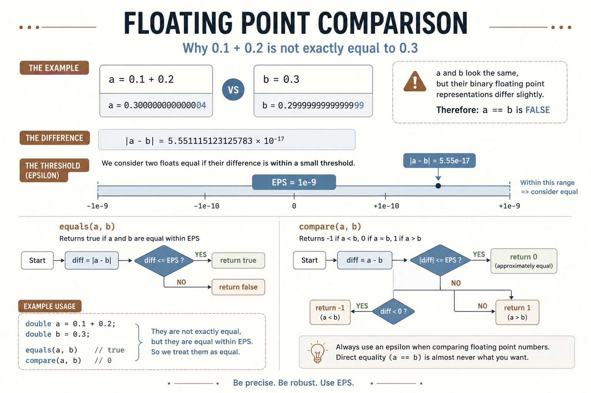

*EPS-based equals/compare functions for reliable floating point comparisons*

### Cross Product Sign

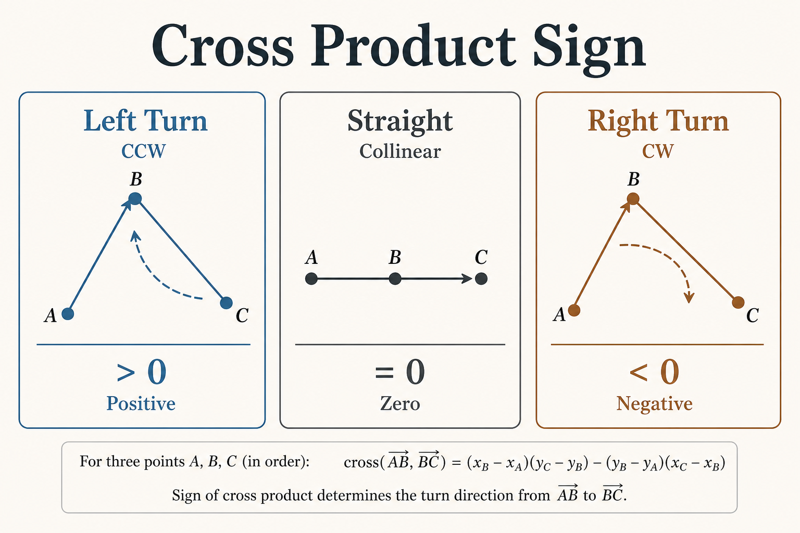

*Positive = CCW left turn, zero = collinear, negative = CW right turn*

### Degeneracies

**Handle special cases:**

- Collinear points

- Duplicate points

- Vertical lines

- Zero-length segments

- Self-intersecting polygons

### Coordinate System

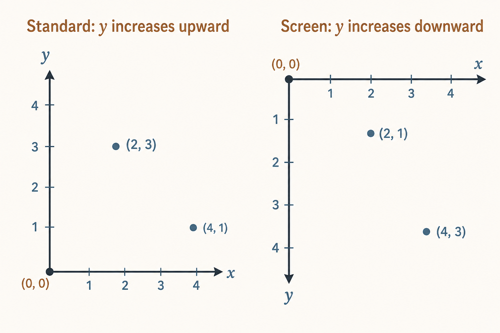

*Standard math coordinates (y up) vs screen coordinates (y down)*

---

## 🗺️ Subtopic Navigation

1. [Geometric Primitives →](./01_geometric_primitives/)

2. [Convex Hull →](./02_convex_hull/)

3. [Line Intersection →](./03_line_intersection/)

4. [Point Location →](./04_point_location/)

5. [Polygon Operations →](./05_polygon_operations/)

6. [Closest Pair →](./06_closest_pair/)

---

## 🏆 LeetCode Problems

### 🟢 Easy

| # | Problem | Pattern | Time | Space |
|:-:|---------|---------|:----:|:-----:|
| 223 | [Rectangle Area](https://leetcode.com/problems/rectangle-area/) | Area formula | O(1) | O(1) |
| 836 | [Rectangle Overlap](https://leetcode.com/problems/rectangle-overlap/) | Interval check | O(1) | O(1) |
| 1030 | [Matrix Cells in Distance Order](https://leetcode.com/problems/matrix-cells-in-distance-order/) | Sort by dist | O(n² log n) | O(n²) |

### 🟡 Medium

| # | Problem | Pattern | Time | Space |
|:-:|---------|---------|:----:|:-----:|
| 587 | [Erect the Fence](https://leetcode.com/problems/erect-the-fence/) | Convex hull | O(n log n) | O(n) |
| 149 | [Max Points on a Line](https://leetcode.com/problems/max-points-on-a-line/) | Hash slopes | O(n²) | O(n) |
| 356 | [Line Reflection](https://leetcode.com/problems/line-reflection/) | Hash midpoints | O(n) | O(n) |
| 939 | [Minimum Area Rectangle](https://leetcode.com/problems/minimum-area-rectangle/) | Hash diagonals | O(n²) | O(n) |

### 🔴 Hard

| # | Problem | Pattern | Time | Space |
|:-:|---------|---------|:----:|:-----:|
| 218 | [The Skyline Problem](https://leetcode.com/problems/the-skyline-problem/) | Sweep line | O(n log n) | O(n) |
| 850 | [Rectangle Area II](https://leetcode.com/problems/rectangle-area-ii/) | Coordinate compression | O(n² log n) | O(n) |
| 391 | [Perfect Rectangle](https://leetcode.com/problems/perfect-rectangle/) | Corner counting | O(n) | O(n) |
| 972 | [Equal Rational Numbers](https://leetcode.com/problems/equal-rational-numbers/) | Fraction compare | O(log n) | O(1) |

---

## 📚 References & Learning Resources

### 📖 Core Concepts

| Resource | Description | Link |
|----------|-------------|------|
| **Computational Geometry** | CP-Algorithms | [Geometry](https://cp-algorithms.com/geometry/) |
| **Convex Hull** | GeeksforGeeks | [Graham scan](https://www.geeksforgeeks.org/convex-hull-algorithm/) |

### 📝 Practice

| Platform | Focus | Link |
|----------|-------|------|
| **LeetCode** | Geometry tag | [Problems](https://leetcode.com/tag/geometry/) |

---
