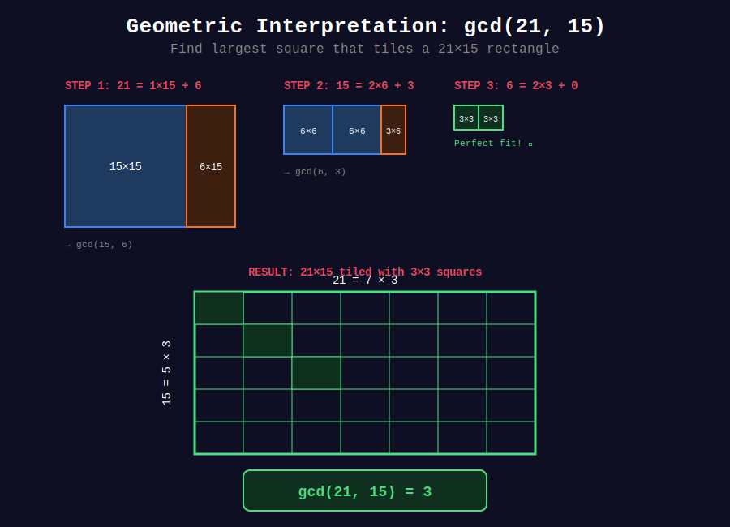

<div align="center">

# 🔄 Euclidean Algorithm

<p>
  
  
</p>

**The Ancient Algorithm That Changed Mathematics**

*300 BC - Still the fastest way to compute GCD*

</div>

---

## 🧭 Navigation

| ⬅️ Previous | 📂 Current | ➡️ Next |
|:------------|:----------:|--------:|
| [🏠 GCD & LCM Home](../README.md) | **01. Euclidean Algorithm** | [02. Extended GCD →](../02_extended_gcd/README.md) |

---

## 📐 Mathematical Foundations

### 1️⃣ The Fundamental Theorem

**Euclidean Algorithm Theorem:**

$$
\gcd(a, b) = \gcd(b, a \bmod b)
$$

**Base Case:**

$$
\gcd(a, 0) = a
$$

**Proof:**
Let $d = \gcd(a, b)$. Then:
- $a = d \cdot m$ for some integer $m$
- $b = d \cdot n$ for some integer $n$
- $\gcd(m, n) = 1$ (coprime)

Now consider $a \bmod b$:

$$
\begin{align}
a \bmod b &= a - q \cdot b \quad \text{where } q = \lfloor a/b \rfloor \\
&= d \cdot m - q \cdot d \cdot n \\
&= d \cdot (m - q \cdot n)
\end{align}
$$

Since $d$ divides both $b$ and $(a \bmod b)$, $d$ is a common divisor of $b$ and $(a \bmod b)$.

Conversely, any common divisor of $b$ and $(a \bmod b)$ must divide:

$$
a = q \cdot b + (a \bmod b)
$$

Therefore, the set of common divisors is identical, so:

$$
\gcd(a, b) = \gcd(b, a \bmod b) \quad \blacksquare
$$

---

### 2️⃣ Time Complexity Analysis (Lamé's Theorem)

**Theorem:** The number of divisions in the Euclidean algorithm for $\gcd(a, b)$ where $a > b$ is at most $5 \times \log\_{10} b$.

**Proof (Key Insight):**

**Lemma:** If $a > b$, then $a \bmod b < a/2$

*Proof of Lemma:*
- Case 1: If $b \leq a/2$, then $a \bmod b < b \leq a/2$ ✓
- Case 2: If $b > a/2$, then $a = 1 \cdot b + r$ where $r = a - b < a/2$ ✓

Therefore, the problem size reduces by at least half every **two** steps.

**Time Complexity:**

$$
T(a, b) = O(\log \min(a, b))
$$

---

### 3️⃣ Worst Case: Fibonacci Numbers

**Theorem:** The worst case for Euclidean algorithm occurs with consecutive Fibonacci numbers.

**Fibonacci Sequence:** $F\_0 = 0, F\_1 = 1, F\_n = F\_{n-1} + F\_{n-2}$

$$
\gcd(F_{n+1}, F_n) \text{ requires exactly } n \text{ steps}
$$

**Example:**
```
gcd(F₇, F₆) = gcd(13, 8):
13 = 1×8 + 5    → gcd(8, 5)
8  = 1×5 + 3    → gcd(5, 3)
5  = 1×3 + 2    → gcd(3, 2)
3  = 1×2 + 1    → gcd(2, 1)
2  = 2×1 + 0    → gcd(1, 0) = 1

5 steps for F₆ = 8 ✓
```

---

## 📊 Visual Diagrams

<div align="center">

### Algorithm Visualization


### Geometric Interpretation


</div>

---

## 🎨 Visual Walkthroughs

### Walkthrough 1: Standard Example

```
+-----------------------------------------------------------------+
| PROBLEM: gcd(252, 105)                                          |
+-----------------------------------------------------------------+
| EXECUTION TRACE:                                                 |
|                                                                  |
| Step 1: gcd(252, 105)                                           |
|   252 = 2 × 105 + 42                                            |
|   Quotient q = 2, Remainder r = 42                              |
|   → gcd(105, 42)                                                |
|                                                                  |
|   Visual Division:                                               |
|   252: ████████████████████████████                             |
|   105: ████████████  (fits 2 times)                             |
|        ████████████                                              |
|        Remainder: ████ (42)                                      |
|                                                                  |
| Step 2: gcd(105, 42)                                            |
|   105 = 2 × 42 + 21                                             |
|   → gcd(42, 21)                                                 |
|                                                                  |
| Step 3: gcd(42, 21)                                             |
|   42 = 2 × 21 + 0                                               |
|   → gcd(21, 0) = 21 ✓                                           |
|                                                                  |
| RESULT: gcd(252, 105) = 21                                      |
|                                                                  |
| Verification:                                                    |
|   252 = 21 × 12  ✓                                              |
|   105 = 21 × 5   ✓                                              |
|   gcd(12, 5) = 1  ✓ (coprime factors)                           |
|                                                                  |
| Steps taken: 3                                                   |
| Max possible: ⌈log₂(105)⌉ × 2 ≈ 14                              |
+-----------------------------------------------------------------+
```

---

### Walkthrough 2: Geometric Interpretation

```
+-----------------------------------------------------------------+
| GEOMETRIC VIEW: gcd(21, 15) as Rectangle Tiling                |
+-----------------------------------------------------------------+
|                                                                  |
| Problem: Find largest square that tiles a 21×15 rectangle       |
|                                                                  |
| Step 1: 21 = 1×15 + 6                                           |
|                                                                  |
|   +--------------------+                                        |
|   |        15          |  6                                     |
|   |  +============+    +--+                                     |
|   |  |            |    |  |                                     |
|   |  |   15×15    |    |  |                                     |
| 21|  |  (waste)   |    |  |                                     |
|   |  |            |    |6 |                                     |
|   |  |            |    |× |                                     |
|   |  +============+    |15|                                     |
|   |                    +--+                                     |
|   +--------------------+                                        |
|                                                                  |
|   Can't use 15×15 squares. Try smaller: gcd(15, 6)             |
|                                                                  |
| Step 2: 15 = 2×6 + 3                                            |
|                                                                  |
|   +--------------+                                              |
|   |  6  |  6  |3 |                                              |
|   | +--++--++-+ |                                              |
| 15| |  ||  || | | → Try gcd(6, 3)                              |
|   | +--++--++-+ |                                              |
|   +--------------+                                              |
|                                                                  |
| Step 3: 6 = 2×3 + 0                                             |
|                                                                  |
|   Answer: 3×3 squares tile perfectly!                           |
|                                                                  |
|   +---------------------+                                       |
|   | +-+-+-+-+-+-+-+     |                                       |
|   | | | | | | | | |     |                                       |
|   | +-+-+-+-+-+-+-+     |                                       |
| 21| | | | | | | | |     | 7 rows of 3                          |
|   | +-+-+-+-+-+-+-+     | 5 cols of 3                          |
|   | | | | | | | | |     |                                       |
|   | +-+-+-+-+-+-+-+     |                                       |
|   +---------------------+                                       |
|         15 = 5×3                                                |
|                                                                  |
| gcd(21, 15) = 3 ✓                                               |
+-----------------------------------------------------------------+
```

---

## 💻 Code Implementations

### Implementation 1: Iterative (Most Efficient)

```python
def gcd(a: int, b: int) -> int:
    """
    Iterative Euclidean algorithm.
    
    Time: O(log min(a, b))
    Space: O(1)
    
    Args:
        a, b: Non-negative integers
    
    Returns:
        Greatest common divisor
    
    Examples:
        >>> gcd(48, 18)
        6
        >>> gcd(7, 11)
        1
        >>> gcd(100, 50)
        50
    """
    while b:
        a, b = b, a % b
    return a

# Step-by-step version for learning
def gcd_verbose(a: int, b: int) -> int:
    """Version that shows each step."""
    print(f"Computing gcd({a}, {b}):")
    step = 0
    
    while b:
        quotient = a // b
        remainder = a % b
        step += 1
        print(f"Step {step}: {a} = {quotient}×{b} + {remainder}")
        a, b = b, remainder
    
    print(f"Result: {a}")
    return a
```

---

### Implementation 2: Recursive (Clean & Elegant)

```python
def gcd_recursive(a: int, b: int) -> int:
    """
    Recursive Euclidean algorithm.
    
    Time: O(log min(a, b))
    Space: O(log min(a, b)) for recursion stack
    
    Classic functional style implementation.
    """
    if b == 0:
        return a
    return gcd_recursive(b, a % b)

# Tail-recursive version (optimizable by compiler)
def gcd_tail(a: int, b: int) -> int:
    """Tail-recursive version."""
    return a if b == 0 else gcd_tail(b, a % b)
```

---

### Implementation 3: With Tracing

```python
def gcd_with_trace(a: int, b: int) -> tuple[int, list]:
    """
    Returns GCD and the sequence of steps.
    
    Useful for analysis and education.
    
    Returns:
        (gcd_value, [(a₀, b₀), (a₁, b₁), ...])
    """
    trace = []
    
    while b:
        trace.append((a, b))
        a, b = b, a % b
    
    trace.append((a, 0))
    return a, trace

# Example usage
gcd_val, steps = gcd_with_trace(252, 105)
print(f"gcd = {gcd_val}")
print(f"Steps: {len(steps) - 1}")
for i, (a, b) in enumerate(steps[:-1]):
    print(f"Step {i+1}: gcd({a}, {b}) → gcd({b}, {a % b})")
```

---

### Implementation 4: Python Built-in

```python
import math

# Python 3.5+
result = math.gcd(48, 18)  # 6

# Python 3.9+ supports multiple arguments
result = math.gcd(12, 18, 24)  # 6
```

---

## 🏆 LeetCode Problems

### 🟢 Easy

| # | Problem | Key Insight | Time |
|:-:|---------|-------------|------|
| 1979 | [Find GCD of Array](https://leetcode.com/problems/find-greatest-common-divisor-of-array/) | GCD of min and max | O(log n) |
| 1071 | [GCD of Strings](https://leetcode.com/problems/greatest-common-divisor-of-strings/) | String length GCD | O(n+m) |
| 914 | [X of a Kind in Deck](https://leetcode.com/problems/x-of-a-kind-in-a-deck-of-cards/) | GCD of frequencies | O(n log m) |

### 🟡 Medium

| # | Problem | Key Insight | Time |
|:-:|---------|-------------|------|
| 2447 | [Number of Subarrays With GCD Equal to K](https://leetcode.com/problems/number-of-subarrays-with-gcd-equal-to-k/) | Running GCD | O(n² log m) |
| 2654 | [Minimum Number of Operations](https://leetcode.com/problems/minimum-number-of-operations-to-make-all-array-elements-equal-to-1/) | GCD = 1 check | O(n² log m) |

---

## 🎓 Common Patterns

### Pattern 1: GCD of Multiple Numbers

```python
from functools import reduce

def gcd_array(arr: list[int]) -> int:
    """
    GCD is associative: gcd(a, gcd(b, c)) = gcd(gcd(a, b), c)
    
    Time: O(n log(max element))
    """
    return reduce(gcd, arr)

# Example
print(gcd_array([12, 18, 24, 30]))  # 6
```

### Pattern 2: Optimize with Early Termination

```python
def gcd_array_optimized(arr: list[int]) -> int:
    """
    If GCD becomes 1, no need to continue.
    """
    result = arr[0]
    for num in arr[1:]:
        result = gcd(result, num)
        if result == 1:
            return 1  # Early termination
    return result
```

### Pattern 3: GCD of Range

```python
def gcd_range(start: int, end: int) -> int:
    """
    GCD of all numbers in [start, end].
    
    Observation: If range has consecutive integers, GCD = 1
    (unless range has only one number)
    """
    if end - start >= 1:
        return 1  # Has consecutive numbers
    return start  # Only one number
```

---

## 💡 Key Insights

> **Why It's Fast:**  
> Each step reduces problem size by **at least half** every 2 iterations. This gives logarithmic complexity.

> **Worst Case:**  
> Consecutive Fibonacci numbers: `gcd(F_{n+1}, F_n)` requires exactly n steps. This is still O(log n) since F_n grows exponentially.

> **Space-Time Tradeoff:**  
> - Iterative: O(1) space, O(log n) time ⭐ Best for production
> - Recursive: O(log n) space, O(log n) time → Clean but uses stack

> **When to Use:**  
> - Simplifying fractions
> - Finding coprime numbers
> - Computing LCM
> - Modular arithmetic
> - Any divisibility problem

---

## 📚 References

| Resource | Link |
|----------|------|
| **CP-Algorithms** | [Euclidean Algorithm](https://cp-algorithms.com/algebra/euclid-algorithm.html) |
| **Wikipedia** | [Euclidean Algorithm](https://en.wikipedia.org/wiki/Euclidean_algorithm) |
| **Brilliant** | [GCD Tutorial](https://brilliant.org/wiki/euclidean-algorithm/) |

---

## 💭 Common Interview Questions

**Q: Why is Euclidean algorithm better than prime factorization?**  
A: Prime factorization is O(√n) per number, while Euclidean is O(log n). For large numbers, Euclidean is much faster.

**Q: Can you compute GCD without modulo operator?**  
A: Yes! Use subtraction: `gcd(a,b) = gcd(a-b, b) if a>b`. But this is O(n) instead of O(log n).

**Q: What if one number is 0?**  
A: `gcd(a, 0) = a` by definition. Any number divides 0.

**Q: What's the practical limit?**  
A: Works perfectly even for numbers with thousands of digits (as in cryptography).

---

<div align="center">

**Made with ❤️ by [Gaurav Goswami](https://github.com/Gaurav14cs17)**

</div>

---

## 🧭 Navigation

| ⬅️ Previous | 📂 Current | ➡️ Next |
|:------------|:----------:|--------:|
| [🏠 GCD & LCM Home](../README.md) | **01. Euclidean Algorithm** | [02. Extended GCD →](../02_extended_gcd/README.md) |

