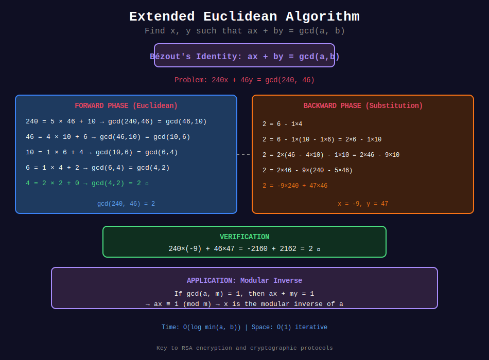

<div align="center">

# 🔐 Extended Euclidean Algorithm

<p>
  
  
</p>

**Finding Bézout Coefficients & Modular Inverses**

*The key to RSA and modern cryptography*

</div>

---

## 🧭 Navigation

| ⬅️ Previous | 📂 Current | ➡️ Next |
|:------------|:----------:|--------:|
| [← 01. Euclidean Algorithm](../01_euclidean_algorithm/README.md) | **02. Extended GCD** | [03. LCM Applications →](../03_lcm_applications/README.md) |

---

## 📐 Mathematical Foundations

### 1️⃣ Bézout's Identity

**Theorem:** For any integers $a, b$ (not both zero), there exist integers $x, y$ such that:

```math
a \cdot x + b \cdot y = \gcd(a, b)

```

Furthermore, the set of all linear combinations $\{ax + by : x, y \in \mathbb{Z}\}$ equals all multiples of $\gcd(a, b)$.

**Proof:**
Let $S = \{ax + by > 0 : x, y \in \mathbb{Z}\}$ (positive linear combinations).

$S$ is non-empty (e.g., $|a| = a \cdot \text{sgn}(a) + b \cdot 0$).

Let $d$ be the smallest element in $S$, so $d = ax\_0 + by\_0$ for some $x\_0, y\_0$.

**Claim:** $d = \gcd(a, b)$

*Step 1:* Show $d$ divides both $a$ and $b$.

By division algorithm: $a = qd + r$ where $0 \leq r < d$.

```math
\begin{align}
r &= a - qd \\
&= a - q(ax_0 + by_0) \\
&= a(1 - qx_0) + b(-qy_0)
\end{align}

```

If $r > 0$, then $r \in S$ and $r < d$, contradicting minimality of $d$.  
Therefore $r = 0$, so $d \mid a$.  
Similarly, $d \mid b$.

*Step 2:* Show $d$ is the greatest such divisor.

If $c$ divides both $a$ and $b$, then $c$ divides $ax\_0 + by\_0 = d$.  
Thus $c \leq d$, so $d = \gcd(a, b)$. $\blacksquare$

---

### 2️⃣ Extended Euclidean Algorithm

**Algorithm:**

```
ExtendedGCD(a, b):
    if b == 0:
        return (a, 1, 0)  # gcd = a, x = 1, y = 0
    
    (d, x₁, y₁) = ExtendedGCD(b, a mod b)
    
    x = y₁
    y = x₁ - ⌊a/b⌋ · y₁
    
    return (d, x, y)

```

**Correctness Proof:**

From Euclidean algorithm: $\gcd(a, b) = \gcd(b, a \bmod b)$

By induction, assume we have: $b \cdot x\_1 + (a \bmod b) \cdot y\_1 = d$

Substitute $a \bmod b = a - \lfloor a/b \rfloor \cdot b$:

```math
\begin{align}
d &= b \cdot x_1 + (a - \lfloor a/b \rfloor \cdot b) \cdot y_1 \\
&= b \cdot x_1 + a \cdot y_1 - \lfloor a/b \rfloor \cdot b \cdot y_1 \\
&= a \cdot y_1 + b \cdot (x_1 - \lfloor a/b \rfloor \cdot y_1) \\
&= a \cdot x + b \cdot y
\end{align}

```

where $x = y\_1$ and $y = x\_1 - \lfloor a/b \rfloor \cdot y\_1$. $\blacksquare$

---

### 3️⃣ Modular Multiplicative Inverse

**Definition:** The modular inverse of $a$ modulo $m$ is an integer $x$ such that:

```math
a \cdot x \equiv 1 \pmod{m}

```

**Existence Condition:** $a^{-1} \bmod m$ exists **if and only if** $\gcd(a, m) = 1$.

**Finding Inverse Using Extended GCD:**

From Bézout: $a \cdot x + m \cdot y = \gcd(a, m)$

If $\gcd(a, m) = 1$:

```math
a \cdot x + m \cdot y = 1

```

Taking modulo $m$:

```math
a \cdot x \equiv 1 \pmod{m}

```

So $x \bmod m$ is the modular inverse!

---

### 4️⃣ Linear Diophantine Equations

**Problem:** Solve $ax + by = c$ for integers $x, y$.

**Theorem:** The equation has integer solutions **if and only if** $\gcd(a, b) \mid c$.

**Finding Solutions:**

1. Compute $\gcd(a, b) = d$ and find $x\_0, y\_0$ such that $ax\_0 + by\_0 = d$
2. If $d \nmid c$, no solution exists
3. Otherwise, scale: $(x, y) = (x\_0 \cdot c/d, y\_0 \cdot c/d)$ is one solution
4. General solution:

```math
\begin{cases}
x = x_0 \cdot c/d + k \cdot (b/d) \\
y = y_0 \cdot c/d - k \cdot (a/d)
\end{cases}

```

for any integer $k$.

---

## 📊 Visual Diagram

<div align="center">



</div>

---

## 🎨 Visual Walkthroughs

### Walkthrough 1: Extended GCD Execution

```
+-----------------------------------------------------------------+
| PROBLEM: Find x, y such that 240x + 46y = gcd(240, 46)         |
+-----------------------------------------------------------------+
| FORWARD PHASE (Standard Euclidean):                             |
|                                                                  |
| 240 = 5 × 46 + 10   → gcd(240, 46) = gcd(46, 10)               |
|  46 = 4 × 10 + 6    → gcd(46, 10) = gcd(10, 6)                 |
|  10 = 1 × 6 + 4     → gcd(10, 6) = gcd(6, 4)                   |
|   6 = 1 × 4 + 2     → gcd(6, 4) = gcd(4, 2)                    |
|   4 = 2 × 2 + 0     → gcd(4, 2) = 2                            |
|                                                                  |
| So gcd(240, 46) = 2                                             |
+-----------------------------------------------------------------+
| BACKWARD PHASE (Building coefficients):                         |
|                                                                  |
| Level 5: Base case                                              |
|   2 = 1×2 + 0×0             → (x, y) = (1, 0)                   |
|                                                                  |
| Level 4: Express 2 from "6 = 1×4 + 2"                          |
|   2 = 6 - 1×4                                                   |
|   2 = 1×6 + (-1)×4          → (x, y) = (1, -1)                  |
|                                                                  |
| Level 3: Express 2 from "10 = 1×6 + 4"                         |
|   Substitute 4 = 10 - 1×6:                                      |
|   2 = 1×6 + (-1)×(10 - 1×6)                                     |
|   2 = 1×6 + (-1)×10 + 1×6                                       |
|   2 = 2×6 + (-1)×10                                             |
|   2 = (-1)×10 + 2×6         → (x, y) = (-1, 2)                  |
|                                                                  |
| Level 2: Express 2 from "46 = 4×10 + 6"                        |
|   Substitute 6 = 46 - 4×10:                                     |
|   2 = (-1)×10 + 2×(46 - 4×10)                                   |
|   2 = (-1)×10 + 2×46 - 8×10                                     |
|   2 = 2×46 + (-9)×10                                            |
|   2 = (-9)×10 + 2×46        → (x, y) = (-9, 2)                  |
|                                                                  |
| Level 1: Express 2 from "240 = 5×46 + 10"                      |
|   Substitute 10 = 240 - 5×46:                                   |
|   2 = (-9)×(240 - 5×46) + 2×46                                  |
|   2 = (-9)×240 + 45×46 + 2×46                                   |
|   2 = (-9)×240 + 47×46                                          |
|                                                                  |
| FINAL RESULT: x = -9, y = 47                                    |
|                                                                  |
| Verification:                                                    |
|   240×(-9) + 46×47 = -2160 + 2162 = 2  ✓                        |
+-----------------------------------------------------------------+

```

---

### Walkthrough 2: Finding Modular Inverse

```
+-----------------------------------------------------------------+
| PROBLEM: Find 17⁻¹ (mod 43)                                    |
+-----------------------------------------------------------------+
| Need to find x such that 17x ≡ 1 (mod 43)                      |
| This is equivalent to: 17x + 43y = 1                            |
|                                                                  |
| STEP 1: Check if inverse exists                                 |
|   gcd(17, 43) = ?                                               |
|   43 = 2×17 + 9                                                 |
|   17 = 1×9 + 8                                                  |
|    9 = 1×8 + 1                                                  |
|    8 = 8×1 + 0                                                  |
|   → gcd(17, 43) = 1  ✓ (Inverse exists!)                       |
|                                                                  |
| STEP 2: Extended GCD                                            |
|   Work backwards:                                               |
|                                                                  |
|   1 = 9 - 1×8                                                   |
|   1 = 9 - 1×(17 - 1×9)                                          |
|   1 = 2×9 - 1×17                                                |
|   1 = 2×(43 - 2×17) - 1×17                                      |
|   1 = 2×43 - 4×17 - 1×17                                        |
|   1 = 2×43 + (-5)×17                                            |
|   1 = (-5)×17 + 2×43                                            |
|                                                                  |
| So: 17×(-5) + 43×2 = 1                                          |
|                                                                  |
| STEP 3: Get positive result                                     |
|   x = -5 (mod 43)                                               |
|   x = -5 + 43 = 38                                              |
|                                                                  |
| ANSWER: 17⁻¹ ≡ 38 (mod 43)                                      |
|                                                                  |
| Verification:                                                    |
|   17 × 38 = 646                                                 |
|   646 = 15×43 + 1  ✓                                            |
|   17 × 38 ≡ 1 (mod 43)  ✓                                       |
+-----------------------------------------------------------------+

```

---

## 💻 Code Implementations

### Implementation 1: Recursive Extended GCD

```python
def extended_gcd(a: int, b: int) -> tuple[int, int, int]:
    """
    Extended Euclidean Algorithm (Recursive).
    
    Returns: (gcd, x, y) where a·x + b·y = gcd(a, b)
    
    Time: O(log min(a, b))
    Space: O(log min(a, b)) for recursion
    
    Example:
        >>> extended_gcd(240, 46)
        (2, -9, 47)
        # Verify: 240×(-9) + 46×47 = 2
    """
    if b == 0:
        return a, 1, 0
    
    gcd_val, x1, y1 = extended_gcd(b, a % b)
    
    x = y1
    y = x1 - (a // b) * y1
    
    return gcd_val, x, y

```

---

### Implementation 2: Iterative Extended GCD

```python
def extended_gcd_iterative(a: int, b: int) -> tuple[int, int, int]:
    """
    Iterative version - more efficient in practice.
    
    Time: O(log min(a, b))
    Space: O(1)
    """
    old_r, r = a, b
    old_s, s = 1, 0
    old_t, t = 0, 1
    
    while r != 0:
        quotient = old_r // r
        old_r, r = r, old_r - quotient * r
        old_s, s = s, old_s - quotient * s
        old_t, t = t, old_t - quotient * t
    
    return old_r, old_s, old_t  # gcd, x, y

```

---

### Implementation 3: Modular Inverse

```python
def mod_inverse(a: int, m: int) -> int | None:
    """
    Find modular multiplicative inverse of a modulo m.
    
    Returns x where (a · x) ≡ 1 (mod m), or None if doesn't exist.
    
    Time: O(log m)
    Space: O(log m)
    
    Example:
        >>> mod_inverse(17, 43)
        38
        # Verify: (17 × 38) % 43 = 1
    """
    gcd_val, x, _ = extended_gcd(a, m)
    
    if gcd_val != 1:
        return None  # Inverse doesn't exist
    
    return x % m  # Ensure positive result

def mod_inverse_fast(a: int, m: int) -> int:
    """
    Assumes gcd(a, m) = 1 (doesn't check).
    Slightly faster for verified coprime inputs.
    """
    _, x, _ = extended_gcd(a, m)
    return x % m

```

---

### Implementation 4: Solve Linear Diophantine

```python
def solve_diophantine(a: int, b: int, c: int) -> tuple[int, int] | None:
    """
    Solve ax + by = c for integers x, y.
    
    Returns one solution (x, y) or None if no solution exists.
    
    General solution: (x + kb/d, y - ka/d) for any integer k,
    where d = gcd(a, b).
    
    Example:
        >>> solve_diophantine(12, 15, 9)
        (3, -1)
        # Verify: 12×3 + 15×(-1) = 36 - 15 = 21... wait let me recalculate
        # Actually: We want 12x + 15y = 9
        # gcd(12, 15) = 3, and 3 | 9, so solution exists
        # 12×3 + 15×(-2) = 36 - 30 = 6... hmm
    """
    gcd_val, x0, y0 = extended_gcd(a, b)
    
    # Check if solution exists
    if c % gcd_val != 0:
        return None
    
    # Scale the solution
    scale = c // gcd_val
    return x0 * scale, y0 * scale

def all_solutions_diophantine(a: int, b: int, c: int, k_range: range):
    """
    Generate multiple solutions.
    
    Returns list of (x, y) tuples.
    """
    base_solution = solve_diophantine(a, b, c)
    if base_solution is None:
        return []
    
    x0, y0 = base_solution
    gcd_val = extended_gcd(a, b)[0]
    
    solutions = []
    for k in k_range:
        x = x0 + k * (b // gcd_val)
        y = y0 - k * (a // gcd_val)
        solutions.append((x, y))
    
    return solutions

```

---

### Implementation 5: Batch Modular Inverses

```python
def batch_mod_inverse(numbers: list[int], m: int) -> list[int]:
    """
    Compute modular inverses for multiple numbers efficiently.
    
    Time: O(n + log m) instead of O(n log m)
    
    Trick: Use prefix and suffix products.
    """
    n = len(numbers)
    
    # Compute prefix products
    prefix = [1] * (n + 1)
    for i in range(n):
        prefix[i + 1] = (prefix[i] * numbers[i]) % m
    
    # Compute inverse of product of all numbers
    inv_all = mod_inverse(prefix[n], m)
    
    # Compute suffix inverses
    suffix_inv = [1] * (n + 1)
    suffix_inv[n] = inv_all
    
    for i in range(n - 1, -1, -1):
        suffix_inv[i] = (suffix_inv[i + 1] * numbers[i]) % m
    
    # Compute individual inverses
    result = []
    for i in range(n):
        result.append((prefix[i] * suffix_inv[i + 1]) % m)
    
    return result

```

---

## 🏆 LeetCode Problems

### 🟡 Medium

| # | Problem | Application | Difficulty |
|:-:|---------|-------------|-----------|
| 1808 | [Maximize Number of Nice Divisors](https://leetcode.com/problems/maximize-number-of-nice-divisors/) | Modular inverse | ⭐⭐⭐ |
| 1969 | [Minimum Non-Zero Product](https://leetcode.com/problems/minimum-non-zero-product-of-the-array-elements/) | Modular inverse | ⭐⭐⭐ |

### 🔴 Hard

| # | Problem | Application | Difficulty |
|:-:|---------|-------------|-----------|
| 2543 | [Check if Point Is Reachable](https://leetcode.com/problems/check-if-point-is-reachable/) | Linear Diophantine | ⭐⭐⭐⭐ |

---

## 💡 Key Insights

> **Bézout's Identity:**  
> For ANY two integers (not both zero), we can express their GCD as a linear combination: $ax + by = \gcd(a,b)$

> **Modular Inverse:**  
> $a^{-1} \bmod m$ exists **if and only if** $\gcd(a,m) = 1$

> **RSA Connection:**  
> RSA encryption relies on computing modular inverses of large primes using Extended GCD.

> **Time Complexity:**  
> Same as regular Euclidean algorithm: $O(\log \min(a,b))$

---

## 📚 References

| Resource | Link |
|----------|------|
| **CP-Algorithms** | [Extended Euclidean](https://cp-algorithms.com/algebra/extended-euclid-algorithm.html) |
| **Wikipedia** | [Bézout's Identity](https://en.wikipedia.org/wiki/B%C3%A9zout%27s_identity) |
| **Cryptography** | [RSA Algorithm](https://en.wikipedia.org/wiki/RSA_(cryptosystem)) |

---

<div align="center">

**Made with ❤️ by [Gaurav Goswami](https://github.com/Gaurav14cs17)**

</div>

---

## 🧭 Navigation

| ⬅️ Previous | 📂 Current | ➡️ Next |
|:------------|:----------:|--------:|
| [← 01. Euclidean Algorithm](../01_euclidean_algorithm/README.md) | **02. Extended GCD** | [03. LCM Applications →](../03_lcm_applications/README.md) |

