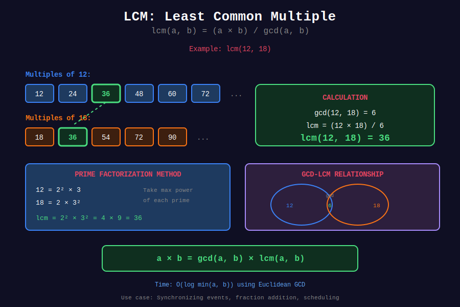

<div align="center">

# 🔁 LCM Applications

<p>
  
  
</p>

**Least Common Multiple in Real World**

*Synchronization, Scheduling, and Pattern Problems*

</div>

---

## 🧭 Navigation

| ⬅️ Previous | 📂 Current | ➡️ Next |
|:------------|:----------:|--------:|
| [← 02. Extended GCD](../02_extended_gcd/README.md) | **03. LCM Applications** | [04. Binary GCD →](../04_binary_gcd/README.md) |

---

## 📐 Mathematical Foundations

### 1️⃣ LCM Formula

$$\text{lcm}(a, b) = \frac{a \times b}{\gcd(a, b)}$$

**Overflow-Safe Version:**

$$\text{lcm}(a, b) = \frac{a}{\gcd(a, b)} \times b$$

### 2️⃣ LCM Properties

$$\begin{align}
\text{lcm}(a, b) &= \text{lcm}(b, a) \quad \text{(Commutative)} \\
\text{lcm}(a, \text{lcm}(b, c)) &= \text{lcm}(\text{lcm}(a, b), c) \quad \text{(Associative)} \\
\gcd(a,b) \times \text{lcm}(a,b) &= a \times b \\
\text{lcm}(ka, kb) &= k \times \text{lcm}(a, b)
\end{align}$$

### 3️⃣ LCM of Multiple Numbers

$$\text{lcm}(a_1, a_2, \ldots, a_n) = \text{lcm}(\text{lcm}(a_1, a_2, \ldots, a_{n-1}), a_n)$$

---

## 📊 Visual Diagram

<div align="center">



</div>

---

## 💻 Code Implementations

### Implementation 1: Basic LCM

```python
def gcd(a: int, b: int) -> int:
    while b:
        a, b = b, a % b
    return a

def lcm(a: int, b: int) -> int:
    """
    Compute LCM of two numbers.
    
    Time: O(log min(a, b))
    Space: O(1)
    """
    return (a * b) // gcd(a, b)

def lcm_safe(a: int, b: int) -> int:
    """
    Overflow-safe: divide before multiply.
    """
    return a // gcd(a, b) * b

```

### Implementation 2: LCM of Array

```python
from functools import reduce

def lcm_array(arr: list[int]) -> int:
    """
    Compute LCM of multiple numbers.
    
    Time: O(n log(max element))
    """
    return reduce(lambda x, y: x * y // gcd(x, y), arr)

# Python 3.9+
import math
result = math.lcm(*arr)

```

### Implementation 3: LCM in Range

```python
def lcm_range(start: int, end: int) -> int:
    """
    LCM of all numbers in [start, end].
    
    Example: lcm_range(1, 5) = lcm(1,2,3,4,5) = 60
    """
    result = start
    for num in range(start + 1, end + 1):
        result = lcm(result, num)
    return result

```

---

## 🏆 LeetCode Problems

### 🟢 Easy

| # | Problem | Key Concept |
|:-:|---------|-------------|
| 2413 | [Smallest Even Multiple](https://leetcode.com/problems/smallest-even-multiple/) | LCM with 2 |

### 🟡 Medium

| # | Problem | Key Concept |
|:-:|---------|-------------|
| 2427 | [Number of Common Factors](https://leetcode.com/problems/number-of-common-factors/) | GCD factors |
| 878 | [Nth Magical Number](https://leetcode.com/problems/nth-magical-number/) | LCM + Binary Search |
| 1201 | [Ugly Number III](https://leetcode.com/problems/ugly-number-iii/) | LCM + Inclusion-Exclusion |

---

## 🎓 Common Applications

### Application 1: Fraction Operations

```python
def add_fractions(n1: int, d1: int, n2: int, d2: int) -> tuple[int, int]:
    """
    Add n1/d1 + n2/d2 and return simplified result.
    """
    common_den = lcm(d1, d2)
    n1 = n1 * (common_den // d1)
    n2 = n2 * (common_den // d2)
    
    result_num = n1 + n2
    result_den = common_den
    
    g = gcd(result_num, result_den)
    return result_num // g, result_den // g

```

### Application 2: Synchronization (Meeting Problem)

```python
def next_meeting_time(period1: int, period2: int, start: int = 0) -> int:
    """
    Two events occur at intervals period1 and period2.
    When do they next coincide after start?
    
    Example: Buses arrive every 12 and 18 minutes.
    When do they arrive together? LCM(12, 18) = 36 minutes
    """
    return start + lcm(period1, period2)

```

### Application 3: Pattern Repetition

```python
def pattern_length(pattern1_len: int, pattern2_len: int) -> int:
    """
    Two patterns repeat. What's the combined cycle length?
    
    Example: Pattern A repeats every 4 steps, B every 6.
    Combined pattern repeats every LCM(4,6) = 12 steps.
    """
    return lcm(pattern1_len, pattern2_len)

```

---

## 💡 Key Insights

> **LCM vs GCD:**  
> - GCD finds largest common divisor (≤ both numbers)
> - LCM finds smallest common multiple (≥ both numbers)

> **Real-World Use Cases:**  
> - **Scheduling:** When do cyclic events coincide?
> - **Fractions:** Finding common denominator
> - **Patterns:** Determining repetition cycles
> - **Music:** Finding beat synchronization

> **Optimization Tip:**  
> Use $\text{lcm}(a,b) = a / \gcd(a,b) \times b$ to avoid overflow

---

<div align="center">

**Made with ❤️ by [Gaurav Goswami](https://github.com/Gaurav14cs17)**

</div>

---

## 🧭 Navigation

| ⬅️ Previous | 📂 Current | ➡️ Next |
|:------------|:----------:|--------:|
| [← 02. Extended GCD](../02_extended_gcd/README.md) | **03. LCM Applications** | [04. Binary GCD →](../04_binary_gcd/README.md) |

