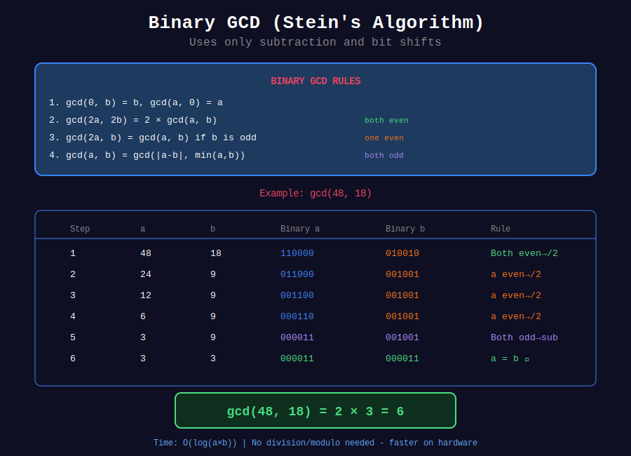

<div align="center">

# ⚡ Binary GCD (Stein's Algorithm)

<p>
  
  
</p>

**Faster GCD Using Only Bitwise Operations**

*Published by Josef Stein in 1967*

</div>

---

## 🧭 Navigation

| ⬅️ Previous | 📂 Current | ➡️ Next |
|:------------|:----------:|--------:|
| [← 03. LCM Applications](../03_lcm_applications/README.md) | **04. Binary GCD** | [05. GCD of Arrays →](../05_gcd_arrays/README.md) |

---

## 📐 Mathematical Foundations

### Binary GCD Properties

**Key Observations:**

1. $\gcd(0, v) = v$
2. $\gcd(2u, 2v) = 2 \cdot \gcd(u, v)$ (factor out 2)
3. $\gcd(2u, v) = \gcd(u, v)$ if $v$ is odd
4. $\gcd(u, v) = \gcd(|u-v|, \min(u,v))$ if both odd

**Algorithm Steps:**
1. Find common power of 2 factor
2. Divide both numbers by 2 until one is odd
3. Subtract smaller from larger (preserves GCD)
4. Divide result by 2 if even
5. Repeat until one number is 0
6. Multiply by common power of 2

---

## 📊 Visual Diagram

<div align="center">



</div>

---

## 💻 Code Implementation

```python
def binary_gcd(a: int, b: int) -> int:
    """
    Binary GCD algorithm (Stein's algorithm).
    
    Uses only: subtraction, bit shifts, bitwise AND/OR
    No division or modulo operations!
    
    Time: O(log min(a, b))
    Space: O(1)
    
    Often faster than Euclidean on modern hardware
    because bitwise operations are very fast.
    """
    if a == 0:
        return b
    if b == 0:
        return a
    
    # Find common power of 2
    shift = 0
    while ((a | b) & 1) == 0:  # Both even
        a >>= 1
        b >>= 1
        shift += 1
    
    # Remove remaining factors of 2 from a
    while (a & 1) == 0:
        a >>= 1
    
    while b != 0:
        # Remove factors of 2 from b
        while (b & 1) == 0:
            b >>= 1
        
        # Ensure a ≤ b
        if a > b:
            a, b = b, a
        
        # Subtract (both are odd, so difference is even)
        b -= a
    
    # Restore common factors of 2
    return a << shift

# Example usage
print(binary_gcd(48, 18))  # 6
print(binary_gcd(100, 35))  # 5
```

---

## 🎨 Visual Walkthrough

```
+-----------------------------------------------------------------+
| EXAMPLE: binary_gcd(48, 18)                                     |
+-----------------------------------------------------------------+
| Step 1: Find common power of 2                                  |
|   48 = 110000₂ (even)                                           |
|   18 = 010010₂ (even)                                           |
|   Both even → divide by 2                                       |
|   shift = 1                                                     |
|   a = 24, b = 9                                                 |
|                                                                  |
| Step 2: Remove factors of 2 from a                              |
|   24 = 11000₂ (even)                                            |
|   a = 12 → 6 → 3 (now odd)                                      |
|                                                                  |
| Step 3: Main loop                                               |
|   a = 3, b = 9 (both odd)                                       |
|   b = 9 - 3 = 6                                                 |
|   Remove 2s from b: 6 → 3                                       |
|   a = 3, b = 3                                                  |
|   b = 3 - 3 = 0                                                 |
|                                                                  |
| Step 4: Restore common factor                                   |
|   result = 3 << 1 = 6  ✓                                        |
+-----------------------------------------------------------------+
```

---

## ⚡ Performance Comparison

| Algorithm | Operations | Best For |
|-----------|-----------|----------|
| **Euclidean** | Division, Modulo | General purpose |
| **Binary GCD** | Bit shifts, Subtraction | Hardware optimization |
| **Extended GCD** | Division, Modulo | Finding coefficients |

**When Binary GCD Wins:**
- Hardware where division is slow
- Very large numbers (cryptography)
- Embedded systems
- Constant-time requirements

---

## 💡 Key Insights

> **Why It's Fast:**  
> Bit shifts and subtraction are typically faster than division/modulo on modern CPUs.

> **Trade-offs:**  
> - Pro: No division, only bit operations
> - Pro: Can be constant-time (side-channel resistant)
> - Con: More complex to implement
> - Con: Not always faster on modern processors

> **Use Cases:**  
> - Cryptographic applications
> - Embedded systems
> - Hardware implementations
> - When division is expensive

---

<div align="center">

**Made with ❤️ by [Gaurav Goswami](https://github.com/Gaurav14cs17)**

</div>

---

## 🧭 Navigation

| ⬅️ Previous | 📂 Current | ➡️ Next |
|:------------|:----------:|--------:|
| [← 03. LCM Applications](../03_lcm_applications/README.md) | **04. Binary GCD** | [05. GCD of Arrays →](../05_gcd_arrays/README.md) |

