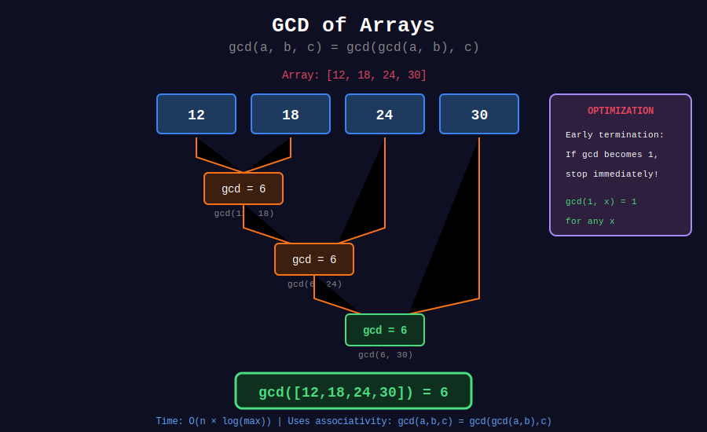

<div align="center">

# 📊 GCD of Arrays

<p>
  
  
</p>

**Efficient GCD Computations on Multiple Numbers**

*Prefix GCD, Suffix GCD, and Range Queries*

</div>

---

## 🧭 Navigation

| ⬅️ Previous | 📂 Current | ➡️ Next |
|:------------|:----------:|--------:|
| [← 04. Binary GCD](../04_binary_gcd/README.md) | **05. GCD of Arrays** | [06. Applications →](../06_applications/README.md) |

---

## 📐 Mathematical Foundations

### Associativity Property

$$\gcd(a, \gcd(b, c)) = \gcd(\gcd(a, b), c) = \gcd(a, b, c)$$

This means we can compute GCD of multiple numbers in any order!

### GCD of Array

$$\gcd(a_1, a_2, \ldots, a_n) = \gcd(a_1, \gcd(a_2, \ldots, a_n))$$

---

## 📊 Visual Diagram

<div align="center">



</div>

---

## 💻 Code Implementations

### Implementation 1: Basic Array GCD

```python
from functools import reduce

def gcd(a: int, b: int) -> int:
    while b:
        a, b = b, a % b
    return a

def gcd_array(arr: list[int]) -> int:
    """
    Compute GCD of all elements in array.
    
    Time: O(n log(max element))
    Space: O(1)
    """
    return reduce(gcd, arr)

# Optimized with early termination
def gcd_array_optimized(arr: list[int]) -> int:
    """
    Stop early if GCD becomes 1.
    """
    result = arr[0]
    for num in arr[1:]:
        result = gcd(result, num)
        if result == 1:
            return 1  # Can't get smaller
    return result

```

---

### Implementation 2: Prefix and Suffix GCD

```python
def prefix_gcd(arr: list[int]) -> list[int]:
    """
    prefix[i] = gcd(arr[0], arr[1], ..., arr[i])
    
    Time: O(n log(max element))
    Space: O(n)
    """
    n = len(arr)
    prefix = [0] * n
    prefix[0] = arr[0]
    
    for i in range(1, n):
        prefix[i] = gcd(prefix[i-1], arr[i])
    
    return prefix

def suffix_gcd(arr: list[int]) -> list[int]:
    """
    suffix[i] = gcd(arr[i], arr[i+1], ..., arr[n-1])
    """
    n = len(arr)
    suffix = [0] * n
    suffix[n-1] = arr[n-1]
    
    for i in range(n-2, -1, -1):
        suffix[i] = gcd(arr[i], suffix[i+1])
    
    return suffix

```

---

### Implementation 3: GCD Excluding One Element

```python
def gcd_excluding_index(arr: list[int], exclude_idx: int) -> int:
    """
    Compute GCD of all elements except arr[exclude_idx].
    
    Use prefix and suffix GCDs for O(1) query after O(n) preprocessing.
    
    Time: O(n log m) preprocessing, O(1) per query
    """
    prefix = prefix_gcd(arr)
    suffix = suffix_gcd(arr)
    
    n = len(arr)
    if exclude_idx == 0:
        return suffix[1] if n > 1 else 0
    elif exclude_idx == n - 1:
        return prefix[n-2]
    else:
        return gcd(prefix[exclude_idx-1], suffix[exclude_idx+1])

def gcd_all_excluding_each(arr: list[int]) -> list[int]:
    """
    For each index i, compute GCD of all elements except arr[i].
    
    Time: O(n log m)
    Space: O(n)
    """
    n = len(arr)
    prefix = prefix_gcd(arr)
    suffix = suffix_gcd(arr)
    
    result = []
    for i in range(n):
        if i == 0:
            result.append(suffix[1] if n > 1 else 0)
        elif i == n - 1:
            result.append(prefix[n-2])
        else:
            result.append(gcd(prefix[i-1], suffix[i+1]))
    
    return result

```

---

### Implementation 4: Subarray GCD Queries

```python
class SubarrayGCD:
    """
    Support queries for GCD of any subarray.
    
    Uses Sparse Table for O(n log n) preprocessing,
    O(1) per query.
    """
    def __init__(self, arr: list[int]):
        self.n = len(arr)
        self.arr = arr
        
        # Build sparse table
        import math
        self.log = [0] * (self.n + 1)
        for i in range(2, self.n + 1):
            self.log[i] = self.log[i // 2] + 1
        
        max_log = self.log[self.n] + 1
        self.st = [[0] * max_log for _ in range(self.n)]
        
        # Initialize for length 1
        for i in range(self.n):
            self.st[i][0] = arr[i]
        
        # Build for larger lengths
        j = 1
        while (1 << j) <= self.n:
            i = 0
            while i + (1 << j) - 1 < self.n:
                self.st[i][j] = gcd(
                    self.st[i][j-1],
                    self.st[i + (1 << (j-1))][j-1]
                )
                i += 1
            j += 1
    
    def query(self, left: int, right: int) -> int:
        """
        Query GCD of arr[left:right+1].
        
        Time: O(1)
        """
        length = right - left + 1
        j = self.log[length]
        return gcd(
            self.st[left][j],
            self.st[right - (1 << j) + 1][j]
        )

```

---

## 🏆 LeetCode Problems

### 🟢 Easy

| # | Problem | Concept |
|:-:|---------|---------|
| 1979 | [Find GCD of Array](https://leetcode.com/problems/find-greatest-common-divisor-of-array/) | Basic array GCD |

### 🟡 Medium

| # | Problem | Concept |
|:-:|---------|---------|
| 1819 | [Number of Different Subsequences GCDs](https://leetcode.com/problems/number-of-different-subsequences-gcds/) | GCD properties |
| 2447 | [Number of Subarrays With GCD Equal to K](https://leetcode.com/problems/number-of-subarrays-with-gcd-equal-to-k/) | Subarray GCD |
| 2654 | [Min Operations to Make Equal to 1](https://leetcode.com/problems/minimum-number-of-operations-to-make-all-array-elements-equal-to-1/) | Array GCD = 1 |

---

## 💡 Key Insights

> **Associativity:**  
> GCD is associative, so we can process in any order

> **Early Termination:**  
> If GCD becomes 1, it can't decrease further

> **Prefix/Suffix Trick:**  
> Precompute prefix and suffix GCDs for O(1) exclusion queries

> **Sparse Table:**  
> For range GCD queries, sparse table gives O(1) query time

---

<div align="center">

**Made with ❤️ by [Gaurav Goswami](https://github.com/Gaurav14cs17)**

</div>

---

## 🧭 Navigation

| ⬅️ Previous | 📂 Current | ➡️ Next |
|:------------|:----------:|--------:|
| [← 04. Binary GCD](../04_binary_gcd/README.md) | **05. GCD of Arrays** | [06. Applications →](../06_applications/README.md) |

