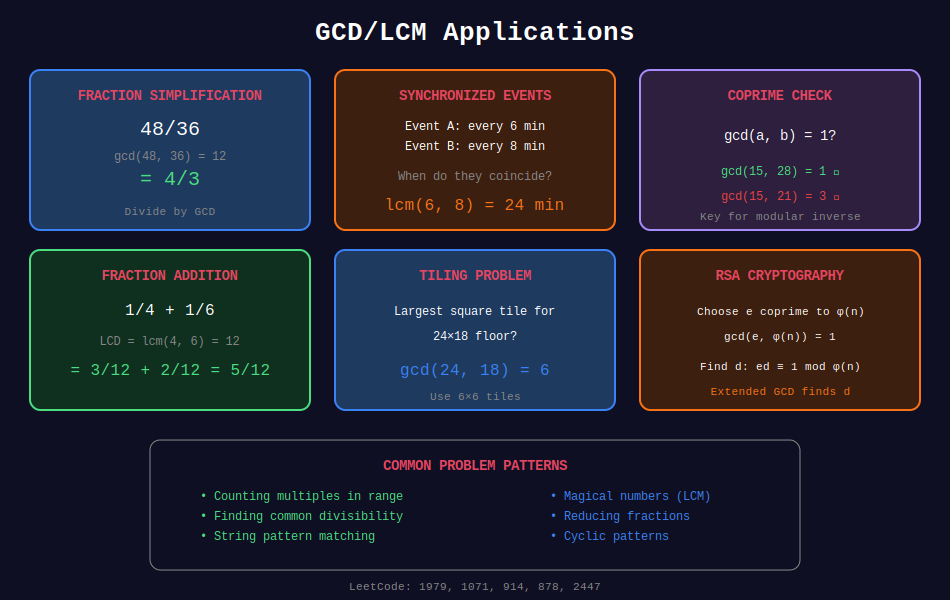

<div align="center">

# 🎯 GCD & LCM Applications

<p>
  
  
</p>

**Real-World Problems & Interview Patterns**

</div>

---

## 🧭 Navigation

| ⬅️ Previous | 📂 Current | ➡️ Next |
|:------------|:----------:|--------:|
| [← 05. GCD of Arrays](../05_gcd_arrays/README.md) | **06. Applications** | [🏠 GCD & LCM Home](../README.md) |

---

## 📊 Visual Diagram

<div align="center">



</div>

---

## 🏆 LeetCode Problems by Category

### Category 1: Basic GCD/LCM

| # | Problem | Difficulty | Key Concept |
|:-:|---------|:----------:|-------------|
| 1979 | [Find GCD of Array](https://leetcode.com/problems/find-greatest-common-divisor-of-array/) | 🟢 Easy | GCD of min/max |
| 1071 | [GCD of Strings](https://leetcode.com/problems/greatest-common-divisor-of-strings/) | 🟢 Easy | String pattern GCD |
| 914 | [X of a Kind in Deck](https://leetcode.com/problems/x-of-a-kind-in-a-deck-of-cards/) | 🟢 Easy | GCD of frequencies |
| 2413 | [Smallest Even Multiple](https://leetcode.com/problems/smallest-even-multiple/) | 🟢 Easy | LCM with 2 |

---

### Category 2: Modular Arithmetic & Inverses

| # | Problem | Difficulty | Key Concept |
|:-:|---------|:----------:|-------------|
| 1808 | [Maximize Nice Divisors](https://leetcode.com/problems/maximize-number-of-nice-divisors/) | 🔴 Hard | Modular inverse |
| 1969 | [Min Non-Zero Product](https://leetcode.com/problems/minimum-non-zero-product-of-the-array-elements/) | 🟡 Medium | Modular arithmetic |

---

### Category 3: Number Theory & Counting

| # | Problem | Difficulty | Key Concept |
|:-:|---------|:----------:|-------------|
| 878 | [Nth Magical Number](https://leetcode.com/problems/nth-magical-number/) | 🔴 Hard | LCM + Binary Search |
| 1201 | [Ugly Number III](https://leetcode.com/problems/ugly-number-iii/) | 🟡 Medium | LCM + Inclusion-Exclusion |
| 2183 | [Count Pairs Divisible by K](https://leetcode.com/problems/count-array-pairs-divisible-by-k/) | 🔴 Hard | GCD factorization |
| 1819 | [Number of Different Subsequences GCDs](https://leetcode.com/problems/number-of-different-subsequences-gcds/) | 🔴 Hard | GCD properties |

---

### Category 4: Array & Subarray Problems

| # | Problem | Difficulty | Key Concept |
|:-:|---------|:----------:|-------------|
| 2447 | [Number of Subarrays With GCD Equal to K](https://leetcode.com/problems/number-of-subarrays-with-gcd-equal-to-k/) | 🟡 Medium | Running GCD |
| 2654 | [Min Operations to Make Equal to 1](https://leetcode.com/problems/minimum-number-of-operations-to-make-all-array-elements-equal-to-1/) | 🟡 Medium | Array GCD = 1 |
| 2344 | [Min Operations to Make Array Equal II](https://leetcode.com/problems/minimum-operations-to-make-array-equal-ii/) | 🔴 Hard | Difference array GCD |

---

### Category 5: Geometry & Grid Problems

| # | Problem | Difficulty | Key Concept |
|:-:|---------|:----------:|-------------|
| 858 | [Mirror Reflection](https://leetcode.com/problems/mirror-reflection/) | 🟡 Medium | GCD/LCM geometry |
| 149 | [Max Points on a Line](https://leetcode.com/problems/max-points-on-a-line/) | 🔴 Hard | GCD for slope |
| 2543 | [Check if Point Is Reachable](https://leetcode.com/problems/check-if-point-is-reachable/) | 🔴 Hard | Linear Diophantine |

---

### Category 6: Fractions & Rational Numbers

| # | Problem | Difficulty | Key Concept |
|:-:|---------|:----------:|-------------|
| 592 | [Fraction Addition/Subtraction](https://leetcode.com/problems/fraction-addition-and-subtraction/) | 🟡 Medium | LCM of denominators |
| 166 | [Fraction to Recurring Decimal](https://leetcode.com/problems/fraction-to-recurring-decimal/) | 🟡 Medium | Simplification |

---

## 💻 Solution Templates

### Template 1: GCD of Strings

```python
def gcdOfStrings(str1: str, str2: str) -> str:
    """
    LeetCode 1071: GCD of Strings
    
    Key Insight: If GCD pattern exists,
    str1 + str2 == str2 + str1
    
    Time: O(n + m)
    """
    if str1 + str2 != str2 + str1:
        return ""
    
    from math import gcd
    g = gcd(len(str1), len(str2))
    return str1[:g]

```

### Template 2: Nth Magical Number

```python
def nthMagicalNumber(n: int, a: int, b: int) -> int:
    """
    LeetCode 878: Nth Magical Number
    
    Key Insight: Use LCM and inclusion-exclusion
    with binary search.
    
    Time: O(log(n × min(a,b)))
    """
    from math import gcd
    
    MOD = 10**9 + 7
    lcm_ab = a * b // gcd(a, b)
    
    # Binary search
    left, right = 1, n * min(a, b)
    
    while left < right:
        mid = (left + right) // 2
        # Count numbers ≤ mid divisible by a or b
        count = mid // a + mid // b - mid // lcm_ab
        
        if count < n:
            left = mid + 1
        else:
            right = mid
    
    return left % MOD

```

### Template 3: Subarray GCD Equal to K

```python
def subarrayGCD(nums: list[int], k: int) -> int:
    """
    LeetCode 2447: Number of Subarrays With GCD Equal to K
    
    Key Insight: GCD can only decrease or stay same.
    Track running GCD for each starting position.
    
    Time: O(n²)
    """
    from math import gcd
    
    count = 0
    n = len(nums)
    
    for i in range(n):
        current_gcd = 0
        for j in range(i, n):
            current_gcd = gcd(current_gcd, nums[j])
            
            if current_gcd == k:
                count += 1
            elif current_gcd < k:
                break  # GCD can't increase
    
    return count

```

### Template 4: Check Reachable Point

```python
def isReachable(targetX: int, targetY: int) -> bool:
    """
    LeetCode 2543: Check if Point Is Reachable
    
    Key Insight: Point (x,y) reachable from (1,1) iff
    gcd(x,y) is power of 2.
    
    Time: O(log n)
    """
    from math import gcd
    
    g = gcd(targetX, targetY)
    
    # Check if g is power of 2
    return (g & (g - 1)) == 0

```

---

## 🎓 Common Patterns

### Pattern 1: Coprimality

```python
def count_coprime_pairs(nums: list[int]) -> int:
    """Count pairs where gcd(nums[i], nums[j]) = 1"""
    from math import gcd
    count = 0
    n = len(nums)
    
    for i in range(n):
        for j in range(i + 1, n):
            if gcd(nums[i], nums[j]) == 1:
                count += 1
    
    return count

```

### Pattern 2: Simplifying Fractions

```python
def simplify(num: int, den: int) -> tuple[int, int]:
    """Reduce fraction to lowest terms"""
    from math import gcd
    g = gcd(abs(num), abs(den))
    return num // g, den // g

```

### Pattern 3: Meeting Time (Synchronization)

```python
def next_meeting(interval1: int, interval2: int) -> int:
    """When do two cyclic events next coincide?"""
    from math import lcm
    return lcm(interval1, interval2)

```

---

## 💡 Key Insights

> **String GCD:**  
> If two strings have a GCD pattern, concatenating them in any order gives the same result.

> **Ugly Numbers:**  
> Use inclusion-exclusion: $|A \cup B \cup C| = |A| + |B| + |C| - |A \cap B| - |A \cap C| - |B \cap C| + |A \cap B \cap C|$

> **Slope Calculation:**  
> When computing slope as dy/dx, reduce using GCD to avoid precision errors.

> **Optimization:**  
> For subarrays, remember GCD is monotonic (never increases) - use this for early termination.

---

## 📚 Study Plan

**Week 1: Foundations**
- Day 1-2: Basic Euclidean Algorithm
- Day 3-4: Extended GCD and modular inverse
- Day 5: LCM applications
- Day 6-7: Practice easy problems

**Week 2: Advanced Patterns**
- Day 1-2: Binary GCD and optimizations
- Day 3-4: Array GCD techniques
- Day 5-7: Medium problems

**Week 3: Expert Level**
- Day 1-3: Hard problems
- Day 4-5: Contest problems
- Day 6-7: Review and speed practice

---

<div align="center">

**Made with ❤️ by [Gaurav Goswami](https://github.com/Gaurav14cs17)**

</div>

---

## 🧭 Navigation

| ⬅️ Previous | 📂 Current | ➡️ Next |
|:------------|:----------:|--------:|
| [← 05. GCD of Arrays](../05_gcd_arrays/README.md) | **06. Applications** | [🏠 GCD & LCM Home](../README.md) |

