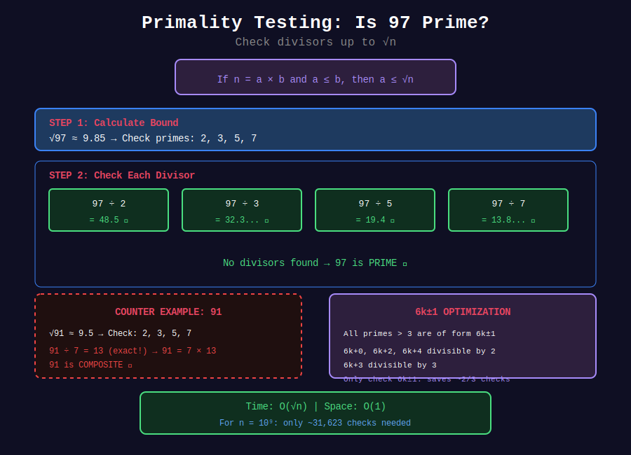

<div align="center">

# 🔍 Primality Testing

<p>
  
  
</p>

**Determining if a Number is Prime**

*From ancient trial division to modern probabilistic tests*

</div>

---

## 🧭 Navigation

| ⬅️ Previous | 📂 Current | ➡️ Next |
|:------------|:----------:|--------:|
| [🏠 Primes Home](../README.md) | **01. Primality Testing** | [02. Sieve of Eratosthenes →](../02_sieve_eratosthenes/README.md) |

---

## 📐 Mathematical Foundations

### 1️⃣ Prime Definition

**Definition:** An integer $p > 1$ is **prime** if its only positive divisors are 1 and $p$.

**Composite:** An integer $n > 1$ that is not prime (has divisors other than 1 and itself).

**Unit:** The number 1 is neither prime nor composite.

---

### 2️⃣ Why √n is Sufficient

**Theorem:** If $n$ is composite, it has a prime factor $\leq \sqrt{n}$.

**Proof:**
Let $n = a \times b$ where $1 < a \leq b < n$.

If $a > \sqrt{n}$, then $b \geq a > \sqrt{n}$, so $a \times b > n$. Contradiction!

Therefore $a \leq \sqrt{n}$, and $a$ has a prime factor $p \leq a \leq \sqrt{n}$. ∎

---

### 3️⃣ The 6k±1 Optimization

**Observation:** All primes greater than 3 are of the form $6k \pm 1$.

**Proof:**
Every integer can be written as $6k$, $6k+1$, $6k+2$, $6k+3$, $6k+4$, or $6k+5$.

- $6k$ is divisible by 2 and 3
- $6k+2$ is divisible by 2
- $6k+3$ is divisible by 3
- $6k+4$ is divisible by 2

Only $6k+1$ and $6k+5 = 6(k+1)-1$ remain as candidates. ∎

---

### 4️⃣ Fermat's Little Theorem

**Theorem:** If $p$ is prime and $\gcd(a, p) = 1$, then:

$$a^{p-1} \equiv 1 \pmod{p}$$

**Contrapositive (Fermat Test):** If $a^{n-1} \not\equiv 1 \pmod{n}$ for some $a$ with $\gcd(a, n) = 1$, then $n$ is composite.

**Warning:** Some composites (Carmichael numbers) pass the Fermat test for all coprime bases!

---

### 5️⃣ Miller-Rabin Witness Theorem

**Setup:** Write $n - 1 = 2^r \cdot d$ where $d$ is odd.

**Theorem:** If $n$ is an odd prime, then for any $a$ with $\gcd(a, n) = 1$:
- Either $a^d \equiv 1 \pmod{n}$
- Or $a^{2^j d} \equiv -1 \pmod{n}$ for some $0 \leq j < r$

**Contrapositive:** If neither condition holds, $n$ is composite (and $a$ is a "witness").

---

## 📊 Visual Diagram

<div align="center">



</div>

---

## 🎨 Visual Walkthroughs

### Walkthrough 1: Trial Division

```
┌─────────────────────────────────────────────────────────────────┐
│ PROBLEM: Is 97 prime?                                          │
├─────────────────────────────────────────────────────────────────┤
│ STEP 1: Calculate bound                                        │
│   √97 ≈ 9.85                                                   │
│   Check divisors: 2, 3, 4, 5, 6, 7, 8, 9                       │
│                                                                 │
│ STEP 2: Apply optimizations                                    │
│   Skip even numbers after 2                                    │
│   Actually check: 2, 3, 5, 7, 9                                │
│                                                                 │
│   Even better with 6k±1:                                       │
│   Check: 2, 3, 5, 7 (only primes ≤ √97)                        │
│                                                                 │
│ STEP 3: Test each divisor                                      │
│                                                                 │
│   97 ÷ 2 = 48.5     ✗ (not integer)                           │
│   97 ÷ 3 = 32.33... ✗ (not integer)                           │
│   97 ÷ 5 = 19.4     ✗ (not integer)                           │
│   97 ÷ 7 = 13.86... ✗ (not integer)                           │
│                                                                 │
│ RESULT: No divisors found → 97 is PRIME ✓                     │
└─────────────────────────────────────────────────────────────────┘
```

---

### Walkthrough 2: 6k±1 Pattern

```
┌─────────────────────────────────────────────────────────────────┐
│ PATTERN: All primes > 3 are of form 6k±1                       │
├─────────────────────────────────────────────────────────────────┤
│                                                                 │
│ Numbers by remainder when divided by 6:                         │
│                                                                 │
│   6k + 0:  6, 12, 18, 24, 30, ...  (divisible by 6)           │
│   6k + 1:  7, 13, 19, 25, 31, ...  ← CANDIDATES               │
│   6k + 2:  8, 14, 20, 26, 32, ...  (divisible by 2)           │
│   6k + 3:  9, 15, 21, 27, 33, ...  (divisible by 3)           │
│   6k + 4: 10, 16, 22, 28, 34, ...  (divisible by 2)           │
│   6k + 5: 11, 17, 23, 29, 35, ...  ← CANDIDATES (= 6k-1)      │
│                                                                 │
│ So we only need to check numbers at positions 5, 7, 11, 13...  │
│ Pattern: i, i+2, i+6, i+8, i+12, i+14, ... where i=5           │
│          = 5, 7, 11, 13, 17, 19, 23, 25, ...                   │
│                                                                 │
│ SAVINGS: Only check 1/3 of candidates!                         │
│                                                                 │
│ Implementation: Start at 5, alternate +2 and +4                │
│   for i in 5, 7, 11, 13, 17, 19, ...                           │
│     check if n % i == 0 or n % (i+2) == 0                      │
│     i += 6                                                      │
└─────────────────────────────────────────────────────────────────┘
```

---

### Walkthrough 3: Miller-Rabin Test

```
┌─────────────────────────────────────────────────────────────────┐
│ PROBLEM: Test if n = 221 is prime using Miller-Rabin          │
├─────────────────────────────────────────────────────────────────┤
│ STEP 1: Write n-1 = 2^r × d where d is odd                    │
│                                                                 │
│   n - 1 = 220 = 4 × 55 = 2² × 55                              │
│   r = 2, d = 55                                                │
│                                                                 │
│ STEP 2: Choose witness a = 174                                 │
│                                                                 │
│   Compute x = a^d mod n = 174^55 mod 221                       │
│   x = 47                                                       │
│                                                                 │
│ STEP 3: Check conditions                                       │
│                                                                 │
│   Is x = 1? No (x = 47)                                        │
│   Is x = n-1 = 220? No                                         │
│                                                                 │
│   Square r-1 = 1 more time:                                    │
│     x = 47² mod 221 = 2209 mod 221 = 220                       │
│                                                                 │
│   Is x = 220? Yes! ✓                                           │
│                                                                 │
│ STEP 4: Try another witness a = 137                            │
│                                                                 │
│   x = 137^55 mod 221 = 188                                     │
│   Is x = 1 or 220? No                                          │
│                                                                 │
│   x = 188² mod 221 = 35344 mod 221 = 205                       │
│   Is x = 220? No                                               │
│                                                                 │
│   Neither condition met → 221 is COMPOSITE!                    │
│                                                                 │
│ VERIFICATION: 221 = 13 × 17 ✓                                  │
└─────────────────────────────────────────────────────────────────┘
```

---

## 💻 Code Implementations

### Implementation 1: Basic Trial Division

```python
def is_prime_basic(n: int) -> bool:
    """
    Check primality using basic trial division.
    
    Time: O(√n)
    Space: O(1)
    
    Checks all odd divisors from 3 to √n.
    
    Examples:
        >>> is_prime_basic(17)
        True
        >>> is_prime_basic(100)
        False
        >>> is_prime_basic(2)
        True
    """
    if n < 2:
        return False
    if n == 2:
        return True
    if n % 2 == 0:
        return False
    
    i = 3
    while i * i <= n:
        if n % i == 0:
            return False
        i += 2
    
    return True
```

---

### Implementation 2: Optimized (6k±1)

```python
def is_prime_optimized(n: int) -> bool:
    """
    Optimized primality test using 6k±1 property.
    
    Time: O(√n / 3) in best case
    Space: O(1)
    
    All primes > 3 are of form 6k±1.
    This reduces checks by ~3x compared to basic.
    """
    if n <= 1:
        return False
    if n <= 3:
        return True
    if n % 2 == 0 or n % 3 == 0:
        return False
    
    # Check numbers of form 6k-1 and 6k+1
    i = 5
    while i * i <= n:
        if n % i == 0 or n % (i + 2) == 0:
            return False
        i += 6
    
    return True
```

---

### Implementation 3: Fermat Primality Test

```python
import random

def fermat_test(n: int, k: int = 5) -> bool:
    """
    Fermat primality test (probabilistic).
    
    Time: O(k log n)
    Space: O(1)
    
    Based on Fermat's Little Theorem:
    If p is prime and gcd(a, p) = 1, then a^(p-1) ≡ 1 (mod p)
    
    WARNING: Carmichael numbers (561, 1105, 1729...) are false positives!
    
    Args:
        n: Number to test
        k: Number of witnesses to try
    
    Returns:
        True if probably prime, False if definitely composite
    """
    if n < 2:
        return False
    if n == 2 or n == 3:
        return True
    if n % 2 == 0:
        return False
    
    for _ in range(k):
        a = random.randint(2, n - 2)
        
        # Check: a^(n-1) ≡ 1 (mod n)
        if pow(a, n - 1, n) != 1:
            return False
    
    return True  # Probably prime


# Carmichael numbers - composites that fool Fermat test
CARMICHAEL = [561, 1105, 1729, 2465, 2821, 6601, 8911]
```

---

### Implementation 4: Miller-Rabin (Recommended)

```python
import random

def miller_rabin(n: int, k: int = 10) -> bool:
    """
    Miller-Rabin primality test (probabilistic).
    
    Time: O(k log³ n)
    Space: O(1)
    
    Much stronger than Fermat - detects Carmichael numbers.
    Error probability: < 4^(-k)
    
    With k=10, error < 10^(-6)
    
    Args:
        n: Number to test
        k: Number of rounds (more = more accurate)
    """
    if n < 2:
        return False
    if n == 2 or n == 3:
        return True
    if n % 2 == 0:
        return False
    
    # Write n-1 as 2^r × d where d is odd
    r, d = 0, n - 1
    while d % 2 == 0:
        r += 1
        d //= 2
    
    # Witness loop
    for _ in range(k):
        a = random.randint(2, n - 2)
        x = pow(a, d, n)
        
        if x == 1 or x == n - 1:
            continue
        
        # Square up to r-1 times
        composite = True
        for _ in range(r - 1):
            x = pow(x, 2, n)
            if x == n - 1:
                composite = False
                break
        
        if composite:
            return False
    
    return True
```

---

### Implementation 5: Deterministic Miller-Rabin

```python
def is_prime_deterministic(n: int) -> bool:
    """
    Deterministic Miller-Rabin for n < 3,317,044,064,679,887,385,961,981
    
    Uses proven witness sets that guarantee correctness.
    
    Time: O(log³ n) with small constant
    Space: O(1)
    """
    if n < 2:
        return False
    
    # Small primes for quick check
    small_primes = [2, 3, 5, 7, 11, 13, 17, 19, 23, 29, 31, 37]
    
    if n in small_primes:
        return True
    
    if any(n % p == 0 for p in small_primes):
        return False
    
    # Write n-1 as 2^r × d
    r, d = 0, n - 1
    while d % 2 == 0:
        r += 1
        d //= 2
    
    def check_witness(a: int) -> bool:
        """Returns True if n passes test for witness a."""
        x = pow(a, d, n)
        
        if x == 1 or x == n - 1:
            return True
        
        for _ in range(r - 1):
            x = pow(x, 2, n)
            if x == n - 1:
                return True
        
        return False
    
    # Witnesses for different ranges (proven to be sufficient)
    if n < 2047:
        witnesses = [2]
    elif n < 1373653:
        witnesses = [2, 3]
    elif n < 9080191:
        witnesses = [31, 73]
    elif n < 25326001:
        witnesses = [2, 3, 5]
    elif n < 3215031751:
        witnesses = [2, 3, 5, 7]
    elif n < 4759123141:
        witnesses = [2, 7, 61]
    elif n < 1122004669633:
        witnesses = [2, 13, 23, 1662803]
    elif n < 2152302898747:
        witnesses = [2, 3, 5, 7, 11]
    elif n < 3474749660383:
        witnesses = [2, 3, 5, 7, 11, 13]
    else:
        witnesses = [2, 3, 5, 7, 11, 13, 17, 19, 23, 29, 31, 37]
    
    return all(check_witness(a) for a in witnesses)
```

---

### Implementation 6: With Verbose Trace

```python
def is_prime_verbose(n: int) -> bool:
    """
    Primality test with step-by-step output.
    
    Educational version for understanding the algorithm.
    """
    print(f"\n{'='*50}")
    print(f"Testing if {n} is prime")
    print('='*50)
    
    if n < 2:
        print(f"n = {n} < 2: Not prime")
        return False
    
    if n == 2:
        print("n = 2: Prime (only even prime)")
        return True
    
    if n % 2 == 0:
        print(f"n = {n} is even: Not prime")
        return False
    
    print(f"n is odd, checking divisors up to √{n} ≈ {n**0.5:.2f}")
    
    i = 3
    checks = 0
    while i * i <= n:
        checks += 1
        if n % i == 0:
            print(f"  {n} ÷ {i} = {n // i} (exact division!)")
            print(f"  {n} = {i} × {n // i}")
            print(f"Result: COMPOSITE (after {checks} checks)")
            return False
        else:
            print(f"  {n} % {i} = {n % i} (not divisible)")
        i += 2
    
    print(f"No divisors found after {checks} checks")
    print(f"Result: PRIME ✓")
    return True


# Example usage
# is_prime_verbose(97)
# is_prime_verbose(91)
```

---

## 🏆 LeetCode Problems

### 🟢 Easy

| # | Problem | Key Concept | Time |
|:-:|---------|-------------|------|
| 762 | [Prime Number of Set Bits](https://leetcode.com/problems/prime-number-of-set-bits-in-binary-representation/) | Precompute small primes | O(n) |
| 2614 | [Prime In Diagonal](https://leetcode.com/problems/prime-in-diagonal/) | Basic primality test | O(n√m) |

### 🟡 Medium

| # | Problem | Key Concept | Time |
|:-:|---------|-------------|------|
| 204 | [Count Primes](https://leetcode.com/problems/count-primes/) | Sieve (not individual testing) | O(n log log n) |
| 866 | [Prime Palindrome](https://leetcode.com/problems/prime-palindrome/) | Generate palindromes + test | O(n^0.5 log n) |

---

## 💻 Solutions to Key Problems

### Problem 866: Prime Palindrome

```python
class Solution:
    def primePalindrome(self, n: int) -> int:
        """
        Find smallest prime palindrome >= n.
        
        Key insight: All even-digit palindromes (except 11) 
        are divisible by 11.
        
        Proof: abccba = 100001a + 10010b + 1100c
                      = 11(9091a + 910b + 100c)
        
        So skip 8-digit range [10^7, 10^8)!
        
        Time: O(√n × log n) approximately
        """
        def is_prime(x: int) -> bool:
            if x < 2:
                return False
            if x == 2:
                return True
            if x % 2 == 0:
                return False
            i = 3
            while i * i <= x:
                if x % i == 0:
                    return False
                i += 2
            return True
        
        def is_palindrome(x: int) -> bool:
            s = str(x)
            return s == s[::-1]
        
        while True:
            if is_palindrome(n) and is_prime(n):
                return n
            
            n += 1
            
            # Skip 8-digit range (all divisible by 11)
            if 10**7 < n < 10**8:
                n = 10**8
```

### Problem 762: Prime Number of Set Bits

```python
class Solution:
    def countPrimeSetBits(self, left: int, right: int) -> int:
        """
        Count numbers in [left, right] with prime number of 1-bits.
        
        Max bits for numbers ≤ 10^6 is about 20.
        Primes ≤ 20: {2, 3, 5, 7, 11, 13, 17, 19}
        
        Time: O(R - L)
        Space: O(1)
        """
        primes = {2, 3, 5, 7, 11, 13, 17, 19}
        count = 0
        
        for n in range(left, right + 1):
            if bin(n).count('1') in primes:
                count += 1
        
        return count
```

---

## 💡 Key Insights

> **Carmichael Numbers:**  
> Composites that pass Fermat test for ALL coprime bases.
> First few: 561, 1105, 1729, 2465, 2821, 6601, 8911...  
> Miller-Rabin correctly identifies these as composite!

> **Witness Selection:**  
> With random witnesses: error < 4^(-k) for k rounds.  
> With deterministic witnesses: guaranteed correct up to proven bounds.

> **Practical Choice:**  
> - Small n (< 10^6): Use trial division or sieve  
> - Large n (10^6 - 10^18): Use Miller-Rabin with deterministic witnesses  
> - Very large n (> 10^18): Use probabilistic Miller-Rabin

> **Time Comparison:**  
> | n | Trial Division | Miller-Rabin |
> |---|----------------|--------------|
> | 10^6 | 1000 ops | 60 ops |
> | 10^12 | 10^6 ops | 120 ops |
> | 10^18 | 10^9 ops | 180 ops |

---

## 📊 Algorithm Comparison

| Method | Time | Space | Deterministic? | Handles Carmichael? |
|--------|------|-------|----------------|---------------------|
| Trial Division | O(√n) | O(1) | ✅ Yes | ✅ Yes |
| Optimized (6k±1) | O(√n/3) | O(1) | ✅ Yes | ✅ Yes |
| Fermat | O(k log n) | O(1) | ❌ No | ❌ No |
| Miller-Rabin | O(k log³ n) | O(1) | ❌/✅ | ✅ Yes |
| AKS | O(log⁶ n) | O(log n) | ✅ Yes | ✅ Yes |

---

## 📚 References

| Resource | Link |
|----------|------|
| **CP-Algorithms** | [Primality Tests](https://cp-algorithms.com/algebra/primality_tests.html) |
| **Wikipedia** | [Miller-Rabin](https://en.wikipedia.org/wiki/Miller%E2%80%93Rabin_primality_test) |
| **Wikipedia** | [Carmichael Numbers](https://en.wikipedia.org/wiki/Carmichael_number) |
| **OEIS** | [Carmichael Numbers A002997](https://oeis.org/A002997) |

---

<div align="center">

**Made with ❤️ by [Gaurav Goswami](https://github.com/Gaurav14cs17)**

</div>

---

## 🧭 Navigation

| ⬅️ Previous | 📂 Current | ➡️ Next |
|:------------|:----------:|--------:|
| [🏠 Primes Home](../README.md) | **01. Primality Testing** | [02. Sieve of Eratosthenes →](../02_sieve_eratosthenes/README.md) |
