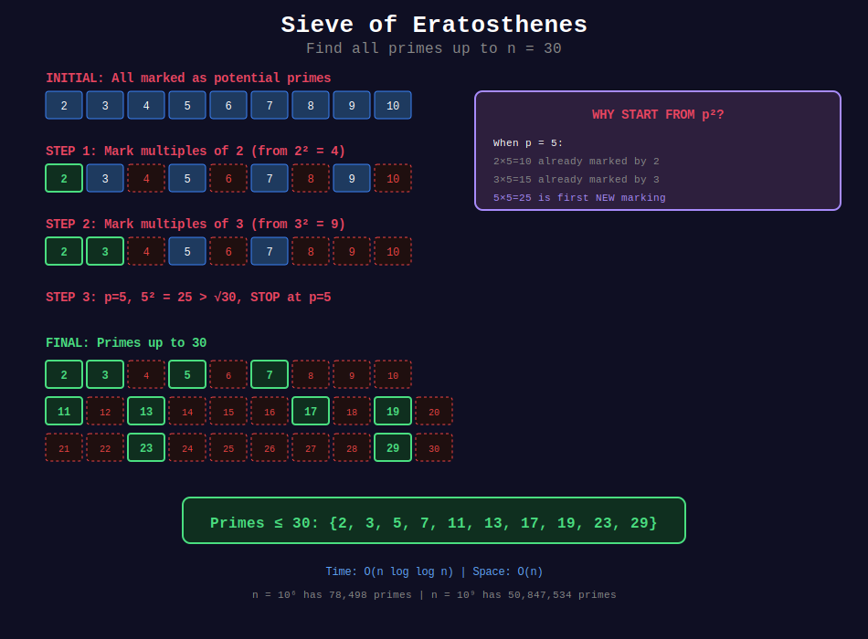

<div align="center">

# 🔢 Sieve of Eratosthenes

<p>
  
  
</p>

**The Ancient Algorithm for Finding All Primes**

*From 240 BC - Still one of the most efficient methods*

</div>

---

## 🧭 Navigation

| ⬅️ Previous | 📂 Current | ➡️ Next |
|:------------|:----------:|--------:|
| [← 01. Primality Testing](../01_primality_testing/README.md) | **02. Sieve of Eratosthenes** | [03. Prime Factorization →](../03_prime_factorization/README.md) |

---

## 📐 Mathematical Foundations

### 1️⃣ Algorithm Overview

**Core Idea:** Iteratively mark multiples of each prime as composite.

**Pseudocode:**

```
1. Create list [0, 1, 2, 3, ..., n], mark 0 and 1 as not prime

2. Start with first prime p = 2
3. Mark all multiples of p (starting from p²) as composite

4. Find next unmarked number > p, set as new p

5. Repeat until p² > n

6. Remaining unmarked numbers are prime

```

---

### 2️⃣ Why Start from p²?

**Key Optimization:** Start marking from $p^2$, not $2p$.

**Reason:** For any composite $k \cdot p$ where $k < p$, the number was already marked by a prime factor of $k$.

**Example:** When p = 5:

- 2×5 = 10 was marked by 2
- 3×5 = 15 was marked by 3
- 4×5 = 20 was marked by 2
- 5×5 = 25 is first new marking

---

### 3️⃣ Time Complexity Analysis

**Theorem:** Sieve of Eratosthenes runs in $O(n \log \log n)$.

**Proof:**
Work done = $\sum_{p \leq n, p \text{ prime}} \frac{n}{p}$

$= n \cdot \sum_{p \leq n} \frac{1}{p}$

$\approx n \cdot \ln \ln n$ (by Meissel-Mertens theorem)

Therefore: $T(n) = O(n \log \log n)$ ∎

---

### 4️⃣ Space Optimization Techniques

| Technique | Space | Description |
|-----------|-------|-------------|
| Basic | O(n) | Boolean array for all n |
| Odd-only | O(n/2) | Skip even numbers (except 2) |
| Bitset | O(n/8) | Use bits instead of bytes |
| Segmented | O(√n) | Process in blocks |

---

## 📊 Visual Diagram

<div align="center">



</div>

---

## 🎨 Visual Walkthroughs

### Walkthrough 1: Basic Sieve

```
+-----------------------------------------------------------------+
| PROBLEM: Find all primes up to 30                              |
+-----------------------------------------------------------------+
| STEP 0: Initialize array                                       |
|                                                                 |
|   Index:  0  1  2  3  4  5  6  7  8  9 10 11 12 13 14 15      |
|   Value:  ×  ×  ✓  ✓  ✓  ✓  ✓  ✓  ✓  ✓  ✓  ✓  ✓  ✓  ✓  ✓      |
|                                                                 |
|   Index: 16 17 18 19 20 21 22 23 24 25 26 27 28 29 30         |
|   Value:  ✓  ✓  ✓  ✓  ✓  ✓  ✓  ✓  ✓  ✓  ✓  ✓  ✓  ✓  ✓         |
|                                                                 |
| STEP 1: p = 2 (first prime)                                    |
|   Mark multiples starting from 2² = 4: 4, 6, 8, 10, ...       |
|                                                                 |
|   Index:  0  1  2  3  4  5  6  7  8  9 10 11 12 13 14 15      |
|   Value:  ×  ×  ✓  ✓  ×  ✓  ×  ✓  ×  ✓  ×  ✓  ×  ✓  ×  ✓      |
|                                                                 |
|   Index: 16 17 18 19 20 21 22 23 24 25 26 27 28 29 30         |
|   Value:  ×  ✓  ×  ✓  ×  ✓  ×  ✓  ×  ✓  ×  ✓  ×  ✓  ×         |
|                                                                 |
| STEP 2: p = 3 (next unmarked)                                  |
|   Mark multiples starting from 3² = 9: 9, 12, 15, ...         |
|   (Some already marked by 2)                                   |
|                                                                 |
|   Index:  0  1  2  3  4  5  6  7  8  9 10 11 12 13 14 15      |
|   Value:  ×  ×  ✓  ✓  ×  ✓  ×  ✓  ×  ×  ×  ✓  ×  ✓  ×  ×      |
|                                                                 |
|   Index: 16 17 18 19 20 21 22 23 24 25 26 27 28 29 30         |
|   Value:  ×  ✓  ×  ✓  ×  ×  ×  ✓  ×  ✓  ×  ×  ×  ✓  ×         |
|                                                                 |
| STEP 3: p = 5 (next unmarked)                                  |
|   Mark multiples starting from 5² = 25: 25, 30                |
|                                                                 |
|   Index: 25 26 27 28 29 30                                    |
|   Value:  ×  ×  ×  ×  ✓  ×  (25 newly marked)                 |
|                                                                 |
| STEP 4: p = 7, but 7² = 49 > 30, so STOP                      |
|                                                                 |
| RESULT: Primes = {2, 3, 5, 7, 11, 13, 17, 19, 23, 29}         |
|         Count = 10 primes                                      |
+-----------------------------------------------------------------+

```

---

### Walkthrough 2: Why p² Optimization Works

```
+-----------------------------------------------------------------+
| When processing p = 7, why start at 7² = 49?                   |
+-----------------------------------------------------------------+
|                                                                 |
| Multiples of 7 less than 49:                                   |
|                                                                 |
|   2 × 7 = 14  ← Already marked when p = 2                     |
|   3 × 7 = 21  ← Already marked when p = 3                     |
|   4 × 7 = 28  ← Already marked when p = 2 (4 = 2×2)           |
|   5 × 7 = 35  ← Already marked when p = 5                     |
|   6 × 7 = 42  ← Already marked when p = 2 (6 = 2×3)           |
|                                                                 |
| First NEW multiple to mark: 7 × 7 = 49                        |
|                                                                 |
| GENERAL RULE:                                                   |
|   For prime p, any composite p × k where k < p                 |
|   has a prime factor < p, so already marked.                   |
|                                                                 |
| SAVINGS:                                                        |
|   Without optimization: mark n/p multiples                     |
|   With optimization: mark n/p - p multiples                    |
|                                                                 |
|   For p = 7, n = 100:                                          |
|   Without: 14 multiples (14, 21, 28, ..., 98)                 |
|   With: 7 multiples (49, 56, 63, ..., 98)                     |
|   50% fewer operations!                                        |
+-----------------------------------------------------------------+

```

---

### Walkthrough 3: Linear Sieve Concept

```
+-----------------------------------------------------------------+
| LINEAR SIEVE: Mark each composite exactly ONCE                 |
+-----------------------------------------------------------------+
|                                                                 |
| Key Idea: Mark i × p where p = smallest prime factor of i×p   |
|                                                                 |
| Example for n = 12:                                            |
|                                                                 |
| i=2: primes=[]                                                 |
|   2 is prime → add to list, primes = [2]                       |
|                                                                 |
| i=3: primes=[2]                                                |
|   3 is prime → add to list, primes = [2, 3]                    |
|   Mark 2×3=6 with SPF=2                                        |
|   Stop: 3 % 2 ≠ 0                                              |
|                                                                 |
| i=4: primes=[2,3]                                              |
|   4 = 2×2, SPF[4]=2, not prime                                 |
|   Mark 2×4=8 with SPF=2                                        |
|   Stop: 4 % 2 = 0 (KEY! This prevents duplicate marking)       |
|                                                                 |
| i=5: primes=[2,3]                                              |
|   5 is prime → add, primes = [2, 3, 5]                         |
|   Mark 2×5=10 with SPF=2                                       |
|   Stop: 5 % 2 ≠ 0, but 3×5=15 > 12                             |
|                                                                 |
| i=6: SPF[6]=2                                                  |
|   Mark 2×6=12 with SPF=2                                       |
|   Stop: 6 % 2 = 0                                              |
|                                                                 |
| Result: Each composite marked EXACTLY once by its SPF          |
|   4 marked once, 6 marked once, 8 marked once, etc.           |
|                                                                 |
| TIME: O(n) - truly linear!                                     |
+-----------------------------------------------------------------+

```

---

## 💻 Code Implementations

### Implementation 1: Basic Sieve

```python
def sieve_of_eratosthenes(n: int) -> list[int]:
    """
    Find all primes up to n.
    
    Time: O(n log log n)
    Space: O(n)
    
    Examples:
        >>> sieve_of_eratosthenes(30)
        [2, 3, 5, 7, 11, 13, 17, 19, 23, 29]
        >>> len(sieve_of_eratosthenes(100))
        25
    """
    if n < 2:
        return []
    
    is_prime = [True] * (n + 1)
    is_prime[0] = is_prime[1] = False
    
    for i in range(2, int(n**0.5) + 1):
        if is_prime[i]:
            # Mark multiples starting from i²
            for j in range(i * i, n + 1, i):
                is_prime[j] = False
    
    return [i for i in range(n + 1) if is_prime[i]]

```

---

### Implementation 2: Optimized (Odd Numbers Only)

```python
def sieve_optimized(n: int) -> list[int]:
    """
    Space-optimized sieve storing only odd numbers.
    
    Time: O(n log log n)
    Space: O(n/2)
    
    Index i represents number 2i + 3
    """
    if n < 2:
        return []
    if n == 2:
        return [2]
    
    # Only store odd numbers >= 3
    size = (n - 1) // 2
    is_prime = [True] * size
    
    primes = [2]
    
    for i in range(size):
        if is_prime[i]:
            p = 2 * i + 3  # Convert index to number
            primes.append(p)
            
            # Mark odd multiples of p
            if p * p <= n:
                # First odd multiple >= p² is p²
                # Index of p² is (p² - 3) // 2
                start = (p * p - 3) // 2
                for j in range(start, size, p):
                    is_prime[j] = False
    
    return primes

```

---

### Implementation 3: Linear Sieve (Euler's Sieve)

```python
def linear_sieve(n: int) -> tuple[list[int], list[int]]:
    """
    Linear time sieve - each composite marked exactly once.
    
    Time: O(n)
    Space: O(n)
    
    Also computes smallest prime factor (SPF) for each number.
    
    Returns:
        (primes, spf) where spf[i] = smallest prime factor of i
    
    Example:
        >>> primes, spf = linear_sieve(20)
        >>> primes
        [2, 3, 5, 7, 11, 13, 17, 19]
        >>> spf[12]
        2
    """
    spf = [0] * (n + 1)  # Smallest prime factor
    primes = []
    
    for i in range(2, n + 1):
        if spf[i] == 0:
            # i is prime
            spf[i] = i
            primes.append(i)
        
        # Mark composites: i × p for each prime p ≤ spf[i]
        for p in primes:
            if p * i > n:
                break
            
            spf[p * i] = p
            
            # KEY: Stop when p divides i
            # This ensures each composite is marked exactly once
            if i % p == 0:
                break
    
    return primes, spf

```

---

### Implementation 4: LeetCode 204 - Count Primes

```python
class Solution:
    def countPrimes(self, n: int) -> int:
        """
        Count primes LESS THAN n.
        
        Time: O(n log log n)
        Space: O(n)
        """
        if n <= 2:
            return 0
        
        is_prime = [True] * n
        is_prime[0] = is_prime[1] = False
        
        for i in range(2, int(n**0.5) + 1):
            if is_prime[i]:
                # Mark multiples
                for j in range(i * i, n, i):
                    is_prime[j] = False
        
        return sum(is_prime)

```

---

### Implementation 5: Sieve with Boolean Array (Memory Efficient)

```python
def sieve_bitset(n: int) -> list[int]:
    """
    Ultra memory-efficient sieve using bit manipulation.
    
    Space: O(n/16) bytes (only odd numbers, packed bits)
    
    Each bit represents primality of an odd number.
    """
    if n < 2:
        return []
    
    # Bit array for odd numbers 3, 5, 7, ...
    size = (n - 1) // 2
    num_bytes = (size + 7) // 8
    bits = bytearray([0xFF] * num_bytes)  # All bits set
    
    def get_bit(i: int) -> bool:
        return (bits[i >> 3] >> (i & 7)) & 1
    
    def clear_bit(i: int):
        bits[i >> 3] &= ~(1 << (i & 7))
    
    primes = [2]
    
    for i in range(size):
        if get_bit(i):
            p = 2 * i + 3
            primes.append(p)
            
            if p * p <= n:
                start = (p * p - 3) // 2
                for j in range(start, size, p):
                    clear_bit(j)
    
    return primes

```

---

### Implementation 6: Visualization

```python
def sieve_visualize(n: int) -> list[int]:
    """
    Educational sieve with step-by-step visualization.
    """
    print(f"\n{'='*60}")
    print(f"Sieve of Eratosthenes for n = {n}")
    print('='*60)
    
    if n < 2:
        print("No primes (n < 2)")
        return []
    
    is_prime = [True] * (n + 1)
    is_prime[0] = is_prime[1] = False
    
    def show_state(step: str = ""):
        nums = []
        for i in range(2, min(n + 1, 50)):  # Show first 50
            if is_prime[i]:
                nums.append(f"{i:3d}")
            else:
                nums.append("  ×")
        
        if step:
            print(f"\n{step}")
        print(" ".join(nums))
        if n > 50:
            print("  ...")
    
    show_state("Initial (all marked as potential primes):")
    
    for i in range(2, int(n**0.5) + 1):
        if is_prime[i]:
            marked_count = 0
            for j in range(i * i, n + 1, i):
                if is_prime[j]:
                    is_prime[j] = False
                    marked_count += 1
            
            show_state(f"After marking multiples of {i} (marked {marked_count} new):")
    
    primes = [i for i in range(n + 1) if is_prime[i]]
    print(f"\nFinal primes: {primes[:20]}{'...' if len(primes) > 20 else ''}")
    print(f"Total count: {len(primes)} primes")
    
    return primes

# Example
# sieve_visualize(50)

```

---

## 🏆 LeetCode Problems

### 🟢 Easy

| # | Problem | Key Concept | Time |
|:-:|---------|-------------|------|
| 204 | [Count Primes](https://leetcode.com/problems/count-primes/) | Basic sieve | O(n log log n) |

### 🟡 Medium

| # | Problem | Key Concept | Time |
|:-:|---------|-------------|------|
| 2523 | [Closest Prime Numbers in Range](https://leetcode.com/problems/closest-prime-numbers-in-range/) | Sieve + gap finding | O((R-L) log log R) |
| 2601 | [Prime Subtraction Operation](https://leetcode.com/problems/prime-subtraction-operation/) | Precompute primes | O(n log m) |
| 2761 | [Prime Pairs With Target Sum](https://leetcode.com/problems/prime-pairs-with-target-sum/) | Sieve + two-sum | O(n log log n) |

---

## 💻 Solutions to Key Problems

### Problem 2523: Closest Prime Numbers in Range

```python
class Solution:
    def closestPrimes(self, left: int, right: int) -> list[int]:
        """
        Find pair of primes in [left, right] with minimum gap.
        
        Time: O((R-L) log log R + √R)
        Space: O(R-L)
        """
        from math import isqrt
        
        # Sieve to find primes up to sqrt(right)
        limit = isqrt(right) + 1
        is_small_prime = [True] * (limit + 1)
        is_small_prime[0] = is_small_prime[1] = False
        
        for i in range(2, isqrt(limit) + 1):
            if is_small_prime[i]:
                for j in range(i*i, limit + 1, i):
                    is_small_prime[j] = False
        
        small_primes = [i for i in range(2, limit + 1) if is_small_prime[i]]
        
        # Sieve the range [left, right]
        size = right - left + 1
        is_prime = [True] * size
        
        # Handle 0 and 1
        for i in range(max(0, 2 - left)):
            is_prime[i] = False
        
        for p in small_primes:
            start = max(p * p, ((left + p - 1) // p) * p)
            if start == p:
                start += p
            for j in range(start, right + 1, p):
                is_prime[j - left] = False
        
        # Collect primes and find minimum gap
        primes = [left + i for i in range(size) if is_prime[i] and left + i >= 2]
        
        if len(primes) < 2:
            return [-1, -1]
        
        min_gap = float('inf')
        result = [-1, -1]
        
        for i in range(1, len(primes)):
            gap = primes[i] - primes[i-1]
            if gap < min_gap:
                min_gap = gap
                result = [primes[i-1], primes[i]]
        
        return result

```

---

## 💡 Key Insights

> **Why O(n log log n)?**  
> Sum of 1/p over primes p ≤ n is approximately ln(ln(n)).  
> Total work = n × (1/2 + 1/3 + 1/5 + 1/7 + ...) ≈ n ln ln n

> **Memory Optimization Progression:**  
> 1. Basic: n bytes  
> 2. Odd-only: n/2 bytes  
> 3. Packed bits: n/16 bytes  
> 4. Segmented: √n bytes

> **Linear Sieve Advantage:**  
> - O(n) time instead of O(n log log n)
> - Computes SPF for O(log n) factorization
> - Each composite marked exactly once

> **When to Use Which:**  
> | Scenario | Best Choice |
> |----------|-------------|
> | n ≤ 10^6, simple | Basic sieve |
> | n ≤ 10^8, need SPF | Linear sieve |
> | n ≤ 10^9, memory limited | Segmented sieve |
> | Range [L, R], R large | Segmented sieve |

---

## 📊 Performance Benchmarks

| n | Basic Sieve | Linear Sieve | Prime Count |
|---|-------------|--------------|-------------|
| 10^4 | <1ms | <1ms | 1,229 |
| 10^5 | 1ms | <1ms | 9,592 |
| 10^6 | 10ms | 5ms | 78,498 |
| 10^7 | 100ms | 50ms | 664,579 |
| 10^8 | 1s | 500ms | 5,761,455 |

---

## 📚 References

| Resource | Link |
|----------|------|
| **CP-Algorithms** | [Sieve of Eratosthenes](https://cp-algorithms.com/algebra/sieve-of-eratosthenes.html) |
| **Wikipedia** | [Sieve of Eratosthenes](https://en.wikipedia.org/wiki/Sieve_of_Eratosthenes) |
| **OEIS** | [Prime Counting A000720](https://oeis.org/A000720) |

---

<div align="center">

**Made with ❤️ by [Gaurav Goswami](https://github.com/Gaurav14cs17)**

</div>

---

## 🧭 Navigation

| ⬅️ Previous | 📂 Current | ➡️ Next |
|:------------|:----------:|--------:|
| [← 01. Primality Testing](../01_primality_testing/README.md) | **02. Sieve of Eratosthenes** | [03. Prime Factorization →](../03_prime_factorization/README.md) |
