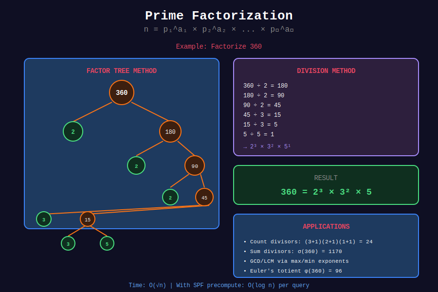

<div align="center">

# 🔬 Prime Factorization

<p>
  
  
</p>

**Decomposing Numbers into Prime Building Blocks**

*The Fundamental Theorem of Arithmetic in action*

</div>

---

## 🧭 Navigation

| ⬅️ Previous | 📂 Current | ➡️ Next |
|:------------|:----------:|--------:|
| [← 02. Sieve of Eratosthenes](../02_sieve_eratosthenes/README.md) | **03. Prime Factorization** | [04. Segmented Sieve →](../04_segmented_sieve/README.md) |

---

## 📐 Mathematical Foundations

### 1️⃣ Fundamental Theorem of Arithmetic

**Theorem:** Every integer $n > 1$ can be expressed **uniquely** as a product of prime powers:

```math
n = p_1^{a_1} \times p_2^{a_2} \times \cdots \times p_k^{a_k}

```

where $p\_1 < p\_2 < \cdots < p\_k$ are primes and $a\_i \geq 1$.

**Example:**

```math
360 = 2^3 \times 3^2 \times 5^1

```

---

### 2️⃣ Applications of Factorization

**Divisor Count (τ function):**

```math
\tau(n) = (a_1 + 1)(a_2 + 1) \cdots (a_k + 1)

```

**Divisor Sum (σ function):**

```math
\sigma(n) = \prod_{i=1}^{k} \frac{p_i^{a_i+1} - 1}{p_i - 1}

```

**Euler's Totient (φ function):**

```math
\phi(n) = n \prod_{i=1}^{k} \left(1 - \frac{1}{p_i}\right)

```

---

### 3️⃣ Factorization Methods

| Method | Time | Space | Best For |
|--------|------|-------|----------|
| Trial Division | O(√n) | O(log n) | Single number |
| With SPF | O(log n) | O(n) | Multiple queries |
| Pollard's Rho | O(n^(1/4)) | O(1) | Very large n |

---

## 📊 Visual Diagram

<div align="center">



</div>

---

## 🎨 Visual Walkthroughs

### Walkthrough 1: Trial Division Factorization

```
+-----------------------------------------------------------------+
| PROBLEM: Factorize 360                                         |
+-----------------------------------------------------------------+
| ALGORITHM: Divide by smallest prime repeatedly                 |
|                                                                 |
| STEP 1: Try d = 2                                              |
|   +-----------------------------------------------------+      |
|   | 360 ÷ 2 = 180   factors: {2: 1}                    |      |
|   | 180 ÷ 2 = 90    factors: {2: 2}                    |      |
|   |  90 ÷ 2 = 45    factors: {2: 3}                    |      |
|   |  45 ÷ 2 = 22.5  ✗ (not divisible)                  |      |
|   +-----------------------------------------------------+      |
|   Remaining: 45                                                 |
|                                                                 |
| STEP 2: Try d = 3                                              |
|   +-----------------------------------------------------+      |
|   | 45 ÷ 3 = 15     factors: {2: 3, 3: 1}              |      |
|   | 15 ÷ 3 = 5      factors: {2: 3, 3: 2}              |      |
|   |  5 ÷ 3 = 1.67   ✗ (not divisible)                  |      |
|   +-----------------------------------------------------+      |
|   Remaining: 5                                                  |
|                                                                 |
| STEP 3: Try d = 4, 5, ...                                      |
|   d = 4: Skip (4² = 16 > 5? No, but 5 % 4 ≠ 0)                |
|   d² = 16 > 5: STOP, remaining 5 is prime                      |
|                                                                 |
| RESULT: 360 = 2³ × 3² × 5¹                                     |
|         factors = {2: 3, 3: 2, 5: 1}                           |
|                                                                 |
| VERIFICATION:                                                   |
|   2³ = 8, 3² = 9, 5¹ = 5                                       |
|   8 × 9 × 5 = 72 × 5 = 360 ✓                                  |
+-----------------------------------------------------------------+

```

---

### Walkthrough 2: Divisor Count Formula

```
+-----------------------------------------------------------------+
| PROBLEM: Count divisors of 360                                 |
+-----------------------------------------------------------------+
| STEP 1: Factorize                                              |
|   360 = 2³ × 3² × 5¹                                           |
|                                                                 |
| STEP 2: Apply formula τ(n) = ∏(aᵢ + 1)                         |
|                                                                 |
|   τ(360) = (3+1) × (2+1) × (1+1)                               |
|          = 4 × 3 × 2                                            |
|          = 24                                                   |
|                                                                 |
| WHY IT WORKS:                                                   |
|   Each divisor has form 2^a × 3^b × 5^c                        |
|   where 0 ≤ a ≤ 3, 0 ≤ b ≤ 2, 0 ≤ c ≤ 1                       |
|                                                                 |
|   Choices for a: 0, 1, 2, 3     → 4 choices                    |
|   Choices for b: 0, 1, 2        → 3 choices                    |
|   Choices for c: 0, 1           → 2 choices                    |
|                                                                 |
|   Total combinations: 4 × 3 × 2 = 24                           |
|                                                                 |
| DIVISORS OF 360:                                               |
|   1, 2, 3, 4, 5, 6, 8, 9, 10, 12, 15, 18,                     |
|   20, 24, 30, 36, 40, 45, 60, 72, 90, 120, 180, 360           |
|                                                                 |
|   Count: 24 ✓                                                   |
+-----------------------------------------------------------------+

```

---

### Walkthrough 3: Factorization with SPF

```
+-----------------------------------------------------------------+
| FAST FACTORIZATION using Smallest Prime Factor (SPF)           |
+-----------------------------------------------------------------+
| PRECOMPUTATION: SPF array (computed via linear sieve)          |
|                                                                 |
|   Number:   2  3  4  5  6  7  8  9 10 11 12 ...               |
|   SPF:      2  3  2  5  2  7  2  3  2 11  2 ...               |
|                                                                 |
| FACTORIZE 360:                                                  |
|                                                                 |
|   n = 360, SPF[360] = 2                                        |
|   → Factor: 2, n = 360 ÷ 2 = 180                               |
|                                                                 |
|   n = 180, SPF[180] = 2                                        |
|   → Factor: 2, n = 180 ÷ 2 = 90                                |
|                                                                 |
|   n = 90, SPF[90] = 2                                          |
|   → Factor: 2, n = 90 ÷ 2 = 45                                 |
|                                                                 |
|   n = 45, SPF[45] = 3                                          |
|   → Factor: 3, n = 45 ÷ 3 = 15                                 |
|                                                                 |
|   n = 15, SPF[15] = 3                                          |
|   → Factor: 3, n = 15 ÷ 3 = 5                                  |
|                                                                 |
|   n = 5, SPF[5] = 5                                            |
|   → Factor: 5, n = 5 ÷ 5 = 1                                   |
|                                                                 |
|   n = 1: DONE                                                   |
|                                                                 |
| RESULT: [2, 2, 2, 3, 3, 5] → {2: 3, 3: 2, 5: 1}               |
|                                                                 |
| TIME: O(log n) - only 6 steps for 360!                         |
|       (vs O(√n) ≈ 19 steps for trial division)                 |
+-----------------------------------------------------------------+

```

---

## 💻 Code Implementations

### Implementation 1: Trial Division

```python
def prime_factorize(n: int) -> dict[int, int]:
    """
    Find prime factorization using trial division.
    
    Time: O(√n)
    Space: O(log n)
    
    Returns: dict {prime: exponent}
    
    Examples:
        >>> prime_factorize(360)
        {2: 3, 3: 2, 5: 1}
        >>> prime_factorize(97)
        {97: 1}
    """
    factors = {}
    
    # Check for 2
    while n % 2 == 0:
        factors[2] = factors.get(2, 0) + 1
        n //= 2
    
    # Check odd factors
    d = 3
    while d * d <= n:
        while n % d == 0:
            factors[d] = factors.get(d, 0) + 1
            n //= d
        d += 2
    
    # Remaining prime factor > √original
    if n > 1:
        factors[n] = 1
    
    return factors

```

---

### Implementation 2: Return List of Factors

```python
def get_prime_factors_list(n: int) -> list[int]:
    """
    Get list of prime factors (with repetition).
    
    Time: O(√n)
    Space: O(log n)
    
    Examples:
        >>> get_prime_factors_list(360)
        [2, 2, 2, 3, 3, 5]
        >>> get_prime_factors_list(12)
        [2, 2, 3]
    """
    factors = []
    d = 2
    
    while d * d <= n:
        while n % d == 0:
            factors.append(d)
            n //= d
        d += 1
    
    if n > 1:
        factors.append(n)
    
    return factors

```

---

### Implementation 3: Factorization with SPF (Fastest)

```python
def precompute_spf(limit: int) -> list[int]:
    """
    Precompute smallest prime factor for all numbers up to limit.
    
    Time: O(n log log n)
    Space: O(n)
    """
    spf = list(range(limit + 1))
    
    for i in range(2, int(limit**0.5) + 1):
        if spf[i] == i:  # i is prime
            for j in range(i * i, limit + 1, i):
                if spf[j] == j:
                    spf[j] = i
    
    return spf

def factorize_with_spf(n: int, spf: list[int]) -> dict[int, int]:
    """
    Factorize n using precomputed SPF.
    
    Time: O(log n)
    Space: O(log n)
    
    Example:
        >>> spf = precompute_spf(1000)
        >>> factorize_with_spf(360, spf)
        {2: 3, 3: 2, 5: 1}
    """
    factors = {}
    
    while n > 1:
        p = spf[n]
        factors[p] = factors.get(p, 0) + 1
        n //= p
    
    return factors

def factorize_list_with_spf(n: int, spf: list[int]) -> list[int]:
    """
    Get list of prime factors using SPF.
    
    Time: O(log n)
    """
    factors = []
    while n > 1:
        factors.append(spf[n])
        n //= spf[n]
    return factors

```

---

### Implementation 4: Divisor Count

```python
def count_divisors(n: int) -> int:
    """
    Count divisors using τ(n) = ∏(aᵢ + 1).
    
    Time: O(√n)
    Space: O(1)
    
    Examples:
        >>> count_divisors(12)
        6  # divisors: 1, 2, 3, 4, 6, 12
        >>> count_divisors(360)
        24
    """
    if n == 1:
        return 1
    
    count = 1
    d = 2
    
    while d * d <= n:
        exp = 0
        while n % d == 0:
            exp += 1
            n //= d
        count *= (exp + 1)
        d += 1
    
    if n > 1:
        count *= 2  # Remaining prime has exponent 1
    
    return count

def count_divisors_with_spf(n: int, spf: list[int]) -> int:
    """
    Count divisors using precomputed SPF.
    
    Time: O(log n)
    """
    count = 1
    while n > 1:
        p = spf[n]
        exp = 0
        while n % p == 0:
            exp += 1
            n //= p
        count *= (exp + 1)
    return count

```

---

### Implementation 5: Sum of Divisors

```python
def sum_of_divisors(n: int) -> int:
    """
    Calculate sum of all divisors using σ(n) formula.
    
    σ(n) = ∏ (p^(a+1) - 1) / (p - 1)
    
    Time: O(√n)
    Space: O(1)
    
    Examples:
        >>> sum_of_divisors(12)
        28  # 1+2+3+4+6+12 = 28
        >>> sum_of_divisors(360)
        1170
    """
    result = 1
    d = 2
    
    while d * d <= n:
        if n % d == 0:
            # Calculate sum of geometric series: 1 + p + p² + ... + p^a
            p_power = 1
            term_sum = 0
            
            while n % d == 0:
                p_power *= d
                term_sum += p_power
                n //= d
            
            term_sum += 1  # Add p^0 = 1
            result *= term_sum
        d += 1
    
    if n > 1:
        result *= (1 + n)  # Remaining prime contributes 1 + p
    
    return result

```

---

### Implementation 6: Get All Divisors

```python
def get_all_divisors(n: int) -> list[int]:
    """
    Get all divisors of n using prime factorization.
    
    Time: O(√n + d(n)) where d(n) = number of divisors
    Space: O(d(n))
    
    Example:
        >>> get_all_divisors(12)
        [1, 2, 3, 4, 6, 12]
    """
    factors = prime_factorize(n)
    
    divisors = [1]
    
    for prime, exp in factors.items():
        new_divisors = []
        power = 1
        
        for _ in range(exp + 1):
            for d in divisors:
                new_divisors.append(d * power)
            power *= prime
        
        divisors = new_divisors
    
    return sorted(divisors)

def get_all_divisors_direct(n: int) -> list[int]:
    """
    Get all divisors directly (simpler but same complexity).
    
    Time: O(√n)
    Space: O(d(n))
    """
    divisors = []
    
    d = 1
    while d * d <= n:
        if n % d == 0:
            divisors.append(d)
            if d * d != n:
                divisors.append(n // d)
        d += 1
    
    return sorted(divisors)

```

---

### Implementation 7: Euler's Totient

```python
def euler_totient(n: int) -> int:
    """
    Calculate Euler's totient φ(n) using factorization.
    
    φ(n) = n × ∏(1 - 1/p) for each prime p dividing n
    
    Time: O(√n)
    Space: O(1)
    
    Examples:
        >>> euler_totient(12)
        4  # Numbers coprime to 12: 1, 5, 7, 11
        >>> euler_totient(36)
        12
    """
    result = n
    d = 2
    
    while d * d <= n:
        if n % d == 0:
            # Remove factor p: φ = φ × (1 - 1/p) = φ - φ/p
            result -= result // d
            
            while n % d == 0:
                n //= d
        d += 1
    
    if n > 1:
        result -= result // n
    
    return result

```

---

## 🏆 LeetCode Problems

### 🟢 Easy

| # | Problem | Key Concept | Time |
|:-:|---------|-------------|------|
| 263 | [Ugly Number](https://leetcode.com/problems/ugly-number/) | Prime factor check | O(log n) |

### 🟡 Medium

| # | Problem | Key Concept | Time |
|:-:|---------|-------------|------|
| 264 | [Ugly Number II](https://leetcode.com/problems/ugly-number-ii/) | Generate sequence | O(n) |
| 313 | [Super Ugly Number](https://leetcode.com/problems/super-ugly-number/) | Multiple primes | O(nk) |
| 1390 | [Four Divisors](https://leetcode.com/problems/four-divisors/) | Divisor counting | O(n√m) |

### 🔴 Hard

| # | Problem | Key Concept | Time |
|:-:|---------|-------------|------|
| 952 | [Largest Component Size by Common Factor](https://leetcode.com/problems/largest-component-size-by-common-factor/) | Union-Find + factorization | O(n√m) |

---

## 💻 Solutions to Key Problems

### Problem 263: Ugly Number

```python
class Solution:
    def isUgly(self, n: int) -> bool:
        """
        Check if n's only prime factors are 2, 3, 5.
        
        Time: O(log n)
        Space: O(1)
        """
        if n <= 0:
            return False
        
        for p in [2, 3, 5]:
            while n % p == 0:
                n //= p
        
        return n == 1

```

### Problem 264: Ugly Number II

```python
class Solution:
    def nthUglyNumber(self, n: int) -> int:
        """
        Find nth ugly number (factors only 2, 3, 5).
        
        Dynamic programming approach with three pointers.
        
        Time: O(n)
        Space: O(n)
        """
        ugly = [1] * n
        i2 = i3 = i5 = 0
        
        for i in range(1, n):
            next2 = ugly[i2] * 2
            next3 = ugly[i3] * 3
            next5 = ugly[i5] * 5
            
            ugly[i] = min(next2, next3, next5)
            
            # Move pointers (may move multiple if there are ties)
            if ugly[i] == next2:
                i2 += 1
            if ugly[i] == next3:
                i3 += 1
            if ugly[i] == next5:
                i5 += 1
        
        return ugly[n - 1]

```

### Problem 1390: Four Divisors

```python
class Solution:
    def sumFourDivisors(self, nums: list[int]) -> int:
        """
        Sum of all numbers with exactly 4 divisors.
        
        n has exactly 4 divisors iff:
        1. n = p³ → divisors: 1, p, p², p³
        2. n = p × q → divisors: 1, p, q, pq
        
        Time: O(n√m) where m = max(nums)
        Space: O(1)
        """
        def sum_if_four_divisors(n: int) -> int:
            divisors = []
            d = 1
            
            while d * d <= n:
                if n % d == 0:
                    divisors.append(d)
                    if d * d != n:
                        divisors.append(n // d)
                    
                    if len(divisors) > 4:
                        return 0
                d += 1
            
            return sum(divisors) if len(divisors) == 4 else 0
        
        return sum(sum_if_four_divisors(n) for n in nums)

```

---

## 💡 Key Insights

> **Number of Distinct Prime Factors:**  
> - Average: O(log log n)  
> - Maximum for n ≤ 10⁹: 9 primes (2×3×5×7×11×13×17×19×23 = 223,092,870)

> **Number of Total Prime Factors:**  
> - Maximum: log₂(n) (for powers of 2)

> **Highly Composite Numbers:**  
> Numbers with many divisors: 1, 2, 4, 6, 12, 24, 36, 48, 60, 120, 180, 240, 360...

> **Perfect Numbers:**  
> σ(n) = 2n (sum of proper divisors equals n)  
> Examples: 6, 28, 496, 8128...

> **SPF vs Trial Division:**  
> | n | Trial Division | With SPF |
> |---|----------------|----------|
> | 10^6 | ~1000 steps | ~20 steps |
> | 10^9 | ~31623 steps | ~30 steps |
> | 10^12 | ~10^6 steps | ~40 steps |

---

## 📊 Complexity Comparison

| Method | Preprocess | Query | Best For |
|--------|------------|-------|----------|
| Trial Division | None | O(√n) | Single large n |
| SPF Sieve | O(n log log n) | O(log n) | Many queries |
| Linear Sieve | O(n) | O(log n) | Many queries + need primes |

---

## 📚 References

| Resource | Link |
|----------|------|
| **CP-Algorithms** | [Factorization](https://cp-algorithms.com/algebra/factorization.html) |
| **Wikipedia** | [Prime Factorization](https://en.wikipedia.org/wiki/Integer_factorization) |
| **OEIS** | [Divisor Function A000005](https://oeis.org/A000005) |
| **OEIS** | [Euler Totient A000010](https://oeis.org/A000010) |

---

<div align="center">

**Made with ❤️ by [Gaurav Goswami](https://github.com/Gaurav14cs17)**

</div>

---

## 🧭 Navigation

| ⬅️ Previous | 📂 Current | ➡️ Next |
|:------------|:----------:|--------:|
| [← 02. Sieve of Eratosthenes](../02_sieve_eratosthenes/README.md) | **03. Prime Factorization** | [04. Segmented Sieve →](../04_segmented_sieve/README.md) |
