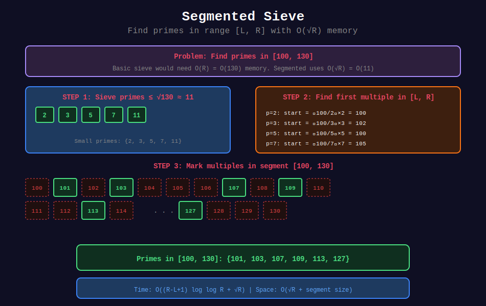

<div align="center">

# 📐 Segmented Sieve

<p>
  
  
</p>

**Memory-Efficient Prime Generation for Large Ranges**

*Finding primes when n is too large for regular sieve*

</div>

---

## 🧭 Navigation

| ⬅️ Previous | 📂 Current | ➡️ Next |
|:------------|:----------:|--------:|
| [← 03. Prime Factorization](../03_prime_factorization/README.md) | **04. Segmented Sieve** | [05. Prime Applications →](../05_prime_applications/README.md) |

---

## 📐 Mathematical Foundations

### 1️⃣ The Problem

**Challenge:** Find primes in range [L, R] where R can be 10^12 or larger.

**Standard Sieve Limitation:**
- Requires O(R) memory
- For R = 10^12, need ~1TB of memory!

**Segmented Sieve Solution:**
- Only need primes up to √R (about 10^6)
- Process range in blocks of size √R
- Space: O(√R) instead of O(R)

---

### 2️⃣ Key Insight

**Theorem:** If $n$ is composite, it has a prime factor $\leq \sqrt{n}$.

**Implication:** To sieve range [L, R], we only need primes up to $\sqrt{R}$.

**Algorithm:**
1. Generate small primes up to √R using standard sieve
2. Create boolean array for range [L, R] only
3. For each small prime p, mark its multiples in [L, R]

---

### 3️⃣ Finding First Multiple in Range

For prime $p$ and range starting at $L$:

**First multiple of p that is ≥ L:**

$$\text{start} = \left\lceil \frac{L}{p} \right\rceil \times p = \left(\frac{L + p - 1}{p}\right) \times p$$

**But skip p itself if it's in range:**

If start = p, then start = 2p (we want composite multiples only).

---

## 📊 Visual Diagram

<div align="center">



</div>

---

## 🎨 Visual Walkthroughs

### Walkthrough 1: Segmented Sieve Concept

```
┌─────────────────────────────────────────────────────────────────┐
│ PROBLEM: Find primes in range [100, 150]                       │
├─────────────────────────────────────────────────────────────────┤
│ STEP 1: Generate small primes up to √150 ≈ 12                  │
│                                                                 │
│   Primes ≤ 12: [2, 3, 5, 7, 11]                                │
│                                                                 │
│ STEP 2: Create array for range [100, 150]                      │
│                                                                 │
│   Index:    0   1   2   3   4   5   6   7   8   9  10         │
│   Number: 100 101 102 103 104 105 106 107 108 109 110         │
│   Prime?:  ✓   ✓   ✓   ✓   ✓   ✓   ✓   ✓   ✓   ✓   ✓         │
│                                                                 │
│ STEP 3: Mark multiples of small primes                         │
│                                                                 │
│   p = 2: First multiple ≥ 100 is 100                           │
│          Mark: 100, 102, 104, 106, 108, 110, ...               │
│                                                                 │
│   p = 3: First multiple ≥ 100 is 102                           │
│          Mark: 102, 105, 108, 111, ...                         │
│                                                                 │
│   p = 5: First multiple ≥ 100 is 100                           │
│          Mark: 100, 105, 110, 115, ...                         │
│                                                                 │
│   p = 7: First multiple ≥ 100 is 105                           │
│          Mark: 105, 112, 119, ...                              │
│                                                                 │
│   p = 11: First multiple ≥ 100 is 110                          │
│           Mark: 110, 121, 132, ...                             │
│                                                                 │
│ RESULT after marking:                                           │
│                                                                 │
│   Number: 100 101 102 103 104 105 106 107 108 109 110         │
│   Prime?:  ×   ✓   ×   ✓   ×   ×   ×   ✓   ×   ✓   ×          │
│                                                                 │
│ PRIMES in [100, 150]:                                          │
│   101, 103, 107, 109, 113, 127, 131, 137, 139, 149            │
└─────────────────────────────────────────────────────────────────┘
```

---

### Walkthrough 2: Finding First Multiple

```
┌─────────────────────────────────────────────────────────────────┐
│ HOW TO FIND: First multiple of p ≥ L                           │
├─────────────────────────────────────────────────────────────────┤
│                                                                 │
│ EXAMPLE: p = 7, L = 100                                        │
│                                                                 │
│ Method 1: Ceiling division                                     │
│                                                                 │
│   ⌈100/7⌉ = ⌈14.28...⌉ = 15                                   │
│   First multiple = 15 × 7 = 105                                │
│                                                                 │
│ Method 2: Formula (integer arithmetic)                         │
│                                                                 │
│   start = ((L + p - 1) // p) * p                               │
│         = ((100 + 7 - 1) // 7) * 7                             │
│         = (106 // 7) * 7                                       │
│         = 15 * 7                                               │
│         = 105                                                  │
│                                                                 │
│ Method 3: Using modulo                                         │
│                                                                 │
│   remainder = L % p = 100 % 7 = 2                              │
│   if remainder == 0: start = L                                 │
│   else: start = L + (p - remainder) = 100 + 5 = 105           │
│                                                                 │
│ SPECIAL CASE: If start == p, use start = 2*p                  │
│                                                                 │
│   Example: p = 101, L = 100                                    │
│   start = 101 (which is prime p itself)                        │
│   So use start = 202 instead                                   │
└─────────────────────────────────────────────────────────────────┘
```

---

### Walkthrough 3: Block-Based Sieve

```
┌─────────────────────────────────────────────────────────────────┐
│ GENERATING ALL PRIMES UP TO 10^9 WITH LIMITED MEMORY           │
├─────────────────────────────────────────────────────────────────┤
│                                                                 │
│ PARAMETERS:                                                     │
│   n = 10^9                                                     │
│   √n = 31623                                                   │
│   Block size = 10^6                                            │
│                                                                 │
│ PHASE 1: Generate primes up to √n                              │
│                                                                 │
│   Standard sieve for [2, 31623]                                │
│   Memory: ~32 KB                                               │
│   Primes found: 3,401                                          │
│                                                                 │
│ PHASE 2: Process in blocks                                     │
│                                                                 │
│   ┌─────────────────────────────────────────────────────┐      │
│   │ Block 1: [31624, 1031623]                          │      │
│   │   Create 1M boolean array                           │      │
│   │   Mark multiples of small primes                    │      │
│   │   Extract primes from block                         │      │
│   │   Free memory, repeat                               │      │
│   └─────────────────────────────────────────────────────┘      │
│                                                                 │
│   ┌─────────────────────────────────────────────────────┐      │
│   │ Block 2: [1031624, 2031623]                        │      │
│   │   ... same process ...                              │      │
│   └─────────────────────────────────────────────────────┘      │
│                                                                 │
│   ... repeat for 1000 blocks ...                               │
│                                                                 │
│ MEMORY USAGE:                                                   │
│   Small primes array: ~32 KB                                   │
│   Block array: ~1 MB                                           │
│   TOTAL: ~1 MB (vs 1 GB for standard sieve!)                   │
└─────────────────────────────────────────────────────────────────┘
```

---

## 💻 Code Implementations

### Implementation 1: Basic Segmented Sieve

```python
def segmented_sieve(L: int, R: int) -> list[int]:
    """
    Find all primes in range [L, R].
    
    Time: O((R-L) log log R + √R log log √R)
    Space: O(√R + (R-L))
    
    Examples:
        >>> segmented_sieve(100, 150)
        [101, 103, 107, 109, 113, 127, 131, 137, 139, 149]
        >>> len(segmented_sieve(10**9, 10**9 + 1000))
        # Returns primes near 10^9
    """
    from math import isqrt
    
    if R < 2:
        return []
    
    L = max(L, 2)
    
    # Step 1: Generate small primes up to √R
    limit = isqrt(R) + 1
    is_prime_small = [True] * (limit + 1)
    is_prime_small[0] = is_prime_small[1] = False
    
    for i in range(2, isqrt(limit) + 1):
        if is_prime_small[i]:
            for j in range(i * i, limit + 1, i):
                is_prime_small[j] = False
    
    small_primes = [i for i in range(2, limit + 1) if is_prime_small[i]]
    
    # Step 2: Create range array
    size = R - L + 1
    is_prime = [True] * size
    
    # Step 3: Mark multiples of small primes
    for p in small_primes:
        # Find first multiple of p that is >= L
        start = ((L + p - 1) // p) * p
        
        # Skip p itself if it's in range
        if start == p:
            start += p
        
        # Mark multiples
        for j in range(start, R + 1, p):
            is_prime[j - L] = False
    
    # Handle L = 0 or L = 1
    if L == 0 and size > 0:
        is_prime[0] = False
    if L <= 1 and 1 - L < size:
        is_prime[1 - L] = False
    
    return [L + i for i in range(size) if is_prime[i]]
```

---

### Implementation 2: Optimized Version

```python
def segmented_sieve_optimized(L: int, R: int) -> list[int]:
    """
    Optimized segmented sieve with early termination.
    
    Time: O((R-L) log log R + √R)
    Space: O(√R + (R-L))
    """
    from math import isqrt
    
    if R < 2:
        return []
    
    L = max(L, 2)
    
    # Generate small primes
    limit = isqrt(R) + 1
    small_primes = []
    is_prime_small = [True] * (limit + 1)
    
    for i in range(2, limit + 1):
        if is_prime_small[i]:
            small_primes.append(i)
            if i * i <= limit:
                for j in range(i * i, limit + 1, i):
                    is_prime_small[j] = False
    
    # Sieve the range
    size = R - L + 1
    is_prime = [True] * size
    
    for p in small_primes:
        # Early termination: if p² > R, remaining primes are too large
        if p * p > R:
            break
        
        # Find first composite multiple
        start = max(p * p, ((L + p - 1) // p) * p)
        if start < L:
            continue
        
        # Mark composites
        for j in range(start - L, size, p):
            is_prime[j] = False
    
    return [L + i for i in range(size) if is_prime[i]]
```

---

### Implementation 3: Count Primes in Range

```python
def count_primes_in_range(L: int, R: int) -> int:
    """
    Count primes in [L, R] without storing them.
    
    Time: O((R-L) log log R + √R)
    Space: O(√R + (R-L))
    """
    from math import isqrt
    
    if R < 2:
        return 0
    
    L = max(L, 2)
    
    limit = isqrt(R) + 1
    is_prime_small = [True] * (limit + 1)
    is_prime_small[0] = is_prime_small[1] = False
    
    small_primes = []
    for i in range(2, limit + 1):
        if is_prime_small[i]:
            small_primes.append(i)
            for j in range(i * i, limit + 1, i):
                is_prime_small[j] = False
    
    size = R - L + 1
    is_prime = [True] * size
    
    for p in small_primes:
        start = ((L + p - 1) // p) * p
        if start == p:
            start += p
        
        for j in range(start, R + 1, p):
            is_prime[j - L] = False
    
    return sum(is_prime)
```

---

### Implementation 4: Block-Based Sieve for Large n

```python
def segmented_sieve_blocks(n: int, block_size: int = 10**6) -> list[int]:
    """
    Generate all primes up to n using block-based segmented sieve.
    
    Memory-efficient for very large n.
    
    Time: O(n log log n)
    Space: O(√n + block_size)
    
    Args:
        n: Upper limit
        block_size: Size of each block (default 10^6)
    """
    from math import isqrt
    
    limit = isqrt(n) + 1
    
    # Generate small primes
    is_prime = [True] * (limit + 1)
    is_prime[0] = is_prime[1] = False
    
    for i in range(2, isqrt(limit) + 1):
        if is_prime[i]:
            for j in range(i * i, limit + 1, i):
                is_prime[j] = False
    
    small_primes = [i for i in range(2, limit + 1) if is_prime[i]]
    
    # Start with small primes
    all_primes = list(small_primes)
    
    # Process remaining range in blocks
    for start in range(limit + 1, n + 1, block_size):
        end = min(start + block_size - 1, n)
        size = end - start + 1
        
        block = [True] * size
        
        for p in small_primes:
            # First multiple of p in this block
            first = ((start + p - 1) // p) * p
            
            for j in range(first - start, size, p):
                block[j] = False
        
        # Collect primes from this block
        for i in range(size):
            if block[i]:
                all_primes.append(start + i)
    
    return all_primes
```

---

### Implementation 5: Prime Counting π(n)

```python
def prime_pi(n: int) -> int:
    """
    Count primes up to n using segmented sieve.
    
    π(n) = number of primes ≤ n
    
    Time: O(n / log log n) approximately
    Space: O(√n)
    
    Examples:
        >>> prime_pi(100)
        25
        >>> prime_pi(10**6)
        78498
    """
    from math import isqrt
    
    if n < 2:
        return 0
    
    limit = isqrt(n) + 1
    block_size = limit
    
    # Small primes
    is_prime = [True] * (limit + 1)
    is_prime[0] = is_prime[1] = False
    
    for i in range(2, isqrt(limit) + 1):
        if is_prime[i]:
            for j in range(i * i, limit + 1, i):
                is_prime[j] = False
    
    small_primes = [i for i in range(2, limit + 1) if is_prime[i]]
    count = len(small_primes)
    
    # Count in each block
    for start in range(limit + 1, n + 1, block_size):
        end = min(start + block_size - 1, n)
        size = end - start + 1
        
        block = [True] * size
        
        for p in small_primes:
            first = ((start + p - 1) // p) * p
            
            for j in range(first - start, size, p):
                block[j] = False
        
        count += sum(block)
    
    return count
```

---

### Implementation 6: LeetCode 2523 Solution

```python
class Solution:
    def closestPrimes(self, left: int, right: int) -> list[int]:
        """
        Find twin primes or closest primes in range [left, right].
        
        Time: O((R-L) log log R + √R)
        Space: O(R-L + √R)
        """
        from math import isqrt
        
        if right < 2:
            return [-1, -1]
        
        left = max(left, 2)
        
        # Small primes up to √right
        limit = isqrt(right) + 1
        is_small_prime = [True] * (limit + 1)
        is_small_prime[0] = is_small_prime[1] = False
        
        for i in range(2, isqrt(limit) + 1):
            if is_small_prime[i]:
                for j in range(i * i, limit + 1, i):
                    is_small_prime[j] = False
        
        small_primes = [i for i in range(2, limit + 1) if is_small_prime[i]]
        
        # Sieve the range
        size = right - left + 1
        is_prime = [True] * size
        
        for p in small_primes:
            start = ((left + p - 1) // p) * p
            if start == p:
                start += p
            
            for j in range(start, right + 1, p):
                is_prime[j - left] = False
        
        # Collect primes
        primes = [left + i for i in range(size) if is_prime[i]]
        
        if len(primes) < 2:
            return [-1, -1]
        
        # Find minimum gap (look for twin primes first)
        for i in range(1, len(primes)):
            if primes[i] - primes[i-1] == 2:
                return [primes[i-1], primes[i]]
        
        # No twins, find minimum gap
        min_gap = float('inf')
        result = [-1, -1]
        
        for i in range(1, len(primes)):
            gap = primes[i] - primes[i-1]
            if gap < min_gap:
                min_gap = gap
                result = [primes[i-1], primes[i]]
        
        return result
```

---

## 🏆 LeetCode Problems

### 🟡 Medium

| # | Problem | Key Concept | Time |
|:-:|---------|-------------|------|
| 204 | [Count Primes](https://leetcode.com/problems/count-primes/) | Basic sieve (can use segmented) | O(n log log n) |
| 2523 | [Closest Prime Numbers in Range](https://leetcode.com/problems/closest-prime-numbers-in-range/) | Segmented sieve | O((R-L) log log R) |

### 🟢 Easy

| # | Problem | Key Concept | Time |
|:-:|---------|-------------|------|
| 2614 | [Prime In Diagonal](https://leetcode.com/problems/prime-in-diagonal/) | Primality check | O(n√m) |

---

## 💡 Key Insights

> **When to Use Segmented Sieve:**  
> | Scenario | Use Segmented? |
> |----------|---------------|
> | Primes up to 10^6 | No, use basic |
> | Primes up to 10^8 | Maybe |
> | Primes up to 10^10+ | Yes |
> | Primes in [10^9, 10^9+10^6] | Yes |

> **Memory Comparison:**  
> For finding primes in [L, R]:
> | Method | Space |
> |--------|-------|
> | Basic Sieve | O(R) |
> | Segmented | O(√R + (R-L)) |

> **Complexity Analysis:**  
> Time for segmented sieve on [L, R]:
> - Generate √R primes: O(√R log log √R)
> - Sieve range: O((R-L) × π(√R) / √R) ≈ O((R-L) log log R)
> - Total: O((R-L) log log R + √R)

> **Block Size Choice:**  
> - Too small: More overhead from loop iterations
> - Too large: May exceed cache, slower memory access
> - Optimal: Usually √n or cache size (~10^5 to 10^6)

---

## 📊 Performance Comparison

| Range | Basic Sieve | Segmented Sieve |
|-------|-------------|-----------------|
| [1, 10^6] | 10ms, 1MB | 15ms, 1KB + 1MB |
| [1, 10^8] | 1s, 100MB | 2s, 10KB |
| [1, 10^10] | ❌ (too much memory) | 200s, 100KB |
| [10^9, 10^9+10^6] | ❌ | 20ms, 1MB |

---

## 📚 References

| Resource | Link |
|----------|------|
| **CP-Algorithms** | [Segmented Sieve](https://cp-algorithms.com/algebra/sieve-of-eratosthenes.html#segmented-sieve) |
| **Wikipedia** | [Segmented Sieve](https://en.wikipedia.org/wiki/Sieve_of_Eratosthenes#Segmented_sieve) |

---

<div align="center">

**Made with ❤️ by [Gaurav Goswami](https://github.com/Gaurav14cs17)**

</div>

---

## 🧭 Navigation

| ⬅️ Previous | 📂 Current | ➡️ Next |
|:------------|:----------:|--------:|
| [← 03. Prime Factorization](../03_prime_factorization/README.md) | **04. Segmented Sieve** | [05. Prime Applications →](../05_prime_applications/README.md) |
