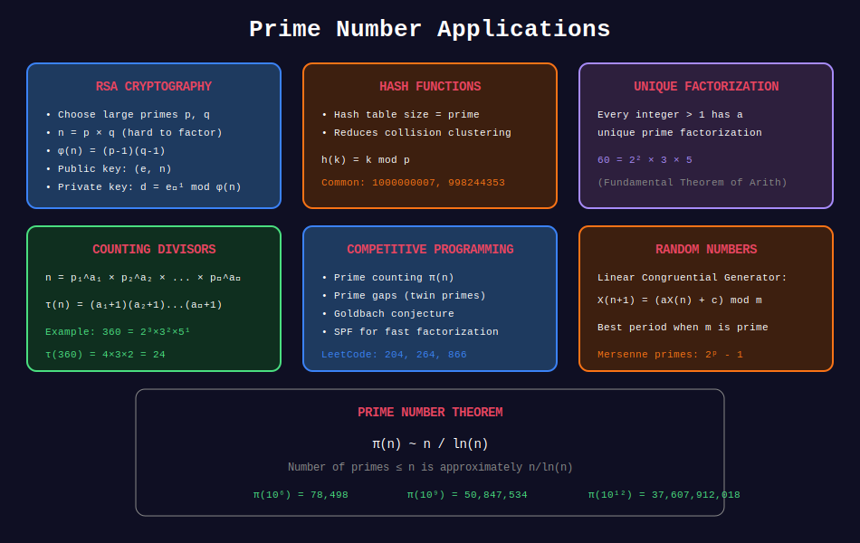

<div align="center">

# 🎯 Prime Applications

<p>
  
  
</p>

**Practical Applications of Prime Numbers**

*Ugly numbers, prime gaps, Goldbach, and more*

</div>

---

## 🧭 Navigation

| ⬅️ Previous | 📂 Current | ➡️ Next |
|:------------|:----------:|--------:|
| [← 04. Segmented Sieve](../04_segmented_sieve/README.md) | **05. Prime Applications** | [06. Applications →](../06_applications/README.md) |

---

## 📐 Mathematical Foundations

### 1️⃣ Ugly Numbers

**Definition:** A number whose only prime factors are 2, 3, and 5.

**Sequence:** 1, 2, 3, 4, 5, 6, 8, 9, 10, 12, 15, 16, 18, 20, 24, 25, 27, 30...

**Super Ugly Numbers:** Numbers with prime factors only from a given set.

---

### 2️⃣ Prime Gaps

**Definition:** Gap between consecutive primes $p_{n+1} - p_n$.

**Properties:**

- First gap of size k: varies (gap 2 first at 3, gap 4 first at 7, etc.)

- Average gap near n: approximately $\ln n$

- Largest gap ≤ n: grows slowly (about $(\ln n)^2$ conjectured)

**Prime Gap Records:**

| Gap | First Occurrence |
|-----|------------------|
| 2 | 3, 5 (twin primes) |
| 4 | 7, 11 |
| 6 | 23, 29 |
| 8 | 89, 97 |

---

### 3️⃣ Twin Primes

**Definition:** Pairs $(p, p+2)$ where both are prime.

**Examples:** (3,5), (5,7), (11,13), (17,19), (29,31), (41,43)...

**Twin Prime Conjecture:** Infinitely many twin primes exist (unproven!).

---

### 4️⃣ Goldbach's Conjecture

**Statement:** Every even integer > 2 is the sum of two primes.

**Status:** Unproven, but verified for all even numbers up to 4×10^18.

**Examples:**

- 4 = 2 + 2
- 10 = 3 + 7 = 5 + 5
- 100 = 3 + 97 = 11 + 89 = 17 + 83 = ...

---

### 5️⃣ Sophie Germain Primes

**Definition:** Prime $p$ where $2p + 1$ is also prime.

**Examples:** 2, 3, 5, 11, 23, 29, 41, 53, 83, 89, 113...

**Use:** Cryptography, especially for safe primes in Diffie-Hellman.

---

## 📊 Visual Diagram

<div align="center">



</div>

---

## 🎨 Visual Walkthroughs

### Walkthrough 1: Generating Ugly Numbers

```
+-----------------------------------------------------------------+

| PROBLEM: Generate first 10 ugly numbers                        |
+-----------------------------------------------------------------+
| ALGORITHM: Three-pointer dynamic programming                   |
|                                                                 |
| Initial: ugly = [1], i2=0, i3=0, i5=0                          |
|                                                                 |
| STEP 1:                                                         |
|   Candidates: ugly[0]*2=2, ugly[0]*3=3, ugly[0]*5=5            |
|   Min = 2 → ugly = [1, 2], i2=1                                |
|                                                                 |
| STEP 2:                                                         |
|   Candidates: ugly[1]*2=4, ugly[0]*3=3, ugly[0]*5=5            |
|   Min = 3 → ugly = [1, 2, 3], i3=1                             |
|                                                                 |
| STEP 3:                                                         |
|   Candidates: ugly[1]*2=4, ugly[1]*3=6, ugly[0]*5=5            |
|   Min = 4 → ugly = [1, 2, 3, 4], i2=2                          |
|                                                                 |
| STEP 4:                                                         |
|   Candidates: ugly[2]*2=6, ugly[1]*3=6, ugly[0]*5=5            |
|   Min = 5 → ugly = [1, 2, 3, 4, 5], i5=1                       |
|                                                                 |
| STEP 5:                                                         |
|   Candidates: ugly[2]*2=6, ugly[1]*3=6, ugly[1]*5=10           |
|   Min = 6 → ugly = [1, 2, 3, 4, 5, 6], i2=3, i3=2              |
|   (Move BOTH pointers since 6 appears in both)                 |
|                                                                 |
| Continue...                                                     |
|                                                                 |
| RESULT: [1, 2, 3, 4, 5, 6, 8, 9, 10, 12]                       |
+-----------------------------------------------------------------+

```

---

### Walkthrough 2: Twin Prime Search

```
+-----------------------------------------------------------------+

| FINDING TWIN PRIMES UP TO 100                                  |
+-----------------------------------------------------------------+
| STEP 1: Generate primes via sieve                              |
|                                                                 |
|   Primes: 2, 3, 5, 7, 11, 13, 17, 19, 23, 29, 31, 37,         |
|           41, 43, 47, 53, 59, 61, 67, 71, 73, 79, 83, 89, 97  |
|                                                                 |
| STEP 2: Check consecutive pairs with gap 2                     |
|                                                                 |
|   (2, 3): gap = 1 ✗                                            |
|   (3, 5): gap = 2 ✓ TWIN PRIME!                                |
|   (5, 7): gap = 2 ✓ TWIN PRIME!                                |
|   (7, 11): gap = 4 ✗                                           |
|   (11, 13): gap = 2 ✓ TWIN PRIME!                              |
|   (13, 17): gap = 4 ✗                                          |
|   (17, 19): gap = 2 ✓ TWIN PRIME!                              |
|   (19, 23): gap = 4 ✗                                          |
|   (23, 29): gap = 6 ✗                                          |
|   (29, 31): gap = 2 ✓ TWIN PRIME!                              |
|   ...                                                           |
|   (41, 43): gap = 2 ✓ TWIN PRIME!                              |
|   ...                                                           |
|   (59, 61): gap = 2 ✓ TWIN PRIME!                              |
|   ...                                                           |
|   (71, 73): gap = 2 ✓ TWIN PRIME!                              |
|                                                                 |
| TWIN PRIMES ≤ 100:                                              |
|   (3,5), (5,7), (11,13), (17,19), (29,31),                    |
|   (41,43), (59,61), (71,73)                                    |
|                                                                 |
| COUNT: 8 pairs                                                  |
+-----------------------------------------------------------------+

```

---

### Walkthrough 3: Goldbach Partition

```
+-----------------------------------------------------------------+

| FINDING GOLDBACH PARTITION FOR 100                             |
+-----------------------------------------------------------------+
| GOAL: Find primes p, q such that p + q = 100                  |
|                                                                 |
| STEP 1: Generate primes up to 100                              |
|                                                                 |
|   primes = {2, 3, 5, 7, 11, 13, 17, 19, 23, 29, 31, 37,       |
|             41, 43, 47, 53, 59, 61, 67, 71, 73, 79, 83, 89, 97}|
|                                                                 |
| STEP 2: For each prime p ≤ 50, check if 100-p is prime        |
|                                                                 |
|   p = 3:  100 - 3 = 97  ✓ (97 is prime!)                      |
|   → FOUND: 100 = 3 + 97                                        |
|                                                                 |
| ALTERNATIVE PARTITIONS:                                         |
|   p = 11: 100 - 11 = 89 ✓ → 100 = 11 + 89                     |
|   p = 17: 100 - 17 = 83 ✓ → 100 = 17 + 83                     |
|   p = 29: 100 - 29 = 71 ✓ → 100 = 29 + 71                     |
|   p = 41: 100 - 41 = 59 ✓ → 100 = 41 + 59                     |
|   p = 47: 100 - 47 = 53 ✓ → 100 = 47 + 53                     |
|                                                                 |
| RESULT: 100 has 6 Goldbach partitions!                         |
|   Smallest: 3 + 97                                              |
|   Most balanced: 47 + 53                                        |
+-----------------------------------------------------------------+

```

---

## 💻 Code Implementations

### Implementation 1: Ugly Number Check

```python
def is_ugly(n: int) -> bool:
    """
    Check if n is ugly (only prime factors 2, 3, 5).
    
    LeetCode 263
    
    Time: O(log n)
    Space: O(1)
    
    Examples:
        >>> is_ugly(6)
        True  # 6 = 2 × 3
        >>> is_ugly(14)
        False  # 14 = 2 × 7
    """
    if n <= 0:
        return False
    
    for p in [2, 3, 5]:
        while n % p == 0:
            n //= p
    
    return n == 1

```

---

### Implementation 2: Nth Ugly Number

```python
def nth_ugly_number(n: int) -> int:
    """
    Find nth ugly number using DP with three pointers.
    
    LeetCode 264
    
    Time: O(n)
    Space: O(n)
    
    Examples:
        >>> nth_ugly_number(10)
        12  # Sequence: 1,2,3,4,5,6,8,9,10,12
    """
    ugly = [1] * n
    i2 = i3 = i5 = 0
    
    for i in range(1, n):
        next2 = ugly[i2] * 2
        next3 = ugly[i3] * 3
        next5 = ugly[i5] * 5
        
        ugly[i] = min(next2, next3, next5)
        
        # Move pointers (may move multiple if ties)
        if ugly[i] == next2:
            i2 += 1
        if ugly[i] == next3:
            i3 += 1
        if ugly[i] == next5:
            i5 += 1
    
    return ugly[n - 1]

```

---

### Implementation 3: Super Ugly Number

```python
import heapq

def nth_super_ugly(n: int, primes: list[int]) -> int:
    """
    Find nth super ugly number (only given primes as factors).
    
    LeetCode 313
    
    Time: O(n log k) where k = len(primes)
    Space: O(n + k)
    
    Example:
        >>> nth_super_ugly(12, [2, 7, 13, 19])
        32
    """
    ugly = [1]
    # heap: (value, prime, index in ugly array)
    heap = [(p, p, 0) for p in primes]
    heapq.heapify(heap)
    
    while len(ugly) < n:
        val, p, idx = heapq.heappop(heap)
        
        if val != ugly[-1]:  # Avoid duplicates
            ugly.append(val)
        
        heapq.heappush(heap, (p * ugly[idx + 1], p, idx + 1))
    
    return ugly[n - 1]

```

---

### Implementation 4: Find Twin Primes

```python
def find_twin_primes(limit: int) -> list[tuple[int, int]]:
    """
    Find all twin prime pairs (p, p+2) up to limit.
    
    Time: O(n log log n)
    Space: O(n)
    
    Examples:
        >>> find_twin_primes(100)
        [(3, 5), (5, 7), (11, 13), (17, 19), (29, 31), (41, 43), (59, 61), (71, 73)]
    """
    # Sieve
    is_prime = [True] * (limit + 3)
    is_prime[0] = is_prime[1] = False
    
    for i in range(2, int((limit + 2)**0.5) + 1):
        if is_prime[i]:
            for j in range(i * i, limit + 3, i):
                is_prime[j] = False
    
    # Find twins
    twins = []
    for i in range(2, limit):
        if is_prime[i] and is_prime[i + 2]:
            twins.append((i, i + 2))
    
    return twins

```

---

### Implementation 5: Prime Gaps

```python
def find_prime_gaps(limit: int) -> list[tuple[int, int, int]]:
    """
    Find gaps between consecutive primes up to limit.
    
    Returns list of (p1, p2, gap) tuples.
    
    Time: O(n log log n)
    Space: O(n)
    """
    # Sieve
    is_prime = [True] * (limit + 1)
    is_prime[0] = is_prime[1] = False
    
    for i in range(2, int(limit**0.5) + 1):
        if is_prime[i]:
            for j in range(i * i, limit + 1, i):
                is_prime[j] = False
    
    primes = [i for i in range(limit + 1) if is_prime[i]]
    
    gaps = []
    for i in range(1, len(primes)):
        gap = primes[i] - primes[i-1]
        gaps.append((primes[i-1], primes[i], gap))
    
    return gaps

def largest_prime_gap(limit: int) -> tuple[int, int, int]:
    """Find the largest gap between consecutive primes ≤ limit."""
    gaps = find_prime_gaps(limit)
    return max(gaps, key=lambda x: x[2])

def first_gap_of_size(gap_size: int, limit: int = 10**6) -> tuple[int, int] | None:
    """Find first pair of consecutive primes with given gap."""
    gaps = find_prime_gaps(limit)
    for p1, p2, gap in gaps:
        if gap == gap_size:
            return (p1, p2)
    return None

```

---

### Implementation 6: Goldbach Partition

```python
def goldbach_partition(n: int) -> tuple[int, int] | None:
    """
    Express even n as sum of two primes (Goldbach's conjecture).
    
    Returns (p, q) such that p + q = n, or None if n is odd/< 4.
    
    Time: O(n log log n) for sieve
    Space: O(n)
    
    Examples:
        >>> goldbach_partition(100)
        (3, 97)
        >>> goldbach_partition(28)
        (5, 23)
    """
    if n < 4 or n % 2 == 1:
        return None
    
    # Generate primes up to n
    is_prime = [True] * (n + 1)
    is_prime[0] = is_prime[1] = False
    
    for i in range(2, int(n**0.5) + 1):
        if is_prime[i]:
            for j in range(i * i, n + 1, i):
                is_prime[j] = False
    
    # Find partition
    for p in range(2, n // 2 + 1):
        if is_prime[p] and is_prime[n - p]:
            return (p, n - p)
    
    return None  # Never happens for even n ≥ 4

def all_goldbach_partitions(n: int) -> list[tuple[int, int]]:
    """Find all Goldbach partitions of even n."""
    if n < 4 or n % 2 == 1:
        return []
    
    is_prime = [True] * (n + 1)
    is_prime[0] = is_prime[1] = False
    
    for i in range(2, int(n**0.5) + 1):
        if is_prime[i]:
            for j in range(i * i, n + 1, i):
                is_prime[j] = False
    
    partitions = []
    for p in range(2, n // 2 + 1):
        if is_prime[p] and is_prime[n - p]:
            partitions.append((p, n - p))
    
    return partitions

```

---

### Implementation 7: Sophie Germain Primes

```python
def find_sophie_germain_primes(limit: int) -> list[int]:
    """
    Find Sophie Germain primes: p where 2p+1 is also prime.
    
    Time: O(n log log n)
    Space: O(n)
    
    Examples:
        >>> find_sophie_germain_primes(100)
        [2, 3, 5, 11, 23, 29, 41, 53, 83, 89]
    """
    # Sieve up to 2*limit + 1
    max_val = 2 * limit + 1
    is_prime = [True] * (max_val + 1)
    is_prime[0] = is_prime[1] = False
    
    for i in range(2, int(max_val**0.5) + 1):
        if is_prime[i]:
            for j in range(i * i, max_val + 1, i):
                is_prime[j] = False
    
    sophie = []
    for p in range(2, limit + 1):
        if is_prime[p] and is_prime[2 * p + 1]:
            sophie.append(p)
    
    return sophie

```

---

### Implementation 8: Sum of Primes

```python
def sum_of_primes(n: int) -> int:
    """
    Calculate sum of all primes up to n.
    
    Time: O(n log log n)
    Space: O(n)
    
    Examples:
        >>> sum_of_primes(10)
        17  # 2+3+5+7
        >>> sum_of_primes(100)
        1060
    """
    if n < 2:
        return 0
    
    is_prime = [True] * (n + 1)
    is_prime[0] = is_prime[1] = False
    
    for i in range(2, int(n**0.5) + 1):
        if is_prime[i]:
            for j in range(i * i, n + 1, i):
                is_prime[j] = False
    
    return sum(i for i in range(n + 1) if is_prime[i])

```

---

## 🏆 LeetCode Problems

### 🟢 Easy

| # | Problem | Key Concept | Time |
|:-:|---------|-------------|------|
| 263 | [Ugly Number](https://leetcode.com/problems/ugly-number/) | Prime factor check | O(log n) |
| 762 | [Prime Number of Set Bits](https://leetcode.com/problems/prime-number-of-set-bits-in-binary-representation/) | Bit counting | O(n) |

### 🟡 Medium

| # | Problem | Key Concept | Time |
|:-:|---------|-------------|------|
| 264 | [Ugly Number II](https://leetcode.com/problems/ugly-number-ii/) | Three-pointer DP | O(n) |
| 313 | [Super Ugly Number](https://leetcode.com/problems/super-ugly-number/) | Heap + DP | O(n log k) |
| 866 | [Prime Palindrome](https://leetcode.com/problems/prime-palindrome/) | Generate + check | O(√n log n) |

---

## 💻 Solutions to Key Problems

### Problem 762: Prime Number of Set Bits

```python
class Solution:
    def countPrimeSetBits(self, left: int, right: int) -> int:
        """
        Count numbers with prime number of 1-bits.
        
        Max bits for n ≤ 10^6 is ~20.
        Primes ≤ 20: {2, 3, 5, 7, 11, 13, 17, 19}
        
        Time: O(R - L)
        Space: O(1)
        """
        primes = {2, 3, 5, 7, 11, 13, 17, 19}
        count = 0
        
        for n in range(left, right + 1):
            if bin(n).count('1') in primes:
                count += 1
        
        return count

```

### Problem 866: Prime Palindrome

```python
class Solution:
    def primePalindrome(self, n: int) -> int:
        """
        Find smallest prime palindrome >= n.
        
        Key insight: Even-length palindromes > 11 are divisible by 11.
        
        Time: O(√n log n) approximately
        """
        def is_prime(x: int) -> bool:
            if x < 2:
                return False
            if x == 2:
                return True
            if x % 2 == 0:
                return False
            for i in range(3, int(x**0.5) + 1, 2):
                if x % i == 0:
                    return False
            return True
        
        def is_palindrome(x: int) -> bool:
            s = str(x)
            return s == s[::-1]
        
        while True:
            if is_palindrome(n) and is_prime(n):
                return n
            
            n += 1
            
            # Skip 8-digit range (all divisible by 11)
            if 10**7 < n < 10**8:
                n = 10**8

```

---

## 💡 Key Insights

> **Ugly Number Generation:**  
> Use three pointers to generate in sorted order.  
> Key: Move ALL pointers that produce the minimum (handles duplicates).

> **Twin Prime Density:**  
> Twin primes become rarer as n grows, but are still infinite (conjectured).  
> ~1200 twin prime pairs below 100,000.

> **Goldbach Verification:**  
> Every even number has been checked up to 4×10^18.  
> The number of Goldbach partitions grows with n.

> **Prime Palindrome Trick:**  
> All even-digit palindromes > 11 are divisible by 11.  
> Proof: abccba = 100001a + 10010b + 1100c = 11(9091a + 910b + 100c)

---

## 📊 Prime Distribution Data

| Range | Primes | Twin Pairs | Sophie Germain |
|-------|--------|------------|----------------|
| [1, 100] | 25 | 8 | 10 |
| [1, 1000] | 168 | 35 | 37 |
| [1, 10^4] | 1,229 | 205 | 190 |
| [1, 10^5] | 9,592 | 1,224 | 1,171 |
| [1, 10^6] | 78,498 | 8,169 | 7,408 |

---

## 📚 References

| Resource | Link |
|----------|------|
| **OEIS** | [Ugly Numbers A051037](https://oeis.org/A051037) |
| **OEIS** | [Twin Primes A001359](https://oeis.org/A001359) |
| **Wikipedia** | [Goldbach's Conjecture](https://en.wikipedia.org/wiki/Goldbach%27s_conjecture) |
| **Wikipedia** | [Sophie Germain Prime](https://en.wikipedia.org/wiki/Sophie_Germain_prime) |

---

<div align="center">

**Made with ❤️ by [Gaurav Goswami](https://github.com/Gaurav14cs17)**

</div>

---

## 🧭 Navigation

| ⬅️ Previous | 📂 Current | ➡️ Next |
|:------------|:----------:|--------:|
| [← 04. Segmented Sieve](../04_segmented_sieve/README.md) | **05. Prime Applications** | [06. Applications →](../06_applications/README.md) |
