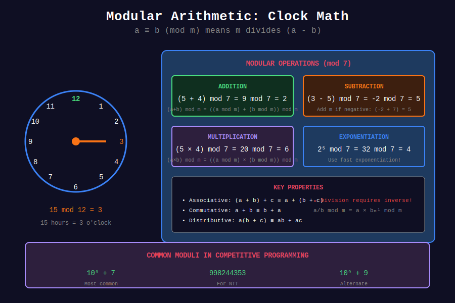

# 🔢 Basic Modular Operations

## 📊 Metadata
- **Difficulty:** 
- **Time Complexity:** O(1) per operation
- **Space Complexity:** O(1)
- **Pattern:** Number Theory, Clock Arithmetic

---

## 🎯 Overview

Modular arithmetic is "clock arithmetic" where numbers wrap around upon reaching a certain value (modulus). It's fundamental to cryptography, hashing, and competitive programming.

**Key Concept:** `a mod m` is the remainder when a is divided by m.

---

## 📐 Core Concepts

### Congruence

**Definition:** a ≡ b (mod m) means m divides (a - b)

**Equivalently:**
```
a ≡ b (mod m) ⟺ a mod m = b mod m
                ⟺ a = b + km for some integer k
```

**Examples:**
```
17 ≡ 5 (mod 12)   because 17 - 5 = 12
-3 ≡ 7 (mod 10)   because -3 - 7 = -10
25 ≡ 0 (mod 5)    because 25 - 0 = 25
```

---

## 📊 Visual Diagram

<div align="center">



</div>

---

## 💻 Implementations

### 1. Basic Operations

```python
def mod_add(a, b, m):
    """
    Compute (a + b) mod m
    
    Time: O(1)
    Space: O(1)
    """
    return ((a % m) + (b % m)) % m

def mod_sub(a, b, m):
    """
    Compute (a - b) mod m
    
    Handles negative results correctly
    """
    return ((a % m) - (b % m) + m) % m

def mod_mul(a, b, m):
    """
    Compute (a × b) mod m
    """
    return ((a % m) * (b % m)) % m

# Examples
print(mod_add(10**18, 10**18, 10**9 + 7))  # Large numbers
print(mod_sub(5, 10, 7))                    # -5 mod 7 = 2
print(mod_mul(10**9, 10**9, 10**9 + 7))
```

### 2. Handling Negative Numbers

```python
def mod_positive(a, m):
    """
    Ensure result is in range [0, m-1]
    
    Python's % operator handles negatives correctly,
    but this makes it explicit.
    """
    return ((a % m) + m) % m

# Examples
print(mod_positive(-5, 7))   # 2
print(mod_positive(-17, 5))  # 3
print(mod_positive(10, 3))   # 1
```

### 3. Modular Arithmetic Class

```python
class ModInt:
    """
    Integer wrapper with automatic modular arithmetic
    """
    MOD = 10**9 + 7
    
    def __init__(self, value):
        self.value = value % ModInt.MOD
    
    def __add__(self, other):
        if isinstance(other, ModInt):
            return ModInt(self.value + other.value)
        return ModInt(self.value + other)
    
    def __sub__(self, other):
        if isinstance(other, ModInt):
            return ModInt(self.value - other.value + ModInt.MOD)
        return ModInt(self.value - other + ModInt.MOD)
    
    def __mul__(self, other):
        if isinstance(other, ModInt):
            return ModInt(self.value * other.value)
        return ModInt(self.value * other)
    
    def __repr__(self):
        return str(self.value)

# Usage
a = ModInt(10**18)
b = ModInt(10**18)
print(a + b)  # Automatic modular addition
print(a * b)  # Automatic modular multiplication
```

### 4. Congruence Check

```python
def are_congruent(a, b, m):
    """
    Check if a ≡ b (mod m)
    """
    return (a - b) % m == 0

# Examples
print(are_congruent(17, 5, 12))   # True
print(are_congruent(100, 10, 9))  # True
print(are_congruent(7, 3, 5))     # False
```

### 5. Common Moduli

```python

# Common moduli in competitive programming
MOD_1 = 10**9 + 7   # 1000000007 (prime)
MOD_2 = 10**9 + 9   # 1000000009 (prime)
MOD_3 = 998244353   # Prime with primitive root (used for NTT)

def mod_safe(n, m=MOD_1):
    """Safe modulo operation"""
    return ((n % m) + m) % m
```

---

## 🧩 LeetCode Problems

| # | Problem | Difficulty | Key Concept |
|---|---------|------------|-------------|
| 1922 | [Count Good Numbers](https://leetcode.com/problems/count-good-numbers/) | 🟡 Medium | Modular multiplication |
| 1780 | [Check if Number is a Sum of Powers of Three](https://leetcode.com/problems/check-if-number-is-a-sum-of-powers-of-three/) | 🟡 Medium | Base conversion |

---

## 💡 Key Insights

### Properties of Modular Arithmetic

1. **(a + b) mod m = ((a mod m) + (b mod m)) mod m**
2. **(a × b) mod m = ((a mod m) × (b mod m)) mod m**
3. **(a - b) mod m = ((a mod m) - (b mod m) + m) mod m**

### Why MOD = 10^9 + 7?

- It's prime (Fermat's theorem works)
- Fits in 32-bit signed integer
- (MOD-1)² fits in 64-bit integer
- Easy to remember

---

**Navigation:** [← Modular Arithmetic Overview](../README.md) | [Modular Inverse →](../02_modular_inverse/)

