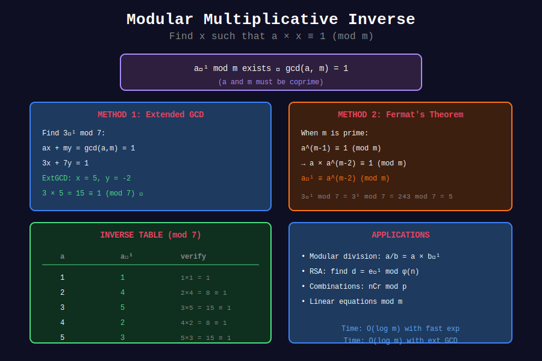

# 🔄 Modular Inverse

## 📊 Metadata

- **Difficulty:** 

- **Time Complexity:** O(log m)

- **Space Complexity:** O(1) iterative, O(log m) recursive

- **Pattern:** Number Theory, Extended GCD, Fermat's Theorem

---

## 🎯 Overview

The **modular inverse** of a modulo m is an integer x such that:

```
a × x ≡ 1 (mod m)

```

Notation: x = a⁻¹ (mod m)

**Existence:** Inverse exists if and only if gcd(a, m) = 1 (a and m are coprime)

---

## 📐 Core Concepts

### When Does Inverse Exist?

| gcd(a, m) | Inverse Exists? | Example |
|-----------|-----------------|---------|
| 1 | Yes | gcd(3, 7) = 1 ✓ |
| > 1 | No | gcd(4, 6) = 2 ✗ |

### Methods to Find Inverse

1. **Extended GCD:** Works for any coprime a and m

2. **Fermat's Theorem:** a⁻¹ ≡ a^(p-2) (mod p), when p is prime

3. **Euler's Theorem:** a⁻¹ ≡ a^(φ(m)-1) (mod m)

---

## 📊 Visual Diagram

<div align="center">



</div>

---

## 💻 Implementations

### 1. Extended GCD Method

```python
def mod_inverse_gcd(a, m):
    """
    Find modular inverse using Extended Euclidean Algorithm
    
    Time: O(log m)
    Space: O(log m) for recursion
    
    Works for any coprime a and m
    
    Returns: x such that (a × x) ≡ 1 (mod m), or None
    """
    def extended_gcd(a, b):
        if b == 0:
            return a, 1, 0
        g, x1, y1 = extended_gcd(b, a % b)
        return g, y1, x1 - (a // b) * y1
    
    g, x, _ = extended_gcd(a % m, m)
    
    if g != 1:
        return None  # No inverse exists
    
    return (x % m + m) % m

# Examples
print(mod_inverse_gcd(3, 11))   # 4: 3×4 = 12 ≡ 1 (mod 11)
print(mod_inverse_gcd(5, 7))    # 3: 5×3 = 15 ≡ 1 (mod 7)
print(mod_inverse_gcd(4, 6))    # None: gcd(4, 6) = 2

```

### 2. Fermat's Theorem Method

```python
def mod_inverse_fermat(a, p):
    """
    Find modular inverse using Fermat's Little Theorem
    
    Only works when p is PRIME
    
    a⁻¹ ≡ a^(p-2) (mod p)
    
    Time: O(log p)
    Space: O(1)
    """
    if a % p == 0:
        return None
    
    return pow(a, p - 2, p)

# Examples (p = 10^9 + 7 is prime)
MOD = 10**9 + 7
print(mod_inverse_fermat(2, MOD))
print(mod_inverse_fermat(3, MOD))

```

### 3. Iterative Extended GCD

```python
def mod_inverse_iterative(a, m):
    """
    Iterative version of Extended GCD for inverse
    
    Time: O(log m)
    Space: O(1)
    """
    if m == 1:
        return 0
    
    m0, x0, x1 = m, 0, 1
    a = a % m
    
    while a > 1:
        q = a // m
        m, a = a % m, m
        x0, x1 = x1 - q * x0, x0
    
    if x1 < 0:
        x1 += m0
    
    return x1

# Examples
print(mod_inverse_iterative(3, 11))  # 4
print(mod_inverse_iterative(7, 26))  # 15

```

### 4. Batch Modular Inverse

```python
def mod_inverse_batch(arr, m):
    """
    Find inverse for all elements in array efficiently
    
    Uses the formula: arr[i]⁻¹ = (prefix product)⁻¹ × (suffix product)
    
    Time: O(n + log m)
    Space: O(n)
    """
    n = len(arr)
    if n == 0:
        return []
    
    # Prefix products
    prefix = [1] * n
    prefix[0] = arr[0]
    for i in range(1, n):
        prefix[i] = (prefix[i-1] * arr[i]) % m
    
    # Inverse of total product
    total_inv = mod_inverse_fermat(prefix[n-1], m)
    
    # Compute inverses
    result = [0] * n
    suffix = 1
    
    for i in range(n-1, -1, -1):
        if i == 0:
            result[i] = (total_inv * suffix) % m
        else:
            result[i] = (total_inv * suffix * prefix[i-1]) % m
        suffix = (suffix * arr[i]) % m
    
    return result

# Example
MOD = 10**9 + 7
arr = [2, 3, 5, 7]
inverses = mod_inverse_batch(arr, MOD)
for a, inv in zip(arr, inverses):
    print(f"{a}⁻¹ = {inv}, verify: {(a * inv) % MOD}")

```

### 5. Modular Division

```python
def mod_div(a, b, m):
    """
    Compute (a / b) mod m
    
    Equivalent to: a × b⁻¹ mod m
    """
    b_inv = mod_inverse_fermat(b, m)
    if b_inv is None:
        return None
    return (a * b_inv) % m

# Example
MOD = 10**9 + 7
print(mod_div(10, 2, MOD))  # 5
print(mod_div(7, 3, MOD))   # 7 × 3⁻¹ mod MOD

```

### 6. Precompute Factorials and Inverses

```python
def precompute_factorials(n, m):
    """
    Precompute factorials and their inverses for combinations
    
    Time: O(n + log m)
    Space: O(n)
    """
    fact = [1] * (n + 1)
    for i in range(1, n + 1):
        fact[i] = (fact[i-1] * i) % m
    
    # Inverse factorial using Fermat
    inv_fact = [1] * (n + 1)
    inv_fact[n] = mod_inverse_fermat(fact[n], m)
    
    for i in range(n-1, -1, -1):
        inv_fact[i] = (inv_fact[i+1] * (i + 1)) % m
    
    return fact, inv_fact

def nCr_mod(n, r, fact, inv_fact, m):
    """
    Compute C(n, r) mod m using precomputed factorials
    
    Time: O(1)
    """
    if r < 0 or r > n:
        return 0
    return (fact[n] * inv_fact[r] % m) * inv_fact[n-r] % m

# Example
MOD = 10**9 + 7
fact, inv_fact = precompute_factorials(1000, MOD)
print(nCr_mod(10, 3, fact, inv_fact, MOD))  # C(10,3) = 120
print(nCr_mod(100, 50, fact, inv_fact, MOD))

```

---

## 🧩 LeetCode Problems

| # | Problem | Difficulty | Key Concept |
|---|---------|------------|-------------|
| 1922 | [Count Good Numbers](https://leetcode.com/problems/count-good-numbers/) | 🟡 Medium | Modular inverse for division |
| 2400 | [Number of Ways to Reach a Position After Exactly k Steps](https://leetcode.com/problems/number-of-ways-to-reach-a-position-after-exactly-k-steps/) | 🟡 Medium | Combinations with inverse |

---

## 💡 Solutions

### Combinations with Mod

```python
class Solution:
    def __init__(self):
        self.MOD = 10**9 + 7
        self.max_n = 1001
        self.fact, self.inv_fact = self.precompute()
    
    def precompute(self):
        fact = [1] * self.max_n
        for i in range(1, self.max_n):
            fact[i] = fact[i-1] * i % self.MOD
        
        inv_fact = [1] * self.max_n
        inv_fact[self.max_n - 1] = pow(fact[self.max_n - 1], self.MOD - 2, self.MOD)
        for i in range(self.max_n - 2, -1, -1):
            inv_fact[i] = inv_fact[i + 1] * (i + 1) % self.MOD
        
        return fact, inv_fact
    
    def nCr(self, n, r):
        if r < 0 or r > n:
            return 0
        return self.fact[n] * self.inv_fact[r] % self.MOD * self.inv_fact[n - r] % self.MOD

```

---

## 💡 Key Insights

### 1. Fermat vs Extended GCD

| Method | When to Use |
|--------|-------------|
| Fermat | m is prime |
| Extended GCD | Any coprime a, m |
| Euler | Know φ(m) |

### 2. Inverse for Combinations

For nCr mod p where p is prime:

```
nCr = n! / (r! × (n-r)!)
    ≡ n! × (r!)⁻¹ × ((n-r)!)⁻¹ (mod p)

```

### 3. Python's Built-in

Python 3.8+ has:

```python
pow(a, -1, m)  # Returns a⁻¹ mod m

```

---

**Navigation:** [← Basic Operations](../01_basic_operations/) | [Fast Exponentiation →](../03_fast_exponentiation/)

