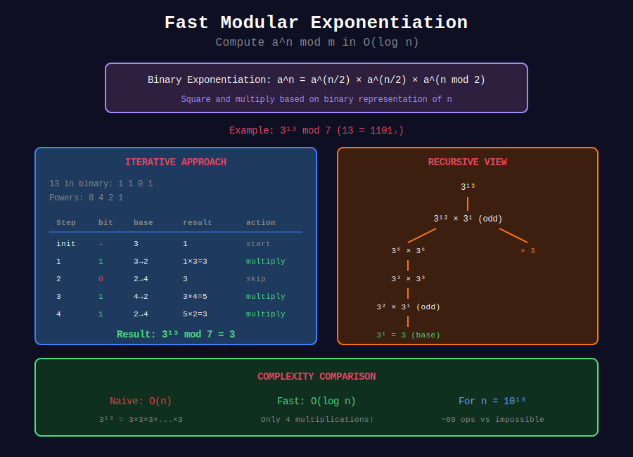

# ⚡ Fast Modular Exponentiation

## 📊 Metadata
- **Difficulty:** 
- **Time Complexity:** O(log n)
- **Space Complexity:** O(1) iterative, O(log n) recursive
- **Pattern:** Divide and Conquer, Binary Representation

---

## 🎯 Overview

**Fast Exponentiation** (also called **Binary Exponentiation** or **Exponentiation by Squaring**) computes a^n in O(log n) time instead of O(n).

**Key Idea:** Use the binary representation of the exponent to reduce multiplications.

---

## 📐 Core Concepts

### Binary Representation Method

```
a^13 = a^(1101₂)
     = a^8 × a^4 × a^1
     = a^(2³) × a^(2²) × a^(2⁰)
```

### Algorithm

1. If n is even: a^n = (a^(n/2))²
2. If n is odd: a^n = a × a^(n-1)

---

## 📊 Visual Diagram

<div align="center">



</div>

---

## 💻 Implementations

### 1. Iterative (Recommended)

```python
def pow_mod(base, exp, mod):
    """
    Compute (base^exp) % mod using binary exponentiation
    
    Time: O(log exp)
    Space: O(1)
    
    Args:
        base: Base number
        exp: Exponent (non-negative)
        mod: Modulus
    
    Returns:
        (base^exp) % mod
    """
    result = 1
    base %= mod
    
    while exp > 0:
        if exp & 1:  # If exp is odd
            result = (result * base) % mod
        
        base = (base * base) % mod
        exp >>= 1
    
    return result

# Examples
print(pow_mod(2, 10, 1000))        # 24
print(pow_mod(2, 100, 10**9 + 7))  # Large exponent
print(pow_mod(3, 1000000, 10**9 + 7))
```

### 2. Recursive Version

```python
def pow_mod_recursive(base, exp, mod):
    """
    Recursive fast exponentiation
    
    Time: O(log exp)
    Space: O(log exp) for call stack
    """
    if exp == 0:
        return 1
    
    if exp % 2 == 0:
        half = pow_mod_recursive(base, exp // 2, mod)
        return (half * half) % mod
    else:
        return (base * pow_mod_recursive(base, exp - 1, mod)) % mod

# Examples
print(pow_mod_recursive(2, 10, 1000))  # 24
```

### 3. With Trace

```python
def pow_mod_trace(base, exp, mod):
    """
    Fast exponentiation with step-by-step trace
    """
    print(f"\nComputing {base}^{exp} mod {mod}:")
    print(f"Binary of {exp}: {bin(exp)}")
    
    result = 1
    base = base % mod
    step = 0
    
    while exp > 0:
        bit = exp & 1
        print(f"Step {step}: exp={exp}, bit={bit}, base={base}, result={result}")
        
        if bit:
            result = (result * base) % mod
            print(f"  → Multiply result: {result}")
        
        base = (base * base) % mod
        print(f"  → Square base: {base}")
        
        exp >>= 1
        step += 1
    
    print(f"Final result: {result}")
    return result

pow_mod_trace(2, 13, 1000)
```

### 4. LeetCode 50: Pow(x, n)

```python
class Solution:
    def myPow(self, x: float, n: int) -> float:
        """
        Compute x^n
        
        Time: O(log |n|)
        Space: O(1)
        """
        if n < 0:
            x = 1 / x
            n = -n
        
        result = 1.0
        
        while n > 0:
            if n & 1:
                result *= x
            x *= x
            n >>= 1
        
        return result
```

### 5. Matrix Exponentiation

```python
def matrix_mult(A, B, mod):
    """Multiply two 2×2 matrices modulo mod"""
    return [
        [(A[0][0]*B[0][0] + A[0][1]*B[1][0]) % mod,
         (A[0][0]*B[0][1] + A[0][1]*B[1][1]) % mod],
        [(A[1][0]*B[0][0] + A[1][1]*B[1][0]) % mod,
         (A[1][0]*B[0][1] + A[1][1]*B[1][1]) % mod]
    ]

def matrix_pow(M, n, mod):
    """
    Compute M^n mod mod for 2×2 matrix
    
    Time: O(log n)
    Space: O(1)
    """
    result = [[1, 0], [0, 1]]  # Identity matrix
    
    while n > 0:
        if n & 1:
            result = matrix_mult(result, M, mod)
        M = matrix_mult(M, M, mod)
        n >>= 1
    
    return result

def fibonacci(n, mod=10**9+7):
    """
    Compute F(n) mod mod in O(log n)
    
    Uses: [F(n+1), F(n)] = [[1,1],[1,0]]^n × [F(1), F(0)]
    """
    if n == 0:
        return 0
    
    M = [[1, 1], [1, 0]]
    result = matrix_pow(M, n, mod)
    return result[0][1]

# Examples
print(fibonacci(10))       # 55
print(fibonacci(100))      # Large Fibonacci
print(fibonacci(10**18))   # Very large, O(log n)
```

### 6. Solving Linear Recurrences

```python
def solve_recurrence(coeffs, initial, n, mod):
    """
    Solve linear recurrence: a(n) = c1×a(n-1) + c2×a(n-2) + ... + ck×a(n-k)
    
    Args:
        coeffs: [c1, c2, ..., ck]
        initial: [a(0), a(1), ..., a(k-1)]
        n: Term to compute
        mod: Modulus
    
    Time: O(k³ log n)
    Space: O(k²)
    """
    k = len(coeffs)
    
    if n < k:
        return initial[n]
    
    # Build companion matrix
    M = [[0] * k for _ in range(k)]
    for i in range(k):
        M[0][i] = coeffs[i]
    for i in range(1, k):
        M[i][i-1] = 1
    
    # Matrix exponentiation
    def mat_mult(A, B):
        size = len(A)
        C = [[0] * size for _ in range(size)]
        for i in range(size):
            for j in range(size):
                for p in range(size):
                    C[i][j] = (C[i][j] + A[i][p] * B[p][j]) % mod
        return C
    
    result = [[1 if i == j else 0 for j in range(k)] for i in range(k)]
    exp = n - k + 1
    
    while exp > 0:
        if exp & 1:
            result = mat_mult(result, M)
        M = mat_mult(M, M)
        exp >>= 1
    
    ans = 0
    for i in range(k):
        ans = (ans + result[0][i] * initial[k - 1 - i]) % mod
    
    return ans

# Example: Fibonacci (a(n) = a(n-1) + a(n-2))
print(solve_recurrence([1, 1], [0, 1], 10, 10**9 + 7))  # 55
```

---

## 🧩 LeetCode Problems

| # | Problem | Difficulty | Key Concept |
|---|---------|------------|-------------|
| 50 | [Pow(x, n)](https://leetcode.com/problems/powx-n/) | 🟡 Medium | Basic fast exponentiation |
| 372 | [Super Pow](https://leetcode.com/problems/super-pow/) | 🟡 Medium | Modular with array exp |
| 1922 | [Count Good Numbers](https://leetcode.com/problems/count-good-numbers/) | 🟡 Medium | Fast power application |

---

## 💡 Solutions

### Problem 372: Super Pow

```python
class Solution:
    def superPow(self, a: int, b: list[int]) -> int:
        """
        Compute a^b where b is represented as array of digits
        
        Uses: a^1234 = (a^123)^10 × a^4
        
        Time: O(n) where n = len(b)
        Space: O(1)
        """
        MOD = 1337
        
        def pow_mod(x, n):
            result = 1
            x %= MOD
            while n > 0:
                if n & 1:
                    result = result * x % MOD
                x = x * x % MOD
                n >>= 1
            return result
        
        result = 1
        for digit in b:
            result = pow_mod(result, 10) * pow_mod(a, digit) % MOD
        
        return result
```

### Problem 1922: Count Good Numbers

```python
class Solution:
    def countGoodNumbers(self, n: int) -> int:
        """
        Good number: even positions (0,2,4,...) have even digits (0,2,4,6,8)
                     odd positions (1,3,5,...) have prime digits (2,3,5,7)
        
        Count = 5^(even positions) × 4^(odd positions)
              = 5^⌈n/2⌉ × 4^⌊n/2⌋
        
        Time: O(log n)
        Space: O(1)
        """
        MOD = 10**9 + 7
        
        even_pos = (n + 1) // 2
        odd_pos = n // 2
        
        return pow(5, even_pos, MOD) * pow(4, odd_pos, MOD) % MOD
```

---

## 💡 Key Insights

### 1. Why O(log n)?

Each iteration halves the exponent:
```
Operations = ⌈log₂(n)⌉
```

### 2. Comparison with Naive

| n | Naive | Fast |
|---|-------|------|
| 10 | 10 | 4 |
| 100 | 100 | 7 |
| 10^9 | 10^9 | 30 |

### 3. Python Built-in

Python's `pow(a, b, m)` uses fast exponentiation internally:
```python
pow(2, 100, 10**9 + 7)  # Efficient built-in
```

---

**Navigation:** [← Modular Inverse](../02_modular_inverse/) | [Fermat's Theorem →](../04_fermats_theorem/)

